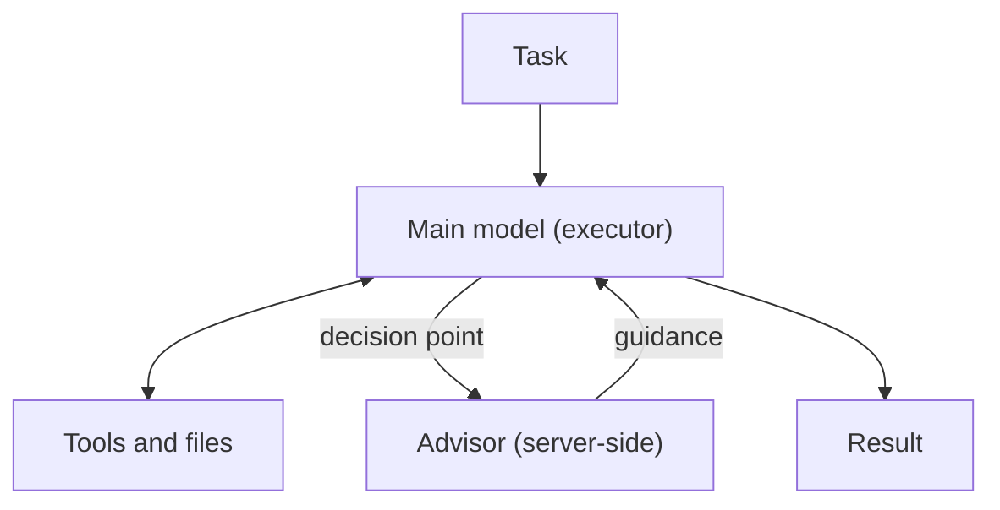

Claude Code's [official Advisor guide](https://code.claude.com/docs/en/advisor) describes a deceptively simple idea: let the main model handle a task, then consult a second, typically stronger model at consequential moments—before committing to a plan, after a recurring error, or before declaring the work done. This is not a handoff to another agent that takes over the task, nor a review gate that must run before every code change.

That distinction determines how to use the feature. **Advisor adds a second opinion that the main model may request; it does not take over execution or automatically prove that the result is correct.**

> **Huahua's take**
>
> A second model can point out a route you may have missed. “Someone looked at it” does not mean the route has been verified as safe.

## One executor, one advice-only model

With Advisor enabled, Claude Code's main model remains the executor: it understands the task, calls tools, reads their results, edits files, and responds. At a moment it considers worth escalating, the executor calls the server-side advisor. The advisor reads the conversation and returns guidance; the main model still decides what to do next.



This differs from the familiar pattern in which a large orchestrator decomposes work and assigns it to multiple workers. The advisor does not execute tools or deliver the user-facing answer. Its output goes back to the main model, which may use it, question it, or adjust it when its own evidence says otherwise. Claude Code's documentation says that if the suggested step fails or contradicts file contents, the executor surfaces the conflict rather than following the advice unconditionally.

Still, this is model collaboration inside one conversation, not an independent safety review. The advisor sees the same task context, the executor controls what happens next, and a `Reviewed` status only means the advisor reviewed the conversation and returned readable guidance. It does not mean the code passed tests, satisfied policy, or was changed correctly.

## The subtle boundary: the model decides when to ask

The official guide describes typical consultation points: before committing to an approach, when an error keeps recurring, and before Claude declares a task complete. Those are model tendencies, not deterministic hooks or rules. You can request a consultation in your prompt, but Claude Code has no setting to force every call or cap the number of calls.

That means Advisor cannot, by itself, serve as “a second model must approve every merge.” If your team needs a non-skippable check, put it in an auditable CI job, test suite, policy check, or human approval workflow—not in prompt-driven model behavior.

Read the status labels literally: `Reviewed` means guidance was returned; `Declined` means the advisor chose not to advise; `Unavailable` means the call failed. The latter two do not necessarily mean the task failed, but they do mean there was no usable second opinion on that call. For consequential work, record these outcomes instead of tracking only whether Advisor was enabled.

## A better fit for long tasks than every request

Advisor fits long workflows where most turns are routine but a small number of decisions determine the outcome—for example, a large refactor, debugging after the same error repeats, or a task that deserves another look before completion. A short question has little planning surface, so a consultation may add only latency and cost. If every turn genuinely needs the strongest model, switching the main model is more direct.

| Mechanism | When the second or stronger model runs | What it is for |
| --- | --- | --- |
| Advisor | At a mid-task decision point chosen by the main model | Keep one executor and add advice for difficult judgments |
| Subagent | Throughout a delegated subtask | Split work that is parallelizable or has a clear boundary |
| `opusplan` | A stronger model during planning, then another model for execution | Plan with one model and execute with another |
| `/model` | Starting with the next request after switching | Use a different model for the task as a whole |

For the wider agent lifecycle, see the [practical AI Agent guide](/en/blog/64-ai-agent-guide/). For how a durable runtime preserves sessions, history, and usage across long jobs, compare [Pydantic AI's durable MCP session design](/en/blog/109-pydantic-ai-v245-durable-mcp-sessions/). Advisor addresses when to get another model's advice; it does not replace execution or state-management design.

## The full conversation goes to an Anthropic-side advisor

The official guide is explicit: Advisor runs server-side on Anthropic's infrastructure, and a call receives the full conversation, including tool calls and tool results. For teams working with private source code, internal issues, customer data, or confidential documents, this is a data-flow and vendor-boundary decision—not just a model choice.

Before enabling it, confirm that the session is allowed to send its complete context to Anthropic and whether tool results may contain secrets, personal data, or other restricted material. This statement alone does not establish a particular retention or training policy; check the terms and data-processing documentation that apply to your organization and plan. Availability also depends on the Anthropic API: the current guide lists Amazon Bedrock, Claude Platform on AWS, Google Cloud Agent Platform, and Microsoft Foundry as unsupported. Provider routing, feature flags, and model pairings can change the effective behavior.

> **Huahua's engineering note**
>
> Don't ask only “Which advisor model did I choose?” Ask “What is in the full transcript this call will receive?” The advisor gets the task history, including tool activity—not an abstracted question.

## “Cheaper” needs to be recalculated for the whole task

The advisor is not a free observer. Each call makes the advisor model read the conversation and consumes additional input and output tokens at that model's rates. Claude Code's guide also says the advisor processes the full transcript anew on each call; its own reads are not reused across calls. The longer the task and the more often the advisor is called, the less useful it is to compare only the main model's per-token price. Measure latency and total tokens too.

In its [Advisor strategy post](https://claude.com/blog/the-advisor-strategy), Anthropic reported a 2.7 percentage-point lift over Sonnet alone on SWE-bench Multilingual with Sonnet plus an Opus advisor, alongside an 11.9% reduction in cost per agentic task. This is a vendor-reported result for a specific evaluation, not a guarantee for every Claude Code workload. The methodology notes show that the configurations differed in more than the advisor: solo Sonnet used adaptive thinking, while the combined setup used Anthropic's suggested coding system prompt with thinking turned off. The test covered 300 problems across nine languages and averaged five trials. It is a useful hypothesis to test, but the lift cannot be attributed solely to Advisor, nor can the cost figure be projected directly onto your repository.

## Run a small controlled evaluation first

Start with representative tasks that have clear acceptance criteria. Compare three conditions: the main model alone, the main model with Advisor, and a stronger model alone. For each, record:

1. Task success and human quality ratings—not just whether the model said “done.”
2. Input and output tokens for each model, total cost per task, and completion time.
3. Advisor call count and timing, plus the rates of `Reviewed`, `Declined`, and `Unavailable`.
4. Whether advice changed the plan, tool use, or final patch—and whether the result then passed tests and human review.
5. Whether the transcript contains data that should not be sent to Anthropic, and how those tasks are handled.

Hold data, tools, main-model version, and task acceptance criteria constant. If you also change the prompt, thinking configuration, or execution environment, track those as separate variables. This is how to answer the product question that matters: does Advisor improve success on your tasks, reduce rework, or merely add tokens and latency?

## Configuration and the experimental-status caveat

The current guide documents three ways to configure Advisor: choose or change a model in a session with `/advisor`, set a persistent `advisorModel` in settings, or specify one for a single session with `--advisor`. For example:

```text
/advisor opus
```

```sh
claude --advisor opus
```

Compatible model pairings and aliases change over time. An alias such as `opus` resolves to the default model built into that Claude Code version, so avoid freezing today's entire compatibility table into an internal SOP. Check the [live compatibility table](https://code.claude.com/docs/en/advisor#choose-an-advisor-model). To turn it off, use `/advisor off`; administrators can fully disable the tool with the documented `CLAUDE_CODE_DISABLE_ADVISOR_TOOL=1` environment variable.

## Treat Advisor as a measurable escalation path

Advisor's engineering value is that a stronger model need not run every turn to offer guidance at selected high-impact decision points. Its limits come from the same design: the model chooses when to ask, the main model weighs the advice, the full conversation goes to a server-side advisor, and the extra inference adds cost.

So don't equate “we added a second model” with “we have double verification.” Measure quality, cost, latency, call status, and rework on your own tasks before deciding where it belongs. If your agents are moving into research or enterprise workflows, [Claude-shaped science: computation can be automated, but research judgment remains](/en/blog/131-anthropic-claude-shaped-science-agentic-research-workflow/) offers a related example of the decisions that still sit beyond execution.

## Sources and further reading

- Anthropic, [Escalate hard decisions with the advisor tool — Claude Code Docs](https://code.claude.com/docs/en/advisor) — Claude Code Advisor behavior, setup, compatibility, data flow, billing, and limitations.
- Anthropic, [Escalate hard decisions with the advisor tool](https://code.claude.com/docs/zh-TW/advisor) — the official Traditional Chinese documentation, cross-checked for terminology and behavior.
- Anthropic, [Advisor tool — Claude Platform Docs](https://platform.claude.com/docs/en/agents-and-tools/tool-use/advisor-tool) — server-side advisor mechanics in the Messages API; do not assume API parameters also apply to the Claude Code CLI.
- Anthropic, [The advisor strategy: Give agents an intelligence boost](https://claude.com/blog/the-advisor-strategy) — vendor-reported evaluation results and their test configurations.
