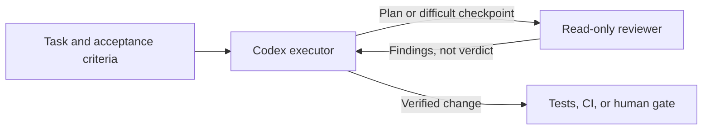

The previous article examined [Claude Code Advisor](/en/blog/133-claude-code-advisor-decision-points/): a main model can ask another model for advice in the middle of a task. Does GPT or Codex offer the same pattern? Yes, but not as one universal Advisor switch. Codex provides several review mechanisms: `/review` inspects code changes, a custom reviewer subagent can inspect a plan or a difficult problem, and Auto-review evaluates actions that cross permission boundaries. If you are building your own agent, the Agents SDK also provides a way to compose a manager that calls a specialist.

That distinction matters. **A second model offering advice, another agent reviewing a diff, and a reviewer evaluating a permission request are different jobs.** Choosing the wrong mechanism can make a team think its code received a second-model review when the only thing checked was whether a shell command could cross the sandbox.

> **Huahua's take**
>
> Codex's second opinions are a set of review tools organized by what they inspect—not one button. Name the object of review first, then choose the reviewer.

## A correction: Codex can use a different model for `/review`

After checking the current [official Codex Code Review documentation](https://learn.chatgpt.com/docs/code-review), there is a concrete answer: Codex's `/review` starts a dedicated reviewer for uncommitted changes, a selected commit, or a branch diff. It returns prioritized findings without changing the working tree. The documentation also says that `review_model` in `config.toml` can select a review model different from the one used by the current session.

That is more than asking the same model to repeat its answer, but its trigger is still an **explicit review**, and its scope is a selected code change. It is not the same as the main agent deciding on its own to consult an advisor at any arbitrary point in a task. A custom subagent or an SDK workflow can provide that kind of checkpointed consultation.

| Mechanism | Review target and trigger | Best question to ask | What it does not mean |
| --- | --- | --- | --- |
| Codex `/review` + `review_model` | A person starts a review of local changes, a commit, or a branch | Does this change have correctness, security, or test risks? | It does not automatically run at every mid-task decision or approve a merge |
| Custom reviewer subagent | The main agent delegates a plan, failure, or change | What assumptions, alternatives, or risks might the author have missed? | Advice is not a test result; the subagent should not replace CI |
| Auto-review | An action needs to cross an existing sandbox or approval boundary | Should this specific action be allowed under policy? | It is not a design or code-quality review, and does not expand permissions |
| Agents SDK advisor tool | The application defines when to call it | How can a second opinion become part of my own agent product? | It is not Codex Auto-review automatically attached to an API |

The flow is easier to see as a sequence: the main Codex agent keeps doing the work and receives reviewer findings. Auto-review checks a specific action only when it needs permission escalation; tests or human gates still verify the result.



## Ask a reviewer subagent to inspect the plan at important checkpoints

If you want a second perspective before implementation, after the same failure repeats, or before delivery, a Codex subagent is a good fit. Official documentation supports subagent workflows in Codex and describes custom agents stored under `~/.codex/agents/` for personal use or `.codex/agents/` for a project. Each agent can have its own model, reasoning effort, sandbox, and instructions. If you do not configure a model or reasoning effort, the subagent inherits the parent's settings. The [official Subagents guide](https://learn.chatgpt.com/docs/agent-configuration/subagents) includes a PR workflow with a `pr_explorer`, a read-only `reviewer` focused on correctness, security, and test risk, and a `docs_researcher`.

For example, define a reviewer that cannot edit files in `.codex/agents/reviewer.toml`:

```toml
name = "reviewer"
description = "Read-only second opinion on plans and code changes."
model = "gpt-6.1-sol"
model_reasoning_effort = "medium"
sandbox_mode = "read-only"
developer_instructions = """
Review the supplied goal, plan, evidence, or diff independently.
Prioritize correctness, security, behavior regressions, and missing tests.
Return concrete findings with evidence and a recommended verification step.
Do not edit files or claim that an unrun test passed.
"""
```

This uses model names listed in the current official examples; available models, reasoning options, and account access can change, so verify them for your Codex version and organization. You can give the main agent a clear checkpoint instruction as well:

```text
First summarize the goal, acceptance criteria, and proposed approach without editing files. Delegate a read-only plan review to reviewer. Ask for the most likely failure assumptions, permission risks, and one alternative. After the review, state which advice you accept or reject and why, then implement. Afterward, ask reviewer to inspect the diff read-only; you still run the tests and report their results.
```

This adds review points to a long task without handing the entire task to the reviewer. OpenAI recommends using subagents for independent, well-bounded work with a concrete question and expected result; keep short tasks and dependent steps with the main agent. [Subagents documentation](https://learn.chatgpt.com/docs/agent-configuration/subagents)

## Use `/review` for a diff, not as a merge button

The strength of Codex `/review` is its explicit scope. You can review a branch against a base branch, inspect uncommitted changes, or target a commit. The reviewer returns prioritized findings without modifying the working tree. That makes it useful for a separate pass over the implementation, where the reviewer can focus on what changed rather than rereading the whole task history. [Codex Code Review documentation](https://learn.chatgpt.com/docs/code-review)

To use a review model different from the active session, set `review_model` in `config.toml`:

```toml
review_model = "YOUR_SUPPORTED_REVIEW_MODEL"
```

Replace the placeholder with a model ID supported by your Codex version and account. Code Review also supports custom review instructions for priorities and reporting format—for example, behavior regressions, data loss, and missing edge-case tests. If you want results in a separate conversation, the documentation lists `chatgpt.reviewDelivery = "detached"`. These controls shape a review workflow; they do not make the reviewer's conclusions proven by tests.

If senior engineers keep repeating the same judgment, put durable repository rules in `AGENTS.md`, under `## Code Review Rules`. Examples include backward-compatibility requirements, data boundaries, and acceptable exceptions. OpenAI's Code Review rules post shows how scoped rules can be placed near the affected code and cited in a finding. Its reported 98% versus 58.3% result comes from an OpenAI-built evaluation suite, so treat it as a vendor evaluation—not an external team's real-world hit rate. [Custom Code Review rules for Codex](https://developers.openai.com/blog/custom-code-review-rules-for-codex) · [Official AGENTS.md guide](https://learn.chatgpt.com/docs/agent-configuration/agents-md)

## Auto-review checks permission boundaries, not your design taste

Codex Auto-review is the formal feature that most resembles “a second agent checking a decision,” but the decision is narrowly defined. When the main agent proposes an action that would otherwise require approval, Codex routes that request to a reviewer agent, which returns an allow or deny decision with a rationale. Triggers include sandbox-boundary command requests, blocked network requests, edits outside allowed roots, and some MCP or app tool calls that need approval. [Auto-review documentation](https://learn.chatgpt.com/docs/sandboxing/auto-review)

For interactive approvals, the configuration looks like this:

```toml
approval_policy = "on-request"
approvals_reviewer = "auto_review"
```

The point is not to give Codex “more permission.” OpenAI says Auto-review swaps the reviewer for eligible approval prompts; it does **not** expand the sandbox, enable extra network access, or relax file boundaries. Routine actions already allowed inside the sandbox are not individually reviewed. The reviewer evaluates the proposed action against policy, not whether a refactor is a good design or an answer is correct. Auto-review is not a deterministic security guarantee and should complement sandbox design, monitoring, and organizational policy.

So do not use Auto-review as a substitute for `/review` or software tests. Auto-review checks permission escalation; `/review` checks code changes; tests and CI provide stable gates for conditions that can be checked mechanically. If a review must not be skipped, enforce it with branch protection, CI, or human approval—not a model's optional decision to ask another model.

## Build an advisor into your own agent product with the Agents SDK

If you are building a GPT agent product rather than only using Codex, the OpenAI Agents SDK offers a direct architecture: define a specialist agent and expose it as a tool to the main agent. Assign `model` on each agent to pair a faster executor with a different advisory model; the manager remains responsible for the final answer. OpenAI calls this pattern “agents as tools” and distinguishes it from a handoff, where the specialist takes over the conversation. [Models and providers](https://developers.openai.com/api/docs/guides/agents/models) · [Orchestration and handoffs](https://developers.openai.com/api/docs/guides/agents/orchestration)

Conceptually:

```ts
import { Agent } from "@openai/agents";

const advisor = new Agent({
  name: "Advisor",
  model: "gpt-6.1-sol",
  instructions: "Review the supplied plan or evidence. Return risks, alternatives, and checks; do not execute tools.",
});

const executor = new Agent({
  name: "Executor",
  model: "gpt-6-luna",
  tools: [
    advisor.asTool({
      toolName: "consult_advisor",
      toolDescription: "Request a bounded second opinion on a consequential decision.",
    }),
  ],
});
```

This code creates a routing capability; it does **not** guarantee the executor will call the advisor at every requested point. If a review is mandatory, create a non-skippable checkpoint in the application flow. For side-effecting tools, enforce policy or approval at the tool boundary. OpenAI also states that Responses API and Agents SDK applications do not automatically inherit Codex Auto-review; a custom harness must implement its own review and enforcement. [Guardrails and human review](https://developers.openai.com/api/docs/guides/agents/guardrails-approvals)

## What OpenAI's own example does—and does not—show

In its account of delivering DevDay 2025, OpenAI describes an engineer using Codex to ramp up on the Guardrails SDK codebase, locate bugs, fix them through the CLI or IDE extension, then use Codex code review to find outstanding issues. The same workflow was used to polish ChatKit sample apps. [How Codex ran OpenAI DevDay 2025](https://developers.openai.com/blog/codex-at-devday) is a first-party engineering example of putting exploration, implementation, and review into one delivery path. It is not a controlled study and cannot establish a general review recall rate or productivity gain.

The useful common principle is not “another model makes it reliable.” It is that each review has a clearly named object: a plan, a diff, or a permission request. To see how subagents fit into a broader harness, continue with [Skills, Subagents, Commands, and Hooks](/en/blog/29-agent-era-skills-subagents-commands-hooks/). For a Codex environment shaped around repository rules, tests, and observability, read [Harness Engineering: Make Codex Repositories Legible, Verifiable, and Governable](/en/blog/11-harness-engineering/). The broader runtime foundation is in the [practical AI Agent guide](/en/blog/64-ai-agent-guide/).

## Compare three conditions on your own tasks

Do not treat “the reviewer found nothing” as a success metric. Select representative tasks with clear acceptance criteria and compare at least three conditions: the main model alone, the main model plus reviewer, and a stronger main model alone. Track:

1. Whether final tests and human acceptance pass—not whether the agent says it is done.
2. The true defects found, false positives, and whether accepted advice actually fixed the issue.
3. The count and trigger for reviewer-subagent calls, `/review`, and Auto-review separately; do not collapse them into one metric.
4. Total tokens or cost per task, latency, rework, and what happens when a reviewer is unavailable or times out.
5. Who owns the final decision, and whether CI, sandboxing, or human approval remains for deployment, deletion, external writes, or sensitive data.

> **Huahua's engineering note**
>
> Different models may reduce some shared blind spots, but they do not create an independent source of truth. Tie findings to a diff, test, or policy evidence; keep unverified advice as a question, not a passing stamp.

A practical Codex setup is: **delegate a read-only reviewer subagent at planning or repeated-failure checkpoints; run `/review` with a chosen `review_model` after the patch; use Auto-review for actions that cross sandbox boundaries; and finish with tests, CI, and clear human ownership.** If you are building your own agent product, use the Agents SDK manager-as-tool pattern to make advisor calls observable and testable.

## Sources and further reading

- OpenAI, [Subagents](https://learn.chatgpt.com/docs/agent-configuration/subagents) — custom Codex subagents, model inheritance, read-only reviewer configuration, and examples.
- OpenAI, [Code review](https://learn.chatgpt.com/docs/code-review) — `/review` scopes, read-only findings, `review_model`, and the review workflow.
- OpenAI, [Auto-review](https://learn.chatgpt.com/docs/sandboxing/auto-review) — reviews of sandbox-boundary approvals and their permission and safety limits.
- OpenAI, [Custom Code Review rules for Codex](https://developers.openai.com/blog/custom-code-review-rules-for-codex) — scoped review guidance in `AGENTS.md` and vendor-reported evaluation results.
- OpenAI, [Orchestration and handoffs](https://developers.openai.com/api/docs/guides/agents/orchestration) and [Models and providers](https://developers.openai.com/api/docs/guides/agents/models) — manager/specialist patterns and per-agent model configuration in the Agents SDK.
- OpenAI, [Guardrails and human review](https://developers.openai.com/api/docs/guides/agents/guardrails-approvals) — review and enforcement boundaries that custom API/SDK agents must implement.
- OpenAI, [How Codex ran OpenAI DevDay 2025](https://developers.openai.com/blog/codex-at-devday) — a first-party engineering example involving SDK debugging, fixes, and code review.
