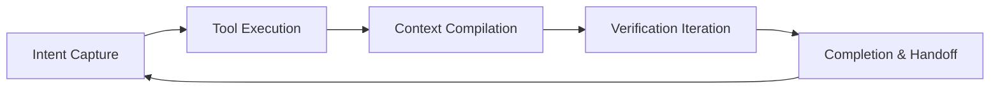

When colleagues ask, "Should we switch to a stronger model?", this popular science article by Parallel.ai with a **23-minute read time** offers another question: **Is the lifecycle management wrapped around the outside of your model good enough?** They define **Agent Harness** as: an architecture that manages the **full lifecycle of context**—from intent capture, specification, compilation, execution, verification to persistence, **everything outside the model**.

This is not "just another prompt trick," but rather a software layer that allows pre-trained LLMs to **connect to the world**. This article is Phase 2 (List **#8**) of [Reading Map 13](/blog/13-harness-engineering-reading-map/), and it complements [LangChain 15](/blog/15-langchain-agent-harness-anatomy/) "Inferring Components from Behavior": this article leans towards **definitions, the five-step loop, stack clarification, and FAQs**, making it suitable for external presentations or onboarding.

---

> **花花的一句話**：幫大模型裝上和真實世界互動的四肢與感官，這就是 Agent Harness 的魅力喵！模型外面的生命週期管理才是真正的決勝點喔～🧶
>
> **花花的工程提醒**：別把 Harness 跟單純的 Prompt 或 Framework 搞混，建構時需將意圖擷取、工具執行、驗證與持久化等五大步驟納入系統層面整體規劃。

Original Source:  
**Parallel.ai (2025). What is an agent harness?**  
URL: <https://parallel.ai/articles/what-is-an-agent-harness>

---

### Background: From "Model + Chat" to "Orchestration + Harness"

Early ChatGPT was practically just **LLM + conversational interface**. Today, behind advanced assistants there is usually:

| Layer | Role |
|----|------|
| **Orchestrator** | Decides when and how many times to call the model (Control flow) |
| **Harness** | Tools, memory, long conversation structure, verification, persistence (Capabilities and side effects) |
| **Model** | Reasoning core |

Parallel emphasizes: **The actual effect often depends on the orchestrator + harness, not just the marginal gains of model parameters or training data.** This is the same narrative as the durability in [Schmid 18](/blog/18-phil-schmid-agent-harness-2026/), and the dramatic shifts in harness rankings of [Terminal Bench in 15](/blog/15-langchain-agent-harness-anatomy/).

An architect's definition in the original article can be condensed as:

> Harness = A complete architectural system surrounding the LLM that manages the entire workflow of context from **intent capture → specification → compilation → execution → verification → persistence**.

---

### Core Concept 1: Why Harness Appeared (Four Types of Practical Gaps)

When an Agent is asked to write cross-session software, query APIs, analyze long documents, or operate UIs, the **bare LLM** exposes four types of gaps:

#### 1. Limited Memory and Context

Standard LLMs have a fixed context window, and each session starts from zero—Parallel compares this to an **engineer with daily amnesia**. Harness uses:

- Persistent logs, summaries  
- External knowledge bases / vector databases  
- **Compaction** (In the same family as the Anthropic Claude Agent SDK)

Allowing work to span across multiple context windows. Compare this to the initializer / coding agent and `claude-progress.txt` in [Anthropic 10](/blog/10-effective-harnesses-for-long-running-agents/).

#### 2. Models Can Only Spit Text, but Need to "Take Action"

Harness **listens for tool-call instructions** → pauses generation → executes search / program / API → stuffs the results back into the context, as if the model itself "wrote out" the observations. This is giving the **model hands and eyes**.

#### 3. Lack of Structured Workflow

Complex tasks need to be broken down and verified at each step. Without structure, outputs are often **superficially reasonable, but collapse upon closer inspection**. Harness formalizes intent, sets acceptance criteria, and forces incremental progress.

#### 4. Long-Horizon Tasks

Anthropic engineering post (cited by Parallel): No matter how strong a coding model is, without an external system for **project initialization, progress tracking, and leaving artifacts for the next session**, it is hard to build large apps well. What Harness fills is the **glue between sessions**.

---

### Core Concept 2: How Harness Works (The Five-Step Loop)

1. **Intent Capture and Orchestration Collaboration**  
   User goals are captured; the orchestrator breaks down sub-tasks or decides the next prompt; the harness provides tools and the context for the current step.

2. **Tool Call Execution**  
   The model outputs structured tool requests → harness **pauses** text generation → executes in the external world → backfills the results. The model can reason over **live data**.

3. **Context Management and Memory**  
   Before each round, **compile working prompts**: retain key points, summarize old conversations, and avoid **context rot** (same topic as isolation / reduction / retrieval in [LangChain 15](/blog/15-langchain-agent-harness-anatomy/)).  
   Often distinguishes three layers of memory (compiled by Parallel):

   | Type | Description |
   |------|------|
   | Working context | Instantaneous prompt for the current model call |
   | Session state | Persistent log of the current task, can be cleared when the task ends |
   | Long-term memory | Knowledge base / vector database across tasks |

4. **Result Verification and Iteration**  
   Format checks, tests, security filtering; coding often sees **write → test → fix** unmanned loops. Harness encourages **one sub-task at a time**, committing / updating progress before advancing.  
   **Parallel explicitly reminds**: Blindly adding "QA sub-Agents" might make things worse; it's better to let the **main Agent self-verify**, escalating or resetting only when necessary.

5. **Completion and Handoff**  
   Save artifacts, progress, repo states, letting the **project have memory**—even if the next LLM instance is brand new.

**Key point**: Harness **does not alter model weights**; it is the architectural layer that enhances the problem-solving capabilities of pre-trained models.

---

### Core Concept 3: Common Components (Checklist)

| Component | Responsibility |
|------|------|
| Tool Integration Layer | Search, DB, code sandbox, images, etc.; default toolkit |
| Memory and State | Short/long-term memory, summaries, RAG injection |
| Context engineering | Isolation, compression, different prompts for first round vs subsequent rounds |
| Planning and Decomposition | Initializer builds list; coding agent does one feature at a time |
| Guardrails | Tests, schema, security; coding runs unit tests |
| Modularity | Pluggable perception / memory / reasoning |

**Academic validation (ICML 2025 Game Agent Paper, cited by Parallel)**: The same GPT-4 class model, added with a harness of **perception + memory + reasoning** modules, has a **consistently higher win rate than without harness** across multiple games—proving that bottlenecks often lie in the **surrounding systems**, not in training a little bit more.

---

### Core Concept 4: Examples and Stack Clarification

| Name | Harness Role |
|------|----------------|
| **Claude Agent SDK** | Anthropic calls it general-purpose harness; includes compaction |
| **LangChain DeepAgents** | Default prompt, planning, virtual file system; "OS out of the box" |
| **AutoGPT, Copilot X, Cursor** | Early or productized instances containing rudimentary harness |
| **LM Evaluation Harness** | ⚠️ **Evaluation harness**, different context from agent harness |

#### Harness vs Framework

- **Framework** (LangChain, LlamaIndex): Building blocks—tool abstraction, chains, agent loops.  
- **Harness**: A **complete runtime with defaults**, often built on top of frameworks (DeepAgents uses LangChain).

#### Harness vs Orchestrator

- **Orchestrator**: **Logic and control flow**—when to call the model again, ReAct loops.  
- **Harness**: **Capabilities and side effects**—executing tools, managing IO, compiling context.  
- Both are **used in tandem**: the orchestrator says "run one more step"; the harness ensures that step has tools and the correct prompt.

#### Harness vs Prompt engineering

Prompt engineering is a **technique**; harness is the **overall architecture including prompt decisions** (tools, memory, loops, persistence).

#### Multi-Model Sharing

Harness can **swap models** without rewriting the whole system; even **model routing** (simple steps use smaller models). What needs adjustment are the details of tool syntax and prompt formatting for each model.

---

### Core Concept 5: Benefits of Proper Design

| Benefit | Mechanism |
|------|------|
| Task Success Rate | Tools, memory, debugging loops compensate for model weaknesses |
| Long-Task Consistency | Load state after interruption, avoiding repetition or abandonment |
| Resource Efficiency | Precise context; knowledge graph / DB external reasoning can reduce tokens by **10–100x** (magnitude claim from original text) |
| Capability Expansion Without Retraining | Vision, Python, search connected via harness |
| Reliability and Security | Filtering, process enforcement; harness acts like a **governor on an engine** |

Parallel's conclusion aligns with industry slogans: **"Harness makes or breaks the product"**—same LLM, harness difference = user experience difference. Compare to [Fowler 14](/blog/14-martin-fowler-harness-engineering-review/), [Ignorance 20](/blog/20-ignorance-ai-harness-playbook/).

---

### FAQ Highlights (Original Key Points)

| Question | Short Answer |
|------|------|
| Does simple Q&A need a harness? | Not necessarily; once multi-steps, tools, or cross-session are needed, it's almost always required (even if very thin) |
| Harness Engineering vs Traditional Software Engineering? | Borrows modules, states, tests, but must deal with a **non-deterministic core**, token limits, hallucinations |
| Only applicable to text LLMs? | The concept can extend to robotics, environment wrappers for RL |

---

### Comparison with Other Articles in This Series

| You want to... | Read which post |
|--------|--------|
| Cybernetics and Trust | [Fowler 14](/blog/14-martin-fowler-harness-engineering-review/) |
| Components and Terminal Bench | [LangChain 15](/blog/15-langchain-agent-harness-anatomy/) |
| Organizational-Level Practical Combat | [OpenAI 11](/blog/11-harness-engineering/) |
| 2026 Strategy and durability | [Schmid 18](/blog/18-phil-schmid-agent-harness-2026/) |
| Industry Playbook Convergence | [Ignorance 20](/blog/20-ignorance-ai-harness-playbook/) |
| Coding Configuration Tactics | [HumanLayer 21](/blog/21-humanlayer-skill-issue-harness/) |

---

### Insights and Recommendations

1. **External Communication**: Use the "CPU / RAM / OS / App" analogy (see [18](/blog/18-phil-schmid-agent-harness-2026/)), then use the five-step loop in this article to explain what the OS does.  
2. **Architecture Decisions**: Mark new features as falling under **orchestrator** or **harness** first; avoid lacking in both.  
3. **Long-Task Defaults**: Progress file + verification steps + incremental commits, rather than infinitely lengthening the system prompt.  
4. **Investment Sequence**: First ensure a **single harness path** can be logged and scored (echoing Schmid's hill climbing), before talking about swapping models.

---

### Summary

The Parallel.ai article is a **textbook-level definition piece**: converging practices scattered across Anthropic, LangChain, and academic game experiments into **lifecycle + five-step loop + stack vocabulary**. It doesn't replace the implementation details in [10](/blog/10-effective-harnesses-for-long-running-agents/) or the extreme stress tests in [17](/blog/17-anthropic-parallel-c-compiler-agents/), but is suitable as the first reading for a team's **common language**.

**Editor's Judgment:** Stack analogies are convenient for external communication, but Parallel.ai **did not provide a quantifiable harness ROI**; in practice, it is still necessary to refer to the validation chain of OpenAI 11, avoiding treating the five-step loop as a checklist while ignoring domain constraints.

---

### Series Guide

- [Reading Map 13](/blog/13-harness-engineering-reading-map/)  
- [20 Ignorance.ai Playbook](/blog/20-ignorance-ai-harness-playbook/) · [21 HumanLayer](/blog/21-humanlayer-skill-issue-harness/)

---

Original Source:  
**Parallel.ai (2025). What is an agent harness?**  
URL: <https://parallel.ai/articles/what-is-an-agent-harness>
