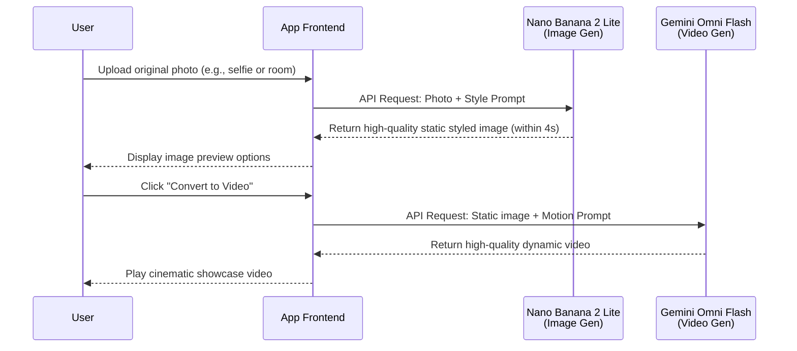

Recently, Google brought two major releases that shocked the developer community: **Nano Banana 2 Lite** and **Gemini Omni Flash**. These two new models are designed to enable developers to conduct creative experiments and scale ideas faster and more cost-effectively.

Whether your workflow requires generating thousands of images or conducting multi-turn conversational video editing, these two new models can help you accelerate development iterations and turn boundless creative visions into reality. This article will provide you with a detailed analysis of the core highlights and application potential of these two major technologies.

## 1. Nano Banana 2 Lite: The Fastest, Most Cost-Effective Gemini Image Model

**Nano Banana 2 Lite** (model code: `gemini-3.1-flash-lite-image`) is specifically designed for development pipelines requiring rapid ideation and high throughput, achieving unprecedented advantages in speed and cost. Officially, it is highly recommended that developers currently using the first-generation Nano Banana (`gemini-2.5-flash-image`) upgrade to 2 Lite immediately to gain comprehensive performance improvements.


### Core Advantages

*   **Ultimate Generation Speed**: Text-to-image generation can be completed in just **4 seconds**, making it perfect for interactive prototyping and rapid visual sketching.
*   **Incredible Cost-Effectiveness**: Generating a 1K resolution image costs only **$0.034**, making it a perfect choice for development teams focused on high-volume composition, strict operational budget control, or low-bandwidth use cases.
*   **Uncompromising Quality**: Despite the extreme pursuit of speed, Nano Banana 2 Lite maintains reliable Prompt Adherence, strong character consistency, and clear, legible in-image text rendering capabilities.

**API Call Example (Python)**:
```python
from google import genai
from PIL import Image
import io

client = genai.Client()

# Generate image using Nano Banana 2 Lite
response = client.models.generate_content(
    model="gemini-3.1-flash-lite-image",
    contents="A futuristic cityscape at sunset, cinematic lighting"
)

# Retrieve and save the generated image
for part in response.parts:
    if part.inline_data:
        image = Image.open(io.BytesIO(part.inline_data.data))
        image.save("output_nano_banana.png")
```

### Meet the Nano Banana Family

Google has also clearly positioned the Nano Banana family for different needs:


*   **Nano Banana 2 Lite (Gemini 3.1 Flash Lite Image)**: Built for "speed", suitable for near real-time, high-throughput workflows with strict ultra-low latency requirements.
*   **Nano Banana 2 (Gemini 3.1 Flash Image)**: The all-around workhorse model, offering high image quality with low latency, perfectly balancing performance and cost.
*   **Nano Banana Pro (Gemini 3 Pro Image)**: Optimized for complex, professional use cases, providing the most powerful control and advanced reasoning capabilities for tasks where "accuracy is prioritized over speed".

Currently, Nano Banana 2 Lite is live on Google AI Studio, Gemini API, and Gemini Enterprise Agent Platform, and is simultaneously promoted to many consumer products including Google Search (AI Mode), Gemini App, and NotebookLM.

## 2. Gemini Omni Flash: Leading Multimodal Video Editing and Generation

At this year's Google I/O conference, **Gemini Omni**, which combines Gemini's multimodal reasoning with video generation and editing capabilities, made its debut. And now, **Gemini Omni Flash** (`gemini-omni-flash-preview`) is officially open to developers for preview testing via the Gemini API and Google AI Studio.

This model can natively support text, image, and video inputs, and perform high-quality video generation and conversational editing. Its pricing is extremely competitive, costing only **$0.10** per second of video generated (same as Veo 3.1 Fast).

### Four Major Highlights of Omni Flash

1.  **Conversational Video Editing**: Developers and users can use natural language to fine-tune and edit video content.
2.  **Multimodal Referencing**: Combines multiple input formats like images, text, and videos, thereby maintaining scene control and high consistency.
3.  **Real-World Knowledge Integration**: Omni draws on Gemini's vast knowledge base in fields such as history, biology, and narrative logic, enabling it to construct persuasive and vivid videos.
4.  **Text and Motion Synchronization**: Through simple prompts, text or graphics can be perfectly linked directly with the motion in the video.

**API Call Example (Python)**:
```python
from google import genai

client = genai.Client()

# Upload reference media (e.g., an image generated by Nano Banana or a baseline video)
# reference_media = client.files.upload(file="source_image.png")

# Use Gemini Omni Flash for video generation or editing
response = client.models.generate_content(
    model="gemini-omni-flash-preview",
    contents=[
        "Transform this scene to look like a watercolor painting, maintaining smooth motion.",
        # reference_media
    ]
)
```

### Current Preview Limitations

It is worth noting that, as a preview version, Omni Flash currently still has some limitations:
*   Currently only supports generating videos up to **10 seconds** (longer durations coming soon).
*   The Gemini API does not yet support uploading audio references and the Scene Extension feature.
*   Although the API accepts video references up to 3 seconds, the model cannot yet process them perfectly.
*   Character consistency when switching scenes or panning the camera still has room for improvement.

## 3. Joining Forces: When Nano Banana 2 Lite Meets Gemini Omni Flash

The real magic happens when these two models are connected!

The best practice for developers is to first use **Nano Banana 2 Lite** as an ultra-fast image generation engine, then feed that image as a reference input to **Gemini Omni Flash** to animate it into a high-quality video. Paired with the **Interactions API** for multi-turn experiences, you can also maintain conversational history and context, allowing users to stack up to three continuous edits.

### Multimodal Pipeline Sequence Architecture (Anywhere / Space Lift)

The following demonstrates the multimodal pipeline architecture of how these two models seamlessly collaborate in Anywhere or Space Lift applications:



### Official Demo App Inspirations

Google has also released several Demo apps for developers to reference and Remix:
*   **Anywhere**: Upload a selfie, and the APP will use Nano Banana 2 Lite to instantly place you in dozens of famous landmarks globally; after clicking the image, Omni Flash will convert it into a dynamic scene video.
*   **Space Lift**: An interior design APP. After uploading a room photo, Nano Banana 2 Lite will generate design concepts in various aesthetic styles for you; after selecting a preferred style and clicking the video button, Omni will present a cinematic room showcase video.
*   **Omni Product Studio**: Built for e-commerce, instantly transforming static product images generated by Nano Banana 2 Lite into eye-catching cinematic product promo videos.

## Conclusion

The release of Nano Banana 2 Lite and Gemini Omni Flash has not only significantly lowered the threshold for AI-generated media but also provided developers with powerful weapons to build end-to-end multimedia experiences. Whether it's interactive design, marketing material generation, or more complex creative workflows, this new wave of generative AI led by Google is worth every developer experiencing and exploring firsthand.

---

> **花花的一句話**：花花聽說有叫 Nano Banana 的東西，還以為是新口味的香蕉零食呢！結果是超快速的畫圖魔法，四秒鐘就能變出一張圖，連我都來不及吃完一口貓草喵！
>
> **花花的工程提醒**：導入生成式 AI 圖像與影片服務時，記得考慮到延遲（Latency）對使用者體驗的影響。像 Nano Banana 2 Lite 這樣的高速模型，非常適合用於需要即時回饋的互動式原型設計或草圖生成。

*Source: [Google Official Blog: Start building with Nano Banana 2 Lite and Gemini Omni Flash](https://blog.google/innovation-and-ai/models-and-research/gemini-models/gemini-omni-flash-nano-banana-2-lite/)*
