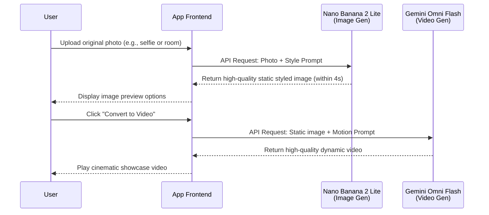

Google released **Nano Banana 2 Lite** and **Gemini Omni Flash** for two related jobs: high-throughput image generation and conversational video generation or editing. They can form an image-first, video-second pipeline, but their maturity differs: the image model emphasizes production speed and cost, while Omni Flash is still labeled preview.

This article separates published specifications, pricing, and limitations. Unless noted otherwise, speed, quality, and cost statements come from Google; before production adoption, re-test them with your prompts, output resolution, failure rate, and regional availability.

## 1. Nano Banana 2 Lite: Read the Vendor Specs, Then Run Your Own Benchmark

**Nano Banana 2 Lite** (model code: `gemini-3.1-flash-lite-image`) targets rapid ideation and high-throughput pipelines. Google recommends that users of the first-generation Nano Banana (`gemini-2.5-flash-image`) evaluate an upgrade, but the decision still depends on prompt compatibility, quality thresholds, and regression results.


### Core Advantages

*   **Published latency**: Google reports roughly **4 seconds** for text-to-image generation, making the model a candidate for interactive prototypes and rapid visual drafts.
*   **Published price**: A 1K image costs **$0.034**; at scale, include retries, moderation, storage, and post-processing in the budget.
*   **Quality claims**: Google highlights prompt adherence, character consistency, and legible in-image text. Validate each with a fixed test set rather than relying on demos.

**API Call Example (Python)**:
```python
from google import genai
from PIL import Image
import io

client = genai.Client()

# Generate image using Nano Banana 2 Lite
response = client.models.generate_content(
    model="gemini-3.1-flash-lite-image",
    contents="A futuristic cityscape at sunset, cinematic lighting"
)

# Retrieve and save the generated image
for part in response.parts:
    if part.inline_data:
        image = Image.open(io.BytesIO(part.inline_data.data))
        image.save("output_nano_banana.png")
```

### Meet the Nano Banana Family

Google has also clearly positioned the Nano Banana family for different needs:


*   **Nano Banana 2 Lite (Gemini 3.1 Flash Lite Image)**: Built for "speed", suitable for near real-time, high-throughput workflows with strict ultra-low latency requirements.
*   **Nano Banana 2 (Gemini 3.1 Flash Image)**: Google's general-purpose option for balancing image quality, latency, and cost.
*   **Nano Banana Pro (Gemini 3 Pro Image)**: Intended for complex tasks where accuracy, control, and reasoning matter more than speed.

Currently, Nano Banana 2 Lite is live on Google AI Studio, Gemini API, and Gemini Enterprise Agent Platform, and is simultaneously promoted to many consumer products including Google Search (AI Mode), Gemini App, and NotebookLM.

## 2. Gemini Omni Flash: Read Preview Capabilities and Limits Together

At this year's Google I/O conference, **Gemini Omni**, which combines Gemini's multimodal reasoning with video generation and editing capabilities, made its debut. And now, **Gemini Omni Flash** (`gemini-omni-flash-preview`) is officially open to developers for preview testing via the Gemini API and Google AI Studio.

The model supports text, image, and video inputs, plus video generation and conversational editing. Google lists the price at **$0.10** per generated second (the same as Veo 3.1 Fast); that excludes retries and product-side moderation.

### Four Major Highlights of Omni Flash

1.  **Conversational Video Editing**: Developers and users can use natural language to fine-tune and edit video content.
2.  **Multimodal Referencing**: Combines multiple input formats like images, text, and videos, thereby maintaining scene control and high consistency.
3.  **Real-World Knowledge Integration**: Omni draws on Gemini's vast knowledge base in fields such as history, biology, and narrative logic, enabling it to construct persuasive and vivid videos.
4.  **Text and Motion Synchronization**: Through simple prompts, text or graphics can be perfectly linked directly with the motion in the video.

**API Call Example (Python)**:
```python
from google import genai

client = genai.Client()

# Upload reference media (e.g., an image generated by Nano Banana or a baseline video)
# reference_media = client.files.upload(file="source_image.png")

# Use Gemini Omni Flash for video generation or editing
response = client.models.generate_content(
    model="gemini-omni-flash-preview",
    contents=[
        "Transform this scene to look like a watercolor painting, maintaining smooth motion.",
        # reference_media
    ]
)
```

### Current Preview Limitations

It is worth noting that, as a preview version, Omni Flash currently still has some limitations:
*   The official preview currently supports videos up to about **10 seconds**.
*   The Gemini API does not yet support uploading audio references and the Scene Extension feature.
*   Although the API accepts video references up to 3 seconds, the model cannot yet process them perfectly.
*   Character consistency when switching scenes or panning the camera still has room for improvement.

## 3. Pipeline Decision: Generate the Image, Then the Video

Google's demos use an easy-to-understand pattern: generate a still image with **Nano Banana 2 Lite**, then pass it to **Gemini Omni Flash** for animation. The **Interactions API** can retain conversational history and context, with Google's current demo showing up to three sequential edits. Treat this as a testable reference architecture, not a requirement for every product.

### Multimodal Pipeline Sequence Architecture (Anywhere / Space Lift)

The following demonstrates the multimodal pipeline architecture of how these two models seamlessly collaborate in Anywhere or Space Lift applications:



### Official Demo App Inspirations

Google has also released several Demo apps for developers to reference and Remix:
*   **Anywhere**: Upload a selfie, and the APP will use Nano Banana 2 Lite to instantly place you in dozens of famous landmarks globally; after clicking the image, Omni Flash will convert it into a dynamic scene video.
*   **Space Lift**: An interior design APP. After uploading a room photo, Nano Banana 2 Lite will generate design concepts in various aesthetic styles for you; after selecting a preferred style and clicking the video button, Omni will present a cinematic room showcase video.
*   **Omni Product Studio**: Built for e-commerce, instantly transforming static product images generated by Nano Banana 2 Lite into eye-catching cinematic product promo videos.

## Conclusion

Nano Banana 2 Lite has a straightforward value proposition: lower per-image cost and shorter waits. Gemini Omni Flash is better treated as a bounded trial while teams measure the ten-second cap, reference-media handling, character consistency, and actual cost per accepted output. Before chaining both models, define quality gates and fallback behavior instead of comparing sticker prices alone.

> **Huahua in one sentence**
>
> Huahua heard that there was something called Nano Banana, and thought it was a new flavor of banana snack! The result is a super-fast drawing magic that can create a picture in four seconds, and I don’t even have time to finish a mouthful of cat grass!
>
> **Huahua's engineering note**
>
> When importing generative AI image and video services, remember to consider the impact of latency on user experience. High-speed models like the Nano Banana 2 Lite are ideal for interactive prototyping or sketching where immediate feedback is required.

## Further Reading

- To see how similar model capabilities change once embedded in a knowledge product, read [NotebookLM Short-Video Summaries](/en/blog/33-google-notebooklm-ai-clips/).
- If you are evaluating an enterprise platform rather than one API, compare [Gemini Enterprise Agent Platform](/en/blog/68-gemini-enterprise-agent-platform/).
- For more productization trade-offs in multimedia AI, continue with [Google Cloud × CyberLink](/en/blog/41-google-cloud-cyberlink-ai-multimedia/).

*Source: [Google Official Blog: Start building with Nano Banana 2 Lite and Gemini Omni Flash](https://blog.google/innovation-and-ai/models-and-research/gemini-models/gemini-omni-flash-nano-banana-2-lite/)*
