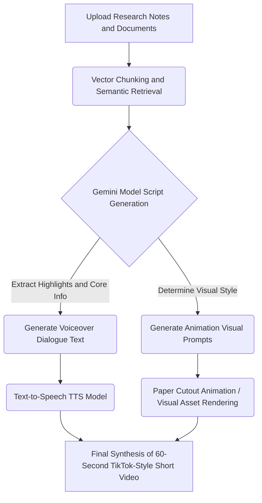

Google's powerful note-taking and research assistant **NotebookLM** has ushered in another major evolution! To allow users to absorb and organize research data in a more diverse and engaging way, NotebookLM has officially launched a brand new feature: **turning your notes and documents into TikTok-style 60-second vertical AI Short Video Overviews with a single click**.

This feature is currently rolling out to **Google AI Ultra** and **Pro** subscribers, allowing users to automatically generate short videos with voiceovers and rich animations based on source materials (such as PDFs, Google Docs, website links, etc.) uploaded into the app.

## Core Highlights and Features: When AI Meets Short Videos

### 1. Multimodal Pipeline: The Magic Behind It
Behind this short video feature is a sophisticated multimodal conversion pipeline. The flowchart below illustrates how NotebookLM transforms lengthy texts into vivid short videos:

### 2. Vivid Visualizations Breaking Through Dull Text
According to a sample shared officially by Google (themed around the famous "Emu War" in Australian history), AI can extract complex historical events and automatically pair them with compelling voiceover narration. Most amazingly, it automatically generates **paper cutout-style** AI art animations to aid in explanation. This completely breaks the dullness of traditional text-only reading, making the absorption of knowledge as effortless, intuitive, and fun as scrolling through short videos on social media.

### 3. Highly Customizable: "Steer" Your Videos via Prompts
This new feature isn't just mindlessly generating random content. NotebookLM empowers users with a great deal of control: you can provide **custom themes and Steering Prompts** to guide the AI.
For example, if you upload a 100-page marketing report, you can instruct the AI: "Focus on the competitor analysis in chapter three and create a short video using a humorous tone." The AI will then perform precise extraction and generation based on your instructions.

A high-impact Steering Prompt should include **character setting, a hook, tone, and structural constraints**. Here are a few structured examples for reference:

*   **Science Popularization and Historical Content**:
    > *"Act as a fast-talking, highly energetic science communicator. Open with a surprising statistic that challenges conventional wisdom as a Hook. The overall tone should be humorous, perhaps slightly sarcastic, using the pacing of trending short videos. End with a cliffhanger to prompt viewers to learn more details."*
*   **Business and Tech Analysis**:
    > *"Create an energetic 60-second tech explainer video. Focus on how this new technology solves [specific pain point]. Use professional and impactful language, and request strong visual contrasts between the 'old method' and the 'new method' found in the document."*

### 4. A Complete Video Ecosystem: Cinematic and Explainer
This new short video generation feature further expands NotebookLM's already powerful multimedia conversion capabilities. Prior to this, NotebookLM's "Video" feature had already covered other formats:
*   **Cinematic videos**: Ideal for immersive narratives and storytelling.
*   **Visual explainers**: Provide structured, comprehensive, chart-rich explanations suitable for deeply understanding complex concepts.
*   **AI Podcast (Audio Overview)**: Generates lively conversations between two AI hosts (this is an audio-only feature).

The newly added 60-second TikTok-style short videos fill the gap for "quick previews" and "fragmented learning," creating a complete ecosystem from in-depth research to rapid absorption.

## Who Is This Feature For? Application Scenario Analysis

NotebookLM's short video feature is more than just a cool toy; it has immense potential in practical applications:

*   **Students and Examinees (Quick Revision)**: Before exams, transform textbook chapters or final notes into a series of 60-second shorts. The brain's memory for dynamic images and sounds is often superior to rote memorization of text, which can vastly improve revision efficiency.
*   **Content Creators (One-Click Asset Generation)**: YouTubers or knowledge influencers can upload their long-form scripts and let NotebookLM automatically produce highlight trailers suitable for YouTube Shorts, TikTok, or Instagram Reels, greatly saving editing and animation time.
*   **Workplace Professionals (Meeting Prep and Presentations)**: Before attending lengthy meetings or when reporting on hefty project documents to superiors, turning core summaries into 1-minute visual shorts can get everyone quickly up to speed.

## How to Generate Your Exclusive AI Short Videos?

If you already have access (Google AI Ultra or Pro subscribers), simply follow these easy steps to try it out:

1.  Open the **NotebookLM** web or app version.
2.  Enter the **Notebook** you want to work with (ensure relevant materials have been uploaded).
3.  In the **"Studio"** section on the right side of the screen, select the **"Video"** option.
4.  Choose **"Short"** under the video formats.
5.  Select the topics you want NotebookLM to focus on, or **enter your own Prompts** to steer the video's focus and style.
6.  Click the **"Generate"** button, wait a moment, and your exclusive 60-second highlight short will be ready!

## Current Support and Limitations

It is worth noting that this new feature **currently only supports English** interfaces and generated content.

**Free users** who haven't subscribed to Google AI Ultra or Pro shouldn't be discouraged either; Google has explicitly stated that this feature will gradually become available for standard free users to experience "soon."

## Conclusion: A New Era of Edutainment

Whether you are a student, researcher, or content creator passionate about learning new knowledge, NotebookLM's brand new "Shorts" generation feature demonstrates the infinite potential of combining **AI education and entertainment (Edutainment)** in the future. Knowledge is no longer locked in hefty document files but can be presented in the most popular formats matching the attention spans of modern audiences. Why not open your NotebookLM now and let AI inject new life into your notes!

---
*References: [The Verge](https://www.theverge.com/tech/959778/google-notebooklm-ai-clips) and major tech media reports*
