This year's Google Cloud Day Taipei Developer Tech Track brought us a wealth of technical AI insights. The conference not only reiterated Google's determination to build a complete AI ecosystem but also detailed its strategic layout, from the underlying infrastructure to high-level Agent platforms.

Below is a summary of the four core highlights and in-depth architectural analysis from this tech track.

---

## 1. Unified AI Technology Architecture (Unified Stack)

Google deeply understands that true AI value cannot be realized simply by piecing together fragmented models. Therefore, Google provides a complete, top-to-bottom "Unified Stack" architecture. Currently, more than 13 million developers worldwide are using Gemini for development through this architecture:

*   **Underlying Hardware (TPU v6):** Google showcased its custom TPU (Tensor Processing Unit) chip designed specifically for AI workloads, bringing a 4.2x increase in matrix multiplication performance per watt, ensuring perfect performance alignment between hardware and models.
*   **Data Cloud:** Based on BigQuery's vector search and real-time CDC (Change Data Capture), AI applications can access the latest business data with millisecond latency.
*   **Agent Platform:** Provides a comprehensive development environment, allowing developers to easily build, run, and maintain automated AI Agents.

---

## 2. Choosing the Right AI Model: The Trade-off Between Intelligence, Speed, and Cost

In model selection, developers always face the impossible triangle of "intelligence level, response speed, and usage cost." To this end, Google offers a diverse model lineup to meet the needs of different scenarios:

*   **Gemini 3.1 Pro:** Currently the most advanced reasoning model, optimized for complex workflow orchestration and multi-step planning. It can interact with system APIs with minimal fine-tuning, perfectly bridging the gap between "high-level strategy" and "low-level autonomous execution."
*   **Gemini 3.5 Flash:** Focuses on ultimate execution speed and code generation capabilities. Not only does it excel in complex long-term tasks, but its "coding" capability even surpasses that of 3.1 Pro, making it the most powerful agent and coding model on earth right now.
*   **Open-Source Model Gemma 4:** Features unprecedented performance per parameter. It offers various size options: the smallest version runs smoothly on mobile devices, the medium version is suitable for local coding, and the largest version can be easily scaled and executed on a single GPU.

---

## 3. Redefining Agents: ADK and Dedicated Development Tools

The conference gave a clear definition of an **Agent**: Unlike traditional software where engineers need to hard-code "algorithms," the Agent era is about giving the model "Tools" and a target "Task," and letting the AI autonomously figure out the best solution.

To this end, Google introduced a series of powerful developer tools and protocols:

### ADK (Agent Development Kit) 2.0 Practical Example
ADK is the core SDK for building Agents. Below is an example of using Python ADK 2.0 to initialize an Agent, register an MCP tool, and assign a Task:

```python
from google_agent_kit import Agent, Task, mcp_tool

# Initialize the Agent, using Gemini 3.5 Flash as the brain
agent = Agent(
    name="MarketAnalyzer",
    model="gemini-3.5-flash",
    system_instruction="You are a professional market analysis assistant, good at analyzing data and generating reports."
)

# Use a decorator to register an MCP-compatible read-only tool
@mcp_tool(description="Query real-time foot traffic and popular stall data for a specified night market")
def fetch_night_market_data(market_name: str) -> dict:
    # Actually connecting to the underlying big database
    return {
        "market": market_name,
        "traffic_status": "high",
        "top_stalls": ["Hot-Star Large Fried Chicken", "Ay-Chung Flour-Rice Noodle"]
    }

# Assign a task
task = Task(
    goal="Introduce the features of the Raohe Night Market to foreign partners, and plan a recommended route containing popular stalls.",
    output_schema={"recommendation_text": str, "suggested_route": list}
)

# Execute the task and output the result
response = agent.run(task)
print(response.content)
```

### Describing Skills with Markdown
In the Google ecosystem, an Agent's Skills can be written directly in natural language and stored as Markdown files:

```markdown
# Skill: NightMarketGuide
Description: Guide foreign tourists to experience Taiwan's night market culture and ordering food

## Process Steps
1. Call `fetch_night_market_data` to get real-time popular stalls.
2. Check if the user has any dietary restrictions (e.g., no beef, strict vegan).
3. Generate an ordering list with English-Chinese translations and a night market map guide.
```

---

## 4. Production Environment Management for Enterprise-grade Agents

When the hard-built Agents are ready to enter the production environment, Google provides a complete governance and defense gateway architecture:

```mermaid
graph TD
    User([User/Client]) --> AGW[Agent Gateway]
    AGW -->|Verification and Access Control| ART[Agent Runtime]
    ART -->|Query Registration Status| AR[Agent Registry]
    ART -->|Use Identity Credentials| AID[Agent Identity]
    ART -->|Execute Specific Tasks| AgentFleet[Agent Fleet]
    AgentFleet <-->|A2A Protocol| OtherAgents[Other Business Agents]

    style AGW fill:#1e293b,stroke:#f59e0b,stroke-width:2px
    style ART fill:#0f172a,stroke:#3b82f6,stroke-width:2px
    style AgentFleet fill:#14532d,stroke:#22c55e,stroke-width:2px
```



*   **Agent Identity:** All Agents deployed to the platform will automatically obtain a new, exclusive identity based on the SPIFFE/SPIRE standard. This not only ensures system security but also guarantees that the behavior of every Agent is traceable and auditable.
*   **Agent Registry:** Centrally manages the list of all Agents, the status of their owned MCP servers, and versioned endpoints.
*   **Agent Gateway:** Responsible for enforcing "Ingress/Egress" access policies, such as setting a financial report generating Agent to "read-only" for financial data, preventing it from making unauthorized modifications.

---

## Conclusion

This year's Google Cloud Day Taipei clearly declared: we have moved beyond the era of merely "calling LLM APIs" and officially entered a new software engineering era centered around **Harness and Platform Engineering**.

---
*Reference: 2026 Google Cloud Day Taipei Tech Track Conference Records*
