In a recent Google Cloud technology conference, Ben, Senior Manager of AI Solutions at Google Cloud Taiwan, and Phoebe, PM at CyberLink, took the stage together to deliver a fascinating cross-industry dialogue.

The core focus of this session was "**The Latest Technological Developments of AI Engineering in the Multimedia Domain**," and how enterprises can actually implement these forward-looking technologies to improve content creation efficiency and generate real commercial value.

Below is a summary of the exciting technical highlights and architecture breakdown from this conference.

---

> **花花的一句話**：喵～生成式 AI 正在降低多媒體創作門檻，將強大的雲端技術轉化為貼近使用者的神隊友，讓創作不再是難事喔！
>
> **花花的工程提醒**：開發 AI 應用時，應評估技術落地難度與商業價值，將強大底層模型包裝為可控且易於操作的工具介面，才能真正解決使用者痛點。

## Part 1: Google Cloud AI Cloud & Platform Development and Enterprise Applications

### The Transformation and Enterprise Challenges Brought by AI Engineering

AI Engineering is comprehensively lowering the barrier to entry for multimedia creation. However, enterprises often face four major considerations during actual implementation:
1.  **Copyright and Legal Risks:** This is the aspect enterprises worry about the most (to address this, Google provides corresponding IP protection mechanisms).
2.  **Brand Image Consistency:** Whether AI-generated content can maintain the enterprise's consistent visual style and brand tone.
3.  **Return on Investment (ROI):** Whether the cost of implementing AI technology can bring substantial business growth.
4.  **Potential Launch Risks:** Whether the model will produce uncontrollable responses or behaviors when actually interacting with consumers.

### Highlights of Google Cloud's Latest Multimedia AI Models

During the conference, Google Cloud showcased its latest arsenal in the field of multimedia generation:

*   **Imagen 3:** Image generation quality has seen a massive leap, effectively reducing the common "AI plastic feel" of the past, and can present more natural and realistic textures and lighting details.
*   **Gemini Omni (Omni):** Possesses powerful physical world understanding capabilities. It can generate content that conforms to real-world logic through real-world visual instructions (such as finger guidance in the frame), and can precisely maintain character consistency (changing outfits and backgrounds without changing the face).
*   **Veo (Video Generation Cloud & Platform):** The barrier to video production has been broken once again! Through simple sketches and text instructions, Veo can quickly generate high-quality dynamic videos.

---

## Part 2: CyberLink's Practical Implementation and Applications

CyberLink, a major multimedia and video software company in Taiwan, is the best practitioner of applying these underlying technologies. Their brand new product "**Promeo**" is a one-stop video and graphic editing tool specially designed for small and medium-sized enterprises and independent creators.

### Promeo's AI Agent Architecture Design

To solve the pain point where "users often do not know how to issue prompts when facing a single AI model," Promeo has introduced an AI Agent coordination architecture powered by Gemini as the brain:

```mermaid
graph TD
    User([Creator Inputs Natural Language]) -->|e.g.: Generate a summer beach poster for my sneakers| Agent[Promeo AI Agent Brain]
    Agent -->|Parse Semantics and Layout Planning| LLM((Gemini 3.5 Flash))
    Agent -->|Dispatch Generation Tasks| Generator[Task Router]
    
    Generator -->|Call Google Imagen 3| ImgGen[Generate Beach Background]
    Generator -->|Call CyberLink Imaging SDK| EditEngine[Remove Background, Blend Sneaker Subject and Shadow]
    Generator -->|Call Gemini Copywriting Tool| Copywriter[Generate 'Cool Summer' Ad Copy]

    EditEngine --> Render[Promeo Rendering Engine]
    ImgGen --> Render
    Copywriter --> Render
    Render --> Finished[Output Final Marketing Poster]

    style Agent fill:#1e293b,stroke:#f59e0b,stroke-width:2px
    style Render fill:#0f172a,stroke:#3b82f6,stroke-width:2px
```



### Data Exchange Format: Layout & Asset Pipeline

When the AI Agent receives instructions, it uses Gemini to output a structured layout JSON and passes it to CyberLink's underlying rendering engine:

```json
{
  "project_id": "promo_summer_2026",
  "canvas": {
    "width": 1080,
    "height": 1920
  },
  "background": {
    "generator": "google-imagen-3",
    "prompt": "sunny beach, soft waves, realistic cinematic lighting, high-res texture"
  },
  "layers": [
    {
      "layer_id": "product_subject",
      "type": "image_foreground",
      "source_url": "user_uploaded_sneaker.png",
      "adjustments": {
        "auto_background_removal": true,
        "shadow_projection": "soft_downward"
      }
    },
    {
      "layer_id": "headline_text",
      "type": "text",
      "content": "Cool Summer, Every Step Exciting",
      "style": {
        "font_family": "Noto Sans TC",
        "font_size": 72,
        "color": "#FFFFFF",
        "position": {"x": 540, "y": 400}
      }
    }
  ]
}
```

### Commercial Value and Market Vision

For "one-person companies" or small teams with limited resources, Promeo is like a dedicated **digital marketing consultant**. It can help creators utilize AI to quickly produce high-quality marketing materials that fit festive atmospheres or promotional campaigns, accelerating the pace of commercial monetization.

---

## 💡 Core Conclusion

This dialogue perfectly demonstrated the excellent complementarity between "infrastructure" and "application services" in the AI ecosystem: **Google Cloud** provides powerful, secure, and highly controllable underlying multimodal generative AI technologies; while **CyberLink** leverages its product design strength to successfully transform these rigid technologies into innovative applications that closely meet the needs of end users.

---
*Reference: Google Cloud Cloud & Platform Conference - CyberLink Cloud & Platform Implementation Dialogue Records*
