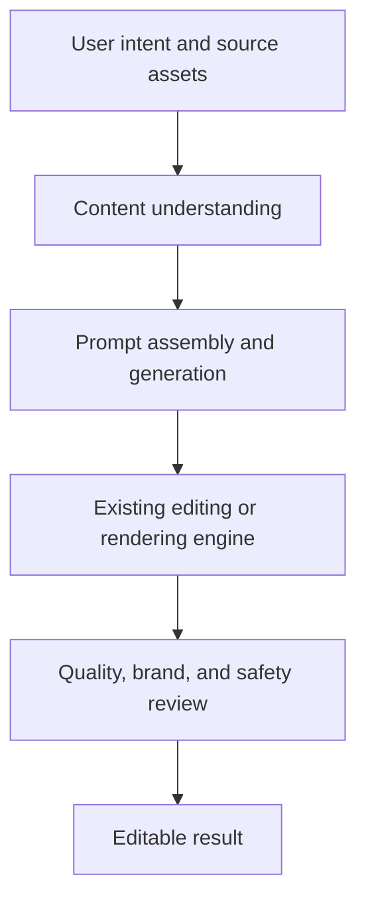

This article began with a Google Cloud event discussion about generative multimedia AI. After re-verification, the durable lesson is not a speculative product architecture. It is how CyberLink turned model capabilities into measurable editing workflows—and which questions the public case study still leaves unanswered.

The [Google Cloud CyberLink customer story](https://cloud.google.com/customers/cyberlink?hl=en) provides concrete product results. It is still a vendor-hosted customer story, so its metrics should be read as CyberLink-reported outcomes rather than independent third-party tests.

> **Huahua's take**
>
> Product differentiation in multimedia AI comes from the measurable workflow around the model: preprocessing, prompt assembly, asset fidelity, rendering, and human correction.

> **Huahua's engineering note**
>
> A customer story validates a direction, not your workload. Re-test character consistency, brand compliance, and completion time on representative target assets.

## Two applications supported by public evidence

The official case study describes two concrete workflows:

1. **Automatic video editing:** CyberLink launched an auto-edit feature in mid-2025 that uses Gemini 2.5 Flash Lite to understand imported footage and produce short videos with captions and background music. The case study reports completion in under one minute.
2. **Image style transfer:** Gemini 2.5 Flash analyzes the image and user intent, then passes a tailored prompt to Imagen. CyberLink reports that more than 85% of resulting images meet its quality standards.

Those figures have a clear owner: they are vendor-reported results in the case study. The public page does not provide sample size, asset distribution, failure criteria, or the amount of manual correction, so the numbers should not be generalized to every multimedia workload.

## What the public record does not establish

The earlier draft extrapolated the event into an internal Promeo architecture involving a Gemini agent, task router, Imagen, rendering engine, and a specific JSON format. The official case study does not publish that orchestration or schema, so those details have been removed.

A narrower conclusion is defensible: multimedia products normally connect understanding and generation models to an existing editing engine. CyberLink's exact routing, layer representation, and retry behavior remain undisclosed. A plausible inference is not a product fact without technical documentation or code.

## A reference workflow product teams can test

The following is a **general reference architecture** derived from the public outcomes, not a description of CyberLink's internal system:

Each stage needs its own acceptance criteria:

- **Understanding:** correct recognition of scene, person, product, and intent.
- **Generation:** preservation of subject features, composition, and brand constraints.
- **Rendering:** editable layers, captions, aspect ratio, and export format.
- **Review:** copyright, sensitive content, brand consistency, and human correction cost.

## Four forms of evidence to collect before adoption

A customer story answers whether the approach can work. Adoption requires evidence that it is worthwhile on your assets:

1. Build a representative evaluation set from your own material instead of relying on curated demos.
2. Track success rate, completion time, inference cost, and minutes of human correction together.
3. Version model and prompt changes so quality drift remains traceable.
4. Preserve editable output and human override instead of making generation an irreversible last step.

## Next reading and source

- For model-level distinctions, continue with the [large language model architecture comparison](/en/blog/76-big-llm-architecture-comparison/).
- If the workflow autonomously selects tools or executes multiple steps, see the [complete AI Agent guide](/en/blog/64-ai-agent-guide/) and [enterprise AI Agent security](/en/blog/43-enterprise-ai-agent-security/).
- Primary source: [CyberLink: Boosting productivity and creativity for visual content creation with AI](https://cloud.google.com/customers/cyberlink?hl=en). This article was checked on August 29, 2026, and labels all performance results as vendor-reported.
