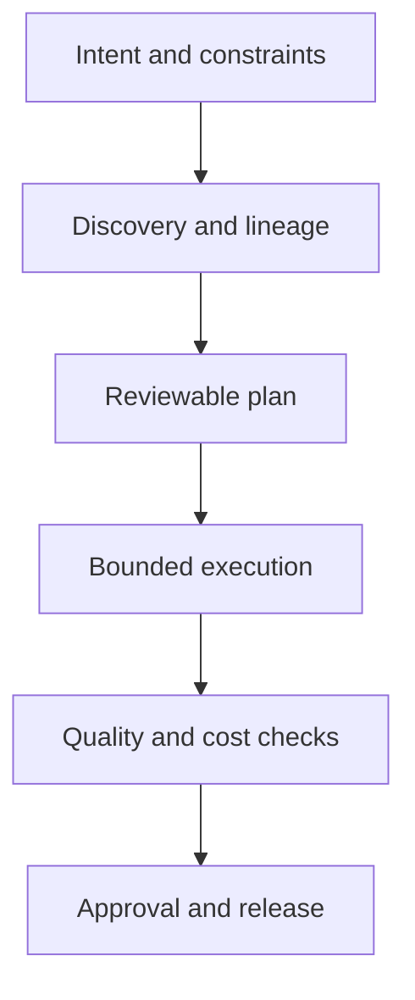

Google Cloud introduced [Data Agent Kit](https://cloud.google.com/blog/products/data-analytics/data-agent-kit-brings-data-skills-and-tools-to-your-ide-or-cli) in May 2026 as an open-source data-engineering and data-science collection that integrates with VS Code, Claude Code, Codex, Gemini CLI, and other development environments. It is not a monolithic model called “Data Agent,” and it is not merely a VS Code extension. The official architecture combines agentic Skills, Model Context Protocol tools, plugins, and extensions.

Google demonstrates discovery, natural-language analysis, Spark/BigQuery/dbt pipelines, model training, incident diagnosis, and Git-based recovery. Those are vendor demonstrations, not proof that every data estate can run the workflow automatically and safely. As of August 9, 2026, Data Agent Kit remains in preview. Enterprises should evaluate it as a set of harness components, not hand it production operator authority by default.

> **Huahua in one sentence**
>
> Data Agent Kit brings platform knowledge and tools into the agent environment; it does not automate away data-governance responsibility.

> **Huahua's engineering note**
>
> Agent-generated SQL, pipelines, and remediation PRs are proposals until access, cost, data quality, lineage, and rollback have been verified.

## The right mental model: a composable data harness

The official repository describes itself as a central hub, currently indexing product extensions, MCP configurations, builder tools, evaluation, and monitoring.

### Agentic Skills encode data-engineering procedures

Skills package query optimization, ML practices, ELT, validation, drift checks, governance, and troubleshooting. They reduce repeated platform guesswork and avoid stuffing every instruction into the system prompt.

A Skill is procedural knowledge, not authority. It can explain how to inspect a BigQuery query plan without receiving write access to a production dataset.

### MCP tools expose data-platform capabilities

MCP connects agents to BigQuery, AlloyDB, Cloud Storage, and related services for metadata discovery, analysis, and artifact creation. The real security boundary remains IAM, service accounts, dataset policy, networking, and audit logs.

Each tool should constrain project and dataset scope, read/write access, bytes processed, timeout, concurrency, and which DDL, DML, or deployment actions require approval.

### Plugins and extensions embed capability in existing workflows

IDE and CLI integration reduces the context-window tax of manually pasting schemas. It also expands the attack surface around local credentials, extension supply chain, and prompt injection. Installation source, version pinning, and update policy belong in platform governance.

## Decomposing an intent-driven data workflow

Google's fraud scenario begins with transactions in Cloud Storage and requests Spark notebooks, Iceberg and BigQuery tables, dbt transformations, model training, and inference output in Spanner. This is not one tool call. It is a staged plan:

Each stage needs acceptance evidence:

- Discovery: owner, classification, freshness, and lineage.
- Plan: input/output contracts, estimated scan, failure and rollback strategy.
- Execution: isolated project, least-privilege credentials, resource and time limits.
- Validation: row counts, nulls, duplicates, schema, distribution drift, and business rules.
- Release: reviewer identity, artifact digest, deployment record, and post-deploy monitoring.

## Conversational Analytics: capability and limits

Google says Data Agent Kit uses the same direction of Gemini natural-language-to-SQL technology found in Conversational BigQuery and Looker to profile, search, query, and visualize data. This speeds exploration, but NL2SQL can still:

- choose the wrong similarly named table, time field, or join key;
- ignore row-level security or semantic-layer definitions;
- produce high-scan-cost or data-exposure queries;
- return syntactically valid but semantically wrong answers.

Start with a curated semantic layer or read replica. Use dry-run cost estimates, query allowlists, row limits, and sensitive-column masking. For high-impact analysis, preserve SQL, parameters, dataset snapshot, and result provenance.

## Incident recovery is not permissionless self-healing

Google demonstrates analysis of a pipeline failure, a drafted and tested fix, and Git-based recovery. A safer responsibility split is:

1. Read-only diagnostic tools collect logs, job metadata, and recent deployments.
2. The agent proposes a root-cause hypothesis with supporting and contradictory evidence.
3. A patch and regression tests run in an isolated branch and project.
4. Policy decides whether a data owner, security reviewer, or on-call engineer must approve.
5. The deployment system executes an approved artifact; a chat session does not directly mutate production.
6. Recovery metrics are checked, with rollback and incident timeline preserved on failure.

Opening a PR and automatically merging or deploying it are different risk tiers. A preview tool should begin with the former.

## Artifact and availability status

The official [GoogleCloudPlatform/data-agent-kit](https://github.com/GoogleCloudPlatform/data-agent-kit) repository is publicly accessible and links starter packs, product plugins, MCP servers, agent evaluation, and monitoring. Google's release page lists VS Code Marketplace, VSX, CLI, and Claude Code plugin paths.

The repository is a fast-moving integration hub. Individual components can have different licenses, release cadences, preview status, and required APIs. Build a component bill of materials rather than recording one vague “Data Agent Kit version”:

- repository, commit, or package version for each Plugin, Skill, and MCP server;
- Google Cloud APIs, IAM roles, and regions used;
- model, tool, and processing-cost limits;
- evaluation data, expected results, and rollback owner;
- an exit strategy for every preview dependency.

## Where adoption fits—and where it does not

Good early candidates have mature IAM, data catalog, CI, and sandboxes, plus repetitive discovery, query, notebook scaffolding, or incident-triage work.

Delay higher autonomy when owners are unclear, production credentials are shared, cost guardrails are absent, data-quality tests are weak, or the organization expects the agent to replace data-engineering review. More tools amplify existing governance gaps.

## A 90-day adoption path

1. **Days 1–30: read-only.** Limit use to catalog search, query suggestions, and documentation while collecting failure cases.
2. **Days 31–60: sandbox execution.** Enable a non-production project with query budgets, schema tests, and human review.
3. **Days 61–90: bounded PR workflow.** Allow pipeline, dbt, and notebook PRs; existing CI/CD and owner approval still deploy.
4. Expand authority only from accuracy, time saved, rework, cost, and incident evidence.

For the governance layer, read [Enterprise AI platform governance](/en/blog/39-enterprise-agentic-ai-governance/). [MCP 2026-07-28](/en/blog/34-model-context-protocol-mcp/) covers protocol boundaries, and the [Harness Engineering reading map](/en/blog/13-harness-engineering-reading-map/) connects Skills to the larger operating model.

## Primary sources

- [Google Cloud Blog: Data Agent Kit brings data skills and tools to your IDE or CLI](https://cloud.google.com/blog/products/data-analytics/data-agent-kit-brings-data-skills-and-tools-to-your-ide-or-cli)
- [GoogleCloudPlatform/data-agent-kit](https://github.com/GoogleCloudPlatform/data-agent-kit)
- [Google Cloud Agentic Data Cloud](https://cloud.google.com/data-cloud)
- [Model Context Protocol](https://modelcontextprotocol.io/)
