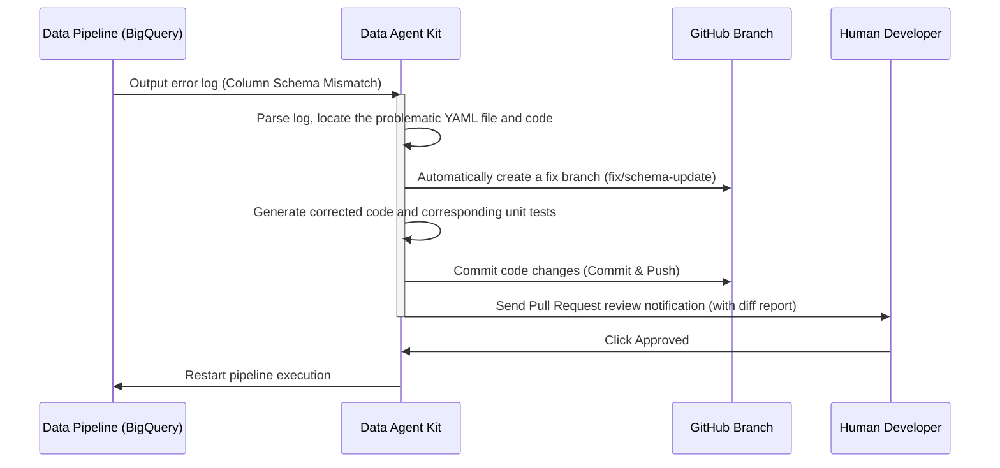

In the data-driven era, data scientists and data engineers shoulder the heavy responsibility of transforming massive amounts of data into business value. However, in their daily work, they face many frustrating frictions and inefficiencies.

At a recent technical conference, the speaker delved into these development pain points and officially introduced a game-changing new solution—**Data Agent Kit**.

---

> **花花的一句話**：喵！Data Agent Kit 是資料團隊的救星，自動處理那些麻煩的資料清理和錯誤排除，讓工程師可以專心發揮價值啦！
>
> **花花的工程提醒**：整合資料工程 AI 輔助工具時，應優先自動化繁瑣的樣板程式碼與資料清理任務，減少開發環境的上下文切換，藉此大幅提升資料管道的建置效率。

## Current Development Pain Points for Data Teams

The speaker pointed out that today's data practitioners are often plagued by the following three major problems:
*   **Excessive context switching:** Developers often need to open dozens of browser tabs simultaneously (e.g., Jupyter Notebooks, BigQuery Console, dbt documentation, etc.).
*   **Passive tools and lack of integration:** Developers must manually configure all underlying environments and massive amounts of boilerplate code.
*   **Severely unbalanced time allocation:** Data scientists spend **80% to 90%** of their time cleaning data and dealing with schema mismatch errors.

---

## Solution: The Grand Debut of Data Agent Kit

To address the aforementioned pain points, the team launched the **Data Agent Kit (Public Preview)**. This is a **proactive AI Agent** primarily designed as a VS Code extension (supporting editors like Cursor), aimed at seamless integration with cloud big data architectures such as BigQuery and Spark.

### Core Automated Workflow: Pipeline Error Fixing and Self-healing

When unexpected errors occur in the pipeline (e.g., a sudden schema change in an upstream database column), the Data Agent Kit can autonomously execute a complete "troubleshooting and code repair" workflow:



---

## Technical Practice: YAML Configuration and Code Self-healing

### 1. Pipeline Definition YAML File
Data Agent Kit uses structured YAML to define the sources, transformers, and output targets of data pipelines:

```yaml
pipeline:
  name: credit_card_fraud_detection
  version: 2.0
  source:
    type: bigquery_table
    dataset: retail_transactions
    table: raw_payment_events  # Original column was txn_id
  transformation:
    - step: clean_nulls
      engine: pyspark
      script_path: ./transform/clean_data.py
  sink:
    type: bigquery_table
    dataset: gold_analytics
    table: fraud_predictions
```

### 2. PySpark Code Self-healing Example
When the upstream database renames `txn_id` to `transaction_identifier`, Data Agent Kit diagnoses the error and automatically generates a PR with the corrected code:

```diff
# Self-healing correction comparison in transform/clean_data.py
- # Original code, fails because txn_id does not exist
- df_clean = df.filter(df["txn_id"].isNotNull())
+ # Data Agent Kit auto-correction: adapts to the new Schema column
+ df_clean = df.filter(df["transaction_identifier"].isNotNull())
```

---

## Five Practical Features of Data Agent Kit

*   **Universal Search & Knowledge Catalog:**
    Developers no longer need to struggle with writing SQL queries from scratch. Simply by using natural language to search for the required data, the Agent will automatically display data sources, lineage, and how it relates to other data tables.
*   **Conversational Analytics:**
    Ask questions in plain language directly within the IDE: "Which merchant category is most prone to fraud?" The Agent will automatically generate and execute complex SQL, analyze the results, and plot charts directly.
*   **Automated Troubleshooting & Self-healing:**
    As shown in the diagram above, it automatically fetches logs, creates branches, commits code, and deploys.
*   **Model Training and Automated Comparison:**
    The Agent can proactively find suitable datasets, perform feature engineering, automatically train and compare different models (like Random Forest and XGBoost), and calculate the AUC curve.

---

## Conclusion and Availability

Data Agent Kit is currently available on the VS Code Marketplace and OpenVSX, with an open-source GitHub repository provided. Its release means that data engineers and scientists no longer need to waste time dealing with tedious tasks like broken schemas. Through a **Harness Engineering** mindset, quality assurance is handed over to automated AI agents, truly unlocking the productivity of data teams.

---
*References: Data Agent Kit Technical Seminar Conference Records*
