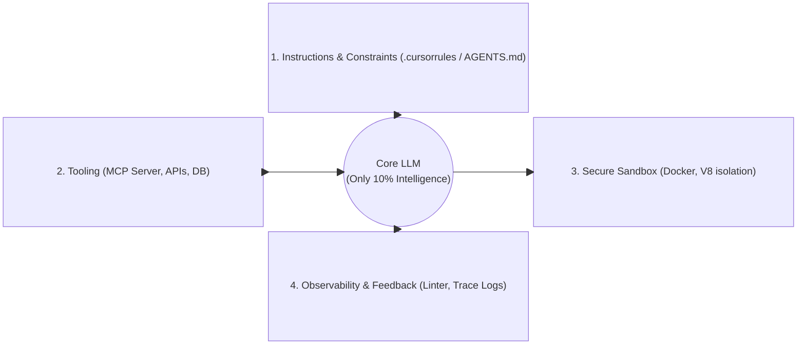
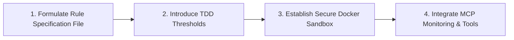

Today, with AI-assisted development tools (such as Cursor, GitHub Copilot, Claude Code, etc.) sweeping the globe, the barrier to entry and the speed of software development have reached unprecedented heights. However, when anyone can produce hundreds or thousands of lines of code with just a few sentences of dialogue, what exactly happens to the core value of software engineering and the Software Development Life Cycle (SDLC)?

In May 2026, distinguished Google engineers **Addy Osmani**, **Shubham Saboo**, and **Sokratis Kartakis** co-authored a massive 50-page whitepaper: **"The New SDLC With Vibe Coding"** (Original Article: [https://addyosmani.com/blog/the-new-software-lifecycle/](https://addyosmani.com/blog/the-new-software-lifecycle/)).

This whitepaper does not merely describe the magic of AI but uses a rigorous engineering perspective to point out the future direction of software engineering transformation for the entire tech industry. To save you the time of reading a 50-page academic PDF in English, this article will provide you with the most comprehensive and hardcore overview, accompanied by concrete architectures and practical advice.

> **Huahua in one sentence**
>
> Meow~ Writing programs is no longer just about typing on the keyboard like crazy! Using Model and Harness guardrails, we can easily control the quality of the code like magic, making development safer and more elegant! 🐾
>
> **Huahua's engineering note**
>
> Shift the development focus from simply generating code to constructing automated tests, evaluation indicators, and system guardrails (Harness) to ensure that the code generated by AI is verifiable and stable.

## Guide Directory
1. **Development Pain Points in the AI Era: Typing is Faster, but are Systems More Fragile?**
2. **The Two Ends of the Spectrum: Vibe Coding vs. Harness Engineering**
3. **90% of the Battle is in the "Guardrails": The Model + Harness Core Framework**
4. **Refactoring the SDLC: Compression and Reallocation of the Four Major Phases**
5. **Required Courses for Engineers in the AI Era: Three Core Skill Transformations**
6. **Team Practice Guide: How to Lead Your Team to Say Goodbye to "Coding by Feel"**

## 1. Development Pain Points in the AI Era: Typing is Faster, but are Systems More Fragile?

The whitepaper first raises a thought-provoking phenomenon: **"The bottleneck of software development is no longer typing speed, but the ability to define specifications and verify output."**

When developers rely too heavily on AI-generated code but lack systematic constraints and testing, the entire software life cycle experiences severe "indigestion":
*   **Technical Debt Explosion**: AI tends to write code that "works for now" but lacks long-term planning, leading to rapid architectural decay.
*   **Hollowing Out of Tests**: AI-generated tests often only cover the Happy Path, missing boundary conditions and security vulnerabilities.
*   **Context Collapse**: Once the model loses context, it begins to hallucinate, and human developers are unable to debug because they haven't reviewed it line by line.

This is exactly why Google experts are urging that software engineering must be upgraded from a casual development model to systematic **Harness Engineering**.

## 2. The Two Ends of the Spectrum: Vibe Coding vs. Harness Engineering

The whitepaper defines current AI development practices as a spectrum. Understanding where you stand on this spectrum is the primary task for every engineering team:

| Dimension of Comparison | Vibe Coding | Harness Engineering |
| :--- | :--- | :--- |
| **Definition** | Relying on intuition and simple Prompts to let AI generate code, manually copy-pasting error messages when things go wrong. | Using AI as a deterministic implementation engine within a strict "context and constraint system." |
| **Core Workflow** | Prompt $\rightarrow$ Code $\rightarrow$ Run $\rightarrow$ Debug (Manual) | Spec $\rightarrow$ Constraints $\rightarrow$ Sandbox Run $\rightarrow$ Auto-feedback Loop |
| **Testing Mechanism** | Almost none, or relying purely on manual click-testing. | Test-Driven Development (TDD) and strict unit testing thresholds. |
| **Blast Radius** | Uncontrollable; AI might randomly modify unrelated files. | Sandboxed and highly restricted by API permissions. |
| **Applicable Scenarios** | Hackathons, MVPs, personal toy projects. | Enterprise-grade systems, financial payments, high-security infrastructure. |

### Underlying Workflow Differences

The following flowchart compares their execution logic in the software life cycle in detail:

```mermaid
graph TD
    subgraph Vibe Coding [Vibe Coding Workflow]
        A1[Natural Language Prompt] --> B1((AI Model))
        B1 --> C1[Generate Code]
        C1 -.->|Manually copy to project| D1[Run Tests/Manual Clicks]
        D1 -->|Throws Error| E1[Paste error back to AI]
        E1 --> B1
        D1 -->|Seems to work| F1[Deploy to Production]
    end

    subgraph Harness Engineering [Harness Engineering Workflow]
        A2[Write Clear Spec & System Constraints] --> B2[Define Automated Tests TDD]
        B2 --> C2((AI Agent))
        C2 --> D2[Execute in Sandboxed Environment]
        D2 --> E2{Testing & Linter Verification}
        E2 -->|Fail| F2[Auto-capture CLI error feedback to Agent]
        F2 --> C2
        E2 -->|Success| G2[Human Developer PR Review]
        G2 -->|Approved| H2[Automated CI/CD Deployment]
    end

    style Vibe Coding fill:#2d131a,stroke:#ff477e,stroke-width:2px
    style Harness Engineering fill:#0d2319,stroke:#2ec4b6,stroke-width:2px
```



### Cost & Maintenance Evolution: The Cost Crossover Point

The whitepaper emphasizes that Vibe Coding and Harness Engineering exhibit fundamentally different cost and complexity curves over a project's lifespan:

1.  **Initial Stage (Day 1 - Month 1)**: Vibe Coding boasts ultra-fast development speed with near-zero setup costs for rapid MVPs. Harness Engineering requires upfront investment to construct `.cursorrules`, sandboxes, and TDD testing nets.
2.  **Intermediate Stage (Month 2 - Month 6)**: As system complexity scales, Vibe Coding suffers from accumulating technical debt, dead code, and context degradation, causing manual debugging and fix costs to **explode exponentially**.
3.  **The Crossover Point**: The whitepaper's cost model reveals a golden crossover around **Months 3 to 4**. Beyond this point, Harness Engineering maintenance costs flatten out, whereas Vibe Coding operational and remediation costs climb 3x to 10x higher!

## 3. 90% of the Battle is in the "Guardrails": The Model + Harness Core Framework

The most important core technology framework in the whitepaper is: **Agent = Model + Harness**.

Many teams expend massive resources selecting and fine-tuning models when adopting AI. However, the whitepaper points out that the underlying Large Language Model (LLM) only determines 10% of the basic intelligence; **what determines whether an AI Agent can stably deliver code in the real world is the remaining 90%—the Harness (constraint armor/external guardrails).**



### Analysis of the Four Pillars of Harness

#### ① Instructions & Constraints
This is not an ordinary System Prompt, but a concrete specification file (such as `.cursorrules`, `AGENTS.md`). It strictly enforces:
*   **Architectural Patterns**: For example, "Must use Clean Architecture; calling the database directly from the Controller layer is prohibited."
*   **Language Restrictions**: For example, "TypeScript strict mode must be enabled; using `any` is prohibited."

##### Practical Example: Enterprise `AGENTS.md` Guardrail Template
```markdown
# Agent Execution Guardrails & Standards

## Architectural Boundaries
- Strict separation of concerns: Controller -> Service -> Repository.
- DO NOT access DB models directly from HTTP routes.

## Code Style & Safety
- TypeScript strict mode enabled. `any` is strictly prohibited.
- All async calls must include try-catch blocks with explicit logging.
- Memory mutation is forbidden; return immutable states.

## Verification Requirements
- Every new feature MUST include unit tests under `tests/unit/`.
- Run `npm run test` & `npm run lint` before returning output.
```

#### ② Tools & Protocol (MCP)
Through the **Model Context Protocol (MCP)**, the Agent's hands and feet are bound within a secure API Gateway. The Agent cannot arbitrarily execute shell commands; it can only interact with the environment via standard tools (such as `read_file`, `run_test`).

#### ③ Sandboxed Execution
Code written by AI must be compiled and tested in a completely isolated sandboxed environment (such as a Docker container or WebAssembly sandbox) to prevent malicious or runaway code from destroying the developer's local machine or production servers.

#### ④ Automated Feedback & Observability
This is the core of "automated debugging." When a sandbox execution fails, the Harness automatically formats Standard Error, Linting errors, or compilation logs, and returns them to the Agent as precise context, enabling "Self-correction."

## 4. Refactoring the SDLC: Compression and Reallocation of the Four Major Phases

In the traditional software development life cycle, time is mostly spent on "writing code" and "manual debugging." The whitepaper notes that in the new SDLC, the proportions and execution methods of each phase will be reallocated:

```mermaid
gantt
    title Traditional SDLC vs AI-Era Harness SDLC Time Allocation Comparison
    dateFormat  X
    axisFormat %d
    
    section Traditional SDLC
    Requirements & System Design          :active, des1, 0, 30
    Coding & Implementation (Writing)   :crit, des2, 30, 70
    Testing & Quality Verification (QA)    :des3, 70, 90
    Deployment & Operations             :des4, 90, 100
    
    section Harness SDLC
    Requirements Design & Spec Definition (Spec) :active, a1, 0, 45
    AI Automated Implementation (AI Coding) :crit, a2, 45, 55
    Test Engineering & Sandbox Verification (TDD)  :a3, 55, 85
    Review & Automated Deployment          :a4, 85, 100
```



### Transformation Analysis

1.  **Requirements and Design Phase (Time extended, weight increased)**:
    Developers must spend more time writing clear, unambiguous Specs and architecture documents. Because "AI cannot understand vague instructions," high-quality inputs are the only way to obtain high-quality code.
2.  **Implementation Phase (Extremely compressed)**:
    The Coding process, which previously took weeks, is compressed to days or even hours. AI Agents rapidly produce skeleton code under the constraints of the Harness.
3.  **Testing and Verification (Transitioning to the core)**:
    The developer's focus shifts to designing an "impenetrable testing net." You don't need to write the code yourself, but you must write test cases that can perfectly catch AI bugs.
4.  **Deployment and Operations (Automation and Auditing)**:
    Introducing an Agent Gateway to monitor all external API calls, and performing forensic-level log auditing on AI-generated changes.

## 5. Required Courses for Engineers in the AI Era: Three Core Skill Transformations

If you want to maintain irreplaceable competitiveness in the AI era, the whitepaper recommends you immediately start cultivating the following three core capabilities:

### ① Context Engineering
This is not just "writing prompts," but **managing the model's attention mechanism**.
*   You must know when to feed the AI which code snippets (avoiding too much irrelevant information that causes the model's attention to waver).
*   Learn to leverage MCP servers to dynamically retrieve the most relevant API documentation and project context.

### ② Test-Driven Specification
You will no longer be the "Code Writer," but the "Rule Maker."
*   You must master how to first write behavioral specifications (Spec) and unit tests, and then let the AI fill in the implementation based on the tests (TDD).
*   Learn to use Assertions to limit the boundaries of the AI's output.

### ③ System & Integration Design
What AI is least adept at is "global planning" and "cross-module design."
*   The value of human engineers will be built upon: How to design a loosely coupled microservices architecture so that AI agents can be confined to a single microservice to safely tinker around without affecting the overall system.

## 6. Team Practice Guide: How to Lead Your Team to Say Goodbye to "Coding by Feel"

If your team is currently in the chaotic "Vibe Coding" phase, often throwing unexpected bugs because of AI-generated code, please refer to the following transformation steps recommended by Google experts:



1.  **Step 1: Establish a strict constraint file in the project root directory**
    Create `.cursorrules` or `AGENTS.md` in your project, explicitly specifying project dependencies, prohibited syntax (e.g., forbidding `eval`, forbidding raw `fetch` without wrappers), and directory structures.
2.  **Step 2: Reject pull requests (PRs) without tests**
    Add a threshold to CI/CD: All AI-generated PRs must include corresponding test cases, and test coverage must not decrease.
3.  **Step 3: Completely isolate the AI's execution environment**
    Use sandbox tools (like Docker or an open-source Agent Sandbox environment) to execute AI-generated code, protecting the cleanliness and security of the local development environment.

## Conclusion: Software Engineering Has Not Disappeared, It's Just Become More Advanced

Google's 50-page whitepaper gives us a deeply inspiring conclusion: **AI will not eliminate software engineers, but it will eliminate those who only know how to copy and paste code.**

When the act of "writing code" is thoroughly commoditized and cheapened by AI, the intelligence humans display in **system architecture design, boundary constraint definition, and strict quality control (Verification)** will become more precious than ever before.

Starting today, let's say goodbye to "Vibe" programming and begin building a bespoke "Harness" for your team, embracing the true era of Harness Engineering!

### Further Reading & Related Resources

If you want to delve deeper into system architecture and context management in the AI era, check out our related guides:
* [Context Engineering Guide for Claude 5](/en/blog/71-context-engineering-claude-5/)
* [Multi-Agent Coordination Topology and Takt Framework Analysis](/en/blog/70-takt-agent-coordination-topology/)

## References & Source Whitepaper

- **Google Whitepaper Original Article**: Addy Osmani (May 2026). "The New Software Lifecycle / The New SDLC With Vibe Coding". [https://addyosmani.com/blog/the-new-software-lifecycle/](https://addyosmani.com/blog/the-new-software-lifecycle/)
- **Author Information**: Addy Osmani (Google Engineering Lead), Shubham Saboo (Head of Developer Relations), Sokratis Kartakis (Google Cloud AI).
- **Google Cloud / Vertex AI Whitepaper Resources**: [Google Cloud AI Architecture Whitepapers](https://cloud.google.com/vertex-ai)
