```mermaid
graph TD
    subgraph App Data Layer [App Data Layer]
        A[App Data: Playlists/Recipes/Contacts] -->|Encapsulate as| B(Entities)
    end

    subgraph App Action Layer [App Action Layer]
        C[App Features: Play/Save/Delete] -->|Encapsulate as| D(Intents)
    end

    subgraph Apple Intelligence
        E[Siri Semantic Layer] <-->|Understand Context| B
        E <-->|Execute Action| D
    end

    style Apple Intelligence fill:#1e1e24,stroke:#a855f7,stroke-width:2px
```

With the official release of the **first iOS 27 Public Beta**, tech media and developers can finally catch a glimpse of the ultimate form of Apple's voice assistant.

David Imel, a senior editor at The Verge, published an inspiring hands-on report after a month of use: **"Siri AI is already changing how I use my iPhone"**. He points out that although this is just a "preview version" and support from many third-party apps will have to wait until the official release in the fall, Siri AI has already demonstrated its disruptive potential for human-computer interaction this time around.

This article will break down the core details of this review for you, to see exactly where this "new Siri" excels, what bottlenecks it faces, and how developers should respond.

---

## iOS 27: A "Snow Leopard" Upgrade Focused on Performance, But Siri Is the Only Star

At the beginning of the review, David Imel points out that iOS 27 overall feels more like the **Snow Leopard (OS X 10.6)** upgrade from back in the day—it doesn't have too many flashy new interfaces, but rather focuses on refactoring and accelerating the underlying system.
*   **Basic Performance Improvements**: Faster app launch speeds, more accurate photo search results, and more stable AirDrop transfers.
*   **Communication Feature Upgrades**: The Messages app supports inline replies and end-to-end encryption for RCS messages.
*   **Visual Optimizations**: The details of the Liquid Glass interface are more refined, especially the legibility of borders and text, which has been vastly improved.

However, in this upgrade centered on "stability", **Siri AI (released as an opt-in beta)** is undoubtedly the sole focal point.

---

## Core Highlight: Shifting from "App-Driven" to "Intent-Driven"

The traditional logic of using a smartphone is:
> **Open App $\rightarrow$ Click within the interface $\rightarrow$ Complete task**.

Whereas the future Siri AI promises is:
> **Directly state what you want to do $\rightarrow$ Siri automatically orchestrates underlying data and Apps $\rightarrow$ Complete task**.

David Imel shared two amazing real-world usage scenarios:

### Real-world Scenario 1: Checking Concert Lineup Orders
He wanted to check when his favorite band would be performing during a four-hour free concert. The event web page did not indicate the order. He directly pulled down on the screen and asked Siri: *"What is the performance order for these bands?"*
Siri flashed its newly designed colorful glowing ring, autonomously scraped the web page info and searched the internet in the background, and gave the correct answer a few seconds later. The user did not need to jump between browser tabs at all, nor did they need to dig through the band's Instagram posts.

### Real-world Scenario 2: Auto-converting Emails to Calendar Events
During the Worldwide Developers Conference (WWDC), he said to Siri: *"Add the WWDC briefing schedule to my calendar."*
Siri automatically scanned his emails in the background, parsed the text within them, and automatically created 6 events with completely accurate times in Apple Calendar with a single click.

> "It really slightly changed my brain chemistry," David wrote. Now, when he encounters any problem, his first reaction is no longer to open a browser and search, but to pull down the screen and directly type a prompt with the keyboard to let Siri solve it.

---

## Existing Bottlenecks and Frustrations: The Gray Areas of Natural Language

Even though Siri AI performs like magic on many complex tasks, when it hits a "semantic wall," it can still be frustrating:

1.  **Keyword Dependency in Onscreen Awareness**:
    When he looked at a concert ticket sales web page and told Siri, "Remind me to buy tickets when they go on sale," Siri merely created a plain text reminder titled "Remind me to buy tickets when they go on sale." He had to explicitly say "Buy tickets for **this** web page for me" for Siri to understand it needed to read the onscreen content.
2.  **Lack of Verb Association**:
    Asking Siri to "route" to a certain address sometimes yielded absolutely no response, but changing it to "direct" triggered it perfectly. For an AI that touts "natural language interaction," there are still traces of keyword-speak.
3.  **Ecosystem Lock-in**:
    Currently, the full capabilities of Siri AI are limited to Apple's first-party applications (Mail, Keynote, Calendar, Notes). If a friend sends a gathering time on Telegram, Siri will fail completely because it lacks permission to read Telegram's data.

---

## Homework for Developers: Entities and Intents

For third-party apps to perfectly integrate with Siri AI, developers must implement two core architectures in the iOS 27 SDK:

*   **Entities**: Represent the types of data contained within the App (e.g., photos, recipes, playlists). This lets Siri know what kind of Personal Context it can extract from that App.
*   **Intents**: Represent the actions the App can execute (e.g., play, save, delete).
*   **Advantages**: Matthew Cassinelli (a former member of Workflow, the predecessor to Shortcuts) points out that this architecture allows "niche, small apps" to be dynamically orchestrated by Siri without the user even manually opening them (for example, asking "Who did I meet at the conference last week?" and Siri would invoke data from the LookBack: Contacts History App).

> **⚠️ Note**: While developers can currently start writing this code, since the iOS 27 SDK is still in the testing phase, third-party apps cannot push Siri AI feature updates to general users before the official release this fall.

---

## The Game Between Tech Giants: Will Google Support Siri?

The review raised a highly disruptive question: **"Will a giant like Google, which relies on ad revenue, have the motivation to fully support Siri AI?"**

If Siri can directly display the highlights of an itinerary or email from Gmail right at the top of the phone, users will have no need to open the Gmail App, and Google will lose the opportunity to display ads and acquire traffic.

However, David Imel believes that **"Consumer Choice"** will force Google to compromise. If an email App (like Spark) becomes incredibly easy to use because it supports Siri AI, and Gmail insists on not supporting it, users will defect to other Apps. In addition, Google itself is also pushing AI Overviews, showing that the entire industry is moving toward an era of direct answers that is "de-Appified and de-web-ified."

## Conclusion: The Future is Here, But We Still Need to Wait

This Siri AI making its debut in iOS 27 is no longer the voice assistant of the past that could only tell bad jokes or set timers, but is gradually evolving into an **AI Agent capable of navigating through the operating system**.

While the public beta still has issues with semantic understanding deviations and a lack of third-party apps, it has undoubtedly laid the most solid foundation for the future of a "seamless AI everyday life." Once the official version of iOS 27 launches this fall, and countless developers have finished implementing Entities and Intents, we will welcome the biggest revolution in iPhone interaction history.

---
*Reference: [The Verge - Siri AI is already changing how I use my iPhone](https://www.theverge.com/tech/964714/siri-ai-public-beta-preview-ios-27-hands-on)*
