Siri AI has entered **iOS 27 developer testing**, but one hands-on should not be read as a production promise. In its June 2026 announcement, Apple said the features were available first for developer testing, with a user beta coming later for supported devices set to English and more languages following over time.

The Verge's David Imel documented a month of examples involving onscreen awareness, personal context, and cross-app actions. Those observations are useful for understanding the interaction direction, but they cannot establish production availability, third-party adoption, or feature parity across regions and languages.

This article therefore uses two layers: the media hands-on for concrete usage scenarios, then Apple documentation for the integration surface and beta boundaries developers can verify today.

> **Huahua in one sentence**
>
> The new Siri can inspect the screen, find personal information, and ask apps to act—but a beta is still a kitten learning to walk, so check what it can really do today. 🐾
>
> **Huahua's engineering note**
>
> Inventory App Intents, App Entities, Spotlight indexing, and schemas first. Associate visible content with entities when onscreen context is needed, and gate releases on SDK availability plus device-level regression tests.

## Start with Status: Developer Testing Is Not Broad Public Availability

In the review, David Imel compares iOS 27 to **Snow Leopard (OS X 10.6)**: more emphasis on system refactoring, performance, and reliability than on a large interface overhaul. He observed:
*   **Basic Performance Improvements**: Faster app launch speeds, more accurate photo search results, and more stable AirDrop transfers.
*   **Communication Feature Upgrades**: The Messages app supports inline replies and end-to-end encryption for RCS messages.
*   **Visual Optimizations**: The details of the Liquid Glass interface are more refined, especially the legibility of borders and text, which has been vastly improved.

These are review observations from test software, not guarantees for every device. Apple currently confirms Apple Developer Program testing, with a consumer beta coming later and subject to device, language, and regional conditions.

## Core Highlight: Shifting from "App-Driven" to "Intent-Driven"

The traditional logic of using a smartphone is:
> **Open App $\rightarrow$ Click within the interface $\rightarrow$ Complete task**.

Whereas the future Siri AI promises is:
> **Directly state what you want to do $\rightarrow$ Siri automatically orchestrates underlying data and Apps $\rightarrow$ Complete task**.

David Imel shared two concrete scenarios; they describe his test environment, not a success-rate guarantee:

### Real-world Scenario 1: Checking Concert Lineup Orders
He wanted to check when his favorite band would be performing during a four-hour free concert. The event web page did not indicate the order. He directly pulled down on the screen and asked Siri: *"What is the performance order for these bands?"*
Siri flashed its newly designed colorful glowing ring, autonomously scraped the web page info and searched the internet in the background, and gave the correct answer a few seconds later. The user did not need to jump between browser tabs at all, nor did they need to dig through the band's Instagram posts.

### Real-world Scenario 2: Auto-converting Emails to Calendar Events
During the Worldwide Developers Conference (WWDC), he said to Siri: *"Add the WWDC briefing schedule to my calendar."*
Siri automatically scanned his emails in the background, parsed the text within them, and automatically created 6 events with completely accurate times in Apple Calendar with a single click.

> "It really slightly changed my brain chemistry," David wrote. Now, when he encounters any problem, his first reaction is no longer to open a browser and search, but to pull down the screen and directly type a prompt with the keyboard to let Siri solve it.

## Existing Bottlenecks and Frustrations: The Gray Areas of Natural Language

Even though Siri AI performs like magic on many complex tasks, when it hits a "semantic wall," it can still be frustrating:

1.  **Keyword Dependency in Onscreen Awareness**:
    When he looked at a concert ticket sales web page and told Siri, "Remind me to buy tickets when they go on sale," Siri merely created a plain text reminder titled "Remind me to buy tickets when they go on sale." He had to explicitly say "Buy tickets for **this** web page for me" for Siri to understand it needed to read the onscreen content.
2.  **Lack of Verb Association**:
    Asking Siri to "route" to a certain address sometimes yielded absolutely no response, but changing it to "direct" triggered it perfectly. For an AI that touts "natural language interaction," there are still traces of keyword-speak.
3.  **Ecosystem Lock-in**:
    Currently, the full capabilities of Siri AI are limited to Apple's first-party applications (Mail, Keynote, Calendar, Notes). If a friend sends a gathering time on Telegram, Siri will fail completely because it lacks permission to read Telegram's data.

## The Verifiable Developer Surface: App Entities, App Intents, and Spotlight

Apple's documentation says third-party apps expose content and actions to Siri AI through App Intents. Which pieces an app implements depends on its data and use cases; there is no single switch that guarantees perfect integration:

```mermaid
graph TD
    subgraph App Data Layer [App Data Layer]
        A[App Data: Playlists/Recipes/Contacts] -->|Encapsulate as| B(Entities)
    end

    subgraph App Action Layer [App Action Layer]
        C[App Features: Play/Save/Delete] -->|Encapsulate as| D(Intents)
    end

    subgraph Apple Intelligence
        E[Siri Semantic Layer] <-->|Understand Context| B
        E <-->|Execute Action| D
    end

    style Apple Intelligence fill:#1e1e24,stroke:#a855f7,stroke-width:2px
```

*   **App Entities** describe app data the system can understand and find, such as photos, recipes, or playlists.
*   **App Intents** describe actions the app can perform, such as play, save, or delete.
*   **Spotlight and donations** index entities and provide runtime signals from actions and content, helping retrieval and disambiguation.
*   **Schemas and transferable types** provide system-understood contracts for data and actions, including moving content across apps.
*   **Onscreen context** associates views, user activities, or other visible content with App Entities so references such as “this photo” have a resolvable target.

> **⚠️ Note**: APIs and system behavior may still change during beta. Test more than type declarations: indexing updates, permission denial, ambiguous parameters, cross-app transfer, and confirmation flows for high-risk actions all need coverage.

## What the Hands-on Cannot Establish Yet

A hands-on can show that a path succeeded on a particular build and account, but it cannot establish three broader conclusions:

1. **Third-party coverage**: Apple provides integration APIs; that does not mean Gmail, Telegram, or any other major app will adopt them, and business-model speculation cannot predict the outcome.
2. **Production reliability**: A task failing when one verb changes is evidence that teams still need completion rate, clarification count, and erroneous-action metrics.
3. **Cross-region parity**: Apple states initial device and language conditions. Regional features and timing should be checked against local official pages.

## Conclusion: Treat Siri AI as a System Interface to Validate

Siri AI's important change is putting onscreen content, personal context, web knowledge, and app actions behind one orchestration layer. For users, that may reduce manual movement between apps. For developers, the real work is turning data, actions, permissions, and confirmations into testable system contracts.

The grounded conclusion today is not that a revolution is complete. The interaction direction is clear and the developer surface is available to prepare, while public availability, third-party adoption, and task reliability still require beta and production evidence.

## Further Reading and Sources

- Use the [Complete AI Agent Guide](/en/blog/64-ai-agent-guide/) to compare Siri's planning, tools, memory, and evaluation boundaries.
- Then read the [DoorDash Ask Assistant Architecture](/en/blog/51-doordash-ask-assistant-architecture/) to compare an operating-system assistant with deterministic controls in a transactional agent.
- Apple: [Siri AI announcement and availability](https://www.apple.com/newsroom/2026/06/apple-introduces-siri-ai-a-profoundly-more-capable-and-personal-assistant/) and [Apple Intelligence and Siri AI developer documentation](https://developer.apple.com/documentation/appintents/apple-intelligence-and-siri-ai)
- Hands-on: [The Verge — Siri AI is already changing how I use my iPhone](https://www.theverge.com/tech/964714/siri-ai-public-beta-preview-ios-27-hands-on)
