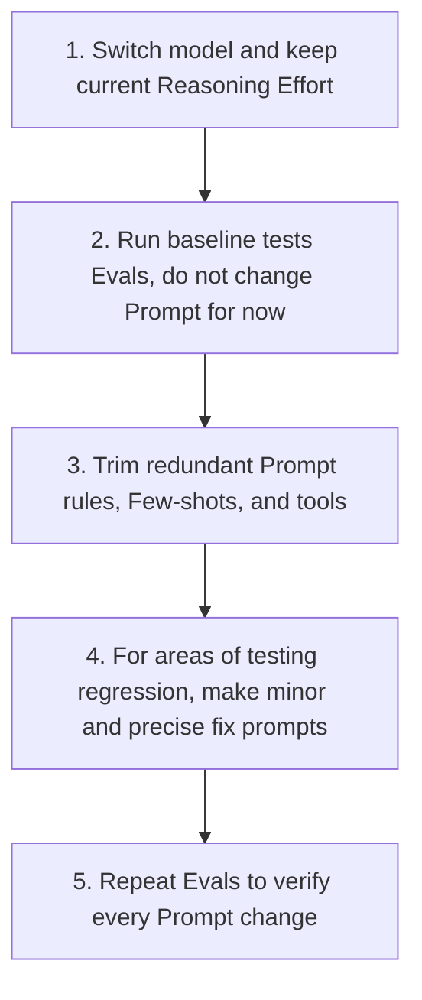

Over the past few years, the AI developer community has formed a conventional set of "Prompt Engineering tricks": cramming dozens of Few-shot examples into the System Prompt, detailing every thinking step, and wildly using words like `ALWAYS` and `NEVER` to force the model to follow the rules.

However, with the release of OpenAI's latest flagship reasoning model **GPT-5.6 Sol**, the official team released a disruptive development guide: **"Prompting guidance for GPT-5.6 Sol"**. This guide declares that software development has officially crossed from mere Prompting into the era of **Harness Engineering**, which centers around systematic constraints, tools, and sandbox construction.

The official data in the guide proved shocking: **in internal Coding-agent evaluations, streamlining the System Prompt not only reduced Token consumption by 41% ~ 66% and cut API costs by 33% ~ 67%, but it also increased final Evaluation Scores by 10% ~ 15%!**

This means that the traditional development method of stacking Prompts has been completely subverted. Facing a role with powerful System 2 reasoning capabilities like GPT-5.6, developers must learn a new philosophy of human-machine collaboration centered on Harness Engineering.

---

## 1. Core Philosophy: Less is More (Simplifying Prompts Makes It Smarter)

Why does the model perform worse when the prompt is longer?

GPT-5.6 is a "reasoning engine" with high-intensity logical deduction capabilities. When you write too many conflicting details and redundant step instructions in the Prompt, it instead restricts the model's self-planning ability and can even cause instability in the model's operation.

### Officially Recommended "Trim" Checklist
*   **Delete duplicate rules**: The same rule doesn't need to be repeatedly emphasized in different words in the prompt.
*   **Delete ineffective examples**: If Few-shot examples do not substantially change the model's behavior, delete them all.
*   **Delete instincts the model already possesses**: You don't need to teach the model "how to use tools" or "how to think step by step (Let's think step by step)"; these are its instincts.
*   **Delete irrelevant tools**: Only expose Tools that are 100% certain to be used in the current task.

### Must Keep Content
*   **User-visible Outcome**.
*   **Success Criteria & Stopping Conditions**.
*   **Safety, authorization, and business logic boundaries**.

---

## 2. Outcome-first and Clear Stopping Conditions

GPT-5.6 is good at "pathfinding". Developers should describe to it "what the destination looks like", rather than dictating that it "move the left foot then the right foot".

### ❌ Prescriptive Prompts to Avoid
> "Step one, call API-A. Step two, compare data. Step three, fill the results into the form. Step four, ask the user if they are satisfied..."

###  Recommended Outcome-first Prompts
```plaintext
Solve the user's problem (end-to-end).

Success Criteria:
- Make eligibility judgments based on existing account credentials and policies.
- Complete all permitted system actions before responding.
- Returned data format: [completed_actions, customer_message, blockers].
- If necessary credentials are missing, only ask for the minimum necessary missing fields.
```

### Setting Stopping Conditions
To prevent the Agent from falling into an infinite loop of Tool calls, we must add symmetrical stopping rules to the prompt:
```plaintext
Solve the problem with the minimum and most useful Tool Loops, but do not prioritize "reducing Loops" higher than "correctness" or "data calculation".
After each result is obtained, evaluate whether the core question can already be answered. If so, stop immediately and reply.
```

---

## 3. Brand New API Parameter text.verbosity and Length Control

By default, GPT-5.6 is more concised than GPT-5.5. The previous practice of writing "Be concise" in the prompt to save tokens may lead to overly incomplete model responses in GPT-5.6.

To control the level of detail in the model's responses in a more standardized way, OpenAI introduced the latest **`text.verbosity`** control parameter into the API:
*   **API Parameter**: Can be set to `low`, `medium`, or `high`.
*   **Precise cropping instructions**: If there are specific length requirements in the Prompt, you should explicitly instruct the model on which information must be "kept" and what can be "deleted", for example:

```plaintext
State the conclusion first. Retain the necessary evidence, major warnings, and next actions required to support the conclusion.
Prioritize trimming quotes, redundant descriptions, generic comforting words, and unnecessary background explanations.
```

---

## 4. Revolutionary New Feature: Programmatic Tool Calling (PTC)

This is the first appearance of a major feature in the official guide. **Programmatic Tool Calling (PTC)** allows the model to compile a series of tool calls into a workflow that can be executed programmatically within a sandbox, used to process large volumes of data.

### Differences between PTC and Direct Tool Calling

| Comparison Dimension | Direct Tool Calling | Programmatic Tool Calling (PTC) |
| :--- | :--- | :--- |
| **Execution Mechanism** | The model decides to call one Tool per step, and after returning, the model thinks about the next step. | The model generates code all at once to programmatically traverse and filter the results of multiple Tools. |
| **Applicable Scenarios** | Operations requiring high "semantic judgment", single executions, or Human-in-the-Loop (HITL) reviews. | Data filtering, merging (Join), sorting, deduplication, or bulk record aggregation. |
| **Token Consumption** | Each step requires LLM reasoning, consuming a large amount of Context Tokens. | Intermediate complex filtering and calculations are completed on the code side, and only the final result is sent back to the LLM. |

### How to Declare PTC Boundaries in the Prompt?
Official warning: Do not just write empty words like "please use PTC efficiently", you must clearly define the handoff:
```plaintext
Use Programmatic Tool Calling only in the "record reduction and deduplication" phase.
Only the read-only search_database tool is allowed to be called.
Compress and return the filtered results as an [evidence_schema] format.
The maximum retry limit for transient errors is 2. Upon completion, hand control back to the direct model for semantic decision-making.
```

---

## 5. Autonomy & Approval Boundaries

GPT-5.6 Sol is highly proactive. Once given tools, it will aggressively and autonomously push the task forward. Therefore, developers must clearly delineate "safe zones" and "red line zones" in the prompt:

```plaintext
[Authorization and Approval Policies]
- For "query, read, diagnose, analyze, and plan" tasks: Authorized to execute autonomously, inspect related files, and directly report the results.
- For "write, modify, fix" tasks: Authorized to execute autonomously and perform validations in the local disk and non-destructive sandbox environments without asking.
- For "external writes, deleting data, payment transactions, expanding scope" tasks: Must pause and request human confirmation.
```
This allows the AI assistant to operate smoothly without frequently interrupting you to ask "Can I read this file?" when reading files or executing safe operations like local formatting.

---

## 6. Tool Routing & Prerequisites

When multiple tools have dependencies, the officials emphasize that the "prerequisites" for retrieval and exploration must be specified in the Prompt to prevent the model from instinctively skipping necessary steps:

```plaintext
Before performing any action, complete the necessary exploration, retrieval, and validation steps.
Do not skip prerequisite checks just because the final goal seems obvious.
```

Furthermore, for Grounding tasks, the retrieval budget should be strictly limited:
*   Perform a loose keyword search first.
*   Only allow a second search when necessary entities (ID, date, source code) are missing or when exhaustive comparison is required.

---

## 7. Optimizing Reasoning Effort Settings

A major feature of reasoning models is the ability to adjust their thinking time. The officials provide very specific adjustment baselines:
*   **Low**: Suitable for highly latency-sensitive and relatively singular tasks.
*   **Medium**: The most balanced default starting point.
*   **High / XHigh**: Only enable when Evals testing confirms a significant return in quality.
*   **Max**: Reserved for the most hardcore, quality-first extreme tasks (such as complex architecture analysis). **Never enable globally by default**.

> 💡 **Official Tip**: Before considering increasing Reasoning Effort, please check whether your Prompt is missing "success criteria", "tool routing rules", or "validation loops". The logical defects of the prompt itself cannot be compensated for merely by prolonging the thinking time.

---

## 8. Check Work Before Finishing (Verify before Delivery)

Officials strongly recommend: **Provide GPT-5.6 with Tools that allow for self-validation, and list validation as a necessary step in the Prompt.**

```plaintext
[Validation Guide]
After completing code modifications, the following validations must be executed:
1. Run Targeted tests against the changed logic.
2. Run Linter and Type checks.
3. Perform Build checks on the affected Packages.
If the above validations cannot be executed, the reason must be explicitly stated in the Final answer.
```

---

## 9. Officially Recommended System Prompt Structure

At the end of the white paper, a standard System Prompt structure skeleton adapted for the GPT-5.6 series models is provided:

```markdown
Role: [Define the model's role and context]

Personality: [Define tone, professionalism, and collaboration style]

Goal: [The user-visible final outcome]

Success criteria: [Specific physical standards that must be met before answering]

Constraints: [Policies, safety, business logic, and side-effect limits]

Tools: [Which tools are available, when to use them, and what is prohibited]

Output: [Structure, length, format, and language requirements]

Stop rules: [When to retry, when to fallback, when to ask a human for help or stop]
```

---

## 10. Five-step Workflow for Application Migration Recommended by Officials

If you want to painlessly migrate an existing application using older GPT versions to GPT-5.6 Sol, it is recommended to follow this workflow:



*Note: Do not rewrite the entire Prompt Stack at once. Otherwise, you will not be able to distinguish whether behavioral changes come from the model, Reasoning settings, or the Prompt changes themselves.*

---

## Conclusion: AI Development Enters a New Normal of "Delegation and Guardrails"

The GPT-5.6 Sol Prompt guidance tells us a clear trend: **Large models are shifting from passive "code translators" to "virtual engineers" with advanced planning capabilities.**

Facing such a model, writing Prompts that are too long or too rigid will only backfire. Future AI development is no longer simple Prompt Engineering, but a systematic Harness Engineering of **"lightweight prompt-defined outcomes, strict Harness setup guardrails, PTC optimized batch computing, and automated evaluation test validation"**.

Go trim the Prompts in your projects right now, and experience a 15% performance boost and 60% Token savings!

---
*Reference source: OpenAI 2026 Developer Guide [Prompting guidance for GPT-5.6 Sol](https://developers.openai.com/api/docs/guides/prompt-guidance-gpt-5p6)*
