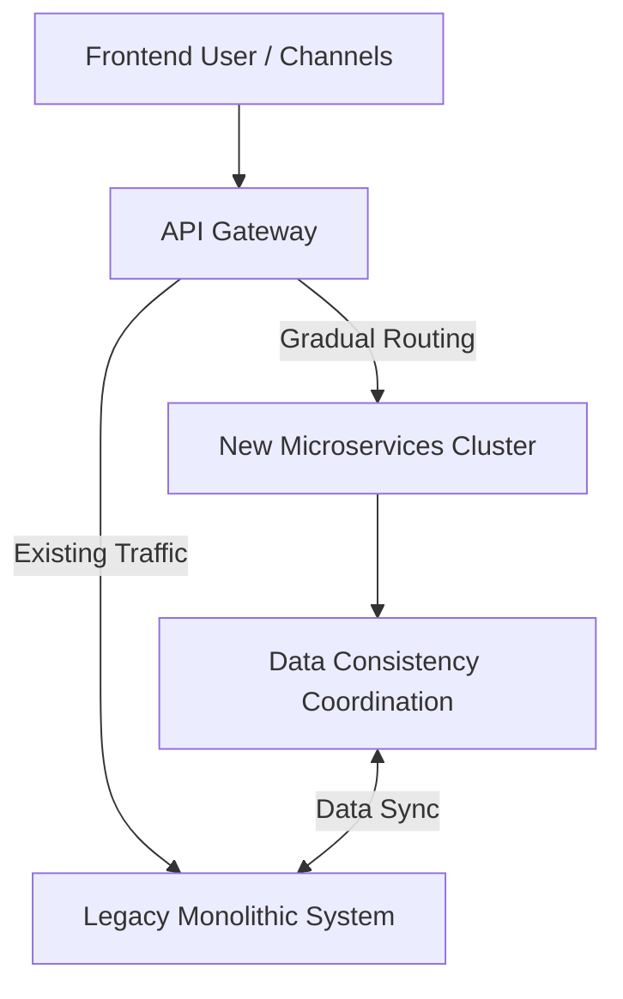

This presentation by a senior consultant from **AWS ProServ (Professional Services)**, who has over 25 years of experience in financial and cloud architecture, is titled:

> **《Decompose with Care: Architecture Patterns, Engineering Best Practices, and Hard Lessons from a Banking System Modernization Project》**

This is not an idealized "microservices playbook," but a sharing of highly practical **pitfalls and solutions**: when you have to modernize in a field intertwined with real money, real users, and legacy systems, the technical architecture is merely a tool. What truly determines success or failure are domain boundaries, contract mechanisms, and engineering disciplines.

Below is a summary and in-depth architectural analysis of the presentation's content. It can also be cross-referenced with the financial implementation series on this site: [Financial Industry GenAI Platform Engineering](/en/blog/38-financial-genai-platform-engineering/), [Enterprise Agentic AI Governance](/en/blog/39-enterprise-agentic-ai-governance/).

> **Evidence boundary:** The bank scale, schedule, rework and UAT improvements, and speaker quotations in this article are case claims from the session. I could not locate a public official recording or transcript, so they should not be treated as independently verified general benchmarks. The Strangler Fig and decomposition guidance is cross-checked against public AWS guidance below.

> **Huahua in one sentence**
>
> Taking apart a huge old system is as exciting as swapping parts on a roller coaster! Meow~ As long as we set the boundaries and contracts, we can safely move to the cloud step by step without fear of messing up! 🐾
>
> **Huahua's engineering note**
>
> When performing monolithic architecture microservices or cloud migration, make good use of the Strangler Fig pattern and multi-layer Facade, and implement Contract-First and Mock-First development disciplines to ensure zero disruption to core business.

## Project Background: "Changing the Engine on a Flying Plane"

The project goal was clear, but the difficulty was extreme: assisting a leading Southeast Asian bank in refactoring and migrating its long-running **monolithic omni-channel banking platform** to a cloud-native microservices architecture on AWS.

The reason it was called "changing the engine on a flying plane" is threefold:

1. **Real Money and Massive User Base**: Serving over **20 million** real active users with a high daily transaction volume, allowing absolutely zero financial errors.
2. **Zero-Downtime Transition**: The transition between the old and new systems had to maintain 100% business continuity throughout the entire process, without affecting current operations.
3. **Complex Intertwining of Old and New**: The bank internally had a large number of uncontrollable legacy upstream/downstream systems. The new system had to coexist and collaborate with them over a long period.

These three points elevated the problem from "how to decompose services" to "how to safely evolve systems in an unstoppable financial environment."

## Overview of the Four Core Challenges

The speaker condensed the pain points into four main threads:

| Challenge | Core Problem | Key Solutions |
| --- | --- | --- |
| 1. Locking Down Requirements | One-sentence contracts, inter-departmental conflicts, late-stage rejections | Early involvement of all stakeholders, acceptance criteria, authoritative sign-off |
| 2. Service Boundaries | Slicing too fine or too coarse is disastrous | Bounded Context, avoiding Over-Decomposition |
| 3. Coexistence of Old and New | Long-term parallel running, data consistency | Strangler Fig, 3-Tier Facade |
| 4. Delivery Speed | Code review and integration become bottlenecks after AI accelerates coding | Contract-First, Mock-First, small MRs, pair programming |

## Challenge 1: How to Accurately Lock Down "Customer Requirements"?

Many technical professionals often underestimate the requirements phase, but financial system requirements are often extremely vague at the beginning—digging deeper reveals an ever-lengthening "ribbon pulled from a magic hat." This is exactly the root cause of an explosion in rework later on.

### Pain Point Phenomena

- Initially, contracts only had "one-sentence requirements," and confirming the details dragged on for **3 weeks**.
- Requirements provided by business, frontend/backend, and security departments conflicted with one another.
- As soon as a feature was launched, **over 10** Change Requests flooded in.
- Core Banking APIs were modified synchronously with the frontend, leading to continuous specification drift (*Loss in translation*).
- Security and Enterprise Architecture (EA) intervened only at late stages, directly vetoing already developed architectures.

### Solutions and Best Practices

> "From day one, bring in all stakeholders who will have an impact on the project's outcome."

- **Early Involvement of All Stakeholders**: Business, frontend, Ops, security, and core banking teams confirm functional and non-functional requirements (NFRs: security, performance, observability) together to clear hurdles early (*Clear gates early*).
- **Specifications/Contracts Before LLD**: Don't rush to write Low-Level Design. First, establish User Stories and extremely detailed **Acceptance Criteria**.
- **AI-Assisted Cross-Checking**: Use tools like Amazon Q to quickly compare loopholes and contradictions in requirement documents; the efficiency far exceeds manual work.
- **Authoritative Sign-off**: Have someone with decision-making power sign off and take responsibility for final requirements to avoid endless verbal changes.

> **Editor's Note:** AI can accelerate finding contradictions, but it cannot replace "who is responsible for the specification." Without a sign-off person, no matter how complete the document is, it's just a draft that can be overturned.

## Challenge 2: Where Should Microservice Boundaries "Be Cut"?

When decomposing a monolith into microservices, cutting too fine or too coarse is disastrous.

### Pain Point Phenomena

Taking "Fund Transfer" as an example, it involves concepts like Customer, Account, Limits, Schedule, etc. If every concept is split into an independent microservice from the start, the costs of maintenance, deployment, and integration testing will spiral out of control instantly.

### Solutions and Best Practices

> "When you are not yet certain, don't over-decompose initially. It is better to maintain larger service boundaries first."

- **Leverage Bounded Context**: This is the core of DDD—within the same boundary, a term like *Customer* can only have a single, unambiguous definition.
- **Beware of Over-Decomposition**: If a service has only 100 lines of business logic but 1000 lines of boilerplate code, it is absolutely not worth the effort. For every additional service, the team pays an extra layer of maintenance and testing tax.

The speaker admitted frankly: in the early stages of the project, they split into **5–6** microservices and suffered greatly in version control and integration testing later. Slicing boundaries is not a matter of taste, but a matter of operability.

## Challenge 3: How Can Old and New Systems Safely Coexist?

Modernization is not a one-time switch. Old and new systems must run in parallel for quite a long period.

### Strangler Fig Pattern

Don't try to replace all functions at once; instead, use an API gateway to gradually route traffic to new services:

### The "3-Tier Facade" Architecture Adopted by the Project

1. **API Gateway Tier**: Dynamic traffic routing and distribution.
2. **Edge Service / BFF Tier**: Optimization and result aggregation tailored for channels like Apps and online banking.
3. **Cross-cutting Service Tier**: Coordinates logic that must access both old and new systems simultaneously to ensure strong consistency (e.g., Limit Check), avoiding distributed consistency disasters.

The point here is not to "make the Facade look pretty," but to: **centralize high-risk consistency conflicts in a governable coordination tier**, rather than letting each microservice "incidentally" touch the old system on its own.

## Challenge 4: How to Truly Improve Delivery Speed with Engineering Practices?

After introducing AI-assisted development, code generation speed is extremely fast; at this point, **Code Review** and **Integration Testing** conversely become new bottlenecks. Typing faster doesn't automatically make the system more stable.

### Solutions and Best Practices

- **Contract-First**: Define the OpenAPI / Swagger / GraphQL Schema first, and treat the contract as the Source of Truth. Once the contract is established, AI can automatically generate Mock APIs and test cases.
- **Mock-First**: The backend provides Mocks first, allowing the frontend to integrate early; this exposes integration difficulties in advance and avoids integration hell in the late stages of the project.
- **Build CI/CD on Day One**: Even if there are only a few lines of code, set up automated testing and security scanning, and continuously optimize them as the project evolves.
- **Use AI for Error Prevention and Rapid Review**: Regulate AI output quality with Prompt templates / Steering Docs.
- **Small Steps, Limit MR Size**: Having AI generate thousands of lines at once will overwhelm manual reviewers; you must enforce small-granularity MRs.
- **Pair Programming**: Complete reviews at the moment of coding to eliminate the bottleneck of MR backlog.

This aligns with the logic of [Harness Engineering / Vibe Coding Guardrails](/en/blog/49-the-new-sdlc-with-vibe-coding/) often discussed on this site: when AI accelerates generation, specifications, validation, and review must be upgraded synchronously; otherwise, it just manufactures risks faster.

## Benefit Summary: Before and After Comparison

| Metric Dimension | Pain Points Before Improvement | Results After Improvement |
| --- | --- | --- |
| Rework Proportion | Frequent requirement changes, non-compliance with security discovered late | Reduced rework by **40%–70%** |
| UAT Time | Frontend-backend integration and spec mismatches exposed late | Testing time shortened by **30%–50%** |
| Deployment & Integration Risk | Chaotic parallel running of old/new, unstable test environments | Early detection of changes via Mock-First and API drift detection |
| Code Review Efficiency | AI output led to severe MR backlog | Untangled bottlenecks with pair programming and small MRs |

The numbers are convincing, but be mindful: **these results are built upon early stakeholdering, contracts, and boundary disciplines**; if you only copy Mock-First or CI/CD without handling requirement sign-offs and over-decomposition, the benefits may not be replicable.

## Reusable Checklist

If you are also undertaking financial-grade modernization, ask yourself first:

1. **Have security, EA, Ops, core banking, and business been brought into the decision-making arena on day one?**
2. **Are there signable Acceptance Criteria instead of verbal stories?**
3. **Are service boundaries based on Bounded Contexts, or just "the classes look clean"?**
4. **Is new and old traffic routed through a rollback-capable Gateway rather than a Big Bang cutover?**
5. **Are strong consistency conflicts centralized in a Cross-cutting coordination tier?**
6. **Do contracts, Mocks, testing, and security scanning precede massive code generation?**
7. **Are MRs small enough for humans to finish reviewing? Does AI output have Steering Docs?**

## Key Conclusion

> "Although AI can help you write 1000 lines of code in an hour, it can also manufacture 1000 lines of bugs in that same time. True modernization tests your precise grasp of business boundaries and strict engineering discipline."

This presentation profoundly reveals: in financial-grade system modernization, microservices and AWS are merely means; **clear domain boundaries (DDD), contract-first communication mechanisms, and the engineering disciplines of automated testing and CI/CD** are the keys to keeping this large ship afloat while completing its refit in stormy seas.

Decomposing with care doesn't mean dismantling slower; it means breaking down risks into governable, rollback-capable, and verifiable units.

## Method Sources

- AWS ProServ session, “Decompose with Care” — original event source for the case narrative and figures; no public recording or transcript located
- [AWS Prescriptive Guidance: Decomposing monoliths into microservices](https://docs.aws.amazon.com/pdfs/prescriptive-guidance/latest/modernization-decomposing-monoliths/modernization-decomposing-monoliths.pdf) — service decomposition, domain boundaries, and migration patterns
- [AWS Prescriptive Guidance: The strangler fig pattern](https://docs.aws.amazon.com/prescriptive-guidance/latest/modernization-aspnet-web-services/fig-pattern.html) — incremental replacement, proxying, and rollback context
- [OpenAPI Specification](https://spec.openapis.org/oas/latest.html) — specification background for contract-first delivery and API-drift checks
