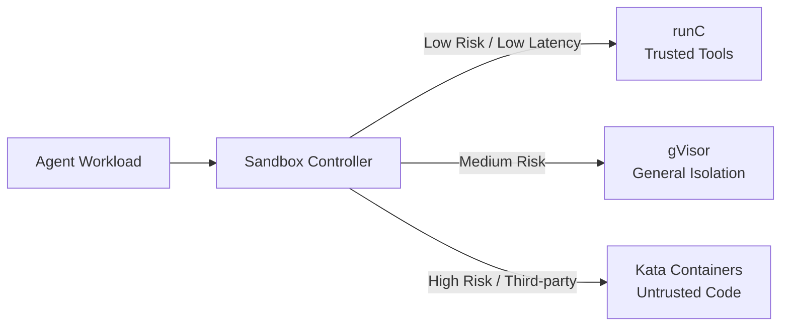

This salon was co-hosted by **AWS Solutions Architect HC** and **Bito Group Operations Manager Michael**. The main theme was very clear:

> **How enterprises can utilize the Kubernetes (AWS EKS) architecture to securely, compliantly, and cost-effectively deploy multi-tenant AI Agent platforms.**

This is not a story about "hooking up another LLM API", but about breaking down the most common bottlenecks enterprises face when introducing Agents—**management, governance, cost, and security monitoring**—into a practical platform engineering context. It can also be cross-referenced with this site's [Enterprise Agentic AI Governance](/en/blog/39-enterprise-agentic-ai-governance/) and [Enterprise AI Agent Security](/en/blog/43-enterprise-ai-agent-security/).

> **Huahua in one sentence**
>
> Meow~ Lock each AI helper in its own safe sandbox, so you won’t be afraid of them being naughty! Creating a multi-tenant environment on EKS is both safe and cost-effective! 🐾
>
> **Huahua's engineering note**
>
> When deploying a multi-tenant AI Agent platform on Kubernetes, isolation levels must be strictly distinguished (such as using sandboxes such as gVisor or Kata Containers), and Network Policy and dynamic expansion and contraction (KEDA) must be used to balance security and cost.

## Agenda Overview

| Phase | Speaker | Key Points |
| --- | --- | --- |
| 1. AI Agent Trends and Security Challenges | HC | Fintech / Container / AI background; OpenClaw, Hermes popularity; OWASP LLM Top 10 red lines |
| 2. Multi-tenant Isolation and Sandbox Technologies | HC | Four levels of isolation; runC / gVisor / Kata; Sandbox Controller mix-and-match |
| 3. BitoClaw Real-world Practice | Michael | Self-built platform under FSC supervision, EKS, KEDA, Pod Identity |
| 4. Summary and Resources | HC | Empowering employees is better than chasing the latest models; deployment reference resources |

## 1. Opening: The Explosion of AI Agents and Enterprise Concerns

HC focuses on Fintech, containerization, and AI/ML. He opened by using the GitHub stars growth curve to illustrate the high popularity of **OpenClaw** and **Hermes Agent**, and immediately brought the atmosphere back to the enterprise scene: Agents are useful, but after deployment, four major challenges must be faced:

1. **Management**: Who can create, enable, and disable which Agents?
2. **Governance**: How to define tool permissions, data boundaries, and audit trails?
3. **Cost**: How to control idle computing power, Tokens, and shared infrastructure?
4. **Security Monitoring**: How to detect and isolate Prompt Injection, malware, and data leaks?

### Security Red Lines from the OWASP LLM Top 10 Perspective

The sharing specifically mentioned the red lines most commonly crossed by enterprises:

- **Prompt Injection**
- **Malware entering the execution environment**
- **Insufficient Data Isolation**

The key reminder is: the stronger the model's capabilities, the less you can assume that "user prompts are well-intentioned." If an enterprise does not separate the execution environment, network permissions, and data plane, the Agent will quickly turn from a productivity tool into an attack surface magnifier.

> **Editor's Note:** SaaS Agents can solve the startup speed issue, but often cannot overcome the compliance threshold of "data absolutely must not be leaked." Finance and regulated industries usually have to answer isolation questions first before discussing flashy features.

## 2. Multi-tenant Isolation: Four Levels from Physical to API

HC summarized enterprise multi-tenant isolation into four levels. In practice, they almost always need to be "layered and superimposed" rather than just choosing one:

| Level | Typical Means | What it Blocks | Limitations |
| --- | --- | --- | --- |
| Physical Isolation | Independent Cluster | Maximum blast radius separation | Highest cost, complex operations and maintenance |
| Logical Isolation | Namespace | Resource quotas, RBAC boundaries | May still share nodes and kernels |
| Container Isolation | Pod / Runtime | Process and file system boundaries | Risks remain when sharing the kernel |
| API Isolation | Gateway, Policy, Identity | Calling surface and credential exposure surface | Cannot block malicious code execution solely through APIs |

The conclusion is very practical: **Workloads with different trust levels should have different isolation strengths.** Internal trusted tools, general business Agents, and Agents executing untrusted third-party code should not share the same Runtime assumption.

## 3. Sandboxed Runtimes: How to Choose Between runC, gVisor, and Kata?

This was the most technically intensive segment of the session. The focus is not on "always choosing the most secure one," but mixing and matching based on risk, latency, and cost.

| Runtime Cloud & Platform | Security Isolation Strength | Startup Latency (Performance) | Memory Overhead (Cost) | Applicable Scenarios |
| --- | --- | --- | --- | --- |
| **runC** | Weaker (Shared kernel) | Extremely fast (Microsecond level) | Extremely low | Internal trusted tool calls |
| **gVisor** | Medium (User-space kernel) | Medium | Medium | Needs to block general vulnerabilities |
| **Kata Containers** | Extremely strong (MicroVM) | Slower (150ms+) | Higher | Executing untrusted third-party code |

A further solution is to use Kubernetes' **Sandbox Controller**, allowing the platform to flexibly mix and match different Runtimes based on workload types, striking a balance between security and performance.

The trade-off here is very direct: you can run everything on Kata for maximum isolation, but you will pay the price in startup latency and memory; if you use runC entirely, the cost and speed are attractive, but it may not withstand the attack surface of untrusted code.

## 4. Bito's Real-world Practice: Why Build BitoClaw?

Michael started from Bito's background: it is a long-established cryptocurrency exchange in Taiwan, supervised by the Financial Supervisory Commission (FSC), with extremely high requirements for information security and compliance (including anti-money laundering).

### Real Pain Points of Introducing AI

- **Human Resource Bottlenecks**: Tedious daily operations and maintenance trap experts' productivity.
- **Knowledge Gaps**: Know-how is scattered across people, documents, and groups.
- **Tool Silos**: Trading, market intelligence, and internal systems are not interconnected.
- **Hard Compliance Requirements**: Data must absolutely not be leaked.

Therefore, they rejected pure SaaS solutions with "higher data risks" and chose to build their own multi-tenant AI Agent platform—**BitoClaw**—on **AWS EKS**, based on OpenClaw and Hermes.

### Key Points of BitoClaw Platform Architecture

| Aspect | Approach | Value |
| --- | --- | --- |
| Application Tech Stack | Frontend Next.js; Backend Go (CHI); Deployed on EKS | Controllable, scalable, observable |
| GitOps / Automation | ArgoCD | Deployment consistency and replayability |
| Cost Control | KEDA (HTTP trigger) Scale-to-Zero | Scales down to zero when not in use |
| Model Access | Pod Identity connecting to AWS Bedrock | Reduces API key leakage risks |
| Network Defense | Network Policy blocks unauthorized traffic by default | Principle of least privilege for connections |
| Permissions | RBAC least privilege | Reduces lateral movement |
| Auditing and Observation | Adopt an LLM observability platform (e.g. Langfuse-class tools) with Grafana | End-to-end call tracing, auditing, and system observability |

### Quantified Results

- **First Deployment**: About **20 minutes**
- **Subsequent Enabling**: Employees wake up the Agent via Slack, about **3 minutes** out-of-the-box
- **Capability Integration**: Integrating professional **Skills** like Spot Trading and market intelligence into the platform
- **Compliance Narrative**: Balancing information security and regulatory compliance (the sharing mentioned aligning with external regulatory and compliance requirements, as well as FSC regulatory scenarios)

The core of this path is not "changing models faster," but: **putting the Agent into an execution and governance boundary that a regulated enterprise can truly deploy into production.**

However, it is still worth noting: Scale-to-Zero and 3-minute cold start are great for internal tools; if the scenario is an extremely latency-sensitive front-office trading path, the costs of pre-warming and availability must be evaluated separately.

## 5. Summary: What Are You Really Buying When Building Your Own Agent Platform?

HC summarized it into one solid core thought:

> **The value of an enterprise building its own AI Agent lies not in pursuing the latest models, but in empowering employees within a secure environment.**

### Checklist to Take Back to Your Team

1. Are your Agent workloads graded by trust level, rather than using runC across the board?
2. Does the isolation cover Cluster / Namespace / Pod / API simultaneously, rather than just shouting network blocking slogans?
3. Are the model credentials long-term API Keys, or short-term Identities (like Pod Identity)?
4. Can it Scale-to-Zero when there is no traffic? Are observation and auditing complete when there is traffic?
5. Can the data leakage risk pass internal information security and regulatory narratives, instead of just "looking very AI"?

## Related Resources

| Resource | Description |
| --- | --- |
| [BitoClaw Platform](https://bitoservice.com/) | Official BitoClaw overview: multi-tenant AI workspace, EKS / KEDA elastic scaling, and enterprise isolation |
| [OpenClaw](https://github.com/openclaw/openclaw) | Open-source personal / team AI agent project |
| [Hermes Agent](https://github.com/NousResearch/hermes-agent) | Open-source agent framework by Nous Research |
| [OWASP Top 10 for LLM Applications 2025](https://genai.owasp.org/resource/owasp-top-10-for-llm-applications-2025/) | Common security red lines for LLM / agent applications |
| [Kubernetes Agent Sandbox](https://github.com/kubernetes-sigs/agent-sandbox) | Kubernetes Sandbox Controller / isolated workload project |

## Key Takeaway

This salon split the enterprise Agent platform into two halves: one half is **HC's isolation and sandbox technology map**, and the other half is **Bito's real-world path of using EKS to simultaneously achieve compliance, cost control, and employee experience**.

For regulated industries, the real stepping stone is often not a stronger model, but:

- Multi-tenant isolation is achieved
- Sandbox strength is chosen correctly
- Credentials and network permissions are controlled
- Idle costs are kept down
- Enabling experience is fast enough that employees are willing to use it

Only by doing these five things right first can AI Agents have the chance to transform from a Demo into enterprise-grade productivity infrastructure.
