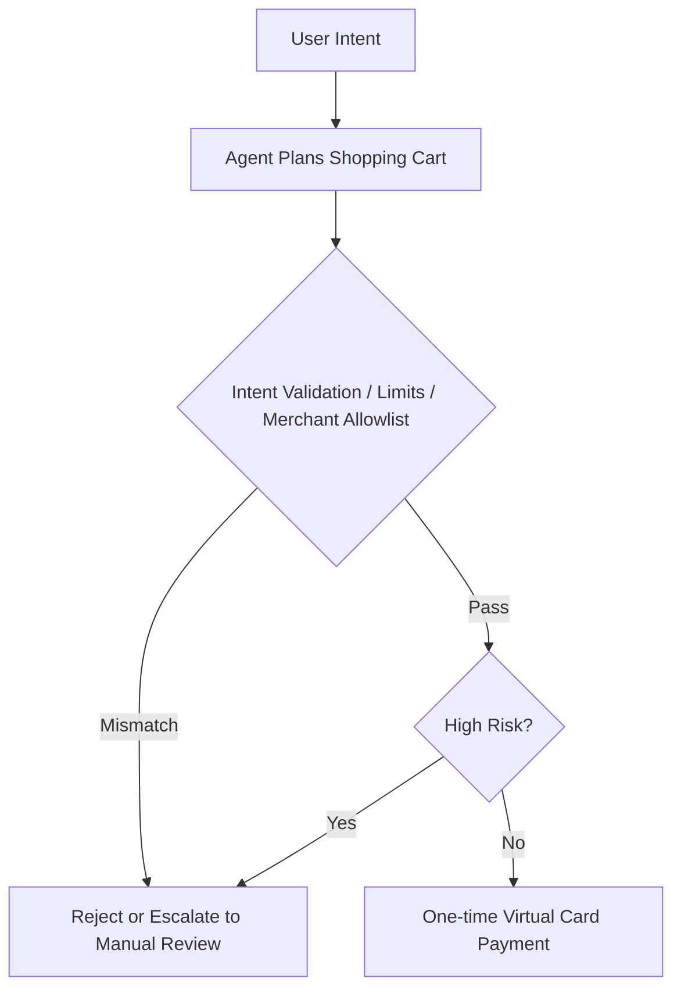

This talk, co-presented by **Amazon representatives** and **TapPay VP Joseph**, explores two complementary fronts:

1. How Amazon turned its generative AI shopping assistant (formerly **Rufus**, now **Alexa for Shopping**) into a scalable conversion engine
2. How TapPay utilizes Amazon's technology to push retail from "chat-based recommendations" to true **Agentic Commerce** that can checkout on behalf of the customer

The core isn't about "whether AI can chat," but: **Whether AI can simplify decision-making under low latency and safely spend money under strict financial controls.**

TapPay architecture, latency, and Open Beta details in this article come from session notes. The [AWS Summit Taipei agenda](https://aws-summit-2026-jane.s3.ap-northeast-1.amazonaws.com/aws_summit_taipei_2026_jane.html) confirms the session on a shopping agent built with Strands Agents and Amazon Bedrock AgentCore and names its speakers. Amazon scale and AgentCore controls are checked separately against first-party sources. Unpublished slides and measurement methods are not treated as independently verified.

> **Huahua's take**
>
> The key to agentic commerce is not automated checkout. It is making intent confirmation, spending limits, one-time credentials, and revocable authorization part of the payment flow.

> **Huahua's engineering note**
>
> When implementing Agentic Commerce (active e-commerce), intent verification, single-time virtual card generation, and amount cap management should be built into the workflow of the checkout agent to ensure the financial security of automated transactions.

## Agenda Overview

| Section | Focus | Key Message |
| --- | --- | --- |
| Amazon Alexa for Shopping | Shopping Pain Points & Conversion | Lens, Review Summary, Sizing, Conversational Recommendations, Buy for Me |
| Architectural Choice | Single Agent vs Multi-Agent | First Token controlled within 3–5 seconds |
| TapPay Agentic Commerce | Proactive Agent Procurement | Front-end intent intervention, completing checkout and payment |
| Safety Guardrails | AI Authorized to Spend | One-time virtual cards, intent validation, MFA, limits, and merchant allowlists |

This can also be compared to the [DoorDash Ask Assistant Architecture](/en/blog/51-doordash-ask-assistant-architecture/) on this site: both emphasize Agent execution and deterministic/safety boundaries, rather than throwing all business actions directly to the model.

## 1. Amazon Alexa for Shopping: Dismantling Shopping Friction

Amazon shared how its generative AI shopping assistant designs features for real consumer pain points and boosts conversion rates with shorter decision paths.

### How Five Major Features Address Pain Points

| Feature | What it Solves | How it Works |
| --- | --- | --- |
| **Amazon Lens (Visual Search)** | Doesn't know the product name | Take a picture to find corresponding or similar products |
| **Review Summary** | Too many reviews to read | LLM automatically summarizes pros/cons |
| **Size Recommendation** | Confusing APAC/EU/US sizing | Combines review signals (e.g., "runs small") with personal profiles |
| **Ask Rufus (Conversational Shopping)** | Complex requirement expression | Remembers preferences (e.g., spouse's favorite color) for precise recommendations |
| **Buy for Me (Out-of-Stock Purchasing)** | Wants to buy even if out of stock | Uses a headless browser in an isolated VM to place orders on brand websites on behalf of the user |

**Buy for Me** is particularly noteworthy: this goes beyond "providing links"; the Agent performs cross-site operations on behalf of the user in an isolated execution environment. The capability is strong, but the blast radius is also larger—the payment controls by TapPay discussed later are almost the necessary dual solution for this kind of capability on the financial side.

### 2025 results: separate official and session figures

- **Customer scale**: Amazon says Rufus helped more than **300 million customers** research, compare, and buy products in 2025.
- **Incremental sales**: Amazon separately says its shopping AI drove nearly **$12 billion in incremental sales** that year.
- **Conversion rate**: The session reported roughly **60%** higher purchase conversion than traditional search flows; no public method or baseline was found, so this remains a speaker-reported figure.

The [Alexa for Shopping introduction](https://www.aboutamazon.com/news/retail/alexa-for-shopping-ai-assistant) supports the customer scale, while the [AWS retail-solution announcement](https://www.aboutamazon.com/news/aws/aws-agentic-shopping-assistant-retailers) supports the incremental-sales figure. Neither establishes that a single-agent architecture alone caused $12 billion in sales. The bounded conclusion is scale, not architectural attribution.

## 2. Key Architectural Choice: Abandoning Multi-Agent to Save 3–5 Seconds

According to the session, this shopping implementation used **Amazon Bedrock AgentCore** and made an important interaction-design choice:

> **Abandoning the Multi-Agent design in favor of a Single Agent architecture.**

The reasoning is very product-driven: while Multi-Agent collaboration might improve task accuracy, frequent mutual calls would push latency to **30–60 seconds**. In e-commerce scenarios, it's hard for users to wait half a minute for a search/recommendation process.

The session says the team therefore chose a **streaming-capable Single Agent architecture**, bringing **First Token Response Time** to **3–5 seconds**. This is a session-reported topology and measurement, not evidence that every Alexa for Shopping path uses the same architecture or latency target.

> **Editor's Note:** This isn't a repudiation of Multi-Agent, but a reminder of the trade-off—coordination accuracy vs. perceived latency. In "near-instant decision" scenarios like e-commerce, latency is often more fatal than lacking an extra specialized Agent layer. For background planning, auditing, or long-running processes, Multi-Agent might still make sense.

## 3. TapPay: From Chatbot to Agentic Commerce

Joseph proposed a more forward-shifted retail concept: don't just appear when the consumer is already choosing products, but intervene when the **shopping Intention** just emerges, and help the user reach the completion of checkout as much as possible.

### Traditional Shopping Guide vs Agentic Commerce

| Comparison | Traditional Shopping Chatbot | Agentic Commerce |
| --- | --- | --- |
| **Intervention Timing** | When consumers actively search and select | At the very frontend when shopping intent emerges |
| **Task Scope** | Recommend products, drop purchase links | Breakdown intent, match specs, **complete checkout and payment** |
| **User Experience** | Still requires manual redirect to e-commerce site for checkout | AI agent completes the task in a one-stop manner |

### Three Key Elements of Implementation

1. **Tools**
   Giving AI "hands and feet": fiat wallets, search APIs, and merchant service integrations so it can actually execute purchases.
2. **Stable Workflow**
   Establishing checking and validation mechanisms to ensure buying the right items, smooth checkout, and payment.
3. **Stable Runtime**
   Adopting Amazon Bedrock AgentCore to support high concurrency and high security.

These three elements almost correspond to the common structure of enterprise Agent platforms: **Tools × Workflow × Runtime**. Missing any piece, the system is prone to stall at a Demo—can chat, but can't buy, or can buy but isn't secure.

## 4. Five Future Application Scenarios

| Scenario | What the User Says/Does | What the Agent Does |
| --- | --- | --- |
| Regular Auto-Procurement | "Almost out of cat litter" consumption rhythm | Automatically restocks based on preferences and consumption; adjusts specs based on feedback (e.g., cat dislikes a certain can) |
| Customized Travel Planning | Days, budget, number of travelers | Integrates hotel, restaurant, and ticket bookings (e.g., AsiaYo, FunNow) |
| Photo-Based Spatial Matching | Uploads a living room photo | Analyzes style and dimensions to recommend decorations |
| Budget-Based Surprise Gifts | Fixed 500–1000 NTD monthly | Automatically selects and sends based on daily habits |
| Precise Gifting | Analyzes interactions with friends | Recommends holiday gifts that truly "touch the heart" |

The commonality of these scenarios is: the value lies not only in the recommendation quality but in **turning the intent into an executable closed-loop transaction**. Thus, the safety controls in the next section aren't add-on features, but prerequisites for the product to go live.

## 5. Safety Guardrails of AI Autonomous Shopping

Joseph emphasized that once AI receives the ability to spend, teams must assume it can hallucinate, exceed authority, or take shortcuts. The following four TapPay controls come from the session. Public [AgentCore payments concepts](https://docs.aws.amazon.com/bedrock-agentcore/latest/devguide/payments-concepts.html) independently support scoped sessions, spending limits, credential isolation, and activity tracking, but do not verify every TapPay implementation detail.

### Four Control Measures

1. **One-time Virtual Cards**
   Generates a one-time virtual card for each transaction, rendering it useless afterward, reducing the risk of repeated fraudulent charges.
2. **Intent Validation for Shopping Carts**
   Checks if the shopping cart truly matches the user's initial intent—for example, preventing AI from buying an expensive console just to get a free gift.
3. **Multi-Factor Authentication (MFA)**
   When detecting abnormal amounts or high-risk behavior, it must be manually verified by the user before proceeding.
4. **Strict Limit Management**
   Supports single transaction limits, monthly limits, and a Merchant Allowlist for permitted spending.

The product philosophy of this design is very clear: **The Agent can be autonomous, but not out of control.** Between completing tasks autonomously and "unlimited spending on behalf of the user," there must be configurable, auditable, and interruptible financial boundaries.

### Open Beta Status

The session reported that the system entered Open Beta in **April 2026** and integrated:

- **FunNow** (Restaurant bookings)
- **AsiaYo** (Accommodation bookings)
- **Eslite Online** (Lifestyle department store)
- **Bibian** (Cross-border e-commerce)

No public TapPay product page was found that independently maintains this merchant list and Beta state, so readers should not treat it as a continuously valid availability list. Merchant coverage, limits, and intent-validation rules still determine the agent's blast radius.

## Structured Summary

- **Amazon's Practice:** Alexa for Shopping shortens the decision path through visual search, review summaries, size recommendations, conversational shopping, and out-of-stock purchasing; **Single Agent + 3–5 seconds first-token response** is the session's engineering trade-off, not public causal proof for incremental sales.
- **Agentic Commerce is the Next Generation:** Moving from passive search and recommendation to "intervening as soon as intent emerges, and autonomously completing procurement and checkout"; requires Tools, Workflow, and Runtime to be fully equipped.
- **Security and Control are Core:** When AI can actually spend money, the core value of merchants/platforms lies more in providing a controllable financial environment—one-time virtual cards, limits, intent validation, and MFA are the tracks that make proactive shopping viable for launch.

## Key Takeaways

This talk laid out the next phase of e-commerce Agents very plainly:

> **Low latency determines if users are willing to use it; security control determines if the system can let it spend money.**

Amazon published the usage scale and an incremental-sales estimate for its shopping AI, while the TapPay session pushed the story toward autonomous checkout and payment controls—**Once AI gets a wallet, who draws the red line?**

When shopping guides shift from "giving advice" to "executing on behalf of," the victory will increasingly lie not in how sweet the model talks, but in whether the Runtime, workflow, and payment guardrails can withstand real money and real users.

Next, compare the [AWS × HoyaBit Bedrock AgentCore case](/en/blog/56-aws-hoyabit-bedrock-agentcore/) with another production-oriented AgentCore deployment, then use the [AI Agent practical guide](/en/blog/64-ai-agent-guide/) to check tool permissions, approvals, and recovery paths.

## Primary sources

- [AWS Summit Taipei 2026 agenda](https://aws-summit-2026-jane.s3.ap-northeast-1.amazonaws.com/aws_summit_taipei_2026_jane.html)
- [Amazon: Alexa for Shopping](https://www.aboutamazon.com/news/retail/alexa-for-shopping-ai-assistant)
- [Amazon: Agentic Shopping Assistant for retailers](https://www.aboutamazon.com/news/aws/aws-agentic-shopping-assistant-retailers)
- [AWS Docs: AgentCore payments core concepts](https://docs.aws.amazon.com/bedrock-agentcore/latest/devguide/payments-concepts.html)
- [AWS Docs: AgentCore payments IAM roles](https://docs.aws.amazon.com/bedrock-agentcore/latest/devguide/payments-iam-roles.html)
