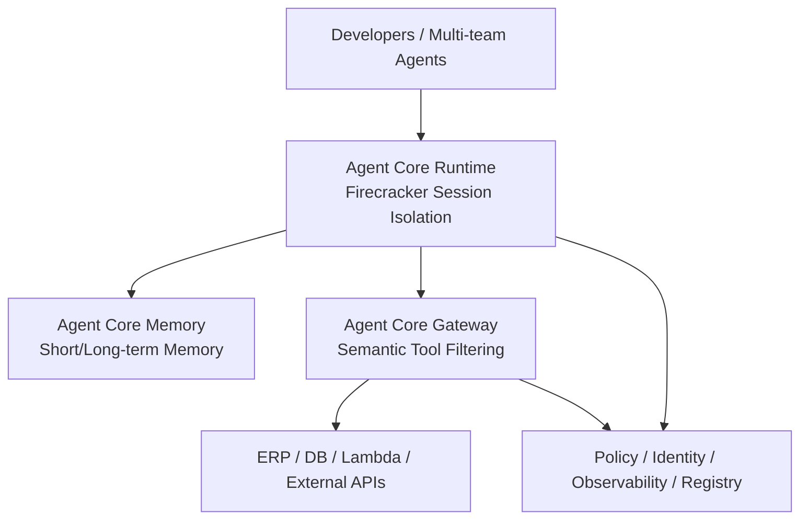

This session was co-presented by **AWS** and **HoyaBit**, Taiwan's first FSC-compliant cryptocurrency exchange. The theme was:

> **"Building Enterprise-Grade AI Agents on AWS"**

The main focus wasn't just another flashy tech demo, but rather tackling the hardest step for enterprises: pushing AI Agents from **POC (Proof of Concept)** into **Production**—all while handling latency, high concurrency, security governance, and tool integration.

At the event, AWS introduced their **Amazon Bedrock Agent Core** solution, while HoyaBit shared their dual-track practical implementation:

- **External**: Deeply integrating natural language AI Agents into their App to lower the barrier to entry for Web3 trading.
- **Internal**: Positioning AI as an "enterprise brain" to free engineers from non-core tasks.

You can also read this in comparison with our site's articles: [Amazon × TapPay Agentic Commerce](/blog/55-amazon-tappay-agentic-commerce/), [EKS Multi-tenant AI Agent Sandbox](/blog/54-eks-multitenant-ai-agent-sandbox-bitocloud/), and [Enterprise Agentic AI Governance](/blog/39-enterprise-agentic-ai-governance/).

---

## Session Overview

| Section | Focus | Key Takeaways |
| --- | --- | --- |
| 1. Trends and Pain Points | Agent evolution and the 4 challenges of POC→Production | Align first on performance/scalability/security/governance |
| 2. Bedrock Agent Core | Runtime, Memory, Gateway, Governance Services | A map of platform capabilities |
| 3. HoyaBit External/Internal Implementation | Voice trading App, Enterprise Brain | How to implement in highly regulated scenarios |
| 4. Platform Architecture and Design Experience | Contract review workflow, Before/After | Map out the workflow first, then discuss models |

---

## I. Trends and Pain Points in Enterprise Agentic AI Adoption

### The 3 Stages of Agent Development

| Stage | Timeframe | Characteristics |
| --- | --- | --- |
| Q&A Mode | Early | Copy-paste, passive content generation |
| Tool Integration | ~2025 | LLMs integrated with external tools (e.g., MCP Server), entering real work scenarios |
| Autonomous Collaboration | ~2026 (Current) | Moving towards an era of autonomous Agents capable of fully assisting human work |

The session also cited a Gartner prediction: by **2028**, roughly **1/3** of generative AI will be embedded in enterprise systems, and **15%** of daily tasks will be assisted by Agentic AI. The numbers indicate the direction, but for enterprises, the more critical question is: after embedding it into systems, who is responsible for performance, scalability, security, and governance?

### 4 Major Pain Points from POC to Production

Most teams look great on Demo Day, but get stuck as soon as they enter the production environment. The session consolidated the pain points into four main areas:

1. **Performance**  
   Is latency low enough? Is the response pacing acceptable to the user?
2. **Scalability**  
   Can it support ten thousand concurrent online users and high-concurrency Sessions?
3. **Security**  
   Once the Agent has access to sensitive enterprise data and internal tools, how is the attack surface controlled?
4. **Governance**  
   When multiple teams are developing multiple Agents, how do you unify management, authentication, and authorization?

> **Editor's Note:** These four points are practically the "minimum passing grade" for an enterprise Agent platform. Merely optimizing prompts or switching to larger models usually cannot solve all four issues at once; what is needed is a platform layer composed of Runtime, Identity, Policy, and Observability capabilities.

---

## II. The AWS Solution: Amazon Bedrock Agent Core Tech Stack

AWS addressed the aforementioned pain points with **Agent Core**. It can be understood as a set of platform capabilities designed to make Agents "deployable, scalable, and governable," rather than just a single chat API.

### 1) Agent Core Runtime: An Isolatable, Managed Execution Layer

| Capability | Description | Pain Point Addressed |
| --- | --- | --- |
| **Session Isolation** | The underlying layer uses **Firecracker microVMs** for physical isolation of compute, memory, and file systems. | Security / Multi-tenancy |
| **MCP Server Hosting** | Enables large models to access enterprise ERPs, databases, and other external systems. | Tool Integration |
| **Multiple Deployment Options** | Container images (ECR) or Zips (S3), auto-generating Endpoints. | POC to Deployment |
| **Lifecycle** | Supports ~**2500** concurrent sessions by default; idle for **5 minutes** pauses CPU (no billing, but state & files retained); recycled after **15 minutes**; max continuous run is ~**8 hours**. | Cost / Scalability |

The key is not just "can it run Agents?", but rather: **every Session has clear isolation boundaries and a lifecycle billing model**, making the cost and security narrative viable for production environments.

### 2) Agent Core Memory: Short-Term State × Long-Term Preferences

- **Short-Term Memory**: Records single-conversation and Session states.
- **Long-Term Memory**: Asynchronously extracts conversation content into semantic storage—for instance, remembering a user's preference for a window seat when booking tickets.

This allows the Agent to do more than just "get the current turn right," enabling it to remember reusable preferences and facts across Sessions. However, long-term memory also introduces governance issues: what is remembered, who can read it, and whether it can be forgotten, all need to be factored into security and compliance designs.

### 3) Agent Core Gateway: Lots of Tools, But Don't Stuff Them All into Context

The Gateway is responsible for interfacing with external APIs or AWS Lambdas and features **Semantic Search**:

> Even if there are hundreds of tools on the backend, only the most relevant tools for the current moment are filtered and brought into the Context, preventing context overflow and performance degradation.

This point is absolutely critical for production environments. The longer the tool directory, the easier it is to hit two landmines simultaneously: increased token costs, and the model choosing the wrong tool. The Gateway upgrades "tool discovery" from hard-cramming a Prompt into a searchable system capability.

### 4) Security and Governance Services: Making Multi-Team Agents Manageable

| Service | Function |
| --- | --- |
| **Policy** | Dynamically evaluates whether the Agent has the permissions to invoke external tools. |
| **Identity** | Complete inbound and outbound authentication. |
| **Observability** | Out-of-the-box monitoring, integrating with CloudWatch or Dashboards to trace Memory, Identity, and Gateway trails. |
| **Registry** | Unifies the management of multi-team Agents via Console, SDK, and APIs. |
| **CLI** | Provides templates to help developers move faster from POC to deployment in production. |

To summarize in one sentence:

> **Developers focus on business logic; the platform handles hosting, isolation, authorization, and observability.**

This is exactly the organizational benefit that HoyaBit's "Before vs. After Platform Implementation" comparison later aims to prove.

---

## III. HoyaBit Implementation: AI Dual-Track in a Compliant Web3 Exchange

### Background

HoyaBit is a virtual asset exchange in Taiwan, compliantly registered with the FSC. Introducing Agents into a regulated industry means the product goals and risk boundaries differ from standard consumer Apps: the goal is to both lower the barrier to entry and retain ultimate human confirmation and audit capabilities.

### External: AI Voice-Driven App

Users can issue commands directly via voice, for example:

> "I want to buy one Bitcoin."

The system automatically generates a trade order using AI, and the user simply performs a final **Human-in-the-loop** confirmation to complete the process. The value lies in:

- Eliminating the learning curve of navigating tedious Web3/Crypto UIs for trading, depositing, and on-chain transfers.
- Translating complex operations into natural language intent.
- **Still retaining human confirmation**, preventing the Agent from losing control over direct financial pathways.

This differs from "fully automated trading": it is **intent understanding + order pre-filling + human authorization**, which aligns better with regulated trading scenarios.

### Internal: AI Enterprise Brain

Internally, AI is utilized for:

- Accelerating cross-departmental communication.
- Querying compliance regulations.
- Systems analysis and knowledge organization.

The goal is to free engineers from non-development time, refocusing the team's capacity back onto core construction. Lowering external barriers and boosting internal productivity constitute the two primary outlets for the same platform capabilities.

---

## IV. HoyaBit AI Platform: Workflow Design and Before/After

### Workflow Example: "Contract Review Agent"

Regulated industries are well-suited for using workflows to explain "which steps should be rule-based, and which steps actually need an Agent":

The crucial part of this chain isn't just the addition of an LLM, but rather:

1. Having retrievable internal rules and data first.
2. Using MCP to connect to internal systems next.
3. Performing risk consolidation after supplementing with external regulations.
4. **Ultimately routing back to a legal review.**

The Agent is responsible for accelerating and consolidating, not replacing the node of ultimate responsibility.

### Why Do We Need an AI Platform? Before vs. After

To prevent R&D from spending massive amounts of energy on non-core tasks like environment deployment, security controls, and system monitoring, HoyaBit built a platform based on Bedrock Agent Core:

| Function / Responsibility | Before Platform Implementation | After Platform Implementation |
| --- | --- | --- |
| **Core Developer Focus** | Aside from core logic, had to handle deployments, tool invocations, logs, etc. | Focused solely on Agent core business logic and permission configuration (YAML). |
| **System Deployment & Hosting** | Handled CI/CD, Container packaging, environment setup manually. | Platform automatically handles CI/CD, ECR pushing, auto-generates Endpoints. |
| **Security & Governance** | Manually wrote defense code, hard to unify across teams. | Dynamically evaluates tool permissions via Policy & Identity, provides isolation. |
| **Observability & Evaluation** | Hooked up monitoring manually, hard to trace complete paths. | Built-in Observability and Evaluation, automatically collects Logs/Metrics. |

The essence of a platform is converting the "infrastructure tax of re-doing the basics for every project" into a shared capability.

### Mars' Key Advice: Map Out the Workflow First, Don't Choose the Model First

> Advice from **Mars**, Head of the HoyaBit AI Team:  
> The first task when adopting AI **is not choosing a model, but mapping out the business workflows**. Figure out which checkpoints are suited for Rule-based engines and which checkpoints require an AI Agent. At the same time, avoid directly planning a grandiose platform right out of the gate. It is recommended to start iterating with a small-scale POC, clearly documenting the cost and time savings metrics Before/After (e.g., reducing human review time from 2 hours down to half an hour) to successfully drive enterprise AI transformation.

This passage is arguably the most valuable organizational methodology to take away from the entire session:

1. **Workflow Layering**: Rule engines vs. Agents; don't shove everything to the model.
2. **Start Small, Scale Up**: Do a POC first, then platformize.
3. **Let the Metrics Talk**: Before/After time and cost data drive transformation better than slogans.

---

## A Checklist to Take Back to Your Team

1. Are you stuck on Prompts, or stuck on the four issues of Latency/Concurrency/Security/Governance?
2. Does Agent execution have Session-level isolation, or is it sharing a single long-running process?
3. Are tools all stuffed into the Context at once, or dynamically selected via a Gateway/Semantic search?
4. Can inbound and outbound Identity and tool Policies be dynamically evaluated?
5. Does your observability allow for replay of Memory, Gateway, and the complete trajectory of tool invocations?
6. Do external financial/trading pathways retain a Human-in-the-loop?
7. Have you used Before/After metrics to prove a POC is worth platformizing?

---

## Key Takeaways

This AWS × HoyaBit session provided a very complete narrative for enterprise-grade Agents:

> **Models make Agents capable of working; Platform capabilities like Agent Core are what make it safe for Agents to work in production environments.**

- For AWS, the answer lies in Runtime isolation, Memory, Gateway tool governance, and a control plane composed of Policy/Identity/Observability/Registry.
- For HoyaBit, the answer is lowering external barriers through voice trading, enhancing internal productivity with an enterprise brain, and using a platform to free developers from the infrastructure tax.
- For any team looking to undergo an enterprise AI transformation, Mars' reminder is the most practical: **map out the workflows and metrics first, then talk about models and grandiose platforms.**

Moving from POC to Production is rarely a contest of who connects to the newest model first, but rather who is first to turn performance, scalability, security, and governance into platform capabilities genuinely shared by the team.
