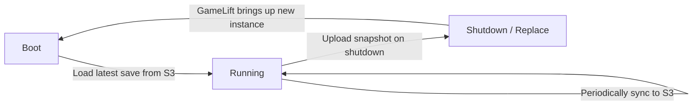
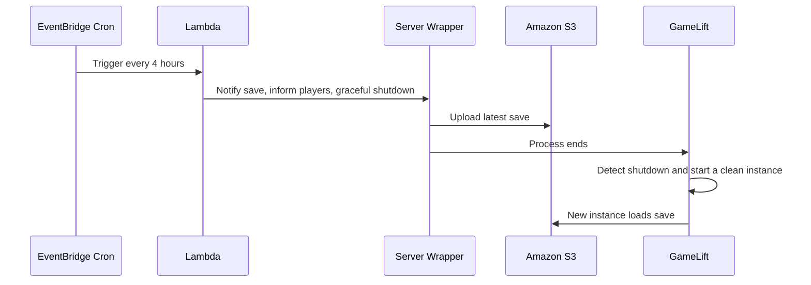

This is an architecture sharing session full of practical insights. The session topic is:

> **Migrating from K8s to Amazon GameLift: Palworld Multiplayer Server Architecture**

The presentation is divided into two parts:

- **First half**: An AWS specialist introduces the Amazon GameLift managed service.
- **Second half**: Pocketpair Platform Engineer **Keigo Yamauchi** shares the design and pitfalls of migrating Palworld official servers from Kubernetes to GameLift.

The core proposition is sharp: cloud computing is inherently ephemeral, but Palworld's game world is highly persistent. To run a 24/7 world on a managed architecture, you must completely decouple "replaceable computing" from "unlosable state".

Palworld topology, deployment timing, world scale, and failure cases in this article come from Keigo Yamauchi's TGDF 2026 session; the [official TGDF 2026 site](https://2026.tgdf.tw/) establishes the event context. GameLift scale tests, locations, Spot behavior, and UDP ping beacons are checked against AWS first-party material. Pocketpair details without public slides are treated as speaker-reported case evidence, not universal GameLift guarantees.

This can also be compared with our site's articles on enterprise platform engineering, such as [AWS × HoyaBit Bedrock AgentCore](/en/blog/56-aws-hoyabit-bedrock-agentcore/)—it's essentially paying the infrastructure tax to the platform so the team can focus on core logic; only here the core is game world saves, rather than Agent workflows.

> **Huahua in one sentence**
>
> Meow~ It turns out that this is how the server of the Phantom Beast Palu was moved! Separate the game state and calculation, just like Huahua separates cans and toys, so that even if the cloud machine is changed, our pallu will not be lost!
>
> **Huahua's engineering note**
>
> Cloud computing is ephemeral in nature, but when dealing with persistent workloads such as game worlds, it is important to externalize "state" and make good use of lifecycle adapters to ensure graceful startup and shutdown of servers.

## Session Overview

| Section | Key Points | Takeaways |
| --- | --- | --- |
| High-level intro to GameLift | Managed service metaphor, elasticity, cost, update efficiency | Why consider leaving self-built/managed K8s |
| Palworld migration design | State externalization, Adapter, Exactly One, monitoring integration | Design principles for persistent worlds on managed platforms |
| Three major failure cases | Terraform Drift, false-healthy Fleets, Ping failures | The actual pitfalls you will encounter after migration |
| Key Takeaways | Four lessons | Reusable platform engineering checklist |

## Part 1: High-level Introduction to Amazon GameLift Service

### 1. What is a Managed Service? Buying a Car vs. Calling a Taxi

The speaker uses a real-life metaphor to explain Managed Services:

| Model | Metaphor | What you are responsible for |
| --- | --- | --- |
| Self-built servers | Buying a car | Maintenance, replacing parts, servicing, repairs—massive operational effort |
| Managed service | Calling a taxi / Renting a car | Focusing on the "destination": game development and design; car maintenance and driving are handled by AWS |

The point is not that "you don't need to know infrastructure at all," but rather shifting repetitive and high-risk operational burdens into predictable platform capabilities and SLAs.

### 2. GameLift: A purpose-built service for real-time multiplayer games

GameLift is positioned as a service specifically designed for multiplayer, low-latency, real-time games. The track records and capabilities mentioned in the session include:

#### Extreme Stress Testing

According to the [AWS scale test](https://aws.amazon.com/blogs/gametech/amazon-gamelift-achieves-100-million-concurrently-connected-users-per-game/), GameLift Servers tested roughly **100 million concurrently connected users (CCU)** and achieved:

- Adding about **100,000** players per second
- Launching more than **9,000 new compute instances** per minute

This is an AWS service-scale test, not Palworld's actual traffic or a guarantee for one deployment. Most teams should focus on session capacity, interruption handling, and recovery behavior.

#### Global Deployment and Cost Advantages

| Aspect | Highlights |
| --- | --- |
| Deployment locations | Region and Local Zone coverage changes; use the current [GameLift Servers service-locations table](https://docs.aws.amazon.com/gameliftservers/latest/developerguide/gamelift-regions.html) instead of a fixed count in an article |
| Cost | Instance type, operating system, location, and network usage are priced separately; model costs using observed session density |
| Matchmaking | Supports **FlexMatch**, but queues, fleets, and locations still require explicit configuration |
| Latency measurement | AWS exposes UDP ping beacons per hosting location for RTT closer to real game traffic |

#### Multiple Cost Optimizations

1. **Auto-scaling by Session**
   Traditionally, scaling is often based on CPU/Memory; but in multiplayer games, CPU might still be low while Sessions are full, requiring new machines to spin up. GameLift can scale based on the **number of Sessions**, which closer aligns with real game bottlenecks.

2. **Safe Managed Spot Instances**
   [AWS documentation](https://docs.aws.amazon.com/gameliftservers/latest/developerguide/fleets-spot.html) says Spot can save roughly **70–90%** versus On-Demand, but capacity can be reclaimed with a two-minute interruption notice. GameLift avoids high-risk instance types; the workload still needs save, drain, and backup-fleet behavior.

3. **Graviton (ARM) Instances**
   Provides highly cost-effective compute options.

#### Update Efficiency (session-reported)

- Past updates/patching: About **40 minutes to even 1 hour**
- Later shortened to about **8 minutes**
- Goal at the time: Global deployment shrunk to **under 5 minutes**

For a live-operated game, a shorter deployment window isn't just an engineering thrill, but determines the reaction speed for incident repairs and event rollouts.

## Part 2: Palworld Migration in Practice—How Persistent Worlds Live in Ephemeral Compute

Keigo Yamauchi broke down the core challenges and solutions of migrating official servers from K8s to GameLift.

### 1. Core Conflict: Ephemeral Compute × Persistent World

| Cloud Nature | Palworld Reality |
| --- | --- |
| Infrastructure is ephemeral and replaceable | The world is highly persistent; progress must never be lost |
| Instances can be replaced anytime | Servers run 24/7; crashes/disconnects immediately impact players |

World-scale context reported in the session:

- Up to about **128** player bases per server
- About **1,000** Pals (creatures)
- Requires continuous operation, and **must absolutely not lose world progress (State)**

Thus, the design principle boils down to one sentence:

> **Compute is ephemeral, but state (saves) is not.**

### 2. Four Key Focus Areas

#### ① Externalize State

To make compute instances replaceable at any time, game saves must be stripped out to external **Amazon S3**:

Saves are further divided into three layers of protection:

| Type | Purpose |
| --- | --- |
| **Active Save** | The save point where players are currently playing |
| **Snapshots** | Historical rollbacks during failures |
| **Exports** | Development investigation, sharing, or debugging |

This is not just "backup," but making the world state a first-class citizen, turning compute into a replaceable executor.

#### ② Translate Life Cycle

GameLift has a set lifecycle protocol (declaring Ready, ending Session, reporting health, etc.). To avoid major modifications to the main game code, Pocketpair built a lightweight **Adapter/Wrapper**:

- The Wrapper is responsible for communicating with GameLift.
- The game core doesn't need a massive refactor.
- Retains migration flexibility and room to change platforms later.

This is the classic **Adapter Pattern**: using a thin adaptation layer to absorb platform differences instead of coupling the business core to managed APIs.

#### ③ Ensure "Exactly One" World Instance

Each Palworld server world must be unique. Approaches include:

- Limiting a single Fleet's capacity to **1**; if the instance disappears abnormally, GameLift automatically rebuilds it.
- **Preventing Race Conditions**: During rebuilds, if multiple instances read/write the same S3 save simultaneously, it could corrupt files—therefore, concurrency suppression and idempotent operations are implemented externally.
- **Graceful restart plan every 4 hours**:

The key is: rules aren't written in documents hoping everyone follows them; they actively maintain "exactly one world" through automation.

#### ④ Integrate Existing Monitoring Assets

During migration, GameLift metrics were hooked up to existing **CloudWatch, Slack alerts, and Grafana**, so operations didn't have to relearn a whole new set of tools. This is often underestimated but directly determines the organizational friction cost post-migration.

## Part 3: Three Major Post-Migration Failure Cases in Practice

### Case 1: Terraform State Drift

| Item | Details |
| --- | --- |
| **Problem** | After CI/CD automatically updated and released a new image, operations running Terraform encountered an unexpected Drift, showing code and actual cloud state were inconsistent. |
| **Root Cause** | The automated release directly changed the running Container Digest without Terraform State knowing. |
| **Solution** | Explicitly use **Digest (instead of Tag)** in Terraform to lock the image, and feed it back into Terraform control, making every apply approach **0 drift**. |

Takeaway: An image "drifting" a bit seems minor, but in the IaC world, it directly becomes a trust crisis—you think an apply is declarative convergence, but in reality, you are always chasing the lagging truth.

### Case 2: Silent Fleet Failure (Showing Healthy but Unconnectable)

| Item | Details |
| --- | --- |
| **Problem** | The dashboard was green/healthy, but players couldn't join at all. |
| **Root Cause** | Traditional monitoring only looks at "whether the instance is alive"; the game process / Game Session inside the instance had actually crashed. |
| **Solution** | Change monitoring to **Invariants**: the number of active Game Sessions and players. If infrastructure is healthy but there are no active Sessions, treat it as an anomaly and automatically trigger a rebuild. |

> **Editor's Note:** "Machine is alive ≠ Service is correct." This applies to Agent platforms, game servers, and trading systems alike—you must monitor business invariants, not just VM/Pod heartbeats.

### Case 3: Ping Value and Latency Measurement Failures

| Item | Details |
| --- | --- |
| **Problem** | After migration, client players could no longer use traditional ICMP Ping to measure latency in the community server list. |
| **Root Cause** | The client's former ICMP target no longer matched the new hosting locations, and ICMP may not represent real UDP game traffic. |
| **Solution** | The client moved to regional **GameLift UDP ping beacons** for RTT, with an ICMP fallback. |

The [AWS UDP ping-beacon guide](https://docs.aws.amazon.com/gameliftservers/latest/developerguide/reference-udp-ping-beacons.html) says UDP better represents most game traffic while recommending ICMP fallback when many UDP probes fail. The migration lesson is to move probe targets, protocols, and fallback behavior together—not to claim that GameLift universally blocks ICMP.

## Conclusion: Four Key Takeaways

Keigo Yamauchi summarized four reusable principles:

1. **Externalize State**
   Thorough separation of compute and state—the golden rule for placing persistent services onto ephemeral managed architectures.

2. **Leverage the Adapter Pattern**
   Use lightweight Wrappers to translate lifecycles, avoiding massive game code overhauls while connecting to new platforms.

3. **Use Operational Design to Maintain Rules**
   Constraints like "exactly one instance" shouldn't just rely on configuration files and human governance; use Lambdas, concurrency suppression, and idempotent workflows to actively enforce them.

4. **Retain Existing Assets**
   Connect logs, metrics, and alerts to original operational interfaces as much as possible to massively lower the team's adaptation cost.

### Checklist to Take Back to Your Team

1. Is your "world/Session/tenant state" externalized to reliable storage?
2. Does the platform lifecycle have an Adapter, rather than intruding on core logic?
3. For Exactly One / single writer, is there automated race condition prevention rather than just documentary guidelines?
4. Does monitoring look at infrastructure heartbeats or business invariants?
5. Does IaC lock release artifacts with immutable Digests to avoid Drift?
6. Do client health checks / latency probes still assume old network behaviors (like ICMP)?

## Final Thoughts

This Palworld migration session clearly explained the hardest sentence in multiplayer backend engineering:

> **The cloud gives you ephemeral compute; players demand an unlosable world.**

GameLift provides the elasticity, cost, and update efficiency tailored for real-time multiplayer games; where Pocketpair truly solved the puzzle was by safely putting a "persistent world" into "ephemeral compute" through state externalization, Adapters, Exactly One automation, and existing monitoring assets.

Whether a migration is successful often does not depend on whether containers can run on a new platform, but on: will the saves corrupt? Will the rules break? Will monitoring lie to you? And will players suddenly fail to connect when you think everything is fine?

To carry these lessons into general platform work, continue with [deployment simulation](/en/blog/25-deployment-simulation/) for failure and recovery exercises. Then compare the [AWS × HoyaBit Bedrock AgentCore case](/en/blog/56-aws-hoyabit-bedrock-agentcore/) to see how a different workload hands infrastructure responsibilities to a managed platform.

## Primary sources

- [Official TGDF 2026 site](https://2026.tgdf.tw/)
- [AWS: GameLift 100 million CCU scale test](https://aws.amazon.com/blogs/gametech/amazon-gamelift-achieves-100-million-concurrently-connected-users-per-game/)
- [AWS Docs: GameLift Servers service locations](https://docs.aws.amazon.com/gameliftservers/latest/developerguide/gamelift-regions.html)
- [AWS Docs: GameLift Spot fleets](https://docs.aws.amazon.com/gameliftservers/latest/developerguide/fleets-spot.html)
- [AWS Docs: GameLift UDP ping beacons](https://docs.aws.amazon.com/gameliftservers/latest/developerguide/reference-udp-ping-beacons.html)
