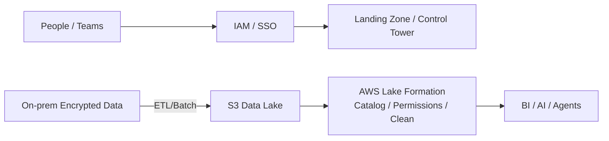
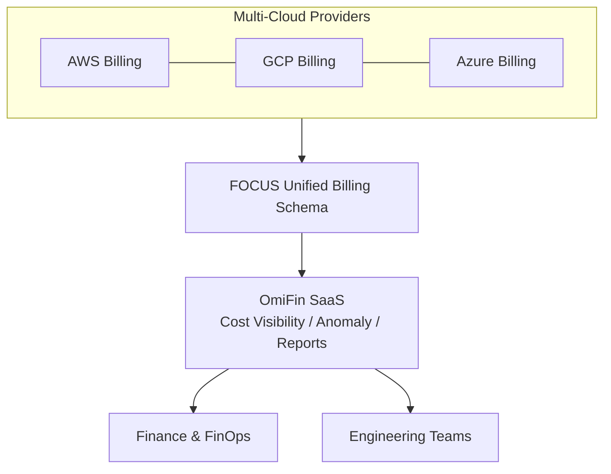

This article is a detailed summary of the recorded speech. The topic is:

> **《New Enterprise Governance Challenges in the AI Agent Era: From Innovative Applications to Controllable Operating Models》**
> Speaker: **Elmer, Enterprise Solution Architect at eCloudvalley Digital Cloud & Platform**

The operating problem is straightforward: as an agent gains users, tools, and longer context, token, model API, and compute spend can grow quickly. Without ownership, limits, and traces, a team cannot tell which cost creates value. The answer is not to stop experimentation, but to make "where money is spent, who may act, and how actions stay safe" part of an operating control plane.

The recording remains the source for OmiFin and claims made on stage. This article was cross-checked on August 29, 2026 against FOCUS, the FinOps Foundation, AWS documentation, and public MAIAH product pages. Details without public product documentation are labeled as speaker claims rather than independent verification.

> **Huahua in one sentence**
>
> FinOps asks whether technology spend creates value. Agent Governance asks who may make an agent do what, and whether every step can be traced and constrained.
>
> **Huahua's engineering note**
>
> When introducing AI applications, cost governance (FinOps) and agent governance (Agent Governance) should be incorporated into the architecture as early as possible, and Guardrails should be established to limit token usage and access rights to prevent innovation from turning into an out-of-control maintenance disaster.

## Core Summary

Two main governance tracks:

1. **Cloud Financial Governance (FinOps)** — Transforming multi-cloud billing and usage into a visible, quantifiable, optimizable, and continuously operating system (eCloudvalley: **OmiFin**).
2. **AI Agent Governance** — Unified management, review, and control of multiple internal enterprise Agents to prevent Token waste and data leaks (eCloudvalley: **MAIAH Platform**).

> It's not about opposing experimentation, but expanding under the premise of being "secure, compliant, and cost-controllable."

## 1. Speaker Bio

- Elmer, Enterprise Solution Architect at eCloudvalley
- Experience: Medical Information Engineer, Designer at the Department of Education, Taipei City Government, Information Section Chief at Construction Center (first contact with AWS)
- Certifications: AWS series, PMP, Personal Data Protection Act related certificates

## 2. Governance & Compliance

Elmer elaborated using Wikipedia and RIMA (Risk Information Security Framework):

- **Governance**: Doing the "right things" — decision-making, direction, oversight
- **Compliance**: Doing "things right" — adherence, execution

### PPT Cloud Governance Model (People / Process / Cloud & Platform)

- **People**: AWS IAM permission control; adopting **Landing Zone / Control Tower** at scale
- **Process / Cloud & Platform**: Encrypted transmission of on-premise data to **S3**, using **AWS Lake Formation** for data governance (unified formatting, permissions, cleansing)



## 3. FinOps and OmiFin: Spending Money Where It Counts

### 3.1 AWS Well-Architected (WA) Six Pillars

- Operational Excellence, Sustainability, Security, Reliability, Performance Efficiency, Cost Optimization
Among them, "Operational Excellence" is the first step to the cloud; **the focus of FinOps is not blindly saving money, but "making the money count" (a Taiwanese pun on "saving money") = spending money where it creates value.**

### 3.2 The three iterative FinOps phases

The [FinOps Foundation](https://www.finops.org/framework/phases/) defines three phases rather than four:

1. **Inform:** understand usage, cost, allocation, and business value.
2. **Optimize:** identify architecture, usage, rate, and licensing improvements.
3. **Operate:** enable engineering, finance, and business teams to act and keep measuring results.

Quantification remains essential, but it runs across the three phases instead of forming an official fourth phase.

### 3.3 eCloudvalley OmiFin Platform

The talk positions OmiFin as a multi-cloud billing and cost-visibility platform and claims SaaS hosting, provider neutrality, and FOCUS data support. No public OmiFin product documentation was found during this review, so procurement or a proof of concept should verify these claims through the live interface, import formats, and contract terms.

The [FOCUS 1.3 specification](https://focus.finops.org/docs/specification/v1-3/sections/introduction/) can be confirmed independently. It defines provider-neutral billing dimensions, metrics, and terminology to reduce cross-cloud normalization work. "FOCUS support" still does not prove complete conformance across every field, version, and validator.



## 4. AI Agent Governance and MAIAH Platform

### 4.1 Four Major Challenges of Enterprise AI Adoption

1. Scenario Discovery: Finding the right application scenarios
2. Model Usability and Deployment: On-premise vs. cloud, whether to re-train
3. Talent Shortage: Lack of AI integration and operation talents
4. Employee Awareness: Insufficient security boundaries for AI tools

### 4.2 eCloudvalley MAIAH Platform (Multi‑AI Agent Hub)

The public [MAIAH AWS Marketplace page](https://aws.amazon.com/marketplace/pp/prodview-hcf72l523y7a2) confirms positioning around centralized management of agents, tools, MCP servers, users, RBAC, observability, usage, and cost. The [MAIAH Governance page](https://aws.amazon.com/marketplace/pp/prodview-qwdqllmp4izkc) lists centralized monitoring, risk controls, cost management, and auditability.

The talk additionally describes BYOA, input/output guardrails, token quotas, and launch review. Those claims are consistent with the public positioning, but CI/CD gates, supported import formats, and limits still need verification in the deployed version.

```mermaid
flowchart LR
  subgraph MAIAH[MAIAH Platform]
    Reg[Agent Registry] --> Mon[Health / Usage / Token]
    Mon --> Guard[Guardrails (PII / Policy)]
    Guard --> Gate[CI/CD Gate\nReview / Approve / Deploy]
    Gate --> Limits[Token Limits / Quotas]
  end
  BYOA[BYOA: Internal Agents / LLM Apps] --> MAIAH
  MAIAH --> Corp[Enterprise Users / Apps]
```

## 5. OmiFin × MAIAH: Dual-Platform Comparison

| Platform | Core Pain Points Addressed | Key Features |
| --- | --- | --- |
| **OmiFin** | Complex multi-cloud billing, hard-to-monitor costs | No agency binding, maintenance-free SaaS, supports **FOCUS** unified billing format |
| **MAIAH Platform** | Lack of AI Agent management, Token out of control, security risks | Unified monitoring of **BYOA**, built-in **Guardrails**, **CI/CD** integration for deployment control |

## Checklist to Take Back to Your Team

1. Can your cloud expenses be cross-compared and anomaly-detected using the **FOCUS format**?
2. Does FinOps continuously cycle through "Inform → Optimize → Operate" and quantify results throughout, rather than stopping at a one-time cost review?
3. Do enterprise Agents have full lifecycle governance including **registration, review, deployment, monitoring, and decommissioning**?
4. Are there whitelists for **Token/Context** quotas and purposes to prevent cost overruns and data leak risks?
5. Is data governance relying on platform capabilities like **Lake Formation** rather than custom solutions by each team?
6. Are permissions centrally managed by **IAM / Landing Zone / Control Tower**?

## Key Takeaway

FinOps and Agent Governance complement one another, but neither replaces the other. The first must connect technology spend to business value; the second must constrain agent identity, permissions, data, and actions. Before adopting any platform, require reproducible permission tests, cost attribution, audit records, and a decommissioning path.

## Next reading and source scope

- Start with [Enterprise Agentic AI governance](/en/blog/39-enterprise-agentic-ai-governance/) for the full control-plane view, then compare its operational evidence with [financial-industry generative AI platform engineering](/en/blog/38-financial-genai-platform-engineering/).
- To turn governance requirements into a release decision, continue with the [Agentic AI platform contract](/en/blog/93-agentic-ai-platform-contract/).
- Methods and standards: [FinOps Framework](https://www.finops.org/framework/), [FOCUS 1.3](https://focus.finops.org/docs/specification/v1-3/sections/introduction/), and the [AWS Well-Architected pillars](https://docs.aws.amazon.com/wellarchitected/latest/framework/the-pillars-of-the-framework.html).
- Public product material: [MAIAH](https://aws.amazon.com/marketplace/pp/prodview-hcf72l523y7a2) and [MAIAH Governance](https://aws.amazon.com/marketplace/pp/prodview-qwdqllmp4izkc). OmiFin details remain based on the talk because no public product documentation was available for cross-checking.
