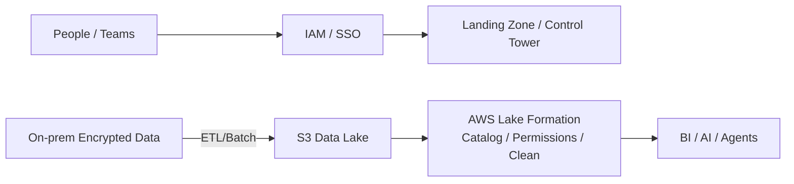
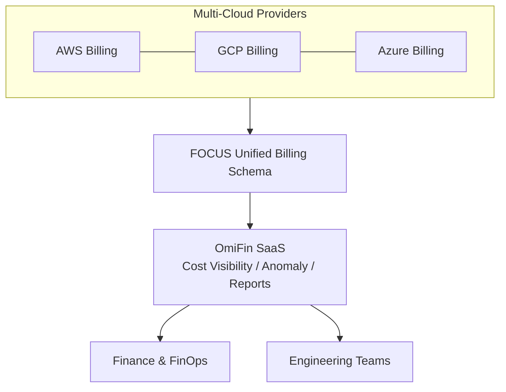

This article is a detailed summary of the recorded speech. The topic is:

> **《New Enterprise Governance Challenges in the AI Agent Era: From Innovative Applications to Controllable Operating Models》**  
> Speaker: **Elmer, Enterprise Solution Architect at eCloudvalley Digital Technology**

The core viewpoint is straightforward: **The cost of AI applications and cloud resources (Tokens, compute) is increasing exponentially**; lacking governance, innovation will soon turn into uncontrollable expenses and information security risks. The solution is not to "seal off innovation," but to platformize the capabilities of "where the money is spent, who can spend it, and how to spend it safely."

---

## Core Summary

Two main governance tracks:

1. **Cloud Financial Governance (FinOps)** — Transforming multi-cloud billing and usage into a visible, quantifiable, optimizable, and continuously operating system (eCloudvalley: **OmiFin**).  
2. **AI Agent Governance** — Unified management, review, and control of multiple internal enterprise Agents to prevent Token waste and data leaks (eCloudvalley: **Maya Platform**).

> It's not about opposing experimentation, but expanding under the premise of being "secure, compliant, and cost-controllable."

---

## 1. Speaker Bio

- Elmer, Enterprise Solution Architect at eCloudvalley  
- Experience: Medical Information Engineer, Designer at the Department of Education, Taipei City Government, Information Section Chief at Construction Center (first contact with AWS)  
- Certifications: AWS series, PMP, Personal Data Protection Act related certificates

---

## 2. Governance & Compliance

Elmer elaborated using Wikipedia and RIMA (Risk Information Security Framework):

- **Governance**: Doing the "right things" — decision-making, direction, oversight  
- **Compliance**: Doing "things right" — adherence, execution

### PPT Cloud Governance Model (People / Process / Technology)

- **People**: AWS IAM permission control; adopting **Landing Zone / Control Tower** at scale  
- **Process / Technology**: Encrypted transmission of on-premise data to **S3**, using **AWS Lake Formation** for data governance (unified formatting, permissions, cleansing)



---

## 3. FinOps and OmiFin: Spending Money Where It Counts

### 3.1 AWS Well-Architected (WA) Six Pillars

- Operational Excellence, Sustainability, Security, Reliability, Performance Efficiency, Cost Optimization  
Among them, "Operational Excellence" is the first step to the cloud; **the focus of FinOps is not blindly saving money, but "making the money count" (a Taiwanese pun on "saving money") = spending money where it creates value.**

### 3.2 Four Phases of FinOps

1. Inform: Understand usage and cost  
2. Quantify: Convert into business metrics  
3. Optimize: Continuously optimize costs  
4. Operate: Institutionalize governance, prevent rebound

### 3.3 eCloudvalley OmiFin Platform

- **Positioning**: One-stop multi-cloud billing and cost visibility management  
- **Features**:  
  - No binding restrictions: No need to bind to any cloud account platform or agency  
  - **SaaS hosted on AWS**: No need to maintain on-premise or self-managed VMs  
  - **Supports FOCUS standard**: Adopts an open cloud billing data format, unifying billing fields from different cloud providers, and accelerating reviews



---

## 4. AI Agent Governance and Maya Platform

### 4.1 Four Major Challenges of Enterprise AI Adoption

1. Scenario Discovery: Finding the right application scenarios  
2. Model Usability and Deployment: On-premise vs. cloud, whether to re-train  
3. Talent Shortage: Lack of AI integration and operation talents  
4. Employee Awareness: Insufficient security boundaries for AI tools

### 4.2 eCloudvalley Maya Platform (Multi‑AI Agent Hub)

- **BYOA (Bring Your Own Agent)**: Integrating self-developed AI/Agents into unified operations (health, usage, Token consumption)  
- **Built-in Review Mechanisms (Guardrails & Governance)**:  
  - Guardrails safety net: Filtering sensitive content in inputs/outputs  
  - Behavior review (CI/CD integration): Agent launches must go through a review flow to eliminate unauthorized deployment  
  - **Token Quota Control**: Limiting context length and total cost to prevent "unlimited burning"  
- **Architectural Security**: Built on the **AWS Security Framework**, strengthening compliance for data and execution environments

```mermaid
flowchart LR
  subgraph Maya[Maya Platform]
    Reg[Agent Registry] --> Mon[Health / Usage / Token]
    Mon --> Guard[Guardrails (PII / Policy)]
    Guard --> Gate[CI/CD Gate\nReview / Approve / Deploy]
    Gate --> Limits[Token Limits / Quotas]
  end
  BYOA[BYOA: Internal Agents / LLM Apps] --> Maya
  Maya --> Corp[Enterprise Users / Apps]
```

---

## 5. OmiFin × Maya: Dual-Platform Comparison

| Platform | Core Pain Points Addressed | Key Features |
| --- | --- | --- |
| **OmiFin** | Complex multi-cloud billing, hard-to-monitor costs | No agency binding, maintenance-free SaaS, supports **FOCUS** unified billing format |
| **Maya Platform** | Lack of AI Agent management, Token out of control, security risks | Unified monitoring of **BYOA**, built-in **Guardrails**, **CI/CD** integration for deployment control |

---

## Checklist to Take Back to Your Team

1. Can your cloud expenses be cross-compared and anomaly-detected using the **FOCUS format**?  
2. Does your FinOps have a rhythm of "Inform -> Quantify -> Optimize -> Operate" rather than being a one-off project?  
3. Do enterprise Agents have full lifecycle governance including **registration, review, deployment, monitoring, and decommissioning**?  
4. Are there whitelists for **Token/Context** quotas and purposes to prevent cost overruns and data leak risks?  
5. Is data governance relying on platform capabilities like **Lake Formation** rather than custom solutions by each team?  
6. Are permissions centrally managed by **IAM / Landing Zone / Control Tower**?

---

## Key Takeaway

> **Innovate fast, spend accurately, and keep risks controllable.**  
> OmiFin allows teams to clearly see "where the money is spent" and continuously optimize; Maya institutionalizes "who can spend, how to spend, and how safe the spending is."  
> When FinOps and Agent governance become platform capabilities, AI can truly be "more reassuring to use, and more valuable over time" within the enterprise.
