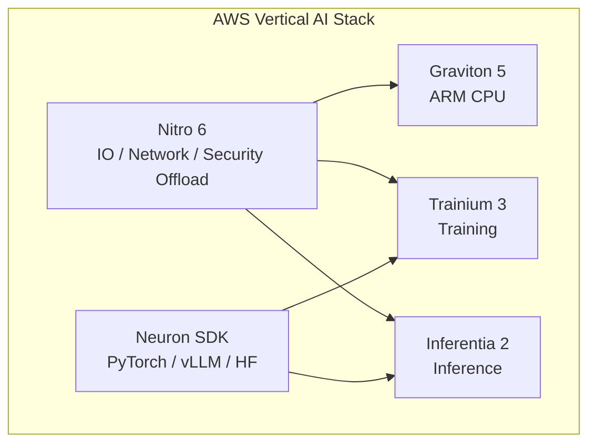
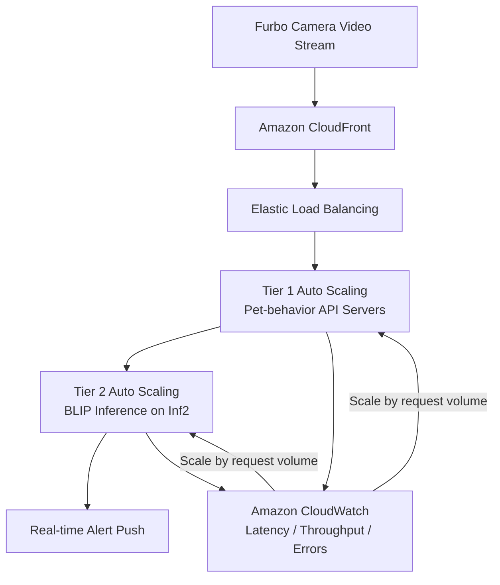

This session, jointly presented by **Howard from AWS** and **Ricky from Tomofun (Furbo)**, covered everything from the underlying hardware design of custom silicon to practical, large-scale cost optimization in enterprise applications.

The core proposition boils down to one sentence:

> **In the AI era, the computing bottleneck is often not "whether you have GPUs," but rather whether hardware and software can be co-optimized.**

This can also be compared with [FinOps × Agent Governance](/blog/58-ecloudvalley-omifin-maya-governance/) and [HoyaBit Bedrock Agent Core](/blog/56-aws-hoyabit-bedrock-agent-core/) on this site — the former discusses cost governance platforms, while this article discusses how "changing to the right chips, writing the right code, and building the right infrastructure" can directly slash your bills.

### Source

In addition to this summary of the talk, Tomofun and AWS also published a complete architecture and code explanation on the official tech blog:

- **AWS Machine Learning Blog**: [Cost effective deployment of vision-language models for pet behavior detection on AWS Inferentia2](https://aws.amazon.com/tw/blogs/machine-learning/cost-effective-deployment-of-vision-language-models-for-pet-behavior-detection-on-aws-inferentia2/)
- **Co-authors**: Tomofun's Chenghsin Lin (Tibo), Ray; AWS's Howard

The following content has been supplemented based on that article with **two-tier Auto Scaling architecture**, **GPU/Inf2 hybrid routing**, **Wrapper code examples**, and **load testing methods**.

---

## Quick Agenda Summary

| Focus | Content | Key Figures |
| --- | --- | --- |
| **AWS Strategy** | Custom silicon (Trainium for training, Inferentia for inference, Graviton CPU, Nitro virtualization) + Neuron SDK software stack | Llama 2 token cost reduced by 55%, throughput increased 4× |
| **Tomofun Practice** | Furbo AI subscription service ported BLIP to Inf2 and optimized Auto Scaling | Live talk: **81.6%**; [AWS Official Tech Blog](https://aws.amazon.com/tw/blogs/machine-learning/cost-effective-deployment-of-vision-language-models-for-pet-behavior-detection-on-aws-inferentia2/) records **83%** cost reduction |

---

## Agenda Overview

| Phase | Speaker | Core Theme | Key Highlights |
| --- | --- | --- | --- |
| First Half | Howard (AWS) | AWS Custom Silicon Ecosystem and Future Blueprint | Annapurna Labs, Nitro 6, Graviton 5, Trainium 2/3, Inf2, Neuron SDK |
| Second Half | Ricky (Tomofun) | Inferentia 2 Cost Reduction Practice | Furbo Dog Nanny, BLIP porting, AMI cold start optimization |

---

## First Half: Deep Dive into AWS AI Custom Silicon (Howard)

Howard delved into AWS's history of deep investment in custom silicon over the past decade, with core R&D coming from the internal **Annapurna Labs**. AWS's philosophy on chips is:

> **Don't just look at the chip itself, but optimize vertically across the infrastructure, servers, virtualization, and the chip as a whole.**



### 1. Progress of the AWS Custom Silicon Family

| Product | Positioning | Highlights |
| --- | --- | --- |
| **Nitro 6** | Virtualization / Network / Security Offload | Offloads underlying IO to custom chips, reserving **100%** of CPU resources for users |
| **Graviton 5** | ARM CPU | Officially GA in June 2026 (C9, M9 series families) |
| **Trainium 3 (Trn3)** | Training Chip | Expected in H2 2026; **TSMC 3nm (N3)** process; up to **20TB** HBM bandwidth and capacity per instance |
| **NeuronLink & Neuron Switch (3rd Gen)** | Chip Interconnect | Can fuse hundreds of Trainium chips into a single ultra-large virtual compute machine; rated as the "most underestimated technology" in large model training |
| **Inferentia 2 (Inf2)** | Inference Chip (Announced in 2022) | Extremely high cost-performance ratio; active customers include ByteDance, Airbnb, and Autodesk |

#### Inferentia 2 Benchmark Highlights

- **Llama 2**: Token cost reduced by **55%**, throughput increased **4 times**
- **Autodesk**: Predicted cost savings of **25%**

### 2. Neuron SDK Software Ecosystem

To lower the barrier for developers, AWS provides the **Neuron SDK** (similar to NVIDIA's CUDA ecosystem):

| Aspect | Content |
| --- | --- |
| **Framework Integration** | Supports PyTorch Lightning, vLLM, Hugging Face |
| **Native PyTorch** | Deep native integration with PyTorch entering Beta, expected to officially release in H2 2026 |
| **Neuron Kernel Interface (NKI)** | A kernel interface similar to Triton/CUDA, allowing performance engineers to directly control underlying memory access and operator compilation |
| **Neuron Explorer** | A performance profiling tool integrated with VS Code to analyze synchronization status between chips |

No matter how powerful the hardware is, if the software stack barrier is too high, enterprises will still be stuck at the POC stage. The value of the Neuron SDK is to turn "custom silicon" into an inference platform that developers can actually use.

---

## Second Half: Tomofun (Furbo) AI Cost Reduction Practice (Ricky)

**Tomofun** is headquartered in Taiwan, and its **Furbo** pet camera commands over a **90%** market share for smart pet cameras in the US. To solve the massive real-time computing costs generated by millions of users, the team attempted to migrate AI inference to Inf2.

### 1. AI Computing Pain Points

**Furbo Dog Nanny** is a subscription service that uses AI video and audio to detect dog behaviors:

- Eating, drinking, vomiting, seizures, crying, fire alarms, etc.
- Cumulatively saved over **tens of thousands** of pets

However, the cost pressure was immense:

| Item | Data |
| --- | --- |
| Core Model | **BLIP** (AI Image Captioning) |
| Original Environment | Traditional GPU instances (e.g., G4dn) |
| Cost Share | Accounted for **20%** of the company's total AWS costs |
| Monthly Fee Scale | Nearly **$100,000 USD** |

A single model eating up 20% of the cloud bill is exactly the kind of scenario where FinOps and architecture optimization must face off head-on.

The official AWS post also points out that the challenges Tomofun faced were twofold:

1. Maintaining cost efficiency for **always-on, real-time** pet behavior monitoring at the scale of hundreds of thousands of devices.
2. Completing the migration without massively rewriting the **BLIP** code, which was already optimized for PyTorch.

### 2. Production Architecture: Two-Tier Auto Scaling and GPU/Inf2 Hybrid Routing

According to the [AWS Tech Blog](https://aws.amazon.com/tw/blogs/machine-learning/cost-effective-deployment-of-vision-language-models-for-pet-behavior-detection-on-aws-inferentia2/), Furbo's pet behavior detection service uses a **two-tier Auto Scaling** design:



**Process Highlights:**

1. **Webcam Interaction**: After the camera captures the video, it passes through CloudFront and ELB into the first-tier API Auto Scaling Group.
2. **Model Inference**: The API layer processes the request and forwards the image to the second-tier inference Auto Scaling Group; the container loads BLIP components compiled with the Neuron SDK.
3. **Hybrid Backend**: Initially routed only to GPU containers; after migration, the API **can seamlessly switch between GPU and Inf2 backends in real time**, without requiring changes to the upstream API or downstream alerting logic.
4. **Metrics-Driven Scaling**: CloudWatch monitors latency, throughput, and error rates. Since the throughput of each instance type was baselined via load testing, scaling can be driven directly by the **image request volume**.

This design allows Tomofun to introduce the lower-cost Inf2 inference into production traffic while maintaining high availability, without having to cut off the GPU path all at once.

### 3. Core Technology: Porting the BLIP Model to Inf2

Inf2 is a specialized ASIC chip, which is not as "forgiving" as a GPU — **input and output shapes must be fixed in advance**. According to the AWS official post, BLIP consists of three components: **Image Encoder, Text Encoder, and Text Decoder**. Tomofun adopted a **modular split + lightweight Wrapper** approach, making no changes to the pre-trained logic, only adjusting the I/O interfaces to meet Neuron's requirements.

#### ① Isolating Original Submodules (Using Text Encoder as an Example)

First, a thin wrapper is used to enclose the original submodule, allowing `forward` to only return the primary tensor, which facilitates tracing and compilation:

```python
class TextEncoder(torch.nn.Module):
    def __init__(self, model):
        super().__init__()
        self.model = model

    def forward(self, input_ids, attention_mask, encoder_hidden_states, encoder_attention_mask):
        output = self.model(
            input_ids=input_ids,
            attention_mask=attention_mask,
            encoder_hidden_states=encoder_hidden_states,
            encoder_attention_mask=encoder_attention_mask,
            return_dict=False,
        )
        return output[0]
```

#### ② Wrapper for Neuron I/O Adaptation

`torch_neuronx.trace()` requires a **tensor tuple** as input and output. The Wrapper acts as an adaptation layer, avoiding rewriting the main body of the model as much as possible:

```python
class TextEncoderWrapper(torch.nn.Module):
    def __init__(self, model):
        super().__init__()
        self.model = TextEncoder(model)

    @classmethod
    def from_model(cls, model):
        wrapper = cls(model)
        wrapper.model = model
        return wrapper

    def forward(self, input_ids, attention_mask, encoder_hidden_states, encoder_attention_mask, return_dict):
        output = self.model(input_ids, attention_mask, encoder_hidden_states, encoder_attention_mask)
        return (output,)
```

**Compilation and Deployment Division of Labor:**

- **Compile**: Use the original submodule directly `model.text_encoder.model`
- **Deploy**: Use `TextEncoderWrapper` to load the compiled `.pt` file and format the I/O

#### ③ Compilation and Tracing (`torch_neuronx.trace`)

The three-step process demonstrated in the AWS post:

1. Prepare a pseudo input with the expected shape/dtype.
2. Call `torch_neuronx.trace()` to compile.
3. Use `torch.jit.save()` to save the Neuron-optimized TorchScript artifact.

```python
inputs = (
    torch.ones((1, 8), dtype=torch.int64),
    torch.ones((1, 8), dtype=torch.int64),
    torch.ones((1, 577, 768), dtype=torch.float32),
    torch.ones((1, 577), dtype=torch.int64),
)
encoder = torch_neuronx.trace(
    model.text_encoder.model,
    inputs,
    compiler_args="--auto-cast-type fp16 --logfile log-neuron-cc.txt",
)
torch.jit.save(encoder, os.path.join(directory, "text_encoder.pt"))
```

Loading the compiled artifact during deployment:

```python
models.text_encoder = TextEncoderWrapper.from_model(
    torch.jit.load(os.path.join(directory, "text_encoder.pt"))
)
```

> The compilation process takes about **2–3 hours** — this is the "upfront investment" for ASIC inference, in exchange for significantly lower costs at runtime. The Vision Encoder and Text Decoder also adopt the same modular process for independent compilation, which are then chained into a complete inference pipeline.

#### ④ Load Testing and Concurrency Tuning

Tomofun simulated real Furbo workloads, sending queries such as "Is the dog barking?", "Is it playing?", or "Is it chewing furniture?" for each video stream. The AWS post notes:

- **Inf2.xlarge** (1 Inferentia2 chip, 32GB memory) can support the required throughput and maintain low latency.
- The baseline for comparison was the deployment cost of **GPU On-Demand** prior to migration.
- The optimal balance at the live presentation was **8 Workers × 8 Concurrency**; when server threads are insufficient, increasing client concurrency rapidly increases latency, requiring load testing to find the **latency-cost** sweet spot.

**Final Results:** The live presentation highlighted an **81.6%** reduction; the [AWS Official Tech Blog](https://aws.amazon.com/tw/blogs/machine-learning/cost-effective-deployment-of-vision-language-models-for-pet-behavior-detection-on-aws-inferentia2/) recorded an **83%** cost reduction compared to GPU On-Demand, without sacrificing performance.


### 4. Auto Scaling Infrastructure Optimization: Baking Docker Images into AMIs

In actual production environments, AI inference traffic fluctuates greatly, necessitating Auto Scaling. However, Tomofun encountered another pain point:

| Item | Original State | After Optimization |
| --- | --- | --- |
| Docker Image Size | **3.6GB** | Baked into a custom **AMI** |
| Cold Start | Pulling the image took **9 minutes** | Booting without pulling via network saved **2 minutes** |
| Performance Gain | — | Cold start performance improved by **15%** |

**Approach**: Bake the 3.6GB Docker image directly into a custom AMI. When an EC2 instance boots up, it doesn't need to pull the image over the network and can directly start the inference service.

This was a "stroke of genius" architectural modification: cost reduction comes not only from changing chips but also from **shortening the time tax during scaling** — for real-time pet alert scenarios, a 2-minute delay can be the difference in product experience and SLA.

### 5. Tomofun's Future Technology Roadmap

Based on the talk and the [AWS Official Post](https://aws.amazon.com/tw/blogs/machine-learning/cost-effective-deployment-of-vision-language-models-for-pet-behavior-detection-on-aws-inferentia2/):

- **Continue to Squeeze the Chip**: Currently, CPU utilization is about **80%**, and NeuronCore is about **60%**; if fully optimized, an additional **10%–15%** in cost savings is expected.
- **Expand Model Scope**: Deploy more **Multimodal** models and **LLMs under 10B parameters** to Inf2.
- **Audio Event Detection**: Migrate audio workloads, such as bark recognition, to Inf2.
- **AWS Deep Learning Containers (DLC)**: Added to the roadmap to simplify dependency management and inference workflows with pre-built containers.

---

## Related Resources

| Resource | Description |
| --- | --- |
| [AWS ML Blog: Pet behavior detection on Inferentia2](https://aws.amazon.com/tw/blogs/machine-learning/cost-effective-deployment-of-vision-language-models-for-pet-behavior-detection-on-aws-inferentia2/) | Complete two-tier architecture, BLIP Wrapper/compilation code, load testing, and 83% cost reduction data |
| [AWS Neuron Documentation](https://awsdocs-neuron.readthedocs-hosted.com/) | Reference for Inferentia2 development, compilation, and deployment |
| [BLIP Paper (arXiv:2201.12086)](https://arxiv.org/pdf/2201.12086) | Original architecture for Bootstrapping Language-Image Pre-training |
| [Furbo Official Website](https://furbo.com/) | Product and AI features introduction |
| Tomofun Tech Blog | More on AI, backend, and frontend development practices |
| Tomofun Job Openings | Frontend, Backend, App, Firmware Engineers |

---

## Checklist to Take Back to Your Team

1. What percentage of your total cloud cost is occupied by your most expensive single AI model? Are there clear FinOps metrics?
2. Have you evaluated purpose-built hardware like **Inf2/Graviton** for inference workloads, rather than just focusing on GPUs?
3. Is the engineering cost of **fixed shapes and pre-compilation** acceptable for ASIC inference?
4. Is the bottleneck of Auto Scaling computing power, or **image pulling/cold starts**?
5. Have you considered **pre-baking large Docker images into AMIs** to shorten scaling time?
6. Has the Neuron SDK ecosystem (native PyTorch, NKI, Explorer) been added to your technology radar?

---

## Key Takeaways

> **The chip determines the ceiling, software determines if you can reach it, and architecture determines if you will fall off during scaling.**

- **AWS** uses Nitro, Graviton, Trainium, Inferentia, and the Neuron SDK to turn vertical integration "from chip to rack" into a replicable AI computing system.
- **Tomofun** used BLIP porting, load testing tuning, and AMI baking to turn Furbo's AI subscription service from a "GPU money burner" into a "sustainable Inf2 operation."

When the real-time inference of millions of users weighs on your bill, an **over 80% cost saving** is not a game of decimal points; it's the lifeline of whether a product can scale. If you want to see the complete architecture diagram and replicable Wrapper/compilation code, it's highly recommended to read the [AWS Official Tech Blog](https://aws.amazon.com/tw/blogs/machine-learning/cost-effective-deployment-of-vision-language-models-for-pet-behavior-detection-on-aws-inferentia2/) directly. Hardware-software co-optimization is exactly the practical lesson that enterprises must catch up on in the AI era.
