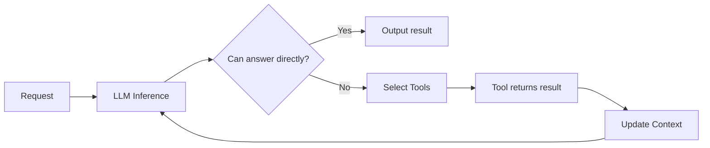
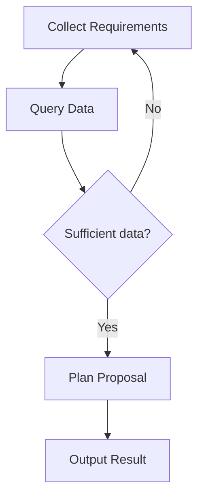
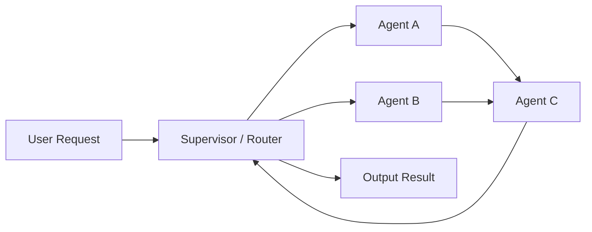
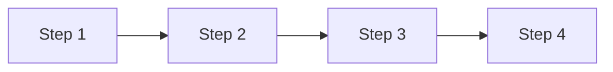
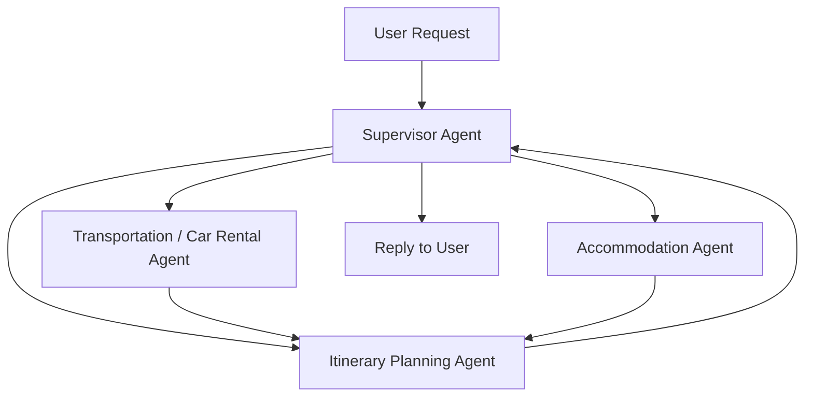

This presentation is divided into two distinct main tracks:

1. **Technical Architecture**: An AWS Cloud Support Engineer breaks down the core design patterns of **Multi-Agent** systems.
2. **Business Application**: **Brian Chen, Founder and CEO of Super 8**, shares the actual pain points of adopting AI Agents in enterprises, and debuts their product **ORRA (Agentic AI OS)**, which is built on **Amazon Bedrock AgentCore**.

If the first half answers "**how exactly should multi-agent systems be designed**", the second half answers "**how to actually deliver these capabilities to non-technical business users in the enterprise**".

> **Huahua's take**
>
> Letting non-technical users create AI employees moves governance earlier: role definitions, data scope, available tools, approvals, and monitoring must be part of creation itself.

This isn't just another architecture lesson on Agents; it's an attempt to bridge two common disconnects in enterprises:

- Architecturally: How to prevent multiple Agents from fighting with each other, wasting tokens, or falling into infinite loops.
- Product-wise: How to enable business users who do not understand Harness, Claude Code, or Codex to actually build and deploy usable AI employees.

Also refer to [AWS × HoyaBit Bedrock AgentCore](/en/blog/56-aws-hoyabit-bedrock-agentcore/), [EKS Multi-tenant AI Agent Sandbox](/en/blog/54-eks-multitenant-ai-agent-sandbox-bitoclaw/), and [FinOps × AI Agent Governance](/en/blog/58-ecloudvalley-omifin-maiah-governance/) on this site.

> **Huahua in one sentence**
>
> Meow! Recruiting an AI employee in two minutes? Using a multi-agent system to divide labor and cooperate is as efficient as cats catching mice together. Even people who don’t understand programming can easily build their own AI helpers!
>
> **Huahua's engineering note**
>
> When designing a Multi-Agent system, you need to choose an appropriate coordination model (such as Graph, Swarm, or Workflow), move governance forward, and define data boundaries and available tools when establishing AI roles to reduce maintenance risks.

## Executive Summary

This session can be condensed into one sentence:

> **The value of an enterprise-grade Multi-Agent system lies not just in smarter models, but in whether it has definable orchestration patterns, a governable execution environment, and a product interface that business users can use directly.**

In the first half, AWS starts from the **basic decision loop of a Single Agent**, gradually expanding to three orchestration patterns: **Graph, Swarm, and Workflow**, and extends to core issues such as **Session state, security, A2A protocols, shared memory, and tool governance**.

In the second half, Super 8 grounds these platform capabilities into a product-oriented answer: **ORRA**. Its goal is not to have every company learn to write agent frameworks, but to allow business users to recruit, train, and deploy their own AI employees using natural language in two minutes—just like writing a "Job Description (JD)"—and deliver them to communication channels like **Slack, Microsoft Teams, LINE, and Messenger**.

## Session Overview

| Section | Topic | Key Question | Takeaways |
| --- | --- | --- | --- |
| 1 | Single Agent and Multi-Agent Basics | Why isn't a single Agent enough? | Task routing, role boundaries, communication mechanisms |
| 2 | Three Major Orchestration Patterns | How to avoid token waste and infinite loops? | Applicable scenarios for Graph/Swarm/Workflow |
| 3 | Amazon Bedrock AgentCore Platform Components | How to platformize Session, Security, and Tool management? | Runtime, Harness, Gateway, Policy, Memory |
| 4 | Super 8 ORRA in Practice | How to lower the barrier for enterprise AI adoption? | JD recruitment model, Builder/Evaluator, Multi-channel Deployment |

## I. The Basic Decision Loop of a Single Agent

Before officially discussing Multi-Agent, the speaker first returned to the most basic **Single Agent loop**.

The essence of this loop is:

1. A request comes in.
2. The LLM first attempts to understand and reason.
3. If it cannot answer directly, it calls a tool.
4. After the tool outputs a result, it backfills the Context.
5. It is handed over to the LLM for reasoning again until a conclusion is reached.

This model works very well when tasks are simple; but once it enters complex business scenarios, problems arise.

## II. Why Do We Need Multi-Agent?

### Limitations of a Single Agent

As business complexity increases, a single LLM often encounters three bottlenecks simultaneously:

1. **Overly multitasked**: One model has to juggle planning, searching, execution, reviewing, and outputting.
2. **Context too large**: All roles and data are stuffed into the same context, driving up both costs and error rates.
3. **Blurred boundaries**: It is very difficult to define which module is responsible for which decision.

Therefore, the core value of Multi-Agent is not just "adding a few more models", but creating higher business value through **specialized division of labor**.

### Three Questions That Must Be Answered in Multi-Agent Design

| Question | True Meaning |
| --- | --- |
| **Routing** | Who should handle this request? |
| **Role Boundaries** | Where do the responsibilities of each Agent end? |
| **Communication** | How do Agents pass messages and results to one another? |

The real difficulty of a multi-agent system has never been "can we get many models to work together", but rather whether we can write reliable system rules for **who should do what, how to hand over after finishing, and when to stop**.

## III. Three Major Orchestration Patterns

To guide LLM reasoning and avoid token waste or infinite loops, the system must define orchestration paths. This presentation converged common Multi-Agent orchestration patterns into three types:

### 1. Graph (Topological Pattern)

The Graph pattern is suitable for **Topology** structures, especially processes that require conditional jumps, recalculation, retries, or branching decisions.

#### Applicable Scenarios

- Business processes that require multiple rounds of judgment and retries.
- After a node fails, it needs to go back to previous steps to fill in missing data.
- Rules are not completely linear but have conditional branches.

#### Advantages

- Decision paths can be explicitly modeled.
- Suitable for visualization and observability.
- Easier to govern than completely free agent hand-offs.

#### Trade-offs

- Higher process design costs.
- If there are many branches, the topology can quickly become complicated.

### 2. Swarm (Collective Pattern)

The Swarm pattern does not predefine a fixed topology; **the LLM dynamically decides who to hand over to**. This pattern is closer to "teamwork" rather than a pre-drawn BPMN process.

#### Applicable Scenarios

- Task types vary greatly, and a fixed path cannot be defined in advance.
- You want to retain high flexibility, letting the LLM dynamically determine the collaboration sequence.
- Sub-agents may query and hand over to each other.

#### Core Risks

Because hand-offs are dynamic, **the biggest fear is falling into an infinite loop of hand-offs**.
Therefore, you must set:

- **Hand-off limits**
- **Maximum steps**
- **Role whitelists**
- **Termination conditions**

Otherwise, the system will enter an expensive infinite loop of "you ask me, I ask him, and he asks you back".

### 3. Workflow

Workflow is most suitable for **single-action and linear scenarios**, for example:

> Search for products → Add to cart → Checkout → Payment

#### Applicable Scenarios

- Task processes are clear.
- Dependencies between steps are fixed.
- Strong compliance or audit requirements where the LLM cannot be allowed to jump freely.

#### Advantages

- Easiest to govern and debug.
- Costs are more predictable.
- Very suitable for mixing with rule-based systems.

#### Disadvantages

- Least flexible.
- Not suitable for highly uncertain, open-ended tasks.

## IV. How Do Agents Communicate with Each Other?

Besides orchestration itself, the other core aspect of a Multi-Agent system is the **communication pattern**.

### 1. Shared Third-party Medium

The most common approach is via:

- External databases
- Object storage
- Queues
- File systems

Allowing Agents to exchange data over a shared medium.

#### Advantages

- Decoupled.
- Traceable.
- Easy to audit and replay.

#### Disadvantages

- Higher latency.
- System design is more like asynchronous integration than conversational collaboration.

### 2. Direct Communication: A2A (Agent-to-Agent) Protocol

A more direct approach is to use the **A2A protocol**.
Agents can read the schema published by others at:

> `.well-known/agent.json`

And dynamically learn:

- What tools the other party provides.
- How to call them.
- What input format is required.
- What output format will be returned.

This makes interactions between Agents more like "service discovery + tool discovery" rather than hard-coded integration.

## V. Travel Agency Case Study: Supervisor + Sub-Agents

The presentation used a travel agency as a very intuitive Multi-Agent practical example.

### Division of Roles

- **Supervisor Agent**: The main agent of the travel agency, responsible for receiving customer requests and overall dispatching.
- **Sub-Agents**:
  - Transportation / Car Rental
  - Accommodation Arrangement
  - Itinerary Planning

Sub-agents can also communicate directly with each other, and finally, the main agent consolidates the answers and replies to the user.

This case study is perfect for understanding:

- **Supervisor** is suitable for routing and result consolidation.
- **Sub-Agents** are suitable for handling specialized capabilities.
- Some data (like accommodation preferences) is not only useful for the Accommodation Agent but can also be shared with the Car Rental or Itinerary Agents.

## VI. How to Build a Multi-Agent System Using the AWS Environment

The second focus of the first half was how AWS uses **Amazon Bedrock AgentCore** to turn managed underlying infrastructure into platform capabilities.

### Amazon Bedrock AgentCore Core Components

| Component | Function | Problem Solved |
| --- | --- | --- |
| **Runtime System** | Similar to Lambda, but can run for up to ~8 hours and maintain context via Session ID | Long tasks, Session state maintenance |
| **Harness** | Quickly configures memory, tools, and security with low-code/settings | Lowers the underlying engineering barrier |
| **Model Integration** | Natively integrates Bedrock foundation models, Fine-tuned models, and SageMaker self-trained models | Consistent model integration |
| **Identity** | Identity and token exchange based on Amazon Cognito | Security credentials and authentication |
| **Gateway** | Integrates Lambda, external APIs, and even treats other Agents as Tools | Tool governance and integration |
| **Registry** | Manages tools and Agent assets to avoid redundant development across teams | Organizational asset governance |
| **Policy** | Controls permissions, restricts tool usage, and prevents Prompt Injection | Security and authorization |
| **Memory** | Shares preferences and cross-Agent memory | Multi-agent shared context |
| **Observability & Evaluation** | Monitors execution time, success rate, and output quality | Observability and quality governance |

### Runtime System: Not a Short-Lived Function, but an Execution Layer That Maintains Sessions

For Multi-Agent systems, one of the most common pain points is **Session Management**.

If a managed environment is not used, teams often have to handle it themselves:

- Session state storage.
- Historical dialogue mounting.
- Multi-agent context synchronization.
- Isolation and permission boundaries.

Capabilities like the Runtime System save developers from having to reimplement these every time:

- Session ID mapping to context.
- Long-running task execution.
- Persistent execution states.

The biggest difference between this and traditional pure Lambda architectures is that it is more like a **long-lifecycle Runtime designed for Agents**.

### Gateway: Treating Both Tools and Agents as Governable Assets

An important concept of the Gateway is:

> **Other Agents can also be treated as Tools.**

This allows the system to:

- Expose certain specialized Agents as callable capabilities.
- Handle authorization, observability, and encapsulation through the Gateway.
- Avoid having to describe a bunch of tool details in prompts every time.

This design makes Multi-Agent not just "everyone chatting with each other", but closer to **governable enterprise service orchestration**.

## VII. Traditional Self-Built Architectures vs. Amazon Bedrock AgentCore Managed Architectures

The presentation clearly contrasted the two development approaches.

### Without Using AgentCore

If building completely on your own, you usually need:

- ECS / Lambda microservices.
- DynamoDB or other storage for Session management.
- Self-written token and memory logic.
- Self-handled security isolation.
- Self-built observability and evaluation.

Of course, this is doable, but if mishandled, it's very easy to run into:

- Session confusion.
- Tool permission leaks.
- Expanded Prompt Injection risks.
- Different teams reinventing the wheel.

### Using AgentCore

This approach hands over:

- State maintenance
- Security isolation
- Identity verification
- Tool governance
- Observability and evaluation

To the platform layer, allowing developers to focus primarily on **business logic**.

This difference is essentially:

> **Do you want to run an Agent product, or do you want to run a whole set of Agent infrastructure first?**

## VIII. Super 8's Commercial Practice: ORRA (Agentic AI OS)

If the question of the first half was "how to make a good Multi-Agent system", Super 8's answer in the second half was:

> **How to enable people in the enterprise who don't know programming to actually use it.**

### The Real Pain Points of Enterprise AI Agent Adoption

Brian Chen pointed out that most enterprises are not unwilling to adopt AI, but are stuck on these practical problems:

1. **Security and privacy concerns**
2. **High programming barriers**
3. **Non-technical personnel cannot understand Agent development concepts**
4. **Even with requirements, it's hard to quickly turn ideas into a runnable product**

For engineers, concepts like Harness, Claude Code, and Codex might be familiar; but for business personnel, these terms themselves are a barrier.

## IX. ORRA: Turning Agent Building into "Recruiting New Employees"

The positioning of **ORRA**, launched by Super 8, is very distinct:

> **Agentic AI OS**

What it wants to do is not to make users learn an agent framework, but to make building an AI Agent as natural as **recruiting an employee**.

### 1. JD Recruitment Model: Natural Language as the Configuration Interface

Users do not need to write YAML, code, or prompt workflows.
They just need to use natural language to describe:

> "I need an AI employee who will do [X] work."

ORRA will use Q&A to fill in the information and build it in about **two minutes**.

This is a very important product design shift:

- For technical personnel, it abstracts agent specs into natural language.
- For business personnel, it translates software configuration into a "Job Description (JD)".

### 2. Skills Training: Adding Capabilities Like Onboarding a New Employee

After creation, users can further use:

- Drag-and-drop
- Data uploads
- Tool configuration

To add skills to their AI employees.

In other words, ORRA transforms the agent lifecycle from:

> Design → Development → Integration → Deployment

Into something more like:

> Recruitment → Training → Equipping → Launch

This makes it easier for non-technical personnel to understand and easier to spread within the organization.

## X. The Core Cloud & Platform Behind ORRA

Brian did not package ORRA as "pure UI magic," but explicitly pointed out that it is still a combination of multi-agent and platform capabilities underneath.

### Builder Agent

Based on the **Job Description (JD)** provided by the user:

- Automatically plans the required capabilities.
- Generates the corresponding Agent structure.
- Determines the needed tools and behavior patterns.

### Evaluator Agent

After the Builder generates it, the Evaluator will check:

- Does this Agent meet expectations?
- Is it missing necessary skills?
- Does it need additional tools or constraints?

This essentially means ORRA uses a **Multi-Agent Builder / Evaluator pattern** internally.

### Multi-Tenant Resource Management

To enter the enterprise, it's not enough for a single Agent to look pretty; it must also answer:

- How are tenants isolated?
- How are different departments separated?
- How are permissions controlled?
- How is data protected?

ORRA emphasizes that its underlying execution phase runs entirely on **Amazon Bedrock AgentCore**, inheriting enterprise-grade security and isolation requirements.

### Multi-Channel Deployment

Another crucial product aspect is the deployment exit.

Once training is complete, the AI employee can be deployed with one click to:

- **Slack**
- **Microsoft Teams**
- **LINE**
- **Messenger**

This shows that ORRA is not just building an agent builder, but is building a **delivery layer for enterprise internal AI labor**.

## XI. What Was This Presentation Really Trying to Convey?

I believe the most valuable takeaway from this session isn't just what AWS and Super 8 said individually, but how putting them together forms a complete path for enterprise AI adoption:

### Level 1: Multi-Agent is not about adding more models, but about having orchestrated order

- Graph: Suitable for topological processes requiring backward jumps and branching decisions.
- Swarm: Suitable for highly flexible, dynamic hand-off open tasks.
- Workflow: Suitable for linear, governable, and auditable business processes.

### Level 2: For Agents to go to production, platform capabilities matter more than prompt tricks

To actually land it, you must answer:

- How is Session maintained?
- How are Tools managed?
- How is Identity exchanged?
- How is Memory shared?
- How is Policy restricted?
- How are evaluation and observability done?

### Level 3: The real key to productization is translating technical language into human language

The smartest thing about ORRA isn't just using Amazon Bedrock AgentCore underneath, but translating:

- Agent specs
- Tool configs
- Runtime deployments

All into terms that business personnel understand:

- JD
- Skills training
- AI employee deployment

This layer of translation is the real key to enabling AI to spread within the enterprise.

## Checklist to Take Back to Your Team

1. Do your current requirements really need a Multi-Agent system, or is a Single Agent + workflow enough?
2. If you are doing Multi-Agent, are the role boundaries clear? Who is responsible for routing, who executes, and who consolidates?
3. Did you choose Graph, Swarm, or Workflow? Why?
4. Is communication between Agents via a shared medium, or directly discovered and connected using an A2A protocol?
5. Are Session, Memory, Tool, Policy, and Identity platformized, instead of rebuilt for each project?
6. If the end users are business departments, have you translated the agent building process into an interface they can understand?
7. Are multi-tenancy, communication platform deployment, and review processes incorporated into the product design?

## Key Takeaways

This AWS × Super 8 presentation actually broke down enterprise Agent adoption into two conditions that must be established simultaneously:

> **On one side, system design must be able to orchestrate multiple Agents; on the other side, product design must make it actually usable for humans.**

For AWS, the answer is:

- Clarifying multi-agent orchestration patterns using **Graph / Swarm / Workflow**.
- Turning Runtime, Memory, Gateway, Identity, Policy, and Observability into managed capabilities using **AgentCore**.

For Super 8, the answer is:

- Turning Agents into AI employees that can be "recruited" and "trained".
- Hiding technical barriers beneath the platform.
- Placing the deployment exit into the chat and collaboration tools that enterprises actually use.

The next step for Multi-Agent might not lie in who creates more complex topology graphs, but in who first turns these capabilities into **governable, deployable, understandable, and spreadable** enterprise products.
