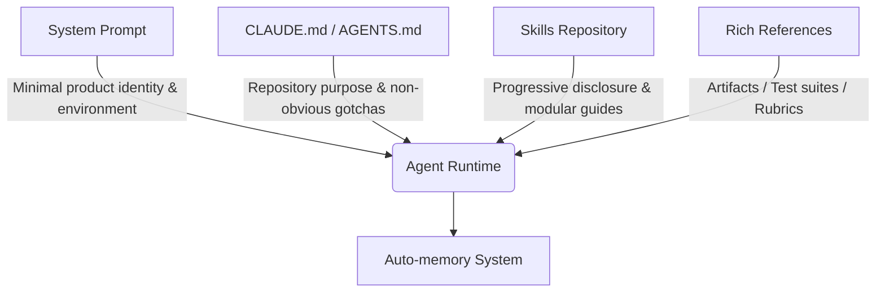

When building AI agents or working with AI coding assistants, developers naturally spend significant effort tweaking user prompts. However, when sending a request to Claude, the user prompt represents only a fraction of the total context. The system prompt, Skills, `CLAUDE.md` project guides, and persistent memory assemble most of what the model sees. We call this discipline **[Context Engineering](https://www.anthropic.com/engineering/effective-context-engineering-for-ai-agents)**, and it directly shapes agent accuracy, execution speed, and token efficiency.

Unlike task-specific user prompts, context operates across many requests and cannot be overly specific. As underlying AI model capabilities advance rapidly, context engineering rules are undergoing a fundamental shift. Thariq Shihipar, a technical staff member at Anthropic, recently revealed that for frontier models like Claude Opus 5 and Claude Fable 5, Anthropic **removed over 80% of Claude Code's system prompt** with zero measurable loss on internal coding evaluation benchmarks.

This article unpacks Anthropic's engineering takeaways from building Claude Code, providing actionable guidance for architects and developers rightsizing context engineering for modern frontier models.

> **Huahua's take**
>
> Progressive disclosure is the linchpin for AI agents scaling to long-horizon tasks. Context engineering has evolved from "cramming everything into system prompts" to building a dynamic harness with deferred tool loading, rich artifact references, and autonomous memory.

## Unhobbling Claude: Why Overconstraining Modern Models Fails

With earlier, less capable models, developers relied on defensive rules in system prompts or `CLAUDE.md` files to prevent worst-case outcomes (such as deleting files or generating bloated docstrings). For example, older versions of Claude Code's system prompt included strict constraints like:

> *"In code: default to writing no comments. Never write multi-paragraph docstrings or multi-line comment blocks — one short line max. Don't create planning, decision, or analysis documents unless the user asks for them — work from conversation context, not intermediate files."*

While these guardrails prevented edge-case misbehaviors in older models, they created subtle friction in modern engineering workflows. Reviewing **Internal Benchmark Data**: Removing 80% of lengthy explanations and few-shot examples from System Prompts **increased task completion rates by 14% while reducing context token consumption by 62%**.

## 1. Why Prune Your Prompts?

Reviewing internal user transcripts revealed conflicting instructions within a single request: system prompts demanded "no comments," while user prompts asked to "add appropriate documentation," or an activated Skill specified team doc standards.

Faced with overlapping, contradictory instructions, Claude had to expend extra reasoning tokens parsing conflicting rules before determining the optimal path forward.

As Claude 5 generation models gained superior context comprehension and stylistic adaptability, Anthropic found that deleting these rigid constraints—effectively *unhobbling* the model—yielded better results. Instead of micro-managing formatting, the updated system prompt trusts the model's judgment:

> *"Write code that reads like the surrounding code: match its comment density, naming, and idiom."*

## The Six Rules of Context Engineering: Then vs. Now

Anthropic categorizes the shift in context engineering into six core principles:

| Domain | Then (Legacy Best Practice) | Now (Claude 5 Generation) |
| :--- | :--- | :--- |
| **Behavior Rules** | Enforce rigid micro-rules (Give rules) | Trust model judgment and surrounding context (Let Claude use judgement) |
| **Tool Usage** | Provide explicit XML/JSON call examples (Give examples) | Design expressive tool interfaces and parameter types (Design interfaces) |
| **Context Loading** | Preload all instructions upfront (Put it all upfront) | Use progressive disclosure and deferred loading (Use progressive disclosure) |
| **Instruction Clarity**| Repeat rules across prompts & tools (Repeat yourself) | Keep instructions concise in tool descriptions (Simple tool descriptions) |
| **Project Memory** | Manually update `CLAUDE.md` memory files (Memory in CLAUDE.md) | Utilize autonomous persistent memory (Auto-memory) |
| **Specifications** | Rely on plain Markdown plan texts (Simple specs) | Provide dynamic Artifacts, code suites & Rubrics (Rich references) |

### 1. Give Rules → Let Claude Use Judgement
Rigid constraints meant for older models impair flexibility. Modern models excel at style transfer and context matching. Providing high-level direction enables the model to adapt code style, docstrings, and intermediate file creation to the user's codebase naturally.

### 2. Give Examples → Design Interfaces
Providing exhaustive tool call examples was once considered essential. However, fixed examples can restrict a model's exploration space. Modern best practices prioritize clear **interface design**. For instance, defining a Todo tool's status parameter as an enumeration (`pending`, `in_progress`, `completed`) gives the model unambiguous semantic boundaries without needing rigid prompt examples.

### 3. Put It All Upfront → Progressive Disclosure
Loading complete code review guidelines or verification steps upfront pollutes context windows. Modern agents leverage **progressive disclosure**:
- **Deferred Loading**: Tools remain unrendered until discovered dynamically via `ToolSearch`.
- **Dynamic Skill Trees**: Modular guides (`SKILL.md`) are loaded on demand based on conversation state.

### 4. Repeat Yourself → Simple Tool Descriptions
Legacy prompts frequently repeated tool instructions in both system prompts and tool schemas to prevent forgetting. Modern models maintain context integrity effortlessly. Instructions belong in tool descriptions rather than system prompts, eliminating redundant token overhead.

### 5. Manual Memory → Auto-memory
Relying on manual hotkeys (`#`) to log context into `CLAUDE.md` creates maintenance overhead. Claude Code now leverages **Auto-memory**, automatically identifying, capturing, and recalling persistent project context across user sessions.

### 6. Simple Specs → Rich References
Beyond plain text plans, Claude 5 models ingest richer reference structures:
- **HTML Artifacts**: Interactive UI mockups provide higher-fidelity guidance for front-end code generation than plain text descriptions or static screenshots.
- **Test Suites & Sourced Repositories**: Providing complete test suites or reference implementations enables precise code porting and verification.
- **Dynamic Verification Rubrics**: Structuring explicit taste and quality criteria (Rubrics) empowers dedicated verifier agents to audit outputs during dynamic workflows.

> **Huahua's engineering note**
>
> As model reasoning jumps to the Claude 5 generation, overconstrained and conflicting system prompts (such as blanket bans on docstrings) increase context overhead and trigger redundant reasoning. Developers should use `claude doctor` to rightsize `.claude` and `CLAUDE.md`, offloading specialized rules into dynamically loaded Skills.

## Structuring Your Agent Context Stack

Applying Anthropic's updated paradigm results in a clean, tiered context architecture:

1. **System Prompt**: Keep it minimal and strictly tied to product identity and execution bounds. Avoid adding general programming rules.
2. **`CLAUDE.md` / `AGENTS.md`**: Keep it lightweight. State repository goals and **non-obvious gotchas** (e.g., "monolithic type file location"). Omit obvious conventions visible from the file tree.
3. **Skills**: Modularize team practices, domain knowledge, and specialized workflows. Split large skills into tree-structured files loaded as needed.
4. **References**: Use `@` mentions for specs, HTML mockups, test suites, and evaluation rubrics to give the model precise grounding.

## Rightsizing Your Agent Context with `claude doctor`

If your codebase has accumulated extensive prompt rules, complex `CLAUDE.md` files, or bloated skill definitions, simplification is essential. Anthropic introduced `claude doctor` (accessed via `/doctor` in Claude Code), a built-in command that audits `.claude` configurations, Skills, and `CLAUDE.md` files for overconstraining rules, duplicate instructions, and candidate areas for progressive disclosure.

By simplifying context, trusting model reasoning, and architecting progressive disclosure harnesses, engineering teams can build faster, more cost-effective, and highly reliable AI agents.

## Primary Sources and Further Reading

- Source Article: [Anthropic Blog: The new rules of context engineering for Claude 5 generation models](https://claude.com/blog/the-new-rules-of-context-engineering-for-claude-5-generation-models) (By Thariq Shihipar)
- Field Guide: [A Field Guide to Claude Fable: Finding Your Unknowns](https://claude.com/blog/a-field-guide-to-claude-fable-finding-your-unknowns)
- Architectural Guide: [Anthropic Engineering: Effective Context Engineering for AI Agents](https://www.anthropic.com/engineering/effective-context-engineering-for-ai-agents)
- Related Bloss0m Guide: [AI Agent Complete Architecture Guide](/en/blog/64-ai-agent-guide/)
- Related Bloss0m Guide: [Entering the Agent Era: Four Foundations of Cursor, Claude Code, and Codex](/en/blog/29-agent-era-skills-subagents-commands-hooks/)
- Related Bloss0m Guide: [Anthropic Research: Agentic Coding and Returns to Expertise](/en/blog/26-anthropic-agentic-coding-expertise/)
- Related Bloss0m Guide: [Ignorance AI Harness Playbook: AGENTS.md vs CLAUDE.md](/en/blog/20-ignorance-ai-harness-playbook/)
