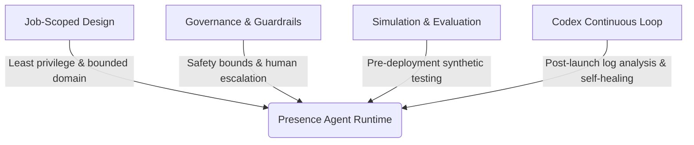

On July 22, 2026, OpenAI officially announced **[OpenAI Presence](https://openai.com/index/introducing-openai-presence/)**, a managed enterprise platform designed to build, deploy, operate, and govern AI agents for high-stakes business workflows. Rather than serving as a self-service DIY chatbot builder, Presence is engineered specifically for mission-critical enterprise environments such as customer support, claims processing, HR inquiries, and IT service desks.

As enterprise AI transitions from simple chat interfaces to autonomous agent execution, organizations face formidable challenges around **reliability, safety compliance, and operational boundaries**. The launch of OpenAI Presence marks a strategic milestone for OpenAI, expanding from a foundation model provider into an end-to-end managed platform providing safety guardrails, simulation testing, and expert co-deployment.

This article unpacks what OpenAI Presence is, examines its four core architectural pillars, and explores what this managed agent governance model means for enterprise AI engineering.

> **Huahua's take**
>
> OpenAI Presence signals the evolution of enterprise AI from unstructured chat boxes to managed, high-stakes workflow governance. Enterprises don't need omnipotent agents; they need job-scoped, policy-governed AI teammates backed by simulation testing and Codex-driven continuous optimization.

## 1. What Is OpenAI Presence? Product Positioning & Dogfooding

**OpenAI Presence** is a managed enterprise platform built to deploy trusted voice and chat agents for both customer-facing and internal business operations. The platform enables real-time voice and text interactions that integrate securely with enterprise backend APIs.

To prove the platform's reliability in high-stakes environments, OpenAI dogfooded Presence for its own operations: launching **AI Phone Support** for English-speaking users. The agent handles real-time voice queries regarding ChatGPT and OpenAI product services, demonstrating production-grade reliability under high concurrency.

Presence is offered through a **Limited General Availability (Limited GA)** program. Rather than an unassisted SaaS self-serve model, deployments are co-engineered alongside OpenAI Forward Deployed Engineers (FDEs) and global systems integration partners to guarantee operational compliance.

## 2. Four Core Architectural Pillars

OpenAI Presence manages high-risk enterprise workflows through four foundational architectural pillars:

### 1. Job-Scoped Design
Presence rejects the concept of omnipotent, open-ended chatbots. Each Presence agent is built for a bounded, specific task (e.g., resolving billing disputes or managing employee insurance claims). Agents receive only the minimum API credentials and domain knowledge required for that role, preventing unauthorized actions or goal drift.

### 2. Governance, Guardrails, and Human Escalation
Administrators configure agent autonomy levels through a central control panel. High-sensitivity actions (such as issuing refunds or sending external emails) can require explicit human-in-the-loop approvals. If an agent encounters ambiguous customer requests or policy boundaries, it seamlessly escalates the session context to human support representatives.

### 3. Pre-Deployment Simulation and Automated Evaluation
Before deploying to production, Presence provides a synthetic simulation engine. Organizations test agents against thousands of edge cases and adversarial scenarios, automatically evaluating policy compliance, accuracy, and safety against enterprise-grade benchmarks.

### 4. Codex-Driven Post-Launch Continuous Loop
In traditional agent architectures, resolving edge-case failures requires engineers to manually inspect logs and write code fixes. Presence incorporates an automated optimization loop powered by **OpenAI Codex**:

- The platform monitors production transcripts and human escalation sessions.
- Codex analyzes policy friction and knowledge gaps, generating proposed prompt and code updates.
- Human engineering teams review and test the updates in a sandbox environment before approving one-click production deployment.

> **Huahua's engineering note**
>
> When building production agent architectures, avoid granting broad, open-ended system permissions. Follow Presence's design principles: restrict permissions to a job-scoped boundary, implement asynchronous human approval checkpoints, and establish pre-deployment edge-case simulation suites.

## 3. Key Takeaways for Enterprise AI Engineering

The launch of OpenAI Presence establishes new standards for enterprise AI deployments:

1. **Shift from Model Capability to Governance**: Frontier models are already capable; enterprise focus has shifted to operational safety, policy compliance, and deterministic execution.
2. **Co-Deployment Models Are Becoming Standard**: Deploying high-stakes agents requires specialized Forward Deployed Engineering (FDE) support and systems integration.
3. **Continuous Self-Healing Loops Are Essential**: Production agent platforms must integrate pre-launch simulation testing with post-launch Codex optimization loops to adapt as business policies evolve.

## Conclusion

OpenAI Presence represents a mature blueprint for enterprise AI agent governance. By combining job-scoped boundaries, governance guardrails, simulation testing, and Codex-driven continuous optimization, Presence lays a solid foundation for deploying AI agents in high-value, high-stakes business environments.

## Primary Sources and Further Reading

- Official Announcement: [OpenAI: Introducing OpenAI Presence](https://openai.com/index/introducing-openai-presence/)
- Related Bloss0m Guide: [Enterprise AI Agent Governance Framework](/en/blog/39-enterprise-agentic-ai-governance/)
- Related Bloss0m Guide: [OpenAI GPT-5.6 Prompting Guidance](/en/blog/72-openai-gpt-5-6-prompting-rules/)
- Related Bloss0m Guide: [The New Rules of Context Engineering for Claude 5 Models](/en/blog/71-context-engineering-claude-5/)
- Related Bloss0m Guide: [AI Agent Complete Architecture Guide](/en/blog/64-ai-agent-guide/)
