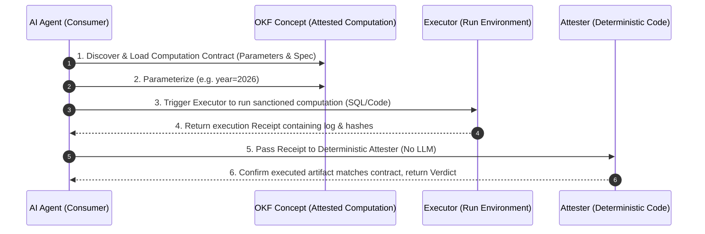

Following Google Cloud's official release of the [Open Knowledge Format (OKF) v0.1](/en/blog/24-open-knowledge-format/) in June 2026, this Markdown-plus-YAML standard—built on the philosophy of being "simple enough to read with `cat` and ship with `git clone`"—quickly captured the attention of the AI infrastructure community.

However, as enterprises began deploying autonomous agents to continuously write, read, and maintain knowledge bases at scale, a critical question emerged: **"When the vast majority of content in a knowledge base is generated by AI agents, why should consumer agents (or humans) trust it? And how can we confirm that numerical figures were computed using the sanctioned, policy-approved logic?"**

Quietly in the background, the Google Cloud team pushed a major specification update to their official GitHub repository ([GoogleCloudPlatform/knowledge-catalog](https://github.com/GoogleCloudPlatform/knowledge-catalog/blob/main/okf/SPEC.md)): **OKF Specification v0.2**.

This is far more than a routine minor patch. It represents a fundamental architectural upgrade that elevates **Provenance, Trust, Lifecycle,** and **Attested Computation** into first-class citizens. This article provides a comprehensive deep dive into the core differences between OKF v0.2 and v0.1, alongside its enterprise implementation value.

> **Huahua in one sentence**
>
> Meow~ In v0.1, OKF helped agents keep data organized; now in v0.2, it attaches ID cards, expiration dates, and mathematical verification stamps to every piece of knowledge! Agents never have to worry about reading stale or hallucinated data again! 🐾
>
> **Huahua's engineering note**
>
> When upgrading to v0.2, pay special attention to migrating `timestamp` and `# Citations`. By incorporating `Attested Computation` alongside deterministic attesters, you can completely eliminate model hallucinations in financial and critical metric computations within RAG workflows.

## 1. Core Motivation: When Knowledge Bases Are Continuously Maintained by AI

In the v0.1 era, OKF solved the problem of breaking down data silos across database schemas, metric definitions, and operational runbooks using clean Markdown structures.

In v0.2, the design team articulated a profound realization: **Modern knowledge corpuses are no longer authored once for humans to read; they are continuously written and maintained by agents.** When most concepts are machine-generated, a consumer agent must ask five essential questions:

1. **Provenance**: What raw materials or data sources was this created from?
2. **Trust**: How much confidence should I place in this knowledge?
3. **Freshness**: Is this information still true today?
4. **Lifecycle**: Is this the current active version, or a deprecated draft?
5. **Attestation**: Was this figure produced using the exact logic we mandated?

OKF v0.2 makes these five dimensions first-class without prescribing heavy runtime SDKs or central schema registries.

## 2. Breaking Changes: Migrating from v0.1 to v0.2

OKF v0.2 remains broadly backward-compatible, but introduces two intentional **breaking changes** to enforce semantic rigor:

| Aspect | OKF v0.1 Legacy | OKF v0.2 Specification | Rationale & Benefit |
| :--- | :--- | :--- | :--- |
| **Timestamps & Actors** | Simple YAML string `timestamp: '2026-05-28'` | Structured `generated: { by: ..., at: ... }` | Explicitly separates "who created it (Actor)" from "when," enabling audit compliance. |
| **Citations & Sources** | Freeform text under `# Citations` in the body | First-class `sources` YAML frontmatter family | Enables agents to extract provenance and credibility signals without parsing markdown body text. |

### Code Comparison

#### v0.1 Legacy Format:
```markdown
---
type: Metric
title: Income Statement
timestamp: '2026-05-28T22:53:05Z'
---

# Definition
Income statement reports revenue.

# Citations
- https://wiki.acme/finance/revenue-recognition
```

#### v0.2 Modern Format:
```markdown
---
type: Metric
title: Income Statement
status: stable
generated: { by: reference_agent/gemini-2.5-pro, at: 2026-06-20T22:53:05Z }
verified: { by: human:ahormati, at: 2026-06-25T09:00:00Z }
stale_after: 2026-12-31
sources:
  - id: rev-policy
    resource: https://wiki.acme/finance/revenue-recognition
    title: Revenue recognition policy
    author: team:finance-fpa
    last_modified: 2026-04-02
---

# Definition
Income statement reports revenue, computed by [revenue computation](https://github.com/GoogleCloudPlatform/knowledge-catalog).
```

## 3. Additive Innovations: The Four Core Frontmatter Families

OKF v0.2 introduces several optional frontmatter families to dramatically improve agent retrieval quality:

### 3.1 Provenance & "Credibility Signals"

Inside the `sources` array, OKF v0.2 records objective credibility signals rather than subjective "trust scores":
* `author`: Follows the Actor convention (`human:<id>`, `<producer>/<version>`, `process:<id>`).
* `usage_count`: The number of times the resource was exercised (dashboard views, query executions) within `usage_window`.
* `last_modified`: When the underlying source itself last changed (`YYYY-MM-DD`), distinct from document creation (`generated.at`).

> **Design Philosophy**: OKF does not hardcode a subjective "85/100 credibility score" into documents, as scores are unportable and go stale. Instead, OKF records objective liveness and authority signals, leaving credibility *inference* to the consumer agent.

### 3.2 Trust Tiers & Lifecycle Controls

* `verified`: Maps human or model review events: `verified: { by: "human:ahormati", at: "2026-06-25" }`.
* `status`: Declares lifecycle state (`draft`, `stable`, `deprecated`).
* `stale_after`: Sets expiration dates (e.g. `2026-12-31`). When `today >= stale_after`, consumer agents issue warnings or decline to rely on the concept.

## 4. Key Breakthrough: Attested Computation

This is the most impressive architectural innovation in OKF v0.2. To solve the problem of LLMs hallucinating SQL queries, financial numbers, or statistical calculations, v0.2 introduces the concept type `type: Attested Computation`.



### Why Distinguish `verified` from `attestation`?

The whitepaper establishes a clear boundary between the two:
1. **`verified` (Definition Verification)**: Confirms that the *definition and formula* still match company policy. This is doc-level, slow, and recorded in the bundle.
2. **`Attestation` (Run Verification)**: Confirms that a *single execution run* produced the displayed figure using the sanctioned formula. This is per-call, runtime-based, and **not stored in the bundle**.

This separation establishes a zero-trust architecture where AI agents can only supply typed parameters, preventing them from modifying underlying queries or calculations.

## 5. Takeaways for Enterprise AI Infrastructure

The evolution from OKF v0.1 to v0.2 reflects Google Cloud's field-tested lessons in scaling Enterprise AI Agents:

1. **From Text Retrieval to Contract Retrieval**: Next-generation RAG shifts from searching plain text snippets to retrieving "computation contracts" backed by explicit parameters, runtime constraints, and deterministic attesters.
2. **Ultra-lightweight Architecture**: Eliminates the need for monolithic metadata servers, achieving cross-system knowledge synchronization using plain Git-versioned `.md` files.

If you are designing agentic RAG or enterprise knowledge infrastructure for your organization, OKF v0.2 is an open standard well worth adopting today.

### Further Reading & Related Resources

If you want to delve deeper into system architecture and context management in the AI era, check out our related guides:
* [Google Cloud OKF v0.1 Open Standard Analysis](/en/blog/24-open-knowledge-format/)
* [Context Engineering Guide for Claude 5](/en/blog/71-context-engineering-claude-5/)

## References & Source Specification

- **OKF v0.2 Official Specification**: Google Cloud Platform. "Open Knowledge Format (OKF) Specification v0.2". GitHub Repository: [https://github.com/GoogleCloudPlatform/knowledge-catalog/blob/main/okf/SPEC.md](https://github.com/GoogleCloudPlatform/knowledge-catalog/blob/main/okf/SPEC.md)
- **OKF Project Repository**: Google Cloud Platform. "Knowledge Catalog". [https://github.com/GoogleCloudPlatform/knowledge-catalog](https://github.com/GoogleCloudPlatform/knowledge-catalog)
