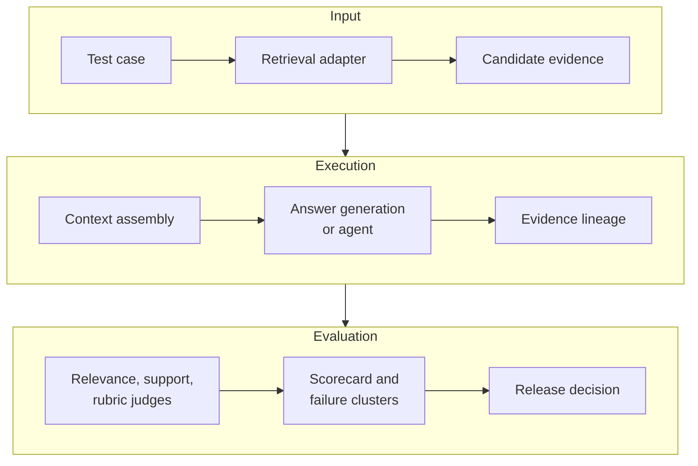

The [entry article](/en/blog/84-trec-rag-2026-agent-first-evaluation/) explained why TREC RAG 2026 is worth watching: it separates Retrieval from Retrieval-Augmented Generation and connects relevance, nuggets, citation support, and metrics through RAGDoll. This article takes the next step and answers a more practical question: if an enterprise team wants a similar evaluation harness, what should it preserve, what should it measure, how should it trace an agent, and how should it decide whether the system is ready for production?

The evidence boundary matters. The [official TREC RAG 2026 page](https://trec-rag.github.io/) defines the two 2026 tasks, the ClimbMix-400b corpus, the timeline, and the tool entry points. The [RAGDoll](https://github.com/castorini/RAGDoll) README exposes interfaces for prompt materialization, UMBRELA-style relevance judging, Nuggetizer, citation support, and metrics. The data model, scorecard, and production gates below are Bloss0m engineering recommendations, not an official enterprise standard or a prediction of the 2026 results. As of August 9, 2026, the official page still lists results and judgments as TBD.

> **Huahua's take**
>
> Mature RAG evaluation does not compress everything into one score; every score should lead back through evidence lineage to a concrete retrieval, reading, generation, and judgment event.

## Think of the harness as a data pipeline

Many teams begin with a batch script: read questions, call a RAG API, send answers to an LLM judge, and write a CSV. That is fast but fragile. When the index, prompt, model, or agent tool changes, the team cannot tell what caused a score movement. When one answer fails, it cannot reconstruct what the model actually saw.

A stronger abstraction is a versioned data pipeline:



Every stage should have explicit inputs, outputs, and failure states. This does not require a heavy workflow engine. It does require that intermediate data not live only in memory, console logs, or a one-off notebook.

## 1. Data model: define what counts as one evaluation

### A test case is more than a question string

A minimal test case can contain `case_id`, `narrative`, `language`, and `expected_answer`. Enterprise cases also need evidence and governance constraints. The following is a conceptual schema, not an official TREC format:

```json
{
  "case_id": "policy-expiry-017",
  "narrative": "What happens when the customer policy expires?",
  "required_evidence": ["policy-v3-expiry"],
  "allowed_sources": ["policy-store"],
  "forbidden_sources": ["draft-policy-store"],
  "expected_nuggets": [
    {"id": "expiry-window", "importance": "vital"},
    {"id": "renewal-action", "importance": "important"}
  ],
  "answer_policy": "abstain-if-no-authoritative-source",
  "risk_class": "high"
}
```

The key is not the field names. It is separating “what the answer should cite” from “what it must not cite.” With only an expected answer and no required evidence, you cannot tell whether a model used an authoritative source or happened to produce a plausible answer from a neighboring, disallowed source.

### A Retrieval run must preserve the candidate set

A Retrieval run should preserve at least:

- `run_id`, `case_id`, query, and query rewrite;
- retriever, reranker, index snapshot, and filter version;
- every candidate’s `document_id`, `passage_id`, rank, score, and source metadata;
- how many candidates were removed by ACL, freshness, or source policy;
- retrieval latency, errors, timeouts, and retries.

Keeping only the first result destroys diagnosis. If the correct document is ranked 17th and the answer receives only top five, the problem is ranking or cutoff. If it never enters the candidate set, the problem is ingestion, query, or indexing. The fixes are different.

### An answer run must preserve sentence-to-citation relationships

RAGDoll’s support assessment starts from answer rows: an answer contains sentences with citation references, and those references map to document IDs. The [official RAGDoll examples](https://github.com/castorini/RAGDoll) then show resolving references to passage text before running support judgments.

An enterprise harness should preserve a similar structure:

```json
{
  "case_id": "policy-expiry-017",
  "run_id": "rag-hybrid-agent-v3",
  "references": ["policy-v3-expiry"],
  "answer": [
    {
      "sentence_id": 0,
      "text": "The policy enters the renewal window 30 days before expiry.",
      "citations": [0]
    }
  ],
  "trace_id": "trace-8f2a"
}
```

Sentence-level structure is more useful than a list of five sources under the whole answer. It lets the harness map each claim to one or more passages and test full, partial, or no support. A product UI may not display sentence-level citations, but the evaluation layer should not discard the relationship.

### A judgment record should keep raw and parsed results

A judge output should not be only `score: 0.82`. Preserve at least:

- judge name, model, prompt version, and sampling settings;
- input answer, citation passage, nugget, or rubric;
- raw response, parsed label, parser status, and error reason;
- human-review flag and adjudication result;
- judgment timestamp and evaluation-code version.

Raw output helps diagnose parser bugs and lets the team change aggregation formulas without paying for another judge run. RAGDoll’s separation between raw events, parsed judgments, support assignments, and metrics illustrates why the final aggregate should not be the only artifact.

## 2. Execution pipeline: freeze inputs, then produce artifacts by stage

### Step 0: Create a run manifest

One `run_id` should identify the entire experiment:

```json
{
  "run_id": "rag-2026-08-09-hybrid-agent-v3",
  "corpus_snapshot": "internal-docs-2026-08-01",
  "topic_set": "enterprise-rag-eval-v2",
  "retriever": "hybrid-bm25-vector@4.1",
  "reranker": "reranker@2026-07",
  "parser": "document-parser@2.8",
  "agent_skill_version": "search-read-answer@3.2.1",
  "model": "model-version-pinned",
  "judge": "support-judge@1.4",
  "metrics_version": "scorecard@2"
}
```

The manifest gathers settings that otherwise hide in environment variables, prompt files, container images, notebooks, and manual commands. Any output-affecting change should create a new run ID. Do not overwrite an old result directory for convenience.

### Step 1: Run Retrieval-only first

The Retrieval-only run answers whether required evidence enters the candidate set. It can be lexical, vector, hybrid, or agentic, but the first experiment should keep the query set, corpus, index, and top-k fixed while changing one variable at a time.

Preserve:

1. The original narrative and query sent to the retriever.
2. Query rewrites, filters, tenant scope, and time conditions.
3. The complete candidate list, not only the context sent to the model.
4. Each candidate’s rank, score, source version, and evidence eligibility.
5. Timeouts, empty results, permission denials, and fallbacks.

If Retrieval-only cannot find the required evidence, do not start by tuning the prompt. A generation model cannot recover a document it never saw.

### Step 2: Treat context assembly as its own stage

Context assembly is a frequently ignored layer. It handles deduplication, passage ordering, token budget, source priority, version conflicts, and citation indexing. It should emit a storable context manifest:

```json
{
  "case_id": "policy-expiry-017",
  "context_id": "ctx-42",
  "selected_passages": [
    {
      "passage_id": "policy-v3-expiry#p12",
      "position": 0,
      "tokens": 148,
      "source_version": "v3",
      "citation_index": 0
    }
  ],
  "removed_duplicates": 2,
  "truncated_passages": 0,
  "token_budget": 4096
}
```

Without this manifest, a weaker answer could come from a worse reranker or from the context assembler cutting away the strongest passage.

### Step 3: Generate the answer and preserve every agent step

For single-pass RAG, preserving final context and the model response solves part of the problem. Agentic RAG also needs every tool call. A minimal trace event might look like this:

```json
{
  "trace_id": "trace-8f2a",
  "step": 3,
  "state": "read-evidence",
  "tool": "search_documents",
  "input": {"query": "policy expiry renewal window"},
  "output": {"document_ids": ["policy-v3-expiry"]},
  "latency_ms": 182,
  "tokens": {"input": 740, "output": 96},
  "stop_reason": null
}
```

At minimum, distinguish `plan`, `search`, `read`, `verify`, `compose`, `abstain`, `error`, and `finish` states. Each state needs entry and exit conditions; otherwise “the agent decided it was done” becomes an opaque failure mode.

### Step 4: Resolve references before support judgment

RAGDoll’s public flow resolves document IDs in the answer to passages a judge can read, then judges each sentence-citation pair. Conceptually:

```text
answer rows
  -> resolve references
  -> resolved answer with segments
  -> sentence/citation judge
  -> parsed judgments
  -> support assignments
  -> topic/run metrics
```

The README defines Full Support, Partial Support, No Support, and missing, failed, or unparseable states. The ordering matters. If the judge reads the entire corpus, it may use information the answer did not cite. If it reads only a citation label, it cannot test whether the sentence expands the passage’s scope. The judge’s input boundary must be fixed.

### Step 5: Produce metrics and failure clusters

Before aggregation, preserve topic-level rows. Do not output only a run average: averages hide high-risk failures. Ninety-five percent of low-risk questions can be correct while five percent of high-risk cases leak data across tenants; a global average must not wash that away.

Each case should be classifiable as:

- retrieval miss;
- ranking or filter failure;
- context truncation or duplication;
- missing nugget;
- unsupported claim;
- citation mismatch;
- stale or conflicting source;
- abstention failure;
- tool timeout or retry loop;
- judge parse or artifact failure.

These labels connect evaluation to repairs in indexing, prompts, policies, tool runtime, and evaluation code.

## 3. Metrics: one score must not stand in for the system

### Retrieval metrics: is the candidate set sufficient?

Common retrieval metrics include Recall@k, Precision@k, MRR, and nDCG. They answer different questions:

- **Recall@k:** How much required evidence appears in top-k? Useful for coverage.
- **Precision@k:** How much of top-k is relevant? Useful for noise and token waste.
- **MRR:** How early does the first relevant result appear? Useful when an authoritative source should be found quickly.
- **nDCG:** Are graded relevance and ranking sensible? Useful when relevance is not binary.

These numbers do not directly equal answer quality. Retrieval recall can be high while context budget, source priority, or generation policy still creates errors. Add an evidence-sufficiency layer: for each case, mark whether vital evidence reached final context, not merely the original candidate set.

### Nugget metrics: which required information is covered?

A nugget is a smaller unit than a complete answer. For each nugget, record `support`, `partial_support`, `missing`, and importance. This distinguishes a minor omitted background detail from a missing vital condition that changes the decision.

If a model generates the nuggets, preserve the generation prompt, model version, and human samples. Automatic gold generation is not free truth; it is another judge stage that needs calibration. RAGDoll’s separate Nuggetizer create, agentic-create, assign, and metrics steps are useful precisely because they keep that process inspectable.

### Citation support: do sentences and sources actually match?

Citation coverage asks whether sentences that should cite evidence contain a citation. That is not enough. A useful support score checks:

1. whether the citation points to the correct document and version;
2. whether the passage contains the required fact;
3. whether the answer adds unsupported causal, temporal, or scope claims;
4. whether the sentence needs multiple sources for full support;
5. whether the source is inside the answerer’s authorization scope.

Report citation coverage, full-support rate, partial-support rate, no-support rate, and reference-resolution failure rate separately. Do not silently turn partial support into full support, and do not turn an unresolvable citation into an unexplained zero.

### Answer quality and abstention

Correctness, completeness, fluency, and helpfulness are useful answer-level dimensions. High-risk enterprise systems also need abstention quality:

- Does the system abstain when no authoritative evidence exists?
- Does it name a conflict instead of choosing the most fluent version?
- Does it avoid using adjacent but unauthorized source material?
- Does it route cases requiring approval to a review queue?

A system that stops correctly when it lacks evidence can be more suitable for enterprise use than one that always produces a complete-sounding answer. Abstention is not better when it is frequent; it is valuable when it matches evidence and policy conditions.

### Safety and operations

Offline benchmarks do not automatically cover enterprise security and operations. Build separate checks:

| Dimension | Question to measure | Typical failure |
| --- | --- | --- |
| Authorization | Do retrieval, cache, and citation pages honor identity scope? | cross-tenant leakage |
| Freshness | How quickly do withdrawn or expired documents stop affecting answers? | stale policy citation |
| Prompt injection | Are document instructions treated as data rather than control messages? | retrieval-to-tool hijack |
| Latency | Can P50/P95 meet the interactive SLO? | agent retry tail |
| Cost | What do model, embedding, rerank, tool, and judge stages cost? | quality gain below cost |
| Reliability | Can timeouts, rate limits, and partial outages recover? | empty answer or loop |

These should enter release review with answer quality, not after a production incident.

## 4. How to map RAGDoll interfaces into your harness

The [RAGDoll workflow](https://github.com/castorini/RAGDoll) is a reference implementation, not a product that every team must copy. Its public interfaces can be understood as follows.

### `materialize`: freeze what the judge sees

RAGDoll can materialize UMBRELA, nugget, and other prompt-task JSONL inputs so a team can inspect system prompts, instructions, queries, and candidates before execution. An enterprise harness should also create an immutable task manifest before calling models. Prompt changes must not silently mix into the same result set.

### UMBRELA-style judging: separate relevance from the answer

The input is a query plus candidates, and the output is relevance judgments. Put this at the retrieval stage to evaluate candidate quality before generation. It remains judge-based measurement, so sample it against human labels for domain terminology, negation, and temporal conditions.

### Nuggetizer: turn long answers into a scorable rubric

The Nuggetizer path turns answer requirements into information units, then assigns those units to submitted answers and computes metrics. For long research summaries, policy comparisons, or multi-step procedures, this is easier to diagnose than asking a judge to rate the whole answer at once.

### Support: resolve citations into sentence-level evidence

Support assessment resolves references and judges a sentence against its citation. The same pattern applies to enterprise systems: a citation is not only a URL; it should resolve to a controlled document version, passage, and authorization check.

### Arena comparison: compare only compatible inputs

RAGDoll’s pairwise comparison operates on shared qids and records tasks, judgments, and pairwise outputs. When comparing two enterprise RAG runs, use the same cases, source scope, and compatible answer policy. Different test sets, abstention rules, or citation formats make the ranking meaningless.

## 5. Judge calibration: automation does not remove human responsibility

### Freeze the judge contract

The judge prompt should state what passages it can see, whether external knowledge is allowed, how to handle conflicting sources, the boundary between Full, Partial, and No Support, what to return when parsing fails, and the output schema. Prompt version belongs in the manifest, and raw responses should be retained.

### Use stratified human calibration

You do not need to review every row, but sampling must be deliberate:

- sample every risk class;
- sample both high- and low-score tails;
- sample partial support, no support, and parser failures;
- sample languages, source types, document lengths, and agent paths;
- rerun the calibration set after every judge or prompt change.

If model judges agree with humans on easy cases but diverge on policy exceptions or multi-hop cases, a global average hides the problem. Preserve disagreement clusters and turn them into new test cases or rubric updates.

### Keep uncertainty in the result

Judge output is not a natural law. Report sample size, human agreement, unparseable rate, judge version, and unresolved cases. Without this metadata, `0.86 support` looks precise while hiding whether it came from ten cases or one hundred thousand.

> **Huahua's engineering note**
>
> A judge can lower manual cost; it cannot remove manual responsibility. The higher the risk, novelty, and version conflict, the more important it is to retain human calibration and replayable evidence.

## 6. Turn agent traces into a production diagnostic tool

### A trace is more than a token log

For agentic RAG, the most valuable trace fields are decision context, not only token counts:

- current goal and subquestion;
- known evidence, unknown evidence, and claims awaiting verification;
- why the tool or query was selected;
- candidate counts and which results were accepted or rejected;
- query rewrites, retries, fallbacks, and context compaction;
- stop condition, unfinished subgoals, and abstention reason.

This lets the team ask why the agent continued searching and why it trusted an evidence card. A trace with only tool names and latency is not enough to diagnose a bad decision.

### Connect the trace to evidence lineage

Every trace event should link to `case_id`, `run_id`, `context_id`, `passage_id`, and `citation_index`. Then a bad answer can be traced backward:

```text
answer sentence
  -> citation index
  -> passage and source version
  -> context assembly decision
  -> agent read/search event
  -> retrieval candidate and query
  -> corpus and index snapshot
```

This is evidence lineage. It turns “hallucination” into more precise categories: retrieval miss, wrong agent read, lost context, incorrect citation builder, or unsupported generation expansion.

### Set an explicit agent budget

Before an agent enters production, define maximum steps, wall-clock time, tool cost, per-tool timeout, retry limit, duplicate-query suppression, and the stop policy when no authoritative evidence is found. These constraints do not reduce intelligence; they make failure predictable.

## 7. From offline scores to production gates

A practical release gate can have three layers.

### Gate A: Evidence correctness

- required evidence coverage meets its threshold;
- high-risk cases show no unauthorized source;
- citation-resolution failure stays below a defined limit;
- stale and conflicting sources have observable handling;
- retrieval misses and context misses are reported separately.

### Gate B: Answer behavior

- vital-nugget coverage meets its threshold;
- full, partial, and no-support distributions are acceptable;
- unsupported claims and citation mismatches remain within risk tolerance;
- no-answer, conflict, and abstention cases do not pass through as fluent hallucinations.

### Gate C: Operations and safety

- P95 latency meets the interactive SLO;
- model, embedding, rerank, and tool costs stay within budget;
- timeouts, rate limits, and partial outages have fallbacks;
- prompt-injection, ACL-leakage, and cross-tenant tests pass;
- index freshness, deletion sync, and cache scope are monitored.

Do not collapse these into one weighted average before deciding. If a high-risk safety gate fails, a strong answer score should not allow a launch.

## 8. A minimum viable rollout order

If the team currently has only one RAG endpoint, add complexity in this order:

1. Create 50–100 stratified test cases with required evidence, risk class, and acceptable abstention.
2. Preserve complete Retrieval candidates, final context, answer sentences, and citations for the same cases.
3. Build a small human-labeled gold set, then add an LLM judge while retaining raw responses.
4. Separate Retrieval, support, nugget, answer, safety, and operations metrics.
5. Add the run manifest, corpus snapshot, prompt version, and evaluation-code version.
6. Establish lexical, vector, and hybrid baselines, then add one agent capability at a time.
7. Use failure clusters to choose the next engineering investment instead of immediately reaching for a larger model or longer agent trajectory.

In this sequence, agentic RAG is a later experimental variable, not a prerequisite for the harness. If baseline evidence lineage does not exist, adding an agent only makes failures harder to trace.

## When not to use this approach

Not every knowledge task needs a complete Agent-first harness. For low-risk, short answers over one authoritative database, deterministic tests, schema validation, and latency checks may be more appropriate. Adding LLM judges, nugget generation, and multi-step traces creates cost and maintenance surface.

Conversely, evidence lineage and layered metrics are worth the investment when the system produces long answers, combines multiple sources, faces version conflicts, calls tools, crosses sensitive authorization boundaries, or must explain why it answered. The criterion is not that agents are new; it is that a single end-to-end score no longer diagnoses the system’s failures.

## The engineering judgment

The importance of TREC RAG 2026 is not that it supplies one score to copy into an enterprise. It demonstrates how retrieval, evidence construction, grounded answers, citation support, and system comparison can become inspectable workflow stages. RAGDoll makes prompts, raw events, resolved references, support assignments, and metrics concrete, bringing evaluation closer to a versioned data pipeline.

The practical takeaway is to pin corpus, topic set, index, prompt, model, judge, and agent skill, then preserve candidate evidence, final context, sentence-level citations, and full traces. Make release decisions across evidence, answer, safety, and operations. If an agent’s extra steps do not produce measurable improvement in evidence coverage or failure recovery, complexity alone is not intelligence.

Start with [TREC RAG 2026: Why RAG Evaluation Is Adding Agents](/en/blog/84-trec-rag-2026-agent-first-evaluation/). For architecture background, read the [Enterprise RAG guide](/en/blog/65-enterprise-rag-guide/) and the [AI Agent guide](/en/blog/64-ai-agent-guide/). To compare dynamic search and iterative reading, continue with [Agentic RAG: Vector Search Meets Agent Reasoning](/en/blog/07-agentic-rag/).

## Sources

- [TREC RAG 2026 official track page](https://trec-rag.github.io/)
- [RAGDoll evaluation runner, schemas, and workflow](https://github.com/castorini/RAGDoll)
- [TREC RAG 2026 agent skills](https://github.com/TREC-RAG/trec-rag-skills)
