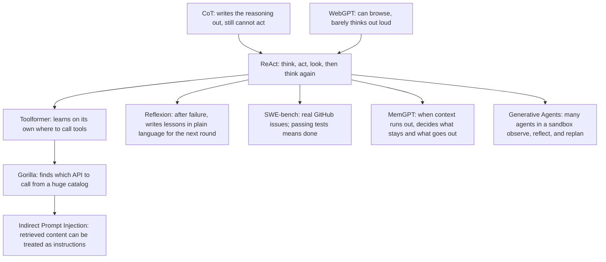

**Bookmark this page.** The [paper-reading hub](/en/paper-reading/) already has three reading paths. If you have just finished the ReAct family, this page shows how the classic papers connect and which note to open next.

This is not a new paper note, and it does not replace the six Paper Essence questions in each linked article. It only answers how the nodes connect, which control point changed, and which link to open next.

> **Huahua in one sentence**
>
> ReAct does not make the model smarter. It combines “only think” and “only act” in one trajectory. Later methods change other parts of the system; they do not erase this original contribution.

> **Huahua's engineering note**
>
> The hub Agent path now starts from these core methods, not OSReward. Keep later leaderboard numbers separate from the 2023/2024 evidence. A few-shot ReAct loop is not an Argus runtime; Toolformer's next-token API is not MidTool; SWE-bench's 1.96% is a protocol result, not a ceiling on model ability.

## Ninety-second mental model

1. **CoT** (Wei et al., 2022) = reason without touching an environment. **WebGPT** (Nakano et al., 2021) = act with little explicit verbal reasoning. **ReAct is the merge**: thought, action, and observation interleave in one trajectory.
2. From ReAct the control point splits: **how tools are learned** (Toolformer), **how experience is written across trials** (Reflexion), **how success is scored on real repos** (SWE-bench), **how a finite context window is paged** (MemGPT).
3. **Gorilla** and **Indirect Prompt Injection** extend the tool and retrieval sequence: after catalog-scale retrieve-and-call, retrieved or tool-returned text shares the instruction channel with the user prompt. **Generative Agents** adds the multi-agent memory branch.
4. The hub [agent-systems path](/en/paper-reading/#reading-paths) follows the same order as this page: read the core methods first, then open 2025–26 work when its question matters. SWE-Bench ProMax's 41.2% and later Letta product metrics do not belong in 2023/2024 tables.
5. Sharing a family name is not the same contract: few-shot ReAct ≠ Argus runtime; Toolformer’s single API insert ≠ MidTool mid-training; SWE-bench 1.96% is a protocol, not a model-ability ceiling.

CoT and WebGPT both have notes on this site; this page only links them into one reading sequence.

## The method map

Papers that already have notes on this site are not labeled separately on the diagram. MemGPT was added later: it decides what stays in or goes out when context runs short, and it was not in the earliest sketch.

## How to walk the map

### Path A · Fastest: ReAct, then one child

1. [ReAct](/en/paper-reading/24-react-interleaved-reasoning-acting/): lock the thought–action–observation contract first.
2. Pick **one** child for the place you are actually stuck: tools → [Toolformer](/en/paper-reading/25-toolformer-self-supervised-api-calls/); across-trial memory → [Reflexion](/en/paper-reading/27-reflexion-verbal-reinforcement/); real-issue evaluation → [SWE-bench](/en/paper-reading/26-swe-bench-github-issue-evaluation/); context paging → [MemGPT](/en/paper-reading/28-memgpt-context-as-memory-paging/).
3. Stop. Read later work only when you need the question it addresses.

### Path B · Full classic sequence: CoT → WebGPT → ReAct → … → Generative Agents

Follow the core-method segment of the hub [agent-systems path](/en/paper-reading/#reading-paths/) in three stages:

1. [CoT](/en/paper-reading/29-chain-of-thought-prompting/) → [WebGPT](/en/paper-reading/30-webgpt-browser-assisted-qa/) → [ReAct](/en/paper-reading/24-react-interleaved-reasoning-acting/)
2. [Toolformer](/en/paper-reading/25-toolformer-self-supervised-api-calls/) → [Gorilla](/en/paper-reading/35-gorilla-llm-connected-with-massive-apis/) → [Indirect Prompt Injection](/en/paper-reading/42-indirect-prompt-injection/)
3. [SWE-bench](/en/paper-reading/26-swe-bench-github-issue-evaluation/) → [Reflexion](/en/paper-reading/27-reflexion-verbal-reinforcement/) → [MemGPT](/en/paper-reading/28-memgpt-context-as-memory-paging/) → [Generative Agents](/en/paper-reading/36-generative-agents-interactive-simulacra/)

Stop after those ten. Open 2025–26 work such as OSReward or Argus only when you need the question it addresses.

### Path C · Pick the next paper from the job

| Where the work is stuck | Start with this paper | Core question it extends |
| --- | --- | --- |
| Teaching tools, or too many schemas | [Gorilla](/en/paper-reading/35-gorilla-llm-connected-with-massive-apis/) → [MidTool](/en/paper-reading/23-midtool-agentic-tool-use/), [RAG-MCP](/en/paper-reading/04-rag-mcp/) | Toolformer → Gorilla: tool use across training, retrieve-and-call, and routing |
| Whether retrieved or tool-returned text shares the instruction channel | [Indirect Prompt Injection](/en/paper-reading/42-indirect-prompt-injection/) → when needed, [AgentS4D](/en/paper-reading/12-agents4d-runtime-risks/), [Trajectory Sentinel](/en/paper-reading/14-agent-trajectory-sentinel/), [A2E](/en/paper-reading/19-a2e-agent-auditing-engine/) | Gorilla → IPI: retrieval and tool returns entering the prompt |
| Remembering after failure, or whether a score gain is retained experience | [ADIAS](/en/paper-reading/20-adias-issue-centric-agent-optimization/), [PAST-Bench](/en/paper-reading/16-past-bench-recursive-self-improvement/) | Reflexion: how experience is written across trials |
| How memory supports planning and social behavior in a multi-agent sandbox | [Generative Agents](/en/paper-reading/36-generative-agents-interactive-simulacra/) vs [MemGPT](/en/paper-reading/28-memgpt-context-as-memory-paging/) | Observe-reflect-plan memory stream ≠ single-agent OS paging |
| Whether large, multilingual refactors still count as success | [SWE-Bench ProMax](/en/paper-reading/22-swe-bench-promax/) | SWE-bench: what counts as coding success |
| Long-horizon runtime, authority, and rollback | [Argus](/en/paper-reading/10-argus-agentic-runtime/) | A ReAct loop is not a deployable control plane |
| The system searched but answered before reading evidence | [Before Reasoning Can Fail](/en/paper-reading/15-before-reasoning-fails/) | ReAct can search; it does not guarantee read-before-final |

## Node table: control point, one sentence, do-not-misread

| Node | Control point changed | One sentence | Link | Do not misread |
| --- | --- | --- | --- | --- |
| CoT | Whether the prompt writes intermediate reasoning | Reason without touching an environment | [Already on this site](/en/paper-reading/29-chain-of-thought-prompting/) | A frozen prompt, not an agent that acts |
| WebGPT | Whether browser actions are used to answer | Act with little explicit verbal reasoning | [Already on this site](/en/paper-reading/30-webgpt-browser-assisted-qa/) | Browsing commands are not ReAct thoughts |
| ReAct | Whether the next move is a sentence to oneself or a touch of the world | Add thought to the action space and interleave with observation | [Already on this site](/en/paper-reading/24-react-interleaved-reasoning-acting/) | A few-shot loop is not an agent runtime |
| Toolformer | Whether a training string should insert one API call | Filter self-supervised tool use with future-token loss | [Already on this site](/en/paper-reading/25-toolformer-self-supervised-api-calls/) | Next-token API ≠ MidTool mid-training |
| Gorilla | How to retrieve and call over a huge API catalog | APIBench + RAT put document retrieval into finetuning and cut hallucination | [Already on this site](/en/paper-reading/35-gorilla-llm-connected-with-massive-apis/) | Core tool-use method; catalog retrieve+call does not establish MCP product behavior and is not MidTool |
| Indirect Prompt Injection | Whether retrieved or tool-returned text shares the instruction channel with the user prompt | Untrusted data enters the prompt via retrieval or tool returns; attackers can control the model indirectly | [Already on this site](/en/paper-reading/42-indirect-prompt-injection/) | 2023 threat-model evidence, not a Guard product SLA |
| Reflexion | Where verbal experience is written after failure | Freeze weights; write verbal feedback into a short buffer; start the next trial | [Already on this site](/en/paper-reading/27-reflexion-verbal-reinforcement/) | Extra retries are not parameter learning |
| SWE-bench | What counts as coding success | A real GitHub issue plus passing tests is resolve | [Already on this site](/en/paper-reading/26-swe-bench-github-issue-evaluation/) | 1.96% is a protocol, not a ceiling |
| MemGPT | Who decides what pages in and out of a finite context | Treat the prompt as RAM and external memory as disk; page with functions | [Already on this site](/en/paper-reading/28-memgpt-context-as-memory-paging/) | Extra node, not in the original sketch; not enterprise ACL memory, and not Letta product metrics |
| Generative Agents | How memory supports planning among many agents in a sandbox | Observations to memory stream, periodic reflection, retrieval-conditioned planning; 25 agents in Smallville | [Already on this site](/en/paper-reading/36-generative-agents-interactive-simulacra/) | Not MemGPT single-agent paging, and not production runtime |
| MidTool | When tool affordances are taught | Move grounding and execution earlier into mid-training | [Already on this site](/en/paper-reading/23-midtool-agentic-tool-use/) | A later method, not Toolformer's loss filter |
| RAG-MCP | How to choose among too many tool schemas | Retrieve candidate schemas, then let the executor call | [Already on this site](/en/paper-reading/04-rag-mcp/) | A later routing method; retrieval is not authorization |
| ADIAS | What indexes repair progress | An issue ledger remembers what was tried and which intervention failed | [Already on this site](/en/paper-reading/20-adias-issue-centric-agent-optimization/) | A leaf; not Reflexion’s short buffer |
| PAST-Bench | Whether a better score came from retained experience | Pair persistence on/off; separate task score from mechanism evidence | [Already on this site](/en/paper-reading/16-past-bench-recursive-self-improvement/) | A leaf; the paper is an evaluation device, not a new memory-algorithm SOTA |
| SWE-Bench ProMax | The denominator for large multilingual refactors | A later evaluation substrate, not “models improved 41 points on the same 2,294 instances” | [Already on this site](/en/paper-reading/22-swe-bench-promax/) | A leaf; 41.2% must not be written back into original SWE-bench tables |
| Before reasoning can fail | Whether a read happens after search and before final | A pre-evidence procedural failure, not a wrong answer after reading gold | [Already on this site](/en/paper-reading/15-before-reasoning-fails/) | A leaf; Read-Gate is not a substitute for retrieval quality |
| Argus | The control plane for long-horizon work | Authority, verifier, rollback—not a longer prompt | [Already on this site](/en/paper-reading/10-argus-agentic-runtime/) | A leaf; a ReAct loop is not this runtime |

## What this page is not

- **It does not replace the six Paper Essence questions.** Each linked note still has to carry: the problem, why the prior approach was insufficient, the core idea, how one input moves through the method, which evidence supports the headline, and where the claim stops. This page only orients.
- **It does not rewrite the spine.** The 2026 CoT and WebGPT notes are now linked in the table and nodes. This page still only orients.
- **The hub agent-systems path now matches this map.** Read the core methods first (CoT → … → Generative Agents), then open 2025–26 work as needed. This remains an orientation guide, not a fourth path type.
- **It does not back-fill later numbers into classics.** Evidence, author claims, and Bloss0m judgment stay in the individual notes.

If the reading method itself is still unfamiliar, pair this map with [Efficient Academic Paper Reading: The Three-Pass Approach](/en/blog/08-efficient-paper-reading-three-pass/). If you want product architecture rather than a paper family, start from the [AI Agent guide](/en/blog/64-ai-agent-guide/).

## How to use this guide

- **Entering from the paper-reading hub:** the three PATHS remain; if you need the ReAct family map, stop here and follow a link.
- **Entering from a classic note:** if the article links to a “reading map,” it means [this page](/en/blog/91-agent-method-foundation-reading-map/).
- **Traditional Chinese edition:** use the language toggle on this page.

## References

- [Paper-reading hub](/en/paper-reading/) (three PATHS; agent-systems path at [#reading-paths](/en/paper-reading/#reading-paths))
- [Wei et al., 2022, Chain-of-Thought Prompting](https://arxiv.org/abs/2201.11903)
- [Nakano et al., 2021, WebGPT](https://arxiv.org/abs/2112.09332)
- Method post on this site: [Three-pass reading](/en/blog/08-efficient-paper-reading-three-pass/)
- A different map (Harness blogs, not this paper family): [How to Read Harness Engineering: Setup and Verification for Long-Running Agents](/en/blog/13-harness-engineering-reading-map/)
