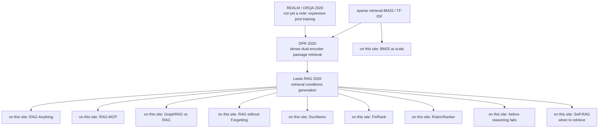

**Bookmark this page.** The [paper-reading hub](/en/paper-reading/) already has three PATHS: foundations, retrieval systems, and agent systems. The second starts at DPR / Lewis RAG and mixes 2025–26 leaves. If you have just finished [DPR](/en/paper-reading/32-dense-passage-retrieval/) and [Lewis RAG](/en/paper-reading/31-retrieval-augmented-generation/), you still need a **spine** that says how those 2020 classics connect to the retrieval notes already on this site. That is this page.

This is not a new paper-reading note, and it does not replace the six Paper Essence questions in each linked article. It only answers how the nodes connect, which control point changed, and which link to open next. The sibling orientation page is the [Agent foundations reading map](/en/blog/91-agent-method-foundation-reading-map/) (Agent vs Retrieval).

> **Huahua in one sentence**
>
> DPR changes how passages are found. Lewis RAG changes how generation uses what was found. The later leaves still grow from those two seams; they do not unpick the 2020 spine and start over.

> **Huahua's engineering note**
>
> Do not mix the two tables, and do not write later leaderboards back into 2020. DPR’s NQ top-20 78.4 is not RAG-Seq’s 44.5. BM25-at-scale is about corpus size, not the 2020 ODQA protocol.

## Ninety-second mental model

1. **Sparse first-stage retrieval** (BM25 / TF-IDF) is the default DPR has to beat. The on-site note [BM25 at scale](/en/paper-reading/13-bm25-wins-at-scale/) is a **leaf**: it is about accuracy–cost curves as corpora grow, not the 2020 open-domain QA protocol.
2. **DPR** (Karpukhin et al., 2020) changes the first stage to a dense dual encoder (NQ top-20 78.4 vs BM25 59.1; extractive Exact Match 41.5). **Lewis RAG** (Lewis et al., 2020) changes generation to condition on retrieved Wikipedia passages $z$ (NQ RAG-Seq Exact Match 44.5). Do not mix those two tables.
3. The 2025–26 notes on this site are **leaves**: multimodal, tool routing, graphs, memory write-back, evidence discovery, financial hard negatives, set-wise rerank, read-before-final. They inherit a control point; their numbers must not be back-filled into 2020 tables.
4. **2020 RAG is not a production RAG platform and not an agent loop.** It has no enterprise ACL, hybrid stack, citation-product contract, or search / read / final agent cycle.

REALM / ORQA are expensive joint-training ancestors and still lack 2026-format notes on this site—this page links arXiv only. Self-RAG’s when-to-retrieve control point now has a deep read: [Self-RAG](/en/paper-reading/33-self-rag-retrieve-generate-critique/).

## The spine

In the diagram, “on this site” is the English for the author’s sketch label. The body reads it as “already given a deep read here.” REALM / ORQA remain not-yet-note ancestors; Self-RAG is now linked to an on-site deep read for when-to-retrieve.

## How to walk the map

### Path A · Fastest: DPR, then Lewis RAG

1. [DPR](/en/paper-reading/32-dense-passage-retrieval/): lock the dense dual-encoder contract that replaces sparse first-stage retrieval.
2. [Lewis RAG](/en/paper-reading/31-retrieval-augmented-generation/): see how retrieved $z$ conditions generation (RAG-Sequence / RAG-Token).
3. Stop. Read a leaf only when you need that control point.

### Path B · Full classic spine: sparse opponent → DPR → RAG, with REALM / ORQA as boundary

Establish who DPR has to beat: the [sparse BM25 opponent inside the DPR note](/en/paper-reading/32-dense-passage-retrieval/) → [DPR](/en/paper-reading/32-dense-passage-retrieval/) → [Lewis RAG](/en/paper-reading/31-retrieval-augmented-generation/). Treat REALM / ORQA only as expensive joint-training ancestors: [REALM arXiv:2002.08909](https://arxiv.org/abs/2002.08909) and [ORQA arXiv:1911.03868](https://arxiv.org/abs/1911.03868). Do not expect 2026-format notes for them on this site. This path builds the method foundation. It does not replace the hub’s [retrieval-systems path](/en/paper-reading/#reading-paths), which still starts at DPR / RAG and then mixes multimodal, tool, graph, and runtime leaves.

### Path C · Pick a leaf from the job

| Where the work is stuck | Start with this leaf | Control point it inherits |
| --- | --- | --- |
| Growing corpora, hybrid / scale cost | [BM25 at scale](/en/paper-reading/13-bm25-wins-at-scale/) | Sparse accuracy–cost at scale, not the 2020 ODQA protocol |
| PDFs, figures, multimodal documents | [RAG-Anything](/en/paper-reading/03-rag-anything/) | Retrieval targets become referable multimodal nodes, not text-only passages |
| Too many tool schemas; retrieve then call | [RAG-MCP](/en/paper-reading/04-rag-mcp/) | Retrieval used for tool-description routing, not authorization |
| Whether a knowledge graph is worth it | [GraphRAG vs RAG](/en/paper-reading/07-graphrag-vs-rag/) | Whether graph indexing is a necessary upgrade for this problem class |
| Whether successful expansions can write back | [RAG without Forgetting](/en/paper-reading/05-rag-without-forgetting/) | Memory write-back behind a correctness gate |
| Evidence needs dynamic discovery, not one top-$k$ | [DocMemo](/en/paper-reading/21-docmemo-dynamic-evidence-discovery/) | The evidence-discovery process |
| Finance / hard negatives, evidence grounding | [FinRank](/en/paper-reading/18-finrank-evidence-grounded-rag/) | Ranking and hard negatives |
| Set-wise rerank for deep research | [RubricRanker](/en/paper-reading/17-rubric-ranker-deep-research/) | The reranking contract |
| The system searched but answered before reading evidence | [Before Reasoning Can Fail](/en/paper-reading/15-before-reasoning-fails/) | Read-before-final; Read-Gate is not a substitute for retrieval quality |
| Whether the model should decide when to retrieve | [Self-RAG](/en/paper-reading/33-self-rag-retrieve-generate-critique/) | when-to-retrieve; reflection tokens, not Read-Gate |

## Node table: control point, one sentence, do-not-misread

| Node | Control point changed | One sentence | Link | Do not misread |
| --- | --- | --- | --- | --- |
| Sparse BM25 / TF-IDF | Whether the first stage is lexical inverted index | The default sparse retrieval DPR must beat | See [contrast inside the DPR note](/en/paper-reading/32-dense-passage-retrieval/) | Opponent baseline, not the on-site BM25-at-scale leaf |
| REALM / ORQA | Whether retrieval and the LM need expensive joint training | Expensive 2020-lineage ancestors; DPR argues you need not take that path | [REALM](https://arxiv.org/abs/2002.08909), [ORQA](https://arxiv.org/abs/1911.03868) | Ancestors; not yet notes on this site |
| DPR | Whether the first stage becomes a dense dual encoder | Two BERTs, dot-product MIPS; NQ top-20 78.4 vs 59.1; extractive EM 41.5 | [Already on this site](/en/paper-reading/32-dense-passage-retrieval/) | The retrieval table is not Lewis RAG’s generation table |
| Lewis RAG | Whether generation conditions on retrieved $z$ | BART plus a DPR-initialized retriever; NQ RAG-Seq 44.5 | [Already on this site](/en/paper-reading/31-retrieval-augmented-generation/) | 2020 method paper ≠ production RAG platform ≠ agent loop |
| BM25 at scale | How accuracy–cost bends as corpora grow | A large-corpus sparse / agent-cost leaf | [Already on this site](/en/paper-reading/13-bm25-wins-at-scale/) | A leaf; not the 2020 ODQA protocol |
| RAG-Anything | Whether document nodes keep multimodal structure | Tables / figures / formulas stay referable; not caption-only | [Already on this site](/en/paper-reading/03-rag-anything/) | A leaf; numbers are not written back into 2020 |
| RAG-MCP | How to choose among too many tool schemas | Retrieve candidate schemas, then let the executor call | [Already on this site](/en/paper-reading/04-rag-mcp/) | A leaf; retrieval is not authorization |
| GraphRAG vs RAG | Whether multi-hop / structural work needs a graph | Systematic comparison of graph vs vector adoption boundaries | [Already on this site](/en/paper-reading/07-graphrag-vs-rag/) | A leaf; not a drop-in replacement for Lewis RAG |
| RAG without Forgetting | Where successful expansions are written back | Index adaptation behind a correctness gate | [Already on this site](/en/paper-reading/05-rag-without-forgetting/) | A leaf; write-back is not unconditional memory |
| DocMemo | Whether evidence is fetched once or discovered dynamically | Dynamic evidence discovery, not a fixed top-$k$ | [Already on this site](/en/paper-reading/21-docmemo-dynamic-evidence-discovery/) | A leaf; not xMemory (that is agent memory) |
| FinRank | How evidence is ranked under financial hard negatives | An evidence-grounded ranking leaf | [Already on this site](/en/paper-reading/18-finrank-evidence-grounded-rag/) | A leaf; numbers are not written back into 2020 |
| RubricRanker | How deep research does set-wise rerank | Set-wise reranking with rubrics | [Already on this site](/en/paper-reading/17-rubric-ranker-deep-research/) | A leaf; not first-stage retrieval |
| Before reasoning can fail | Whether a read happens after search and before final | A pre-evidence procedural failure, not a wrong answer after reading gold | [Already on this site](/en/paper-reading/15-before-reasoning-fails/) | A leaf; Read-Gate is not a substitute for retrieval quality |
| Self-RAG | Whether / when to call retrieval | Self-reflection decides retrieve / critique | [Already on this site](/en/paper-reading/33-self-rag-retrieve-generate-critique/) | when-to-retrieve; not Read-Gate and not a production RAG gate |

## What this page is not

- **It does not replace the six Paper Essence questions.** Each linked note still has to carry: the problem, why the prior approach was insufficient, the core idea, how one input moves through the method, which evidence supports the headline, and where the claim stops. This page only orients.
- **It does not invent REALM / ORQA notes.** Those ancestor nodes stay arXiv-only. Self-RAG now has an [on-site deep read](/en/paper-reading/33-self-rag-retrieve-generate-critique/); this page only orients and does not rewrite the six Paper Essence questions.
- **It does not rewrite the hub’s retrieval-systems path.** That path still starts at DPR / RAG and mixes multimodal, tool, graph, and runtime leaves. This page is the method-foundation spine, not a fourth path type.
- **It does not back-fill later numbers into classics, and it does not mix the DPR and Lewis RAG tables.** Evidence, author claims, and Bloss0m judgment stay in the individual notes.
- **It does not force xMemory or AskChem onto this spine.** xMemory is agent memory; AskChem is claim-centered synthesis and is not a first-class ancestor or leaf on this map.

If the reading method itself is still unfamiliar, pair this map with [Efficient Academic Paper Reading: The Three-Pass Approach](/en/blog/08-efficient-paper-reading-three-pass/). If you want product architecture rather than a paper family, start from the [Enterprise RAG guide](/en/blog/65-enterprise-rag-guide/). For the Agent-family sibling map, see the [Agent foundations reading map](/en/blog/91-agent-method-foundation-reading-map/).

## How to use this guide

- **Entering from the paper-reading hub:** the three PATHS remain; if you need the DPR / Lewis RAG spine onto the leaves, stop here and follow a link. Retrieval-systems path: [#reading-paths](/en/paper-reading/#reading-paths).
- **Entering from a classic note:** if the article links to a “reading map,” it means [this page](/en/blog/92-rag-method-foundation-reading-map/).
- **Traditional Chinese edition:** use the language toggle on this page.

## References

- [Paper-reading hub](/en/paper-reading/) (three PATHS; retrieval-systems path at [#reading-paths](/en/paper-reading/#reading-paths))
- [Karpukhin et al., 2020, Dense Passage Retrieval](https://arxiv.org/abs/2004.04906)
- [Lewis et al., 2020, Retrieval-Augmented Generation](https://arxiv.org/abs/2005.11401)
- [Guu et al., 2020, REALM](https://arxiv.org/abs/2002.08909)
- [Lee et al., 2019, ORQA](https://arxiv.org/abs/1911.03868)
- [Asai et al., 2023, Self-RAG](https://arxiv.org/abs/2310.11511)
- Method post on this site: [Three-pass reading](/en/blog/08-efficient-paper-reading-three-pass/)
- Sibling orientation page (Agent family): [Agent foundations reading map](/en/blog/91-agent-method-foundation-reading-map/)
- A different map (Harness blogs, not this paper family): [Harness Engineering Guide](/en/blog/13-harness-engineering-reading-map/)
