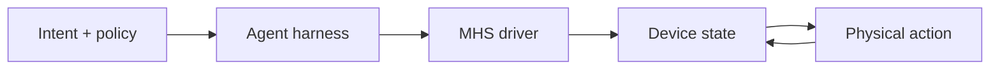

When an AI agent moves from files, databases, and APIs to microscopes, liquid handlers, robotic arms, or the laser systems inside a quantum computer, the first problem is usually not whether the model can reason. It is that every device has a different interface, state format, and operating vocabulary. Anthropic’s **[Model Hardware Standard (MHS) research preview](https://www.anthropic.com/news/model-hardware-standard-research-preview)**, announced on August 27, 2026, tries to converge that layer into a common shape through which an agent can discover, read, write, and orchestrate physical devices.

The conclusion up front: MHS is best understood as an **MCP-shaped interface for the physical world**, addressing adapters, discoverability, and orchestration. It is not a complete hardware-safety standard, and it does not make a model a trusted controller. Public materials still describe MHS as a limited, application-based research preview; the final specification and open-source release are not yet available.

> **Huahua in one sentence**
>
> MHS gives an agent a common language for seeing and operating different devices, but the platform still owns who may act, when it must stop, and how failures are contained.

## Put standardization at the right layer

Think of MHS as one layer in a hardware-control stack, not a product that absorbs every risk:

| Layer | Question | What the MHS preview currently addresses |
| --- | --- | --- |
| Device adapter | How can different vendors’ devices be called by one software layer? | A standardized driver between the operating system and device-specific interfaces |
| Capability and state | How does an agent know what a device measures, adjusts, and limits? | Discoverability, read/write primitives, device characteristics, and a reference file for limits |
| Agent access path | How does an agent harness send requests and coordinate devices? | Three control paths: MCP, command line interface, and code files (APIs) |
| Platform governance | Who has permission, what requires approval, and how are failures isolated? | Public material says safety evaluations and best practices are still being developed; a complete authorization model is not public |
| Physical and business safety | Is this action safe for the sample, machine, environment, or product? | Still requires device controls, operators, domain procedures, and platform policy |

This separation matters. Reading “safety limits” as “authorization, approval, and incident response are solved” would confuse an interface contract with a security boundary.

## What does MHS actually standardize?

### 1. A driver that hides vendor differences

Anthropic describes the MHS driver as a layer between a computer’s operating system and a physical device. It translates each vendor’s programming interface into a common control shape. The first benefit is integration: a research team does not need one new Agent connector for every liquid handler, robotic arm, and plate reader before putting them into the same workflow.

That does not mean any piece of hardware can be plugged in and used. MHS currently targets **devices with a programmable interface**. Equipment without one still needs a driver from its manufacturer or integrator. The driver must also translate commands correctly, handle disconnects, and report real state; otherwise a common interface only makes different errors look consistent.

### 2. A small vocabulary for observing and changing state

The public description uses `read`—for example, reading a temperature—and `write`—for example, setting a temperature—as simple primitives. A shared vocabulary lets an agent reuse the pattern “read state, change a parameter, read the result” across devices, without learning every vendor command language.

But `write` means “request a state change,” not “approve a safe action.” Execution still needs range checks, current-state checks, sample conditions, mutual exclusion, operator identity, and approval rules. For a robotic arm, a valid coordinate is not automatically a safe motion. For a liquid handler, a valid flow rate does not mean that the sample will avoid bubbles or contamination.

### 3. Make hardware knowledge discoverable

MHS also emphasizes device-characteristic tags. Facts such as a robot arm’s weight, what a device can measure or adjust, and which safety limits are enforced may previously have lived in paper manuals, one engineer’s computer, or tacit team knowledge. Public materials say users can add this context in natural language; the driver can then produce a reference file describing device capabilities and limits.

That is valuable **context packaging**, not automatic proof of physical truth. Tags can be stale, wrong, incomplete, or silent about a constraint that appears only when two devices operate together. A platform should record provenance, version, reviewer, and scope; it should not treat a complete-looking description as a verified interlock.

### 4. Give different agent paths the same device surface

Anthropic says MHS can control hardware through MCP, a CLI, and code files (APIs), and is model-agnostic so different agent harnesses can connect. “MCP-shaped” does not mean MHS is MCP: MCP is an open protocol between AI applications and external servers; MHS combines hardware drivers, device descriptions, and control primitives for physical equipment. MCP can be one of its transport or integration paths.

A reasonable architecture therefore looks like this:

The `Intent + policy` and `Agent harness` boxes do not disappear when MHS is added. They own goals, rules, stop conditions, and human handoffs. The MHS driver makes devices consistently readable and writable; the device-control layer must still reject commands outside its capabilities or safety envelope.

## What do the early examples actually show?

### Genentech: a BCA assay proof of concept across three instruments

The Anthropic and Genentech case uses a liquid handler, robotic arm, and microplate reader to run a BCA protein assay. Claude uses MHS to read the three devices, transfer liquid, move a plate, read absorbance, and adjust flow based on results. That demonstrates how a common interface can let an agent enter a **cross-device closed loop**.

The same case exposes the physical failure boundary that MHS does not remove. Viscous protein samples can form bubbles at high flow rates, causing inaccurate transfer volumes, liquid-level detection errors, and distorted optical readings. Claude initially tended to retry in the same well. Researchers had to explain that the failure was physical and required moving to a clean well and reducing mixing cycles. A driver can report an error and an agent can replan, but deciding how much the sample has been affected still requires domain knowledge and operational policy.

### HHMI Janelia: turning seven vendor programs into one rig

Janelia’s microscopy case describes a rig assembled from seven vendor programs with no shared interface. MHS put the rig’s state into a shared, standardized dictionary, allowing an agent to choose imaging regions and analysis steps at decision points while researchers monitored the data. The case also says MHS device-level safety limits can prevent an agent from accidentally using excessive laser power.

The publicly inspectable [Gently microscopy repository](https://github.com/gently-project/gently) is an adjacent implementation linked from Anthropic’s article, not the MHS specification itself. Its layers—process isolation, device limits, restricted plan vocabulary, and error cleanup—show why physical agents usually need a **safety stack**, not a single protocol property.

### QuEra: 99.3% is a bounded test result, not a general guarantee

In the QuEra case, an agent read instruments, adjusted laser controls, and repeatedly tested induced disturbances overnight. Anthropic reports that the resulting deterministic, inspectable script recovered the correct lock in 695 of 700 randomized trials, or 99.3%; the final script could run without an agent in the loop.

That number is useful only with its boundary attached. It is a result for one laser-lock-recovery task, a defined disturbance set, and a particular test environment. It supports the claim that an agent can turn exploration into a replayable control program; it does not support a claim that MHS delivers 99.3% safety or reliability for arbitrary hardware. The mature artifact in the example is a deterministic script, not an always-online model directly driving the laser.

> **Huahua's engineering note**
>
> A strong division of labor for physical agents is to let the model explore, form hypotheses, and choose decision points, then compile verified loops into inspectable, testable, stoppable deterministic workflows.

## Which safety and permission duties remain with the platform?

In this research preview, official material discusses drivers, device descriptions, device-level safety limits, and safety evaluations that are still being developed. It does not publish a complete identity, RBAC, token, approval, or audit schema that an outside team can adopt directly. Therefore, a platform must not treat MHS discoverability as authorization.

At minimum, keep these duties outside MHS and enforce them with deterministic components:

1. **Identity and delegation:** establish which user, workload, and tenant is acting for whom; do not trust a model’s self-described role.
2. **Least privilege and action policy:** separate reads, reversible bounded writes, and irreversible or high-energy actions; bind authorization to device, sample, environment, and time.
3. **Human approval and step-up control:** high laser power, robot motion, sample disposal, external output, or production-state changes should show a human the actual parameters and impact—not merely a natural-language summary.
4. **Independent interlocks and limits:** platform policy, driver limits, and the hardware emergency stop should be independent layers; hardware must still reach a safe state when the agent misbehaves.
5. **Concurrency, leases, and idempotency:** prevent two agents from writing one device at once; long jobs need leases, timeouts, cancellation, retries, and request identity that avoids duplicate side effects.
6. **Trace, evidence, and version governance:** record what the model saw, which driver description version was used, the policy decision, actual parameters, device responses, and human intervention so a run can be replayed and investigated.
7. **Recovery and the kill switch:** define which errors are retryable, which require a new sample or engineer, when to quarantine a device, and how to stop a multi-device workflow.

These controls do not diminish MHS. They put it in the right place: MHS supplies a common action surface that a policy engine can inspect; the platform decides who may use that surface and under which conditions.

## Failure boundary: who owns the error?

Four questions help assign responsibility:

| Failure boundary | Example failure | Owner |
| --- | --- | --- |
| Interface and connectivity | Malformed command, bad translation, device disconnect | Driver or device service; return clear, classifiable errors |
| Hardware and physical process | Bubbles, drift, overheating, collision, sample contamination | Device interlocks, sensors, domain experts, and safety procedures |
| Agent reasoning and orchestration | Wrong tool, misunderstood state, infinite retry, unsafe composition | Harness policy, step/cost limits, human handoff, and trace |
| Platform and operations | Overreach, cross-tenant access, leaked credentials, races, unrecoverable incident | Control plane, IAM, audit, tenant isolation, on-call, and runbooks |

This is why “MHS can recover from hardware errors” needs careful reading. It means that in some examples an agent can use observations to choose a recovery action; it does not mean every hardware failure can be safely repaired in software. Anthropic’s own Genentech case says the model needed human help to recognize bubbles as a physical failure.

## Where is the evidence—and where is it not?

As of September 9, 2026, the public state is best summarized in two columns:

| Evidence we have | Not yet established or not public |
| --- | --- |
| Started by Anthropic and HHMI Janelia, with partners across science, robotics, electronics, and manufacturing | A generally available specification, version governance, and interoperability test suite |
| Limited, application-based research preview intended to build safety evaluations and best practices before open-sourcing | A public, complete protocol for auth, approval, audit, revocation, and incident response |
| Targets devices with programmable interfaces and can be reached through MCP, CLI, and APIs | Hardware without a programming interface remains out of scope; broad cross-vendor and cross-domain interoperability is not established |
| Early proof of concepts at Genentech, Janelia, and QuEra; QuEra reports 99.3% on a specific 700-trial recovery test | General safety, reliability, cost, or performance benchmarks; no evidence that arbitrary agents can operate unattended |

The official [MHS website](https://www.modelhardwarestandard.com/) still describes the project as a limited research preview with application-based access. That status is part of the adoption decision, not a footnote: teams can study the interface shape and safety architecture now, but should not treat MHS as a finished industry standard or production certification.

## A practical adoption sequence for platform and hardware teams

If a team wants to experiment with an MHS-like interface, make the first milestone **observable read-only integration**, not autonomous control of an entire experiment:

1. Inventory each device’s capabilities, units, state, preconditions, limits, errors, and safe-stop behavior.
2. Use drivers and reference files to align semantics, while adding provenance, version, reviewer, and expiry to every description.
3. Start with read-only, shadow, and simulated modes to test discovery, state freshness, denied permissions, and cross-device traces.
4. Add only narrow, reversible, bounded writes; every high-risk action goes through an independent policy engine and human approval.
5. Move long, frequent, verified loops out of online reasoning into deterministic scripts, and regression-test them against the same disturbance set.
6. Exercise timeout, disconnect, retry, credential revocation, interlocks, and the kill switch—not only the happy-path demo.

This sequence follows the core principle in Bloss0m’s [complete AI Agent guide](/en/blog/64-ai-agent-guide/): let agents handle decisions whose paths genuinely cannot be specified in advance, while predictable and heavily audited work remains deterministic. For the value and limits of a shared agent interface, continue with [MCP as the interface between models and tools](/en/blog/34-model-context-protocol-mcp/); “standard interface does not equal safe authorization” applies to MHS as well.

In an enterprise setting, connect the responsibility model to the [Enterprise Agentic AI governance guide](/en/blog/39-enterprise-agentic-ai-governance/) and the execution envelope in [Enterprise AI Agent security architecture](/en/blog/43-enterprise-ai-agent-security/): the model can propose the next step, but a control plane outside the model decides whether it is allowed, needs a human, and leaves enough evidence.

> **Huahua's take**
>
> MHS’s long-term value is not the claim that AI already understands hardware; it is the chance to make hardware capabilities, state, and limits reusable, evaluable, and governable across agent harnesses.

## Primary sources and further reading

- [Anthropic: Previewing the Model Hardware Standard](https://www.anthropic.com/news/model-hardware-standard-research-preview) — the research preview, drivers, primitives, early examples, and limitations.
- [Official Model Hardware Standard website](https://www.modelhardwarestandard.com/) — preview access and the project’s pre-open-source status.
- [Gently: Agentic harness for microscopy](https://github.com/gently-project/gently) — the public adjacent implementation linked from Anthropic’s article; useful for examining process isolation, device limits, plan constraints, and cleanup without treating it as the MHS specification.
- [Model Context Protocol: Architecture](https://modelcontextprotocol.io/specification/2025-06-18/architecture) — MCP host, client, server, and capability boundaries.
- [Anthropic: Introducing the Model Context Protocol](https://www.anthropic.com/news/model-context-protocol) — the original announcement of MCP as an open standard for connecting AI applications to external systems.
