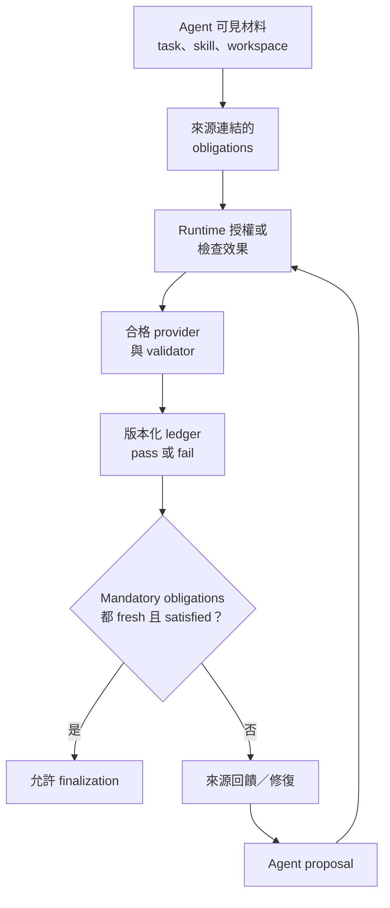

## 90 秒地圖 / The paper in 90 seconds

- **問題**：Agent 能理解指示，卻可能在工具操作與產物上漏做要求；它也可能在狀態尚未達標時自行回報完成。當同一個 agent 同時提出行動、解讀結果、判定要求已滿足並宣告結束，規格只是上下文，並沒有獨立的驗收權威。
- **核心洞見**：讓 agent 保有規劃與提出方案的自主性，但把規格所定義狀態的寫入權交給外部 runtime。SpecHarness 把可執行、可驗證的要求轉為有來源的 obligations；合格 evidence provider 驗證效果後，runtime 才能提交版本化狀態並准許 finalization。
- **最強證據**：在 SkillsBench 的 87 個 tasks、509 項 source-grounded task directions 與七個 task-agent 模型上，completion claim 比 official evaluator pass 高 28.7–37.9 個百分點；SpecHarness 的 macro pass 為 73.1%，Raw 為 61.1%（Table 1）。
- **主要邊界**：509 項是從可見材料抽出的方向索引，不是完整重建自然語言規格或官方 verifier 語義。主要提升比較的是包含線上驗證、回饋與修復的完整架構，不能單獨歸因為 authoritative sign-off 的效果（Sections 4、Appendices A、C、D）。

本文依據 [arXiv:2609.29921v1](https://arxiv.org/abs/2609.29921)，提交日期為 2026-09-24；目前來源只確認為 arXiv preprint，不能據此稱為同行評審論文。論證的焦點是：完成一項任務的權力，應由「提出完成的 agent」還是「規格要求與可採信證據」決定？作者先量出理解與執行、宣告與驗收之間的差距，再提出一套把操作控制、效果驗證與狀態提交接在一起的 runtime。這個研究支持在可觀測條件上建立外部驗收權威；它沒有證明只加入一個 commit primitive 就能得到同樣的分數提升。

## 既有方法的限制：檢查答案不等於治理狀態

很多 agent 系統把任務描述、操作規範、輸出 schema 和 reusable skills 放進模型上下文，然後要求模型依它們採取行動。常見的補強方法有三種，但各自只控制流程的一部分（Introduction、Related Work、Figure 2）。

**事後驗證**在產物或軌跡完成後檢查它們。它可以指出哪裡不符合規格，但違規操作已經發生，驗證結果通常只是診斷資訊。**完成閘門**在 agent 說「完成」之後、任務被接受之前跑 verifier；它能拒絕未通過的完成聲明，卻不一定限制前面的執行與中間狀態。**Runtime enforcement**在執行期間攔截或約束動作，但若只做政策判斷，不一定持有經過獨立證據確認的任務狀態。作者認為缺少的是同一條鏈：規格既能約束指定執行面，也能決定哪些證據有權建立可接受狀態。

這不是說前述做法無效，也不是論文宣稱自己發明了 reference monitor、runtime verification 或 transaction commit。SpecHarness 借用這些既有思想，將其組合成面向 agent 規格的權威邊界：誰可以提案、哪些 action 可被中介、誰能產生驗證證據，以及什麼狀態足以准許結束（Section 2；Conclusion）。

## 核心直覺：把 proposal、evidence 和 accepted state 分開

可以先用三個不同名詞理解論文的概念模型。

1. **Proposal 是意圖，不是事實。** Agent 可以規劃、選工具、產生檔案、修復失敗，也可以請求完成；這些都只是候選動作或判斷，不能直接把 obligation 標成已滿足。
2. **Evidence 是具來源與範圍的觀測。** Runtime 必須知道 evidence 由哪個 provider、validator、channel 和版本產生，並確認它對應哪個義務。工具輸出字串、agent 自述或來源不明的觀察不會自動成為權威證據。
3. **Commit 是 runtime 對權威狀態的更新。** 可接受證據可以提交 pass 或 fail；fail 是可追溯的不滿足狀態，不等於 obligation 已滿足。當依賴版本改變，舊 evidence 會變 stale 或 unknown，必須重新驗證。

這三者分開後，兩種 gap 才能被分別觀察。**Understanding–execution gap（U–E）** 衡量可見、可測方向中有多少在執行時沒有被實現；它不直接測量模型腦中的「理解」。**State–authority gap（S–A）** 衡量 runtime 接受、但官方 evaluator 判定未通過的 runs 比例；Raw 條件的 agent claim 不設閘門，因此 S–A 對應其 pass 失敗比例。它也不是所有情境下通用的 calibration score（Section 4.3）。

作者以 obligation IR 保存任務中不同處置的材料：`hard` 是可阻擋特定轉移或完成的 mandatory obligation；`advisory` 是不阻擋的指引；`abstain` 記錄編譯器因歧義或無法建立可靠驗證而不下判斷；`residual` 保留未被納入義務的上下文。**Task direction**是測量與來源追溯用的可見要求索引；**obligation**才是 runtime 可執行的狀態條件。兩者不保證一對一：多個方向可共同落在一個 obligation，advisory 或 abstained 方向也不會自動成為 blocking rule（Section 3.2、Equation 3）。

*Bloss0m 原創流程圖，依 Section 3 的機制整理，並非原論文 Figure 4 重製。原圖可由 [論文 Figure 4](https://arxiv.org/html/2609.29921#S3.F4) 查閱；本文不重用該圖像。*

## 用 data-to-d3 任務走一遍 runtime

論文附錄提供一個 SkillsBench 的 data-to-d3 execution trace。這是由實際可見任務材料實例化並稽核的 protocol replay，不是宣稱某段完整自然生成的 agent 逐字軌跡。它能具體展示權威邊界如何工作（Appendix E.2、Table 25）。

1. **編譯規格**：任務要求產生可由瀏覽器開啟的 `/root/output/index.html`，並包含 `js/d3.v6.min.js`、`js/visualization.js`、`css/style.css` 及複製的輸入資料。可見的 D3 skill 另要求離線且 deterministic 地使用相依套件。Runtime 保留每條要求來自 task 或 skill 的來源。
2. **分派處置**：路徑與必要檔案等明確條件可以轉成 mandatory obligation；若某一要求語意模糊、不可觀測或沒有合格 validator，就留在 advisory、abstain 或 residual，不因編譯出一句文字便升格為硬性門檻。
3. **提出並授權 action**：Agent 提出建立檔案、載入資料或執行程式的 action proposal。Runtime 將它正規化並對照 obligation。只有 action surface 通過 closure audit、可控制的路徑才可用 mediate-and-commit；其他可安全隔離且事後可觀測的管道採 validate-and-commit。未受支援或存在繞道風險的通道不能假裝已被預先攔截。
4. **觀察效果並驗證**：受信任 observer 將實際檔案與執行狀態交給綁定 validator。Validator 檢查相對於來源要求的效果，而非相信 agent 說它已建立成功。只有 provider、channel、validator 身分、scope、結果類型與依賴版本都符合協定，結果才是 admissible evidence。
5. **提交與修復**：Runtime 原子地記錄 obligation 的 passed 或 failed、依賴 digest 與 provenance。失敗可以提供來源連結的回饋，Agent 再提 repair；修復後要拿到新的 admissible evidence 才能更新狀態。
6. **檢查 freshness 並結束**：若檔案、輸入、validator、環境或上游義務的版本變更，舊 commitment 不能支撐完成。只有所有 active mandatory obligations 都有 fresh 且 satisfied 的 evidence，finalization request 才能被准許。

這個流程的重點不只是「多跑一次檢查」。它把錯誤狀態與通過狀態都放進可稽核歷史，避免把 tool 回傳成功、模型信心或舊版 artifact 的驗證結果，錯當成目前狀態已符合要求。其保證範圍仍只涵蓋有來源、可觀察、mandatory 且驗證器合格的義務，不涵蓋整份自然語言規格的所有含義（Section 3、Appendix B）。

## 技術機制：從可見材料到有版本的狀態

SpecHarness 的輸入是 agent 可見 context：task prompt、適用 guidelines、注入的 skills，以及可觀察 workspace 和 schemas。Held-out official verifiers 與 oracle solutions 被排除在這個輸入之外，只在執行後做評估。這個區分是避免 runtime 偷用測試答案的重要設計條件（Sections 3.1–3.2、Appendix A）。

**第一步：抽取和凍結。** 作者以開發集上的人工標註比較七個 candidate language-model compilers，依預先指定的 development coverage 選出 GPT-5.6 Sol，之後凍結其指示、輸出 schema 與建構程序。509 項 SkillsBench directions 就是該 frozen compiler 從 87 tasks 的可見 task prompt、workspace 與 injected skills 中抽出的共同測量表面。事後將它們與 held-out official test functions 對齊，是 coverage/alignment audit，並非將 evaluator 邏輯灌回 runtime，也不等於完整恢復官方測試語義（Appendix A.1–A.2）。

**第二步：把方向建成 obligation。** 每個 obligation 連結來源、action matching/authorization、執行與驗證條件、要更新的狀態，以及 dependency 和 enforcement control。只有 mandatory、參數有來源、具授權 evidence provider 且 validator 通過 blocking qualification 的要求，才能成為 hard obligation。其他情況要 advisory、abstain 或留在 residual。Machine-checkable 不等同合格可阻擋：validator 還必須在可信邊界內觀測輸入、採用 deterministic 且來源可追溯的條件，並通過滿足案例、針對性違規、錯誤輸入、provider 不可用與執行失敗等測試（Sections 3.2、Appendix B.1）。

**第三步：對 action surface 設定控制方式。** Mediate-and-commit 是預防性控制：只有 runtime 控制的執行器能派送受管 action；要聲稱 no-bypass，closure audit 必須涵蓋所有可產生等效效果的路徑。若無法證明某 surface 已封閉，論文不把它算成 preventive mediation；可安全隔離且可觀測的效果改用 validate-and-commit，在效果發生後驗證；兩者都做不到的 surface 不列入 hard enforcement。Appendix B.2 將保證限制在已稽核的能力圖與 threat model，不涵蓋未宣告外部通道、受信元件遭入侵、validator 缺陷或不可觀察效果。

**第四步：只由 admissible evidence 更新 ledger。** 每次提交都記錄 validator/provider 身分與版本、dependency versions、evidence provenance 和 commit event。通過的結果可建立 satisfied state；失敗結果可提交目前 non-satisfaction，並觸發修復；error 只留下診斷 trace，不更新權威狀態，也不能讓 mandatory requirement 帶著未知結果被 finalization。提交與事件記錄是 atomic 的（Equations 9–12、Appendix B.1）。

**第五步：版本改變即使狀態失效。** Commitment 綁定建立它時所用的 artifact、input、validator、environment 與相依 obligation 版本。只要 digest 與目前狀態不符，或版本資訊不足，相關記錄就變 stale 或 unknown。歷史記錄仍保留，但不得再作為目前完成的依據；必須重新驗證，必要時修復後再提交（Section 3.5、Appendix B.3）。

這個形式模型也釐清一個常見誤讀：commit 不只記錄成功，而是寫入由證據支持的 authoritative result，可能通過，也可能失敗。Agent 仍然負責解讀工作與提出修復，但它不能直接修改 ledger、注入 validator outcome、把義務標記為 satisfied 或准許 finalization。

## 實驗設計與量測方式

作者在兩個具有不同 state semantics 的 benchmark 上評估這個架構。SkillsBench 有 87 個 tool-use 與 artifact-production tasks，官方 verifier 只在 agent execution 後判定任務通過。GuideBench 有 1,042 個受 guidelines 約束的決策 tasks；整理 301 條 guideline entries、移除四條重複規則後，形成 297 個 obligation templates 與 5,817 個 task-level instances。GuideBench 沒有 closure-audited physical action surface，因此所有硬性義務都採 validate-and-commit（Sections 4.1、Appendices C、E）。

七個 task agents 是 GPT-5.6 Sol、Claude Fable 5、Gemini 3.1 Pro、Kimi K3、GLM-5.2、Qwen3.7-Max 與 DeepSeek-V4-Pro。SkillsBench 的 Raw 與 SpecHarness 共用 OpenHands substrate、初始 workspace、模型、工具存取與名義 budget；GuideBench 各配對也固定相同輸入與模型設定。名義 token、call 與 timeout ceilings 相同，不代表實際 calls、tokens、repair steps 或 wall-clock time 相同。官方 verifier 與答案標籤不提供 obligation 建構、runtime feedback 或 repair（Appendix C.1–C.2）。

主要指標是官方 pass rate。U–E 是 frozen direction/obligation surface 上未被執行證據支持的比率；S–A 是被某 condition 接受、但官方 evaluator 判定失敗的 run 比率。Raw 所有有效 run 都接受 agent 的未設閘門 claim，所以 Raw S–A 等於 1 減 Raw pass。論文另外報 Raw-pass preservation，讓讀者能看出降低 unsupported acceptance 是否伴隨過度拒絕。三個指標回答不同問題，S–A 不該脫離 pass 和 preservation 單獨看（Section 4.3）。

## 結果一：七個模型都存在「說完成」與「通過」的差距

在 87 個 SkillsBench tasks 的 Raw 條件下，七個模型對 509 項 source-grounded directions 各自只滿足 79.6%–86.4%。Raw agent 的 completion-claim rate 比 official evaluator pass rate 高 28.7–37.9 個百分點，顯示「模型說完成」不是「測試條件已成立」的可靠代理量。這個差距是 benchmark 中的接受與通過差距，不能外推成所有 production agents 一律有相同過度聲稱率（Introduction、Figure 3、Table 1）。

| 指標，SkillsBench 七模型 macro average | Raw | SpecHarness | 差異 |
| --- | ---: | ---: | ---: |
| Official pass | 61.1% | 73.1% | +12.0 個百分點 |
| U–E | 17.4% | 9.3% | −8.1 個百分點 |
| S–A | 32.8% | 12.8% | −20.0 個百分點 |

Table 1 的 macro average 是七個 model-level rates 的未加權平均。作者以 task 為 cluster 做 10,000 次 paired bootstrap，pass 差異的 95% CI 為 [+9.1, +14.9] 個百分點；七個 task-agent 的 exact paired McNemar tests 經 Holm correction 後都仍顯著。這支持「本實驗的完整 SpecHarness condition 優於配對 Raw condition」；統計顯著性不會自己回答改善由哪個元件造成，也不解決測量 surface 是否涵蓋所有規格的問題（Appendix D.1、Tables 16–17）。

模型逐列結果也顯示，改善不是只有最強模型有。例如 GPT-5.6 Sol 的 pass 由 71.3% 到 85.1%，Gemini 3.1 Pro 由 62.1% 到 79.3%，Qwen3.7-Max 由 54.0% 到 65.5%。但模型能力排名、任務組成、義務覆蓋和驗證器品質都會影響數值；這不是跨模型「規格外掛」可以保證的固定增益（Table 1）。

## 結果二：相同的 obligation–evidence–commit 抽象可用於決策，但證據類型不同

GuideBench 把外部規格約束用在決策而非檔案產物。七個模型的 macro official pass 從 86.2% 到 91.3%，U–E 由 10.4% 降至 5.0%，S–A 由 13.8% 降至 6.9%（Table 3）。這說明相同的概念骨架可以套用在 rule-local decision state：先判斷哪些指南適用，再用授權證據檢查答案是否符合，最後提交對應狀態。

固定 GPT-5.6 Sol 的 baseline comparison 中，SpecHarness pass 為 95.1%、U–E 3.5%、S–A 3.8%；對照的 RvLLM、VeriMAP 與 SatLM 分別代表 post-hoc verification、completion gating 與 computation substrate（Table 4）。其中 SatLM 可把 declarative rules 外部化執行並降低 U–E，但若 solver output 沒有被當作權威決策狀態提交，S–A 仍可能偏高。這支持作者想區分「檢查答案」「跑規則」和「誰有權寫入接受狀態」三個問題，不代表每個 benchmark 都應使用相同 runtime 或 validator。

兩個 benchmark 的比較都依賴各自凍結的測量表面。GuideBench 缺少獨立 extraction oracle，297 個 templates 和 5,817 個 instances 可供條件比較，卻不證明 guideline 語義已被完整恢復。SkillsBench 則以 509 個 extracted directions 當分母。數字精確並不會讓分母自動變成完整規格（Sections 4、Appendix A.2）。

## 架構診斷：哪些元件伴隨哪些失敗變化

作者比較移除 runtime 元件的 variants。完整 SpecHarness 的 pass、U–E、S–A 與 paired Raw-pass preservation 分別是 85.1%、6.3%、6.9%、96.8%；移除 mediation 後 pass 降至 80.5%、U–E 升至 10.0%；移除 effect validation 後 S–A 升至 16.1%；移除 commitment 時 S–A 升到 25.3%，是這組 variants 中退化最大的一項。移除 blocking qualification 反而讓 S–A 變為 5.7%，但 preservation 降到 90.3%，顯示嚴格拒絕可能是過度拒絕，不等於可靠權威（Table 5）。

這些架構 ablations 提供元件層級診斷，但論文明確指出它們沒有在 matched trajectories 或 matched compute 下隔離 commitment 的因果效果。拿掉一部分機制也會改變 agent feedback、互動與修復路徑，所以不應把 Table 5 當成各元件可獨立相加的因果貢獻量。

Freshness 測試在 248 次 targeted dependency mutations 中，完整 runtime 將受影響 commitment 全數 invalidated；完成重新驗證後，95.8% 的 affected entries 回復，經 repair 後 95.6% 的 affected tasks 恢復。沒有 freshness invalidation 的變體讓 100% mutations 留下 stale acceptance（Table 6、Appendix B.3）。這提供 versioned state 對避免「舊證據仍能通過」的直接測試，但仍是特定 mutation protocol 的結果，不等於正式環境所有依賴變動都能被偵測。

論文也量出 enforcement 的範圍。SkillsBench 250 個 hard obligations 中，110 個（44.0%）落在 closure-audited action surfaces，使用 mediate-and-commit；140 個（56.0%）使用可安全隔離的 validate-and-commit。GuideBench 沒有 audited physical action surface，全部 obligation 都是 validate-and-commit（Table 7、Appendix B.2）。因此論文不是聲稱 runtime 阻止了每一個不合規操作；一部分是在動作完成後才檢查效果。

## 成本與診斷資訊：完整治理 loop 有額外負擔

相對於 Raw，SpecHarness 在 SkillsBench 平均使用 1.53 倍 task-agent tokens、1.24 倍 condition-execution wall-clock time，每 task 平均增加 0.36 次 task-agent calls（Table 22）。Wall-clock measure 含線上 validator 執行、來源連結 feedback 與修復；編譯器選擇、validator qualification、每任務 obligation construction 與官方事後評估不在該配對執行成本內。這些數值描述的是完整線上架構，不是 commit 單一功能的 overhead，也不宜直接當成帳單成本估算。

在固定失敗 replay set 上，actionable source-linked reports 的比例由 Raw 42.5% 到 SpecHarness 96.2%；SpecHarness normalized feedback time 為 Raw 的 0.44 倍（Table 23）。但兩條件可見的 trace 資訊不對稱：SpecHarness 原生具備 ledger 和線上 validator feedback，Raw 沒有。這是完整條件所暴露診斷資訊的比較，不是控制相同 trace access 後證明診斷器本身較準。

## 證據地圖：結果支持什麼、在哪裡停止

| 論文主張 | 支持它的證據 | 讀者應保留的界線 |
| --- | --- | --- |
| Agent visible requirements 常在執行或驗收時流失 | 87 tasks、509 directions、七個模型的 Raw U–E 對應 79.6%–86.4% directions satisfied、completion claims 比 official pass 高 28.7–37.9 pp（Figure 3、Table 1） | 抽出的方向索引不等於自然語言任務和 evaluator 的完整語義。 |
| 外部 authority runtime 在兩個 benchmark 的完整 condition 中降低 gap 並提升 pass | SkillsBench Table 1；GuideBench Table 3；paired bootstrap 與 McNemar 結果 | 比較包含 validation、feedback、repair；不可把 gain 單獨歸因為 authoritative sign-off。 |
| Evidence 必須綁定 scope、provider 和版本，才可支持持續有效的狀態 | hard validator qualification、closure audit、atomic commit、248 次 freshness mutations（Sections 3、Appendix B；Tables 6–7、10） | no-bypass 只適用於已通過 closure audit 的 action surface；可信邊界與可觀測性是假設。 |
| 技能或 guideline 可被編成可稽核 obligation | 509 SkillsBench directions、GuideBench 5,817 rule-local instances、validator tests | 提取方向是測量 surface；方向對齊 573/585 official test functions 是 alignment，不是恢復全部 verifier 邏輯。 |
| 額外治理帶來更可操作的診斷資訊 | failure replay set 中 actionable report 42.5%→96.2%（Table 23） | trace access 不對稱，無法分離 native ledger 帶來的資訊優勢和診斷品質。 |

作者最強的概念貢獻是把「做得對不對」和「誰有權宣告已做對」拆成不同問題，並把這條界線具體化為可追溯 obligation、合格 evidence provider、版本 freshness 與 finalization rule。實驗證據則支持整體介入在指定環境下有較好的通過率和 gap 指標。它不支持以下更強說法：commit 單獨造成 +12 個百分點；所有可見要求都能被硬性驗證；或 SpecHarness 在任意工具、環境與主觀任務都能保證安全完成。

## 限制與未解問題

- **需求覆蓋不是規格完備性。** 509 directions 是 frozen compiler 從 agent-visible materials 的輸出；573/585 對齊官方測試函式描述的是 benchmark test alignment，不是 runtime 能恢復全部 evaluator semantics。GuideBench 也沒有獨立 extraction oracle（Section 4.1、Appendix A）。
- **硬性 gate 有意只涵蓋一部分。** 主觀、含糊、衝突或無合格 evidence provider 的要求可能留在 advisory、abstain 或 residual。這是避免偽造確定性的設計選擇，同時也代表 finalization 保證只對 grounded mandatory obligations 成立（Sections 3.2、3.5）。
- **完整架構比較無法識別單一機制的因果貢獻。** SpecHarness 線上做 validation、來源 feedback 與 repair；實際 calls、token 和時間也改變。即使 paired controls 和 bootstrap 支持 condition-level 差異，作者仍明確承認未在 matched trajectories/compute 下獨立測 commit（Sections 4.4、Appendix C.2、D.1）。
- **No-bypass 保證有窄邊界。** 44% 的 SkillsBench hard obligations 適用預防性 mediation；其他義務採效果發生後的驗證。可信元件、capability graph、effect equivalence 和外部通道範圍都影響保證是否成立（Appendix B.2）。
- **過度拒絕不能被忽略。** S–A 降低若同時犧牲原本會通過的任務，不代表接受政策更可靠；論文因此同報 pass 與 Raw-pass preservation。部署時還需觀察 unresolved/unknown obligations 對任務可用性和人工作業量的影響（Sections 4.3、5.3）。
- **成本和可重現性有限。** 作者報告的條件執行時間只涵蓋特定 benchmark runtime；完整 compiler/preprocessing 成本另計，且目前沒有官方 SpecHarness implementation 可讓外部團隊驗證部署工程細節。這些是評估邊界，不足以推算通用服務成本。

## Bloss0m 工程判斷與不適用條件

**Bloss0m 工程判斷**：若完成聲明會觸發發布、資料變更或對外承諾，應把「agent 的完成提案」和「系統接受狀態」存成兩種事件。這項設計原則來自作者的 authority boundary，但下列採用步驟是本篇的工程化整理，不是論文已驗證的通用部署規格。

1. **先選一條可觀察的義務。** 將任務中可判定的條件連結到原始來源、目標狀態與負責 provider。不要只把 prompt 複製成另一份 checklist；要指出哪個可信觀測能證明條件成立。
2. **把不確定性保留在模型裡。** 無法穩定判定、依賴人工審美或有多種合理解釋的要求先設為 advisory/abstain，並明確指定需要誰覆核。形式化不會自動使主觀標準變客觀。
3. **定義資料與 action 邊界。** 對要預先阻擋的動作，盤點等效 effect paths 並做 closure audit；盤點不完整就不要宣稱 no-bypass。若只能安全隔離效果、不能控制路徑，採事後 validate-and-commit 並說清楚預防能力缺口。
4. **提交要能失效與重驗。** 把輸入、產物、validator 與環境版本寫入 evidence provenance；依賴改變時讓舊結果轉成 stale/unknown，而不是沿用之前的綠燈。
5. **用 paired metrics 看整體收益和拒絕代價。** 除官方 pass 外，也分開看未實現義務、unsupported acceptance、Raw-pass preservation、repair 次數與 wall-clock cost。不能只挑 S–A 或 pass 中一項當成「成功」。

這一套做法適用於有明確、可觀察驗收條件的任務，例如要求檔案存在、schema 符合、操作順序受限或狀態轉換需經授權的 workflow。若真正的完成標準是創意品質、使用者偏好、政策解釋或需要多方權衡，就不應只用一個自動 validator 做終局裁決。應將可確定的子條件設為 hard obligations，將其餘部分保留為人工或更高階判斷，並明確描述誰持有最後接受權。

## Artifacts 與可重現性

截至 2026-09-28，讀者可公開閱讀 [arXiv v1 HTML](https://arxiv.org/html/2609.29921v1) 與 [PDF](https://arxiv.org/pdf/2609.29921v1)。論文描述 SpecHarness 架構、benchmark 設定、統計分析與 replay，但在論文所列連結與目前可確認的資料中，沒有找到作者公開的 SpecHarness repository 或完整 runnable experiment package；SkillsBench/GuideBench 材料的完整存取條件與授權也未在此核實。不要把論文中詳細方法描述等同可直接安裝的公開實作。本文沒有獨立重跑七模型 benchmark，文中結果皆為作者報告。

原論文 Figure 1–4 與後續圖示可在 HTML/PDF 閱讀，但 arXiv 頁標示的 perpetual non-exclusive license 只授予 arXiv 有限散布權，arXiv 的授權說明指出該授權限制其他人重用；未找到更寬鬆的圖像授權或作者另行允許。因此本文不複製原論文圖，也不把自製說明圖說成原圖。正文流程圖是依 Section 3 自行整理的解說，不代表 benchmark 數據，也不能取代原論文 Figure 4；原始證據請由前述來源錨點查閱。本文封面則是獨立原創的 Evidence Atlas 概念圖，不代表 benchmark 數據，也不是 paper figure。

## 讀完後的三個記憶點

1. **宣稱不是驗收**：87 個 SkillsBench tasks 中，Raw 條件只滿足 509 項可見 directions 的 79.6%–86.4%；completion-claim rate 高於官方 pass rate 28.7–37.9 pp。
2. **狀態需要有權來源**：SpecHarness 將 proposal、admissible evidence 與版本化 commitment 分開，只有 fresh 的 mandatory obligations 都 satisfied 才能 finalization。
3. **改善屬於完整治理 loop**：SkillsBench pass 提升 12.0 pp，但 runtime 同時帶入 online validation、feedback 和 repair；不能聲稱這是 sign-off 單獨造成的效果。

## Related reading

- [Agent Skills 對版本限定外掛遷移有幫助嗎？（Paper Reading #75）](/paper-reading/75-agent-skills-version-specific-plugin-migration/)：從 skills 的版本與程序要求延伸到要求如何轉為外部驗收條件。
- [Tool Calls Are Not Workflows: Agentic RAG Failure Attribution（Paper Reading #49）](/paper-reading/49-tool-calls-workflows-fail/)：補充理解工具回傳與整體工作狀態之間的落差。
- [LLM Agent 執行軌跡竄改（Paper Reading #77）](/paper-reading/77-llm-agents-can-easily-tamper-with-traces/)：當 evidence 或 trace 位於 Agent 可寫入的邊界內，驗收權威還需要哪些完整性保護。
- [Agentic RAG 工程案例](/projects/agentic-rag/)：對照一套具有凍結題庫、失敗分類與回歸基線的實作，思考如何把評測結果升格為可提交的驗收狀態。

## Primary sources

- Li et al., [Who Holds the Pen? Let Specifications, Not Agents, Sign Off, arXiv:2609.29921v1](https://arxiv.org/html/2609.29921v1), submitted 2026-09-24. 本文主要依據 Figures 1–4、Tables 1–7、Sections 1–5 與 Appendices A–E。
- [arXiv 授權說明](https://info.arxiv.org/help/license/index.html)：區分免費閱讀與允許他人重用之授權範圍。

<!-- paper-reading-no-body-figures: The arXiv version carries the perpetual non-exclusive license, which grants arXiv limited distribution rights and restricts reuse by others; no separate figure reuse permission was identified. The original figures remain linked and discussed as evidence, but no paper figure is copied or recreated. -->
