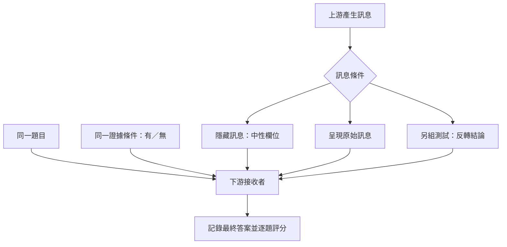
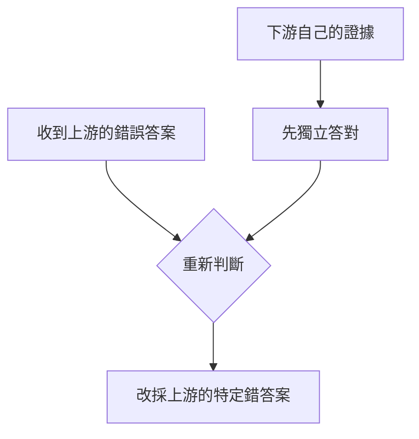

<!-- paper-reading-no-body-figures: The arXiv record grants a perpetual non-exclusive license to distribute the preprint but does not state a figure-reuse license. No separate permission for reproducing its figures could be verified, so the original figures are not copied. -->

## 90 秒掌握論文

- **問題**：多 Agent 系統會把草稿、檢索結果或推理交給下一個節點；錯誤傳遞固然常見，較難分清的是：接收者若已拿到足以答對的獨立證據，錯誤訊息還會不會把它從正確答案推走？過去關於從眾、sycophancy 或知識衝突的研究，通常沒有在真實的模型交接中同時固定下游證據並操弄訊息內容。
- **核心洞見**：訊息的邊際價值取決於接收者是否已有自己的證據，而且「有幫助」與「有害」可以同時存在於同一套流程的不同題目上。上游答對時，訊息常能救回下游原本答錯的題；上游答錯時，下游可能放棄原本能做對的判斷，甚至直接採用同一個錯誤答案。作者把這種有方向的改答稱為 **answer substitution**。
- **最強證據**：五個 benchmark × 五個下游接收模型的 25 個測試格裡，2,667 個「下游在獨立證據條件下可解」的項目有 297 個由正轉錯（11.1%）；最高單格是 32%。這不是 32% 的整體錯誤率。另從 82 個有害轉換中稽核出 77 個（94%）明確對上上游的特定錯答案（§3.3、Figure 3）。
- **主要邊界**：這是單次、兩節點 handoff 的受控實驗，含問答、SQL 等特定 benchmark 與指定模型，不是線上事故率或所有多 Agent 架構的普遍常數。將證據保留、訊息移除或換接收模型都不是無成本通用解；恢復測試部分使用 oracle 錯誤位置，部署仍需要可靠偵測。

本文讀的是 2026 年 9 月 29 日提交的 arXiv v1 預印本；arXiv 記錄未列出同行評審狀態。以下先看訊息實驗到底固定了什麼，再分清「多出資訊」與「答案被訊息帶走」的證據強度。

## 既有方法的限制：溝通為什麼可能同時救錯與製造錯

在 draft-review 工作流裡，上游節點先產出推理與草稿答案，下游節點再根據任務本身的證據和這份草稿提交最終答案。直覺上，第二個節點若有能力忽略不可靠的草稿，額外訊息不應使它比完全看不到草稿更差。然而模型不是理想的自由選擇者：訊息可能改變它如何解讀已見證據，或讓某個候選結論取得不成比例的注意力。

論文的問題不是「多 Agent 是否整體更好」，也不是估算產品中有多少回答會出錯，而是把一個可重複的原子交接拆開觀察：對同一題、同一份下游證據，呈現上游訊息與隱去訊息的答案是否不同？再問轉錯是否特別朝向上游的答案，以及只改訊息結論能否讓下游答案跟著翻轉。這個設計連起研究缺口、操弄和主要發現：通訊可能提供有用訊號，也可能以特定錯誤答案取代接收者原本正確的判斷。

作者借用 value-of-information（VoI）作為診斷直覺，而非提出新的 VoI 定理。若決策者可任意丟棄訊號，額外訊息理應不會傷害決策；實驗若觀察到訊息有負邊際價值，表示實際接收流程未能有效做到自由丟棄。這是經驗現象與理論基準的對照，不能讀成模型能力或機制已被形式證明（§2.1）。

## 先把四個概念分開

1. **獨立證據（independent evidence）**：任務提供給下游的資料，例如檢索段落、資料庫 schema 或工具輸出。它與上游的推理／答案訊息分開控制；「獨立」指實驗中不由該訊息代替，不代表資料在現實世界中統計獨立。
2. **訊息價值**：作者以訊息顯示條件準確率減去訊息隱藏條件準確率表示，記為 $\tau(s)=\operatorname{Acc}_{shown}(s)-\operatorname{Acc}_{hidden}(s)$，其中 $s$ 是有無下游證據。正值代表在該條件平均有益，負值代表平均有害。平均值可能掩蓋不同題目上同時發生的救回和覆寫。
3. **證據—訊息交互作用**：$\Gamma=\tau(no\ evidence)-\tau(with\ evidence)$。$\Gamma>0$ 表示下游有證據時，訊息邊際價值下降；這本身只證明兩者互相改變訊息的平均價值，不能單靠它推出 substitution。
4. **Answer substitution**：一個可觀察的轉換定義：下游在訊息缺席時能答對，收到錯誤上游答案後卻轉為上游那個特定錯答案。作者將「獨立可解」操作化為三次獨立 evidence-only 執行中至少兩次答對（$k=3$ 多數決；§2.1、Appendix A.20）。這不是對模型內部信念的直接讀心，也不表示它每次單跑都會答對。

實驗中的「訊息隱藏」也不是把下游重新啟動或拿掉整次審查，而是在相同 prompt 框架中以中性 placeholder 取代上游 reasoning 和 answer 欄位。這項細節使兩個分支保留相近的任務指示與推理呼叫，避免把「看見特定內容」和「多一次模型推理」混為一談。它仍不等於真實系統中完全沒有上游節點：實際協作的排程、工具呼叫、上下文長度與等待成本，都超出這個內容操弄本身。作者另以 matched-call control 和 delayed-receipt control 分別處理額外推理與先形成答案的替代解釋（§3.5、Appendix A.21、A.26）。

這四個層次不可混成一句「Agent 會盲從」。$\Gamma$ 是平均條件差；由正確轉錯（c→w）是項目層級的方向；答案與錯誤上游答案吻合則進一步檢驗錯誤是否被特定訊息帶向，而不是一般噪音。

## 核心直覺：訊息多，不等於證據多

下游收到訊息前已能看到任務證據。新增的上游文字可能帶來另一條有用推理，也可能只是把某個候選答案放到顯著位置。若我們只比較「有訊息」和「無訊息」的總分，兩種效應會抵銷：上游答對的題目讓訊息幫忙，上游答錯的題目讓訊息造成損害。因此作者同時分析訊息值、逐題轉換方向、上游答案正誤，以及訊息結論被反轉後的答案變化。

Figure 2 的讀法尤其重要：面板 (a) 顯示在 25 個接收者—benchmark 格中，$\Gamma$ 都顯著為正（$p<0.0001$）；這是「下游證據會改變訊息價值」的設計檢查。面板 (b) 按上游正誤分解後才看到核心：上游正確時訊息可幫忙，上游錯誤時則造成負向影響。面板 (c) 改變上游模型：更準確的上游會減少出錯訊息總量，卻沒有消除收到錯誤訊息後逐題被帶偏的現象（§3.2）。

這是把數個控制放在一起閱讀的簡圖：證據有無屬於基礎 2×2 設計；結論反轉則是另外的訊息操弄，不是所有條件一次組成的三組比較。

*Bloss0m 工程解說圖：在同一證據條件內固定題目與證據、改變訊息處置的簡化示意；證據有無仍是基礎 2×2 設計的一個因素，反轉結論是分開的控制實驗。這是原創解說圖，不是原論文圖，也不呈現額外實驗數據。*

## 用一題真實例子走完整個方法與機制

Appendix A.17 的 LBM 案例問：「《亂世佳人》（*Gone with the Wind*）女主角的配偶是誰？」下游可取得的證據指出女主角是 Vivien Leigh，並連到她現實生活中的配偶 Laurence Olivier。上游提供錯誤答案 Rhett Butler——那是電影中 Scarlett O’Hara 的配偶，不是演員 Vivien Leigh 的配偶。

1. **輸入**：下游看到問題和同一份證據；控制條件中，上游答案欄位不是 Rhett Butler，而是中性空值。
2. **無訊息基線**：模型答 Laurence Olivier。這份回答符合題目把「女主角」指向演員、而證據也談現實人物關係的讀法。
3. **加入錯誤訊息**：題目和證據不變，只把上游的錯答案 Rhett Butler 與分析交給接收者。論文的案例追蹤中，deepseek 先將題目重新解讀為問電影角色的配偶，再答 Rhett Butler（Appendix A.17，Trace 4）。
4. **判讀**：這個個案展示答案改變方向符合 substitution 的定義：接收者原本可以用眼前證據答對，收到錯誤訊息後卻採用該特定答案。它不是錯誤率估計，也不是單一案例可證明普遍心理機制。
5. **可能失敗點**：如果上游答案其實正確，無條件遮蔽訊息便會連同可用線索一起丟掉；若系統把任何歧見都當成錯誤，也可能把接收者的正確答案錯誤覆寫。工程上需要判斷訊息可信度與證據衝突，而不是只要「有訊息」就接受或拒絕。

上面的個案可抽象成下列答案轉換。箭頭呈現論文對 answer substitution 的操作定義，不代表每個接收者或每道題都會如此改答。

*Bloss0m 工程解說圖：answer substitution 的逐步示意；這是原創概念圖，不是原論文圖或新增實驗結果。*

這個例子也說明 CoT 文字不能直接當作忠實的內部因果說明。軌跡能顯示模型寫下了哪些理由，卻不能單獨證明它真正因何改答。作者把它當作行為診斷材料，並與受控操弄互相補充。

## 方法骨架：固定證據，改變訊息

研究把 handoff 表成上游訊息 $m$、下游證據 $e$ 和最終答案 $y$。每個項目先分派到證據有／無、訊息顯示／隱藏的 2×2 條件；訊息隱藏時使用相同 prompt 結構與中性 placeholder，而不是完全刪除第二次推理。這讓主要對照聚焦於訊息內容是否可見，另外的控制再測來源標籤、接收時機和評分等可能解釋（§2.1、§3.1、Appendix A.26）。

基準實驗使用五個資料集，共 750 個項目：BIRD（SQL，150）、HotpotQA（多跳問答，200）、LBMusique（多跳問答，160）、2WikiMultihopQA／L2W（120）與 DROP（閱讀理解，120）。主要上游與下游是 gpt-4o-mini；另測 gpt-5.4、kimi-k2.6、qwen-plus 等上游，以及 deepseek-v3.2、kimi-k2.6、glm-5、qwen3.6-plus 等其他接收者，合計五種接收模型。所有模型使用 temperature 0；完整模型 manifest 和 prompt 在 Appendix A.25–A.26（§3.1）。這是跨任務與模型的受控 benchmark 覆蓋，不是涵蓋所有供應商版本、語言或長期多輪互動的普查。

三類問題把推論鏈接起來：訊息價值是否隨上游正誤改變？接收者的轉錯是否指向上游特定錯誤？固定證據、只翻轉訊息結論時，答案是否跟著翻？正向 $\Gamma$ 是前提性診斷，方向性轉換和結論反轉才是區分 substitution 與普通冗餘的關鍵（§2.2–2.3）。

## 結果一：總平均會把幫助與傷害折在一起

在五個接收者 × 五個 benchmark 的 25 格中，$\Gamma$ 均為正且達顯著水準。作者也在 BIRD 遮掉 database schema，觀察到準確率下降 24.4 個百分點（95% CI −30.1 至 −18.8），作為證據本身確實影響結果的檢查（§3.2、Figure 2(a)）。這項檢查沒有證明真實部署的檢索證據一定可靠；它支持的是這個實驗中的 evidence 操弄有作用。

核心分解揭示兩種轉換並存。Figure 3(a) 以 25 格合計的 2,667 個獨立可解項目為分母，297 個由正確轉錯，即 11.1%；最高單一格達 32%。Figure 3(b) 同時呈現錯轉和原本答錯後被訊息救回（w→c）。因此「最高 32%」必須連著「單一格、原本獨立可解的題目、特定模型與資料集」一起讀，不能改寫成「訊息讓 32% 的所有答案變錯」。論文也明確區分採用率分析的分母：82 個轉換是人工稽核子集，並非全部 297 個案例都進入答案吻合稽核（§3.3、Figure 3、Appendix Table 2）。

82 個 c→w 轉換中，77 個（94%；bootstrap 95% CI 87%–98%）與上游特定錯答案吻合。另在 279 個、具逐題上游正誤資料的轉換中，250 個（90%）發生於上游答案確實錯誤的項目。這使論文能主張「有方向的訊息採用」比單純準確率下降更貼切；它仍不直接識別究竟是 anchoring、重新解讀問題或其他內部機制造成（§3.3；Appendix A.3–A.4）。

## 結果二：反轉訊息結論，接收答案也跟著動

方向性吻合仍可能受到答案字串、第二次思考或其他差異影響。作者因此在固定證據後，修訂上游訊息的結論：原先正確的結論被改錯、原先錯誤的結論被改正，同時保留推理格式與主要引用事實。實驗涵蓋 11 個測試格；在每格中，把正確結論改錯都會降低準確率，把錯誤結論改正則都會提升準確率（§3.4、Figure 4）。這比單看相關吻合更直接支持「接收者對訊息所含結論有因果反應」，但介入訊息可能同時改動支撐新結論的連接語句，並非只改一個 token。

更窄的 minimal-edit 控制只替換最後答案行與一句結論敘述、其他推理盡量保留；九格中四格達統計顯著，顯示結論標籤本身在部分情況有獨立效果，而完整支持性推理可能再放大作用（§3.4、Appendix A.19）。效果依模型與任務而變，所以不能把這一組控制說成「只要改答案字串就必然造成翻轉」。

其他控制排除部分替代說法，但沒有找出唯一心理機制。將相同訊息標為 teammate、unverified tool 或不標來源，在樣本足夠的 HotpotQA 上未見標籤間顯著差異；明示「證據優先」也沒有可靠消除覆寫（Appendix A.22）。延後讓接收者先獨立作答，並未使錯誤訊息失去影響（Figure 5、§3.5）。匹配兩個分支的推理次數後，有訊息的一側仍有較多正轉錯；因此「只是多跑一次模型」不夠解釋結果。替代的 Yes/No 抽取評分會降低但不消除部分 benchmark 的轉錯（Appendix A.18）。這些是對特定替代解釋的控制，不等於所有提示、格式、標籤或評分偏差均已排除。

## 結果三：推理軌跡與恢復實驗告訴我們什麼

作者沒有把 chain-of-thought（CoT）當作可靠防線。HotpotQA 上，四種模型中有的覆寫率稍降、有的反而上升，變化都未達顯著；LBM 上最明顯的下降仍留下近半數原可獨立答對項目被覆寫（§4、Appendix A.18）。在抽查的較強模型軌跡中，接收者能提及正確證據、甚至明確指出上游推理的矛盾，最後仍跟隨錯答案；60 份註記的兩位標註者一致性 AC1=0.98。這支持「沒有讀到證據」不是全部解釋，但推理文字不是內部因果過程的透明記錄，作者也把 anchoring 等機制留作未解問題（§4、Appendix A.16–A.17）。

恢復測試是條件化的上界示範。對已知上游錯誤的題目，提供正確錯誤位置帶來最大改善；泛稱「小心」收益較小，錯誤指出衝突位置則沒有改善。移除訊息並改用不同 receiver，三個子集的總改善為 BIRD +21.7、LBM +30.8、L2W +24.0 個百分點；每個子集樣本數分別為 92、70、16，L2W 尤其小（Table 1、§3.6）。數字來自已知哪些訊息錯誤的條件，部署並不知道 oracle 標籤。

成本面不能略過：對上游正確的項目移除訊息會使準確率下降約 20.7–25.4 個百分點；作者估算要達損益平衡，錯誤偵測器 precision 約需 BIRD 66%、L2W 94%（§3.6）。所以這組實驗並不支持「一律不要傳訊息」，而是指出選擇性閘控值得研究，且門檻會隨任務及正確訊息帶來的價值改變。就此文列出的恢復測試而言，偵測、覆核與換模型的延遲、費用及錯誤成本沒有被做成完整的線上成本研究。

## 證據地圖：論文支持到哪裡

| 層次 | 論文證據 | 可以支持的解讀 | 不能由此推出 |
| --- | --- | --- | --- |
| 平均訊息價值 | 五 benchmark × 五 receiver；Figure 2、Appendix A.9–A.10 | 下游有證據會改變訊息的平均邊際價值；不同格的 $\tau$ 可正可負 | 所有 Agent 系統平均都會因訊息受害 |
| 逐題覆寫 | 297/2,667=11.1%，最高格 32%；Figure 3 | 在定義為獨立可解的題目中，呈現錯誤訊息後可觀察到正轉錯 | 32% 是總體錯誤率、線上事故率或所有接收器的共同值 |
| 方向與結論介入 | 77/82 對上游特定錯答；反轉實驗 11 格同向；§3.3–3.4、Figure 4 | 結果符合 answer substitution，且接收答案會隨受操弄的訊息結論變化 | 已完全證明單一內部心理機制，或純粹只由答案字串造成 |
| 替代解釋與失敗型態 | source-label、delayed、matched-call、CoT 控制；Figure 5、Appendix A.16–A.22 | 若干來源標籤、先答、額外呼叫與評分解釋不足以抹去觀察 | 所有交互作用、模型版本漂移與 prompt 設計均已涵蓋 |
| 恢復與部署條件 | Table 1、Figure 6、§3.6 | 已知錯誤位置時，移除／更換 receiver 可回收部分錯誤 | 不完美偵測器在任意真實工作流一定有淨收益 |

Figure 1–6 和原始表格包含具體視覺證據，但 arXiv 頁面列出的授權是對全文的永久非專屬散布許可，未在記錄中給出可確認的圖像重製授權。本文因此不複製正文原圖；上述段落以圖號與章節定位原研究結果。本文封面是 Bloss0m 原創的概念性 Evidence Atlas，僅畫出「本地證據與上游訊息在接收端交會、結果可能分流」的抽象關係，不是論文圖表，也沒有編造測量值。

## 研究邊界與外部效度

- **交接範圍窄於完整協作系統**：核心操弄是一次 draft-review 訊息，不包含多輪協商、投票、共享記憶、任務拆分、權限控制或失敗重試。論文說它是 sequential pipeline 的共同構件；將原子構件結果外推到整套架構仍要實測（§2.1、§6）。
- **任務與模型是有限樣本**：五個 benchmark 包含 SQL、閱讀理解與多跳 QA，但結果取決於模型、prompt 與資料。L2W 自然上游錯誤只有 16 題，部分分層估計檢定力有限（Appendix A.6）；多重比較也需看附錄所報的校正結果，而非只看未校正顯著性（Appendix A.10）。
- **可解性的操作定義有不確定性**：三次 evidence-only 執行取多數決，把隨機輸出壓成一個分層標籤。Appendix A.20 比較獨立重跑，顯示分類對重複執行有一定穩健性；但它不能代表潛在能力的無誤測量，也不是每個部署請求會有三次試跑。
- **答案匹配是人工稽核子集**：94% 的分子分母是 77/82 個被稽核的有害轉換，不應與 297/2,667 的整體正轉錯分母互換。開放式答案的吻合採用論文描述的答案比對準則；其他任務、正規化規則或語意等價答案可能得到不同分類（§3.3、Appendix A.3）。
- **結論反轉不是純粹單字替換**：作者報告反轉訊息保留約 60–73% token，並稽核生成訊息的連貫性與證據依據（Appendix A.15）。調整推理以支持新結論可能同時改變論證脈絡，因此反轉實驗識別的是訊息結論與相關文字整體的影響；minimal-edit 控制提供補充而非完全解決此限制。
- **尚未識別唯一因果機制**：控制削弱了幾種解釋，但 anchoring、語意重構、選擇性取證及模型內部表徵之間的因果關係仍未知。文字軌跡只讓研究者觀察輸出理由，不能直接讀取內在計算（§4、§6）。

## Bloss0m 工程判斷：把訊息當作有條件的候選證據

以下是 **Bloss0m 工程化整理**，不是作者已驗證的部署協定：

1. **保留交接的可比較性**：在關鍵任務記錄接收者看到的原始證據、上游答案、最後答案與是否採納，讓錯誤可按交接邊回放。只存最終輸出，無法區分上游錯誤、下游獨立失誤與訊息誘發的覆寫。
2. **把主張與根據分欄**：要求上游把結論、引用的證據和不確定性分開，讓下游可核對具體衝突。這是設計建議，不能保證結構化訊息一定降低 substitution；論文中泛化警語收益較小，具體指出衝突位置才更有幫助（§3.6）。
3. **先量測訊息的條件價值再加閘**：用本地任務集估計上游正確／錯誤、下游有無獨立證據時的收益與傷害，並報告錯轉、救回、precision、recall 和延遲成本。不能只看整體 accuracy，也不宜用本文 66% 或 94% 門檻直接設定別的產品；那是特定子集和假設下的 break-even 估計。
4. **將降級策略設計為可回復**：當訊息可信度低或與直接證據衝突時，可以要求另一個獨立核驗、保留原始證據重新生成，或進入人工覆核。每種策略都需要以相同項目配對測試，並衡量訊息原本正確時造成的損失。
5. **不要把「更強模型」或 CoT 當防火牆**：更準的上游減少錯誤訊息數量，不表示接收端不會受剩餘錯訊息影響；CoT 在此研究中也未一致消除覆寫。把模型升級當成風險消失，需要另外的版本與任務證據（§3.2、§4）。

### 何時先不要照搬

若工作流中沒有可獨立檢查的證據、上游訊息本身是唯一知識來源，無條件剔除它可能讓結果更差。若 detector 尚未在目標任務驗證，依單一 benchmark 門檻切訊息亦不合理。若產品是多輪辯論、含工具副作用的代理鏈或高風險決策，這篇兩節點 benchmark 只能形成風險假設，不能取代端到端故障注入、權限安全或人工升級測試。

## Artifact 與可重現性

截至 2026-10-02，arXiv 提供 v1 HTML、PDF 與 TeX source；arXiv 紀錄沒有連結作者程式碼、資料集套件或 demo。論文附錄包含 benchmark 樣本數、模型 manifest、提示模板和分析細節，足以了解設計，但本文沒有獨立下載資料、呼叫相同模型服務或重跑 benchmark。文中所有實驗數字均為作者在 arXiv v1 報告的結果；不能據此聲稱已獨立重現。

預印本內容可能更新。若要重做，需要確認資料集版本與可用切分、模型服務是否仍提供相同快照、生成的反轉訊息與評分流程，並按作者的同項目條件配對 protocol 重建實驗。這是重現所需的核對事項，不代表作者附錄已提供可直接執行的一鍵實驗包。

## 讀完後的三個記憶點

1. **技術想法**：訊息價值是條件性的；下游已有足夠證據時，錯誤訊息仍可能以其特定答案取代原先正確判斷。
2. **證據**：297/2,667 個獨立可解項目出現正轉錯（11.1%，最高單格 32%）；另 77/82 個稽核案例指向上游特定錯答案。兩組分母回答不同問題。
3. **適用邊界**：訊息也能救回錯誤答案；選擇性移除要依賴錯誤偵測，且證據來自單次兩節點受控交接，尚非產品級故障率。

延伸閱讀：

- [XyEval：Agent 會接受錯誤建議嗎？](/paper-reading/69-xyeval-agents-say-yes-to-bad-advice/)：從建議者與接受者評測角度延伸錯誤建議的影響。
- [Raven：可組合 Agent harness 的規劃](/paper-reading/81-raven-composable-agent-harnesses/)：比較規劃與執行交接的不同可靠性問題。
- [Completed Pairs Hide Capped Failures](/paper-reading/79-completed-pairs-capped-failures/)：思考評測聚合如何隱藏任務中的失敗。

## Primary sources

- [Gong et al., “When Upstream Messages Override Correct Answers: A Controlled Study of Multi-Agent LLM Collaboration,” arXiv:2609.36855v1](https://arxiv.org/html/2609.36855)（2026-09-29）。
- [arXiv 摘要、版本與可用檔案](https://arxiv.org/abs/2609.36855)。
