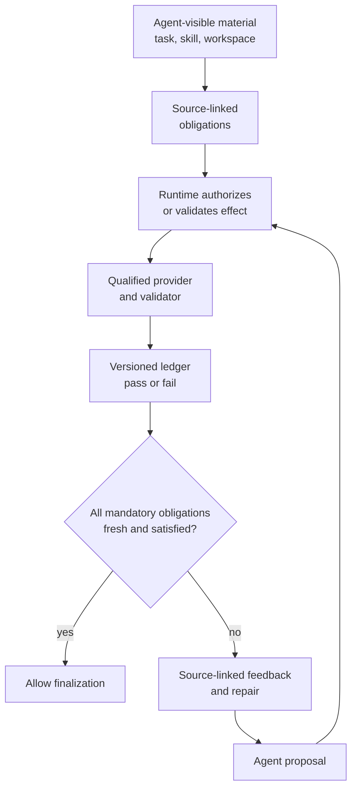

## The paper in 90 seconds

- **Problem:** An agent can understand an instruction yet omit it during tool use or artifact production. It can also report completion before the required state exists. When the same agent proposes actions, interprets outcomes, judges whether requirements are met, and declares itself done, the specification remains context rather than an independent acceptance authority.
- **Core insight:** Preserve the agent's autonomy to plan and propose, but give an external runtime control over specification-defined state. SpecHarness turns executable, verifiable requirements into source-linked obligations; only after a qualified evidence provider validates an effect may the runtime commit versioned state and permit finalization.
- **Strongest evidence:** Across 87 SkillsBench tasks, 509 source-grounded task directions, and seven task-agent models, completion claims exceed official evaluator passes by 28.7–37.9 percentage points. SpecHarness reaches 73.1% macro pass, compared with 61.1% for Raw (Table 1).
- **Main boundary:** The 509 items form a direction index extracted from visible materials, not a complete reconstruction of natural-language specifications or official verifier semantics. The main gain compares a full runtime that includes online validation, feedback, and repair; it cannot be attributed to authoritative sign-off alone (Sections 4; Appendices A, C, and D).

This reading follows [arXiv:2609.29921v1](https://arxiv.org/abs/2609.29921), submitted on 2026-09-24. The source establishes that it is an arXiv preprint; it does not establish peer review. The question is who should have the authority to accept a task: the agent that proposes completion, or the specification and evidence required by the task? The authors first measure gaps between understanding and execution, and between a completion claim and acceptance. They then propose a runtime that connects action control, effect validation, and state commitment. The experiments support an external acceptance authority for observable conditions. They do not show that adding a commit primitive by itself produces the same gains.

## Why prior approaches do not govern state

Many agent systems place task descriptions, operating instructions, output schemas, and reusable skills into a model's context and ask it to follow them. Common safeguards strengthen different parts of the process but do not necessarily connect them (Introduction, Related Work, Figure 2).

**Post-hoc verification** checks a trajectory or artifact after execution. It can diagnose a violation, but the action has already occurred and the result often remains diagnostic information. **Completion gating** runs a verifier after the agent says it is done and before a task is accepted. It can reject an unsupported claim, but it does not necessarily constrain earlier actions or intermediate state. **Runtime enforcement** intercepts or constrains behavior during execution, but a policy decision alone does not necessarily maintain task state established by independent evidence. The authors identify a missing link: a specification should constrain designated execution surfaces and determine which evidence may establish acceptable state.

This is not a claim that the earlier approaches are ineffective, nor that the paper invents reference monitors, runtime verification, or transactional commit. SpecHarness draws on those established ideas and assembles them into an agent-specific authority boundary: who can propose, which actions can be mediated, who can produce evidence, and what state permits the task to end (Section 2; Conclusion).

## Core intuition: separate proposal, evidence, and accepted state

Three terms help reconstruct the paper's conceptual model.

1. **A proposal is intent, not fact.** The agent may plan, choose tools, create files, repair failures, and request completion. These are candidate actions or judgments; they cannot directly mark an obligation as satisfied.
2. **Evidence is an observation with provenance and scope.** The runtime needs to know which provider, validator, channel, and version produced it, and which obligation it addresses. A tool's success string, the agent's self-report, or an unattributed observation does not automatically count as authoritative evidence.
3. **A commit updates authoritative runtime state.** Admissible evidence can commit either pass or fail. A committed failure is an auditable non-satisfied state, not a satisfied obligation. When a dependency version changes, old evidence becomes stale or unknown and must be revalidated.

Separating these concepts makes the two gaps measurable. The **understanding–execution gap (U–E)** measures how much of the visible, measurable direction surface is not realized in execution evidence; it does not directly measure what a model internally understood. The **state–authority gap (S–A)** is the fraction of runs accepted by a condition but rejected by the official evaluator. In Raw, the agent's claim is accepted without a gate, so S–A equals the Raw failure rate. It is not a general-purpose calibration score for every deployment (Section 4.3).

The authors use an obligation intermediate representation to assign different dispositions to visible material. A **hard** obligation is mandatory and may block a covered transition or completion. An **advisory** item guides the agent without blocking. **Abstain** records that the compiler does not make a decision because the requirement is ambiguous or cannot be validated reliably. **Residual** preserves context that was not incorporated into an obligation. A **task direction** is an index for measurement and source attribution; an **obligation** is a condition the runtime can execute. The mapping need not be one-to-one: several directions may ground one obligation, and an advisory or abstained direction does not automatically become a blocking rule (Section 3.2; Equation 3).

*Bloss0m's original process diagram, derived from the mechanism in Section 3; it is not a reproduction of paper Figure 4. See [the paper's Figure 4](https://arxiv.org/html/2609.29921#S3.F4) for the source illustration, which this article does not reuse.*

## Walk one data-to-d3 task through the runtime

The paper's appendix includes a SkillsBench data-to-d3 execution trace. It is an audited protocol replay instantiated from actual agent-visible task materials, not a claim that it is a verbatim naturally generated trajectory. It shows how the authority boundary is intended to work (Appendix E.2; Table 25).

1. **Compile the specification.** The task requires a browser-accessible `/root/output/index.html`, along with `js/d3.v6.min.js`, `js/visualization.js`, `css/style.css`, and copied input data. The visible D3 skill also requires offline and deterministic dependency use. The runtime retains each requirement's source in the task or skill.
2. **Assign dispositions.** Explicit conditions such as required paths and files can become mandatory obligations. If a requirement is ambiguous, unobservable, or lacks a qualified validator, it remains advisory, abstained, or residual. A compiler's ability to phrase it does not justify promoting it to a hard gate.
3. **Propose and authorize an action.** The agent proposes creating a file, loading data, or running code. The runtime normalizes the proposal and matches it against obligations. Only a surface that passes a closure audit and has a controlled execution path can use mediate-and-commit. Other channels whose effects can be safely isolated and observed use validate-and-commit. An unsupported channel or a path with unresolved bypasses must not be described as prevented in advance.
4. **Observe effects and validate.** A trusted observer passes actual file and execution state to a bound validator. The validator checks the effect against the source requirement rather than trusting the agent's report. Evidence is admissible only when the provider, channel, validator identity, scope, result type, and dependency versions satisfy the protocol.
5. **Commit and repair.** The runtime atomically records whether the obligation passed or failed, its dependency digest, and provenance. A failure can produce source-linked feedback; the agent may then propose a repair. The state can change only when new admissible evidence arrives.
6. **Check freshness and finalize.** If an artifact, input, validator, environment, or upstream obligation changes, its previous commitment cannot support completion. The runtime permits finalization only when every active mandatory obligation has fresh, satisfied evidence.

The point is not simply to “run one more check.” The design keeps both success and failure in an auditable history. A successful tool return, model confidence, or an older artifact's validation cannot stand in for evidence that the current state meets the requirement. Even so, the guarantee covers only grounded, observable, mandatory obligations with qualified validators; it does not cover every meaning in the natural-language specification (Section 3; Appendix B).

## Technical mechanism: from visible material to versioned state

The input is the context visible to the agent: task prompt, applicable guidelines, injected skills, and observable workspace and schemas. Held-out official verifiers and oracle solutions are excluded; they are used only after execution for evaluation. Keeping this boundary is important because runtime checks must not use the hidden answer key (Sections 3.1–3.2; Appendix A).

**First, extract and freeze.** The authors compare seven candidate language-model compilers against development annotations, select GPT-5.6 Sol using a prespecified development-coverage criterion, then freeze its instructions, output schema, and construction procedure. The 509 SkillsBench directions are the common measurement surface extracted by this frozen compiler from visible prompts, workspace information, and injected skills across 87 tasks. The later alignment of those directions with held-out official test functions is a coverage/alignment audit. It neither feeds evaluator logic back into runtime nor proves that official test semantics have been fully recovered (Appendices A.1–A.2).

**Second, build obligations from directions.** Each obligation binds provenance, action matching and authorization, execution and validation conditions, state updates, dependencies, and enforcement controls. A requirement may be hard only if it is mandatory, grounded in a source, has an authorized evidence provider, and its validator passes blocking qualification. Otherwise it remains advisory, abstained, or residual. Being machine-checkable is not the same as qualifying to block: a validator also needs observable inputs within the trusted boundary, deterministic source-linked criteria, and tests for satisfying cases, targeted violations, malformed inputs, provider unavailability, and execution failures (Section 3.2; Appendix B.1).

**Third, select a control mode for each action surface.** Mediate-and-commit is preventive: only a runtime-controlled executor dispatches governed actions. A no-bypass claim requires the closure audit to cover every path capable of an effect-equivalent action. If a surface cannot be shown closed, the paper does not count it as preventive mediation. An effect that can be safely isolated and observed may instead use validate-and-commit after it occurs. A surface that supports neither mode stays outside hard enforcement. Appendix B.2 confines the guarantee to the audited capability graph and threat model; undeclared external channels, compromised trusted components, validator defects, and unobservable effects are excluded.

**Fourth, update the ledger only from admissible evidence.** Each commit records the provider and validator identity and version, dependency versions, evidence provenance, and commit event. A passed result can establish satisfied state. A failed result can commit current non-satisfaction and trigger repair. An error appears in the diagnostic trace but does not update authoritative state or let finalization proceed while a mandatory obligation remains unresolved. The ledger update and event record are atomic (Equations 9–12; Appendix B.1).

**Fifth, invalidate state when versions change.** A commitment is tied to the versions of the artifact, input, validator, environment, and dependent obligations used to establish it. If the digest differs from current state, or version evidence is incomplete, the entry becomes stale or unknown. History is retained, but cannot support current completion; the runtime must revalidate and, when needed, repair before recommitting (Section 3.5; Appendix B.3).

This formal model also resolves a common ambiguity: a commit does not mean “success.” It records an evidence-backed authoritative result, which can pass or fail. The agent still interprets the work and proposes repairs, but it cannot edit the ledger, inject validator outcomes, mark an obligation satisfied, or authorize finalization.

## Experimental design and measures

The authors evaluate the architecture on two benchmarks with different state semantics. SkillsBench contains 87 tool-use and artifact-production tasks, with an official verifier judging success after agent execution. GuideBench contains 1,042 guideline-constrained decision tasks. After removing four duplicate rules from 301 guideline entries, the authors form 297 obligation templates and 5,817 task-level instances. GuideBench has no closure-audited physical action surface, so all hard obligations use validate-and-commit (Sections 4.1; Appendices C and E).

The seven task agents are GPT-5.6 Sol, Claude Fable 5, Gemini 3.1 Pro, Kimi K3, GLM-5.2, Qwen3.7-Max, and DeepSeek-V4-Pro. SkillsBench Raw and SpecHarness runs share an OpenHands substrate, initial workspace, model, tool access, and nominal budgets. Paired GuideBench conditions also share inputs and model settings. Equal nominal token, call, and timeout ceilings do not imply equal realized calls, tokens, repair steps, or wall-clock time. Official verifiers and answer labels do not supply obligation construction, runtime feedback, or repair (Appendix C.1–C.2).

Official pass rate is the primary metric. U–E is the share of the frozen direction or obligation surface not supported by execution evidence. S–A is the share of runs accepted by a condition but rejected by the official evaluator. Every valid Raw run accepts the agent's ungated terminal claim, so Raw S–A equals one minus Raw pass. The paper also reports Raw-pass preservation to show whether lower unsupported acceptance comes with over-refusal. These measures answer different questions; S–A should be read alongside pass and preservation (Section 4.3).

## Result 1: all seven models show a gap between saying “done” and passing

In the Raw condition across 87 SkillsBench tasks, the seven models satisfy only 79.6%–86.4% of the 509 source-grounded directions. Their Raw completion-claim rates exceed official evaluator pass rates by 28.7–37.9 percentage points. This means “the model says it is done” is not a reliable proxy for “the benchmark's required conditions hold.” The measured gap belongs to this benchmark's acceptance and pass rules; it is not a universal overclaim rate for production agents (Introduction; Figure 3; Table 1).

| SkillsBench metric, seven-model macro average | Raw | SpecHarness | Change |
| --- | ---: | ---: | ---: |
| Official pass | 61.1% | 73.1% | +12.0 percentage points |
| U–E | 17.4% | 9.3% | −8.1 percentage points |
| S–A | 32.8% | 12.8% | −20.0 percentage points |

Table 1's macro average is the unweighted mean of seven model-level rates. The authors use 10,000 paired task-bootstrap replicates, clustered by task; the 95% CI for the pass difference is [+9.1, +14.9] percentage points. Exact paired McNemar tests for all seven task agents remain significant after Holm correction. This supports the claim that the complete SpecHarness condition outperforms its paired Raw condition in this experiment. Statistical significance does not identify which component caused the improvement, nor does it establish that the measurement surface covers every specification (Appendix D.1; Tables 16–17).

The model-level results also show that gains are not confined to the strongest model. GPT-5.6 Sol moves from 71.3% to 85.1% pass, Gemini 3.1 Pro from 62.1% to 79.3%, and Qwen3.7-Max from 54.0% to 65.5%. However, model capability, task composition, obligation coverage, and validator quality all shape these values. They are not a fixed gain that a “specification add-on” can guarantee (Table 1).

## Result 2: one obligation–evidence–commit abstraction can cover decisions, with a different evidence surface

GuideBench applies external specifications to decisions rather than file artifacts. Across seven models, macro official pass rises from 86.2% to 91.3%, U–E falls from 10.4% to 5.0%, and S–A falls from 13.8% to 6.9% (Table 3). This suggests that the same conceptual scaffold can be applied to rule-local decision state: determine which guidance applies, use authorized evidence to check whether the answer conforms, and commit the resulting state.

With GPT-5.6 Sol fixed, the SpecHarness baseline comparison reports 95.1% pass, 3.5% U–E, and 3.8% S–A. RvLLM, VeriMAP, and SatLM represent post-hoc verification, completion gating, and a computation substrate, respectively (Table 4). SatLM can execute declarative rules externally and reduce U–E. If the solver output is not committed as authoritative decision state, S–A may remain higher. This comparison supports the authors' distinction among checking an answer, executing rules, and deciding who may write accepted state. It does not mean every benchmark needs the same runtime or validator.

Results across the two benchmarks rely on each benchmark's frozen measurement surface. GuideBench has no independent extraction oracle; its 297 templates and 5,817 instances support comparisons between conditions, but do not prove complete recovery of guideline semantics. SkillsBench uses 509 extracted directions as its denominator. A precise number does not make the denominator a complete specification (Section 4; Appendix A.2).

## Architecture diagnostics: which components track which failure changes

The authors compare variants with runtime components removed. Full SpecHarness reports 85.1% pass, 6.3% U–E, 6.9% S–A, and 96.8% paired Raw-pass preservation. Removing mediation lowers pass to 80.5% and raises U–E to 10.0%. Removing effect validation raises S–A to 16.1%. Removing commitment raises S–A to 25.3%, the largest degradation among the listed variants. Removing blocking qualification instead lowers S–A to 5.7%, but Raw-pass preservation falls to 90.3%. Stricter rejection can therefore reflect over-refusal rather than more reliable authority (Table 5).

These architecture ablations provide component-level diagnostics, but the paper explicitly says they do not isolate the causal effect of commitment under matched trajectories or compute. Removing a mechanism can also alter agent feedback, interactions, and repair paths. Table 5 should not be read as independent causal contributions that can simply be added together.

A freshness experiment applies 248 targeted dependency mutations. Full SpecHarness invalidates every affected commitment; after revalidation, 95.8% of affected entries are restored, and after repair 95.6% of affected tasks recover. Without freshness invalidation, 100% of mutations leave stale acceptance in place (Table 6; Appendix B.3). This directly tests versioned state against “old evidence still passes,” but it is a result for a specific mutation protocol, not proof that every dependency change in production will be detected.

The paper also quantifies enforcement coverage. Of 250 SkillsBench hard obligations, 110 (44.0%) fall on closure-audited action surfaces and use mediate-and-commit; 140 (56.0%) use validate-and-commit on safely isolated channels. GuideBench has no audited physical action surface, so all obligations use validate-and-commit (Table 7; Appendix B.2). The system therefore does not claim to prevent every noncompliant action; some effects are checked only after they occur.

## Cost and diagnostic information: the complete governance loop adds overhead

Relative to Raw, SpecHarness uses a macro average of 1.53 times as many task-agent tokens and 1.24 times the condition-execution wall-clock time, with 0.36 additional task-agent calls per task (Table 22). The wall-clock measure includes online validator execution, source-linked feedback, and repair. Compiler selection, validator qualification, task-specific obligation construction, and official post-run evaluation are outside the paired execution cost. These values describe the full online architecture, not commitment alone, and should not be treated directly as a billing estimate.

On a fixed failure-replay set, actionable source-linked reports rise from 42.5% for Raw to 96.2% for SpecHarness; normalized feedback time is 0.44 times the Raw value (Table 23). But the conditions have asymmetric trace access: SpecHarness natively has a ledger and online validator feedback, while Raw does not. This compares the diagnostic information exposed by the complete conditions; it does not establish greater diagnostic accuracy after controlling for equal trace access.

## Evidence map: what the results support and where they stop

| Paper claim | Supporting evidence | Boundary to retain |
| --- | --- | --- |
| Visible agent requirements are often lost during execution or acceptance | 87 tasks, 509 directions, seven models; Raw satisfies 79.6%–86.4% of directions and a 28.7–37.9 pp claim/pass gap (Figure 3; Table 1) | The extracted direction index is not a complete semantic account of the task or evaluator. |
| An external authority runtime reduces gaps and raises pass across two benchmark conditions | SkillsBench Table 1; GuideBench Table 3; paired bootstrap and McNemar results | The condition includes validation, feedback, and repair; gains cannot be attributed to authoritative sign-off alone. |
| Evidence needs scope, provider, and version to support ongoing state validity | Hard-validator qualification, closure audit, atomic commit, and 248 freshness mutations (Section 3; Appendix B; Tables 6–7 and 10) | No-bypass applies only to closure-audited action surfaces and assumes the stated trust boundary and observability. |
| Skills and guidelines can be compiled into auditable obligations | 509 SkillsBench directions, 5,817 GuideBench rule-local instances, validator tests | Direction alignment with 573/585 official test functions is an alignment result, not full recovery of verifier logic. |
| More governance exposes more actionable diagnostic information | Actionable reports rise from 42.5% to 96.2% on the failure-replay set (Table 23) | Trace access is asymmetric, so the ledger's information advantage is not separated from diagnostic quality. |

The strongest conceptual contribution is to separate “was the work done correctly?” from “who has authority to declare it correct?” and to instantiate that distinction with traceable obligations, qualified providers, version freshness, and a finalization rule. The experiments support improved pass and gap metrics for the complete intervention in the stated environment. They do not support stronger claims that commitment alone caused the +12-point gain, that every visible requirement can become a hard validator, or that SpecHarness guarantees safe completion across arbitrary tools, environments, and subjective tasks.

## Limitations and open questions

- **Requirement coverage is not specification completeness.** The 509 directions come from a frozen compiler applied to agent-visible materials. Alignment to 573 of 585 official test functions describes benchmark test alignment, not runtime recovery of all evaluator semantics. GuideBench also lacks an independent extraction oracle (Section 4.1; Appendix A).
- **Hard gates intentionally cover only a subset.** Subjective, ambiguous, conflicting, or unobservable requirements without a qualified provider may remain advisory, abstained, or residual. This avoids invented certainty, but means finalization guarantees apply only to grounded mandatory obligations (Sections 3.2 and 3.5).
- **The full-architecture comparison cannot identify one mechanism's causal contribution.** SpecHarness performs online validation, source-linked feedback, and repair; realized calls, tokens, and time also change. Even with paired controls and bootstrap intervals, the authors explicitly acknowledge they did not isolate commitment under matched trajectories or compute (Sections 4.4; Appendices C.2 and D.1).
- **No-bypass guarantees have a narrow boundary.** Preventive mediation applies to 44% of SkillsBench hard obligations; the rest use post-effect validation. The trust boundary, capability graph, effect-equivalence relation, and scope of external channels all matter (Appendix B.2).
- **Over-refusal matters.** A lower S–A is not necessarily a better acceptance policy if the runtime also rejects tasks that Raw would pass. The paper therefore reports pass alongside Raw-pass preservation. A deployment would also need to track unresolved or unknown obligations and their effect on availability and human workload (Sections 4.3 and 5.3).
- **Cost and reproducibility remain bounded.** Reported condition-execution time covers a particular benchmark runtime; full compiler and preprocessing costs are separate. No official SpecHarness implementation is currently available for external teams to inspect deployment details. These limits bound the evaluation; they are not enough to calculate generic service cost.

## Bloss0m engineering judgment and when not to use it

**Bloss0m engineering judgment:** If a completion claim can trigger a release, data mutation, or external commitment, store “the agent proposed completion” and “the system accepted the state” as different events. This design principle follows the authors' authority boundary, while the adoption steps below are a Bloss0m engineering synthesis, not a deployment recipe validated by the paper.

1. **Start with one observable obligation.** Link a decidable task condition to its original source, target state, and responsible provider. Do not merely copy the prompt into another checklist; identify the trusted observation that can establish the condition.
2. **Keep uncertainty explicit.** Requirements that cannot be evaluated consistently, depend on human taste, or admit several reasonable interpretations should begin as advisory or abstained, with a named reviewer if needed. Formal representation does not make a subjective standard objective.
3. **Define data and action boundaries.** For an action that must be prevented in advance, enumerate effect-equivalent paths and run a closure audit. If the inventory is incomplete, do not claim no-bypass. If effects can be isolated but paths cannot be controlled, use validate-and-commit and explain the preventive gap.
4. **Make commitments invalidatable.** Record input, artifact, validator, and environment versions in evidence provenance. When a dependency changes, mark the old result stale or unknown rather than carrying forward the previous green status.
5. **Measure end-to-end value and rejection cost.** Alongside official pass, track unrealized requirements, unsupported acceptance, Raw-pass preservation, repair count, and wall-clock cost. Do not select only S–A or pass as the definition of success.

This approach fits tasks with explicit, observable acceptance conditions, such as required files, schema conformance, constrained action order, or authorized workflow transitions. If “done” means creative quality, user preference, policy interpretation, or a trade-off among stakeholders, a single automatic validator should not make the final decision. Make the decidable subconditions hard obligations, retain the rest for human or higher-level judgment, and name who owns final acceptance.

## Artifacts and reproducibility

As of 2026-09-28, readers can access the [arXiv v1 HTML](https://arxiv.org/html/2609.29921v1) and [PDF](https://arxiv.org/pdf/2609.29921v1). The paper describes SpecHarness, its benchmark setup, statistical analyses, and replay examples. In the links listed by the paper and materials currently confirmed, there is no author-released SpecHarness repository or complete runnable experiment package. Full access conditions and licenses for the SkillsBench and GuideBench materials have not been verified here. A detailed method description should not be mistaken for an installable public implementation. This article did not independently rerun the seven-model benchmark; the reported results are the authors' results.

The original Figures 1–4 and later figures can be viewed in the HTML/PDF, but the arXiv page identifies a perpetual non-exclusive license. arXiv explains that this license gives arXiv limited distribution rights and restricts reuse by others; no broader figure license or separate author permission was identified. This reading therefore does not reproduce the paper figures or present an explanatory diagram as an original paper figure. The process diagram in the body is an original explanation based on Section 3, not benchmark data and not a substitute for Figure 4; readers can follow the source anchors to inspect the paper's evidence. The cover is an independently created Evidence Atlas concept illustration; it does not represent benchmark data and is not a paper figure.

## Three things to remember

1. **A completion claim is not acceptance:** across 87 SkillsBench tasks, Raw satisfies only 79.6%–86.4% of the 509 visible directions; claims exceed official passes by 28.7–37.9 pp.
2. **State needs an authorized source:** SpecHarness separates proposals, admissible evidence, and versioned commitments; finalization requires every fresh mandatory obligation to be satisfied.
3. **The gain belongs to a full governance loop:** SkillsBench pass rises by 12.0 pp, but the runtime also adds online validation, feedback, and repair; the result cannot be attributed to sign-off alone.

## Related reading

- [Do Agent Skills Help with Version-Specific Plugin Migration? (Paper Reading #75)](/en/paper-reading/75-agent-skills-version-specific-plugin-migration/): extends version and procedure requirements into external acceptance conditions.
- [Tool Calls Are Not Workflows: Agentic RAG Failure Attribution (Paper Reading #49)](/en/paper-reading/49-tool-calls-workflows-fail/): adds context for the gap between a successful tool return and an achieved workflow state.

## Primary sources

- Li et al., [Who Holds the Pen? Let Specifications, Not Agents, Sign Off, arXiv:2609.29921v1](https://arxiv.org/html/2609.29921v1), submitted 2026-09-24. This reading relies mainly on Figures 1–4, Tables 1–7, Sections 1–5, and Appendices A–E.
- [arXiv license information](https://info.arxiv.org/help/license/index.html): distinguishes free-to-read access from the scope of licenses permitting reuse by others.

<!-- paper-reading-no-body-figures: The arXiv version carries the perpetual non-exclusive license, which grants arXiv limited distribution rights and restricts reuse by others; no separate figure reuse permission was identified. The original figures remain linked and discussed as evidence, but no paper figure is copied or recreated. -->
