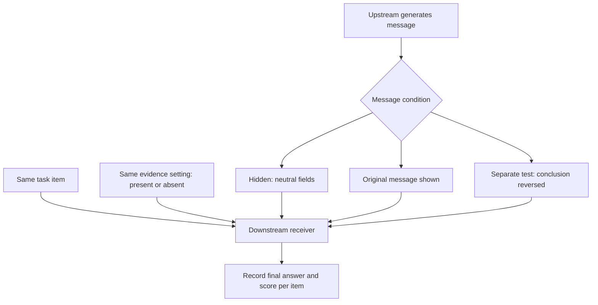
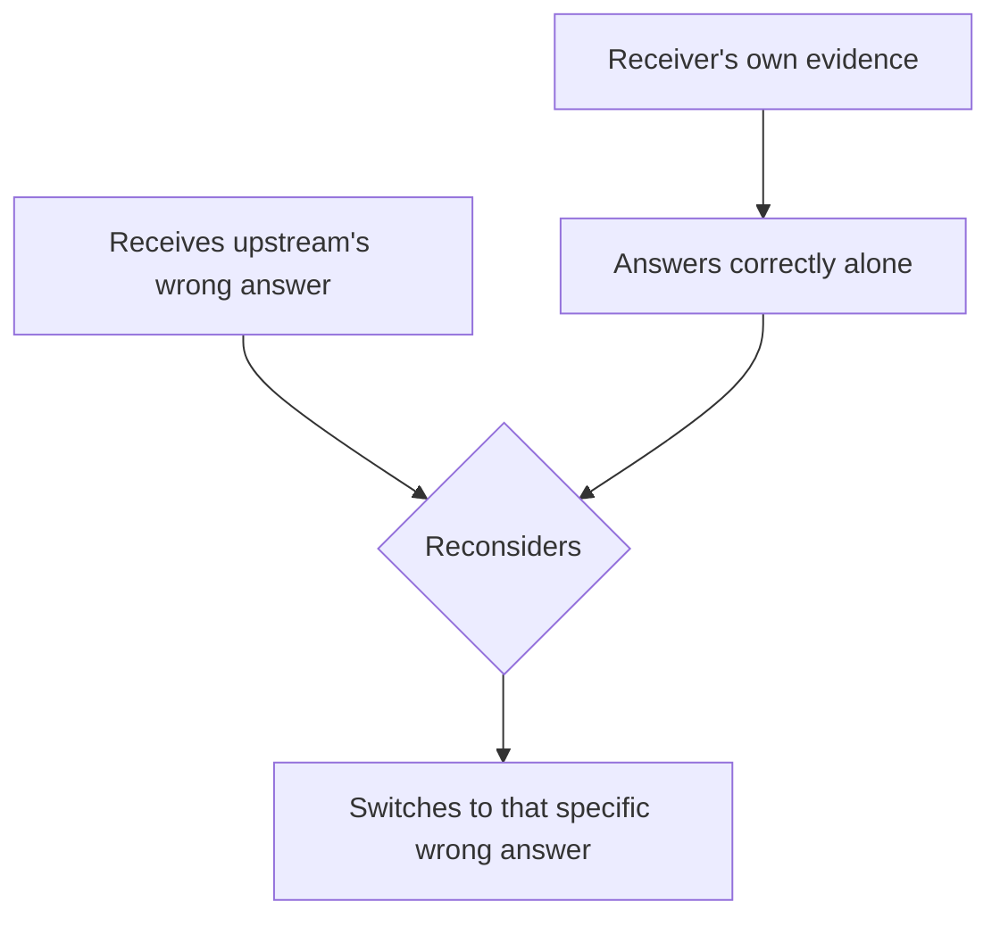

<!-- paper-reading-no-body-figures: The arXiv record grants a perpetual non-exclusive license to distribute the preprint but does not state a figure-reuse license. No separate permission for reproducing its figures could be verified, so the original figures are not copied. -->

## The paper in 90 seconds

- **Problem:** Multi-agent systems pass drafts, retrieved results, or reasoning to a downstream node. Error propagation is familiar; the sharper question is whether a bad message can displace a correct answer when the receiver already has enough independent evidence to solve the task. Prior work on conformity, sycophancy, or knowledge conflict generally did not hold downstream evidence fixed while manipulating message content in an actual model handoff.
- **Core insight:** A message's marginal value depends on whether the receiver has its own evidence, and help and harm can coexist across items in the same workflow. An upstream-correct message can rescue a receiver that would otherwise fail. An upstream-wrong message can make it abandon an answer it could already produce, sometimes adopting that very wrong answer. The authors call this directed change **answer substitution**.
- **Strongest evidence:** Across 25 cells (five benchmarks × five receivers), 297 of 2,667 items classified as independently solvable changed from correct to wrong (11.1%); the highest single-cell rate was 32%. That is not a 32% overall error rate. In a separate audit of 82 harmful transitions, 77 (94%) matched the upstream's specific wrong answer (§3.3, Figure 3).
- **Main boundary:** This is a controlled, single-message, two-node handoff study on selected QA, SQL, and reading-comprehension benchmarks and named model versions. It does not estimate a production incident rate or a universal multi-agent failure rate. Keeping evidence, removing a message, or switching receivers is not a cost-free general fix; some recovery tests also use oracle knowledge of which answer is wrong.

This reading follows the arXiv v1 preprint submitted on September 29, 2026; the arXiv record does not establish peer-review status. We first unpack what the handoff experiment holds constant, then distinguish evidence that a message adds information from evidence that a specific answer displaces the receiver's judgment.

## Limits of prior approaches: why communication can both rescue and mislead

In a draft-review workflow, an upstream node sends reasoning and a draft answer; a downstream node submits a final answer using both the task evidence and that draft. If the receiver could freely ignore an unreliable draft, additional information should not make it worse than seeing no draft. Language models are not ideal free-disposal decision makers: a message may change how they interpret evidence already present or give one candidate conclusion disproportionate salience.

The paper does not ask whether multi-agent systems are better overall or estimate how many production answers will be wrong. It isolates a repeatable unit: for the same item and same downstream evidence, does the answer differ when an upstream message is shown rather than hidden? Is a harmful change directed toward the upstream answer? And if only the message conclusion is reversed, does the downstream answer move with it? This links the research gap, intervention, and central result: communication can provide useful signals, but a specific erroneous answer can also displace a receiver's otherwise correct judgment.

The authors use value of information (VoI) as a diagnostic intuition, not as a new VoI theorem. If a decision maker may discard any signal at will, an additional signal should not reduce decision quality. A negative marginal value in the experiment indicates that the practical receiver does not effectively exercise that free-disposal option. This is an empirical finding compared with a theoretical baseline, not a formal proof about model capability or internal mechanism (§2.1).

## Four concepts to keep distinct

1. **Independent evidence:** Task material available to the downstream receiver, such as retrieved passages, a database schema, or tool output. The study controls it separately from the upstream reasoning and answer. “Independent” means it is not supplied by the message being manipulated; it does not mean the evidence is statistically independent in the real world.
2. **Message value:** The authors define $\tau(s)=\operatorname{Acc}_{shown}(s)-\operatorname{Acc}_{hidden}(s)$, where $s$ indicates whether the receiver has evidence. A positive value means the message helps on average in that condition; a negative value means it harms on average. An average can hide helpful and harmful transitions on different items.
3. **Evidence–message interaction:** $\Gamma=\tau(no\ evidence)-\tau(with\ evidence)$. A positive $\Gamma$ means the message's marginal value decreases when the receiver has evidence. That alone establishes an interaction in average message value; it does not establish substitution.
4. **Answer substitution:** An observable transition: the receiver would answer correctly without the message, but switches to the upstream's specific wrong answer after receiving it. The authors classify an item as independently solvable when at least two of three independent evidence-only runs are correct (a majority vote with $k=3$; §2.1, Appendix A.20). This is not direct access to an internal belief, nor does it mean the model answers correctly on every standalone run.

These levels should not collapse into “agents blindly follow peers.” $\Gamma$ is a condition-level average; correct-to-wrong (c→w) is an item-level direction; matching the upstream's wrong answer tests whether the direction is message-specific rather than generic noise.

## Core intuition: more messages are not necessarily more evidence

The receiver sees task evidence before any message arrives. Upstream text may add useful reasoning, or it may simply make a candidate answer salient. If we compare only total accuracy with and without messages, both effects can cancel: messages help on items where the upstream is right and hurt where it is wrong. The authors therefore analyze message value, item-level transition direction, upstream correctness, and the receiver's response when the message conclusion is reversed.

Figure 2 is best read in stages. Panel (a) shows significantly positive $\Gamma$ in all 25 receiver–benchmark cells ($p<0.0001$); this checks that downstream evidence changes message value. Panel (b) decomposes the result by upstream correctness and reveals the central split: messages can help when the upstream is right and hurt when it is wrong. Panel (c) varies the upstream model: a more accurate upstream creates fewer erroneous messages overall, but does not eliminate per-item displacement after a wrong message is received (§3.2).

The diagram places several controls in one view: evidence present/absent belongs to the base 2×2 design, while conclusion reversal is a separate message manipulation rather than a third arm combined into one comparison.

*Bloss0m explanatory diagram: a simplified view of holding the task and evidence state fixed within a comparison while changing message treatment; evidence availability remains a factor in the base 2×2 design, and conclusion reversal is a separate control experiment. This original explainer is not a paper figure and adds no experimental data.*

## A worked example from the paper

Appendix A.17 gives an LBMusique case asking: “Who was the spouse of the leading lady in *Gone with the Wind*?” The evidence available to the receiver identifies the leading lady as Vivien Leigh and connects her to her real-life spouse, Laurence Olivier. The upstream's wrong answer is Rhett Butler—the spouse of Scarlett O’Hara in the film, not the spouse of actor Vivien Leigh.

1. **Input:** The receiver sees the question and the same evidence in every condition. In the control, the upstream answer field is replaced by a neutral placeholder rather than Rhett Butler.
2. **No-message baseline:** The model answers Laurence Olivier, matching the reading of “leading lady” as the actor and the evidence about real people.
3. **Add the wrong message:** The question and evidence stay fixed; only the upstream answer Rhett Butler and its analysis are given to the receiver. In the trace reported by the paper, DeepSeek reinterprets the question as asking about the character's spouse and answers Rhett Butler (Appendix A.17, Trace 4).
4. **Interpretation:** This case illustrates the direction in the substitution definition: the receiver could answer from the visible evidence, yet adopts the specific answer in the wrong message. It is not a rate estimate, and one case cannot establish a universal psychological mechanism.
5. **Likely failure point:** If the upstream answer is correct, blindly hiding the message discards a useful clue. If every disagreement is treated as proof that the message is wrong, a system may overwrite the receiver's correct answer instead. Engineering needs to assess message reliability and evidence conflict rather than always accept or reject any message.

The case above can be abstracted as the following answer transition. The arrows express the paper's operational definition of answer substitution; they do not mean that every receiver or item changes this way.

*Bloss0m explanatory diagram: a stepwise illustration of answer substitution. This is an original conceptual explainer, not a paper figure or an additional experimental result.*

The example also shows why a chain-of-thought trace should not be treated as a faithful causal explanation of internal reasoning. It reveals the reasons the model wrote down, not by itself why the answer changed. The authors use traces as behavioral diagnostic material alongside controlled interventions.

## Method: hold evidence fixed and vary the message

The study represents a handoff with an upstream message $m$, downstream evidence $e$, and final answer $y$. The baseline design crosses evidence present/absent with message shown/hidden in a 2×2 setup. When hidden, the message is replaced by neutral placeholders within the same prompt structure, rather than removing the second inference call altogether. This focuses the primary contrast on message visibility; separate controls examine source labels, receipt timing, and scoring as alternative explanations (§2.1, §3.1, Appendix A.26).

The five benchmarks contain 750 items: BIRD (SQL, 150), HotpotQA (multi-hop QA, 200), LBMusique (multi-hop QA, 160), 2WikiMultihopQA/L2W (120), and DROP (reading comprehension, 120). The primary upstream and downstream are both gpt-4o-mini. Other upstream models include gpt-5.4, kimi-k2.6, and qwen-plus; other receivers include deepseek-v3.2, kimi-k2.6, glm-5, and qwen3.6-plus, for five receiver models in total. All runs use temperature 0. The full model manifest and prompts appear in Appendices A.25–A.26 (§3.1). This is controlled coverage across selected tasks and models, not a census of providers, model versions, languages, or long-running multi-turn collaboration.

Three questions connect the inference chain: Does message value depend on whether the upstream is correct? Are harmful changes directed toward the upstream's specific wrong answer? With evidence fixed, does reversing the message conclusion shift the downstream answer? Positive $\Gamma$ is a diagnostic premise; directional transitions and conclusion reversal are the key evidence distinguishing substitution from ordinary redundancy (§2.2–2.3).

## Result 1: aggregate accuracy combines help and harm

Across five receivers × five benchmarks, $\Gamma$ is positive and statistically significant in all 25 cells. The authors also mask the database schema on BIRD and observe an accuracy drop of 24.4 percentage points (95% CI −30.1 to −18.8), checking that the evidence manipulation itself matters (§3.2, Figure 2(a)). This does not show that retrieved evidence in deployment is always reliable; it supports the role of the evidence manipulation in this experiment.

The conditional decomposition reveals both transition types. Figure 3(a) uses 2,667 independently solvable items pooled across the 25 cells: 297 move from correct to wrong, or 11.1%; the highest single cell reaches 32%. Figure 3(b) also shows wrong-to-correct rescues on items the receiver would otherwise miss. Thus “up to 32%” must stay attached to “one cell, items classified as independently solvable, and a particular model–benchmark setting.” It cannot be rewritten as “messages make 32% of all answers wrong.” The paper distinguishes denominators: the answer-adoption audit of 82 harmful transitions is not an audit of all 297 c→w cases (§3.3, Figure 3, Appendix Table 2).

Of 82 audited c→w transitions, 77 (94%; bootstrap 95% CI 87%–98%) match the specific wrong answer in the upstream message. Separately, 250 of 279 transitions with item-level upstream correctness data (90%) occur when the upstream answer is in fact wrong. This supports describing the finding as directed message adoption, rather than a generic accuracy decline. It still does not identify whether anchoring, question reinterpretation, or another internal process caused any individual change (§3.3; Appendices A.3–A.4).

## Result 2: reverse the message conclusion and the receiver moves

Directional matching could still be affected by answer strings, a second reasoning call, or another difference. The authors therefore revise the upstream message after holding the evidence fixed: an initially correct conclusion is corrupted and an initially wrong one corrected, while the reasoning format and main cited facts are preserved. Across 11 tested cells, corrupting a correct conclusion lowers accuracy in every cell, while correcting a wrong conclusion raises it in every cell (§3.4, Figure 4). This gives more direct evidence that the receiver responds causally to the conclusion in the message than answer matching alone. However, rewriting a message may also change connective reasoning that supports its new conclusion; it is not always a one-token edit.

A narrower minimal-edit control replaces only the final answer line and one sentence stating the conclusion while retaining the rest of the reasoning as much as possible. Four of nine tested cells reach statistical significance. This indicates an independent effect of the conclusion label in some settings, with supporting reasoning potentially amplifying it (§3.4, Appendix A.19). Effects vary by model and task, so this control does not establish that changing only an answer string always flips the receiver.

Other controls narrow some alternative explanations without identifying a unique psychological mechanism. Relabeling the same message as a teammate, an unverified tool, or leaving it unlabeled produces no significant differences among labels on adequately powered HotpotQA comparisons; an explicit “prioritize the evidence” instruction also does not reliably remove overrides (Appendix A.22). Allowing the receiver to answer independently before seeing the message does not eliminate the influence of an erroneous conclusion (Figure 5, §3.5). When inference-call counts are matched between branches, the message-exposed branch still has more c→w changes, so “the model merely got another chance to think” is insufficient. Alternative Yes/No extraction scoring reduces but does not eliminate overrides on some benchmarks (Appendix A.18). These controls test specified explanations; they do not rule out every prompt, format, label, or scoring interaction.

## Result 3: reasoning traces and recovery experiments

The authors do not find chain-of-thought (CoT) to be a reliable defense. On HotpotQA, some of four models show modest reductions in override rates and others increase; none of the changes is significant. On LBM, even the strongest reduction leaves nearly half of items that the receiver could solve alone overridden (§4, Appendix A.18). In traces from stronger models, receivers cite correct evidence and may even identify a contradiction in the upstream reasoning, yet still follow its wrong answer. Two annotators reviewing 60 traces show AC1=0.98 agreement. This supports the claim that failure to engage with evidence is not the whole explanation; written reasoning traces do not expose the internal causal process, and the authors leave anchoring and other accounts unresolved (§4, Appendices A.16–A.17).

Recovery tests are conditional demonstrations of an upper bound. For known upstream errors, pointing to the correct error location gives the largest gain; a generic “be careful” warning helps less, and an incorrect conflict location does not improve results. Removing the message and regenerating with a different receiver yields total gains of +21.7 points on BIRD, +30.8 on LBM, and +24.0 on L2W. The respective subsets contain 92, 70, and 16 items, making the L2W estimate especially small (Table 1, §3.6). These numbers use knowledge of which upstream answers are wrong; a deployed system does not have oracle labels.

The cost side matters: removing a message on upstream-correct items lowers accuracy by about 20.7–25.4 percentage points. The authors estimate break-even detector precision at approximately 66% on BIRD and 94% on L2W (§3.6). The experiments therefore do not support “never pass messages.” They motivate selective gating, whose threshold varies with task and the value of correct messages. The reported recovery tests are not a comprehensive online study of detector, review, or model-switch latency, expense, and error cost.

## Evidence map: what the paper supports

| Layer | Paper evidence | Supported reading | Not established |
| --- | --- | --- | --- |
| Average message value | Five benchmarks × five receivers; Figure 2, Appendices A.9–A.10 | Downstream evidence changes the message's average marginal value; $\tau$ can be positive or negative across cells | Messages harm every multi-agent system on average |
| Item-level override | 297/2,667 = 11.1%, up to 32% in one cell; Figure 3 | With the defined independently solvable items, showing the erroneous message can produce c→w transitions | 32% is an overall error rate, production incident rate, or shared rate across receivers |
| Direction and message intervention | 77/82 match the specific wrong answer; conclusion reversal has the same directional effect in 11 cells; §3.3–3.4, Figure 4 | The pattern fits answer substitution, and the receiver's answer responds to the manipulated message conclusion | A single internal psychological mechanism is proven, or only the answer string causes the effect |
| Alternative explanations and failure patterns | Source-label, delayed-receipt, matched-call, and CoT controls; Figure 5, Appendices A.16–A.22 | Some source-label, prior-answer, extra-call, and scoring accounts do not erase the observed pattern | Every interaction, version drift, or prompt design has been covered |
| Recovery and deployment conditions | Table 1, Figure 6, §3.6 | With error locations known, removal or receiver replacement recovers some errors | An imperfect detector yields net gains in any real workflow |

Figures 1–6 and the original tables contain visual evidence, but the arXiv record states a perpetual non-exclusive license to distribute the paper and does not specify a verifiable figure-reuse license. This reading therefore does not reproduce the original figures; the discussion above identifies their numbers and sections for readers who consult the source. The cover is an original Bloss0m conceptual Evidence Atlas. It depicts only the abstract relationship—local evidence and an upstream message meet at the receiver and can lead to different outcomes. It is not a paper figure and does not encode invented measurements.

## Scope and external validity

- **Narrower than a full collaborative system:** The central intervention is a single draft-review message. It does not evaluate multi-turn negotiation, voting, shared memory, task decomposition, permissions, or retries. The paper describes the handoff as a common building block of sequential pipelines; generalizing the component result to a complete architecture requires testing (§2.1, §6).
- **Finite tasks and models:** The five benchmarks cover SQL, reading comprehension, and multi-hop QA, but findings depend on model, prompt, and data. L2W has only 16 naturally wrong upstream answers, limiting power for some stratified estimates (Appendix A.6). Multiple comparisons should be interpreted with the correction reported in the appendix rather than unadjusted significance alone (Appendix A.10).
- **Operational definition of solvability:** Majority vote across three evidence-only runs compresses stochastic outputs into a binary item label. Appendix A.20 compares independent reruns and reports some stability, but this is not an error-free measure of latent capability and does not mean that deployed requests get three pilot runs.
- **Answer matching is an audited subset:** The 94% result is 77/82 harmful transitions, not the full 297/2,667 c→w population. The open-ended answer match follows the paper's described matching criteria; other tasks, normalization rules, or semantic-equivalence decisions could yield a different classification (§3.3, Appendix A.3).
- **Conclusion reversal is not a pure word swap:** The authors report preserving roughly 60–73% of tokens and audit the coherence and evidence grounding of generated messages (Appendix A.15). Reworking reasoning to support a new conclusion may also alter the argument context. The reversal test identifies the effect of a conclusion and related message text; the minimal-edit control supplements but does not completely remove this limitation.
- **No unique causal mechanism identified:** The controls weaken several explanations, but causal relations among anchoring, semantic reinterpretation, selective evidence use, and internal representations remain unknown. A textual trace shows written reasons, not internal computation (§4, §6).

## Bloss0m engineering judgment: treat messages as conditional candidate evidence

The following is a **Bloss0m engineering synthesis**, not a deployment protocol validated by the authors:

1. **Preserve handoff comparability:** For important tasks, log the raw evidence visible to the receiver, the upstream answer, the final answer, and whether the answer was adopted. This makes the error replayable at the handoff edge. With only a final output, it is hard to distinguish an upstream error, an independent downstream miss, and a message-induced override.
2. **Separate claims from their grounds:** Ask upstream agents to provide a conclusion, cited evidence, and uncertainty in separate fields so the receiver can check a concrete conflict. This is a design recommendation, not a guarantee that structured messages reduce substitution. In this paper, generic warnings helped less than a specific conflict location (§3.6).
3. **Measure conditional message value before adding a gate:** On a local task set, estimate benefits and harms by upstream correctness and availability of receiver evidence. Report c→w changes, rescues, precision, recall, and latency cost. Do not rely only on aggregate accuracy or copy the paper's 66% and 94% thresholds into another product; those break-even estimates depend on specific subsets and assumptions.
4. **Make fallback behavior reversible:** When a message is uncertain or conflicts with direct evidence, consider independent verification, regeneration from retained evidence, or human review. Pair-test every strategy on the same items and measure losses when the message was actually correct.
5. **Do not treat a stronger model or CoT as a firewall:** A more accurate upstream creates fewer erroneous messages but does not show that the receiver is immune to the remaining errors. CoT also did not consistently eliminate overrides here. Any claim that a model upgrade removes the risk needs evidence on the target model version and task (§3.2, §4).

### When not to copy the intervention

If the workflow has no evidence that the receiver can independently inspect and the upstream message is its only source of knowledge, dropping that message indiscriminately may make the result worse. If a detector has not been validated on the target task, a threshold from one benchmark is not a sound switching rule. For multi-turn debate, agents with tool side effects, or high-stakes decisions, this two-node benchmark can motivate a risk hypothesis, but it cannot replace end-to-end fault injection, authorization testing, or human-escalation evaluation.

## Artifacts and reproducibility

As of October 2, 2026, arXiv provides the v1 HTML, PDF, and TeX source. The arXiv record does not link author code, a packaged dataset, or a demo. The appendices include benchmark sizes, a model manifest, prompt templates, and analysis details, which support understanding the design; this reading did not independently download the datasets, call the same model services, or rerun the benchmarks. All experimental numbers here are author-reported results from arXiv v1, not an independent reproduction.

The preprint may change. A reproduction would need to confirm dataset versions and splits, availability of the same model-service snapshots, the generated conclusion-reversed messages, and the scoring procedure, then rebuild the paired conditions described by the authors. These are items to verify for a rerun, not a claim that the appendices provide a one-command experiment package.

## Three things to remember: the takeaways

1. **Technical idea:** Message value is conditional. When the receiver already has enough evidence, an incorrect message can replace an otherwise correct answer with its own specific conclusion.
2. **Evidence:** 297/2,667 independently solvable items changed from correct to wrong (11.1%, with 32% as the highest single cell); separately, 77/82 audited cases matched the upstream's specific wrong answer. The denominators answer different questions.
3. **Boundary:** Messages can also rescue wrong answers. Selective removal depends on error detection, and the evidence comes from controlled single-message handoffs, not production failure rates.

Further reading:

- [XyEval: Do agents accept bad advice?](/en/paper-reading/69-xyeval-agents-say-yes-to-bad-advice/) extends the question through evaluations of advisers and receivers.
- [Raven: Planning with composable agent harnesses](/en/paper-reading/81-raven-composable-agent-harnesses/) examines a different reliability boundary in planning and execution handoffs.
- [Completed Pairs Hide Capped Failures](/en/paper-reading/79-completed-pairs-capped-failures/) explores how evaluation aggregation can hide task failures.

## Primary sources

- [Gong et al., “When Upstream Messages Override Correct Answers: A Controlled Study of Multi-Agent LLM Collaboration,” arXiv:2609.36855v1](https://arxiv.org/html/2609.36855) (2026-09-29).
- [arXiv record: abstract, version, and available files](https://arxiv.org/abs/2609.36855).
