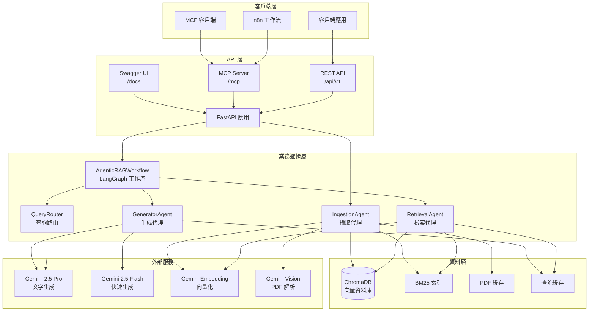
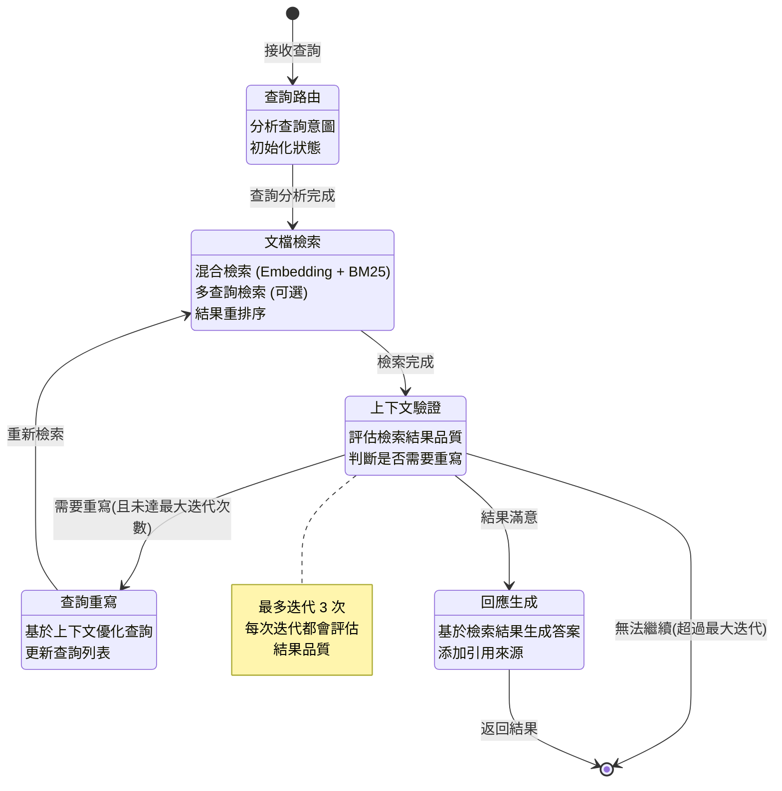
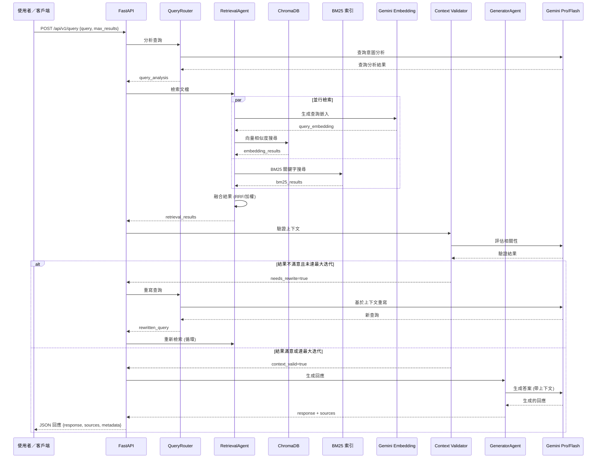

## Context（情境）

企業內部知識庫、客服與決策支援需要從大量 PDF 文檔中即時取得準確答案，並能與既有系統（如 n8n 工作流、內部應用）整合。情境包含多模態 PDF（掃描件、圖表、手寫）、多種查詢意圖，以及對回應速度與引用來源可追溯的要求。

## Challenge（痛點）

- 原始 RAG  pipeline 總響應時間平均約 **20 秒**，無法滿足即時問答體驗。
- 多模態 PDF 需兼顧高文字密度頁（PyMuPDF）與低文字密度頁（圖表、掃描件）的解析品質。
- 檢索結果若與查詢意圖不符，需有自我校正機制（查詢重寫、上下文驗證）以提升答案品質。

## Solution（架構＋做法）

本專案為**基於 LangGraph 的多代理 RAG 系統**，使用 **Gemini 2.5 Pro** 的多模態能力處理 PDF 文檔，提供智能檢索、查詢重寫與自我校正。

- **多模態 PDF 解析** — 混合策略（PyMuPDF + Gemini Vision），自動辨識低文字密度頁面並以視覺 API 解析。
- **語義分塊與混合檢索** — LLM 語義分塊（Gemini 2.0 Flash）、ChromaDB 向量檢索與 BM25 關鍵字檢索，並以查詢重寫與上下文驗證做自我校正。
- **API 與整合** — FastAPI REST、FastMCP 的 MCP Server（流式查詢）、Swagger 文件，以及 n8n MCP Client 節點整合。

### 架構與工作流

**LangGraph 工作流**：**QueryRouter** 分析意圖 → **RetrievalAgent** 混合檢索（Embedding + BM25）→ **Context Validator** 評估品質，必要時查詢重寫並重新檢索（最多 3 次）→ **GeneratorAgent** 以 Gemini Pro/Flash 生成帶引用來源的答案。

- **客戶端** — REST（`/api/v1`）、MCP（`/mcp`）、Swagger（`/docs`）。
- **資料層** — ChromaDB、BM25、PDF 緩存、查詢緩存。
- **外部服務** — Gemini 2.5 Pro（生成／PDF 解析）、Gemini 2.0 Flash（快速生成／語義分塊）、Gemini Embedding（向量化）。

以下三張圖分別為系統架構、狀態機流程與查詢資料流。

### 系統架構圖

### 工作流程圖（LangGraph 狀態機）

### 資料流圖

## 功能重點

多模態 PDF 解析、LLM 語義分塊、智能檢索（查詢重寫／自我校正）、多 RAG 支援、文檔增量與去重、Docker／Cloud Run 部署、API Key／JWT 與 PII 過濾。細節見下方「主要特性詳解」。

## 主要特性詳解

### 多模態 PDF 解析

系統採用混合解析策略：

- **PyMuPDF** — 快速擷取文字內容，適用於高文字密度頁面。
- **Gemini Vision** — 處理低文字密度頁面（掃描件、圖表、手寫內容）。
- **自動判斷** — 依文字密度選擇解析方式。
- **並行處理** — 多進程／多執行緒並行，提升效率。
- **頁面緩存** — 支援斷點續傳，避免重複處理。

### 智能檢索機制

- **多查詢檢索** — 原始查詢擴展為多個相關查詢，並行執行。
- **查詢快取** — LRU（OrderedDict）、依頻率與時間淘汰、Prometheus 監控命中率；可選 Redis（預設關閉）。
- **Prompt 工程** — Chain-of-Thought、Few-shot、結構化 prompt。
- **上下文驗證與重寫** — 評估檢索與查詢相關性，不理想時重寫查詢並重新檢索，最多 3 次迭代。
- **LLM Reranking**（可選）— Gemini 重排序；預設關閉，因 agentic 機制已能優化。

## Impact（量化成效）

系統經全面優化，達成**約 16.7 倍效能提升**，總響應時間由平均約 20 秒降至約 1.2 秒。

| 項目 | 優化前 | 優化後 | 提升倍數 |
|------|--------|--------|----------|
| **總響應時間** | ~20 秒 | ~1.2 秒 | **16.7x** |
| **檢索時間** | ~350ms | ~330ms | 相近 |
| **生成時間** | ~19.3 秒 | ~0.87 秒 | **22x** |
| **Prompt 長度** | 7830 字元 (1957 tokens) | 3384 字元 (846 tokens) | **減少 57%** |

**主要優化方向**：
- 模型：切換至 Gemini 2.0 Flash（非思考模型）、關閉 Thinking 模式，生成時間約 22 倍提升。
- 檢索：`retrieval_multiplier` 3→2、`hybrid_rrf_k` 40→20，減少計算並加快融合。
- 監控：Prompt 長度與各階段耗時（`prompt_prep_time_ms`、`llm_invoke_time_ms`、`search_time_ms` 等），便於發現瓶頸。
- 修復：無效 `filter_metadata` 導致 BM25 結果被錯誤過濾，修正後 BM25 正確參與融合。

**典型查詢**（例：「金控鎖定」）：檢索約 364ms、生成約 867ms，總響應約 1.2 秒。

### 監控與可觀測性

結構化日誌（loguru、JSON）、Prometheus 指標（查詢次數、延遲、錯誤率、快取命中率）、各階段效能監控，`/metrics` 提供 Prometheus 格式。

### 錯誤處理與重試

指數退避重試（初始 1 秒、最大 60 秒）、斷路器防連鎖故障、錯誤分類（臨時／永久／限流）決定是否重試；涵蓋所有 Gemini 呼叫。

### 安全與認證

X-API-Key、JWT（可選）、輸入驗證（防注入／XSS）、PII 過濾、CORS 與路徑遍歷防護。

### 文檔管理與語義分塊

- **增量索引與去重** — 新增文檔增量索引、MinHash LSH 去重、文檔列表／刪除、PDF 解析結果導出為 Markdown。
- **LLM 語義分塊** — Gemini 2.0 Flash 辨識語義邊界，chunk overlap 200 字元，失敗時回退啟發式分塊；可經 `LLM_CHUNKING_ENABLED`、視窗 4000 字元等設定調整，文字過短時使用傳統分塊。

## 技術棧

- **編排與模型** — LangGraph、Gemini 2.5 Pro / 2.0 Flash、Gemini Embedding 001。
- **儲存與檢索** — ChromaDB、BM25、查詢與 PDF 緩存。
- **API 與協定** — FastAPI、FastMCP（MCP Server）。
- **環境** — Python 3.11+；可選 Docker、Cloud Run。

## Extension（可延伸方向）

- 對接更多知識來源（Notion、Confluence、內部 API），擴充混合檢索維度。
- 將 MCP Server 推廣至更多 n8n 節點或 IDE 插件，支援工作流內即時問答。
- 依業務需求加入 Reranking、A/B 測試與用量分析，持續優化檢索與生成品質。
