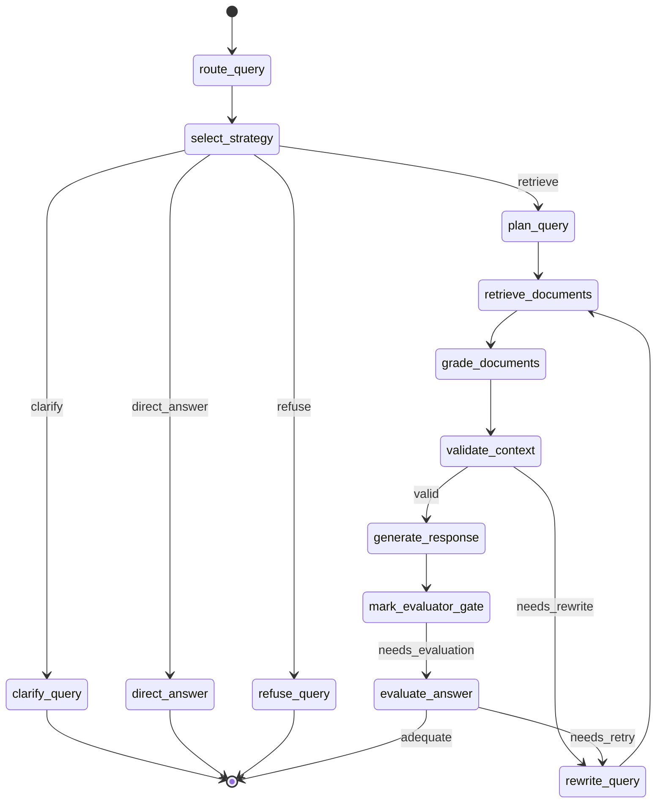
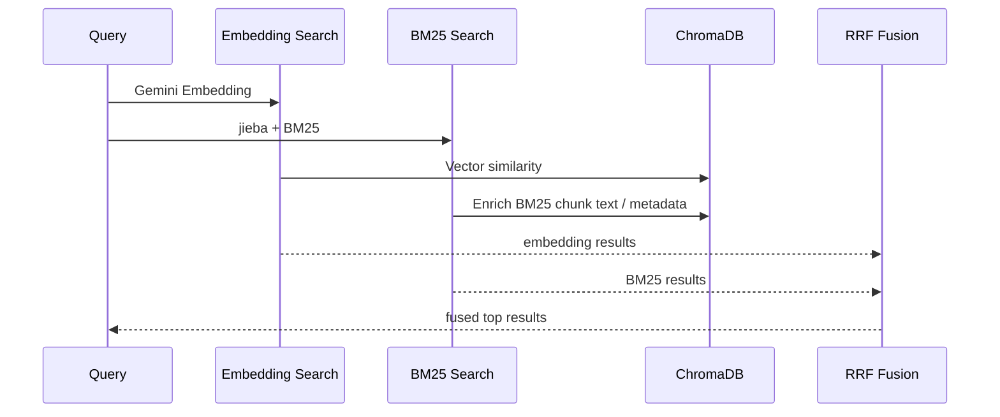

## 摘要

這個專案一開始是為了解決企業內部知識庫問答的典型問題：文件很多、PDF 格式複雜、使用者問法不穩定，而且回答必須能追溯來源。早期版本比較像一條標準 RAG pipeline：解析 PDF、切 chunk、做向量檢索，再交給 LLM 生成答案。

後來真正困難的地方不是「把 RAG 做起來」，而是讓它在真實問題集上穩定：同義詞、台語或口語問法、系統名稱混淆、FAQ 表格、權限與安全邊界、來源衝突、以及回答看似合理但其實漏掉關鍵步驟。這些問題讓系統逐步演進成一個基於 LangGraph 的受控式 Agentic RAG：前段用 rule-first、LLM-fallback 做查詢分析與策略分流，中段用 hybrid retrieval、文件評分與 context validation 控制檢索品質，後段用答案評估與 rewrite loop 決定是否重試。

目前版本的重點已經不只是「多代理 RAG」，而是「可評測、可觀測、可部署、可控」的企業 RAG 系統。

## Context：為什麼不能只做傳統 RAG？

企業內部知識庫的文件通常不是乾淨的 Markdown。它可能是 PDF、投影片、表格截圖、掃描頁、流程圖，甚至同一個名詞在不同文件裡有不同寫法。使用者查詢也不會總是精準輸入文件標題，更多時候是：

- 「金控卡住袂入去誰可以幫我開？」
- 「OTP 一直跳是系統壞掉嗎？」
- 「開機帳號鎖住跟員工入口網鎖定一樣嗎？」
- 「忘記密碼一直失敗 UHD 可以去哪查原因？」
- 「外部訪客 Wi-Fi SSID 密碼是多少？」

這些問題對傳統 RAG 來說有幾個麻煩點：

1. 查詢文字和文件文字不一定長得一樣，向量檢索可能找不到精準 FAQ。
2. 企業 FAQ 裡很多答案依賴系統別、裝置別、權限別，不能只拿最相似段落就回答。
3. 有些問題需要澄清，有些問題可以直接回答，有些問題必須拒答。
4. 回答若漏掉關鍵步驟，比「查不到」更危險。
5. 系統要能部署到 API、MCP、n8n 等工作流，而不是只在 notebook 裡跑通。

所以這版系統的核心目標變成：讓 RAG 的每一步都可控、可觀測、可評測，而且可以在延遲可接受的情況下維持高準確率。

## 系統總覽

新版架構可以分成五層：

- **介面層**：FastAPI REST API、Swagger UI、FastMCP Streamable HTTP、n8n MCP Client。
- **工作流層**：LangGraph 狀態機，負責 query routing、strategy selection、retrieval planning、rewrite loop、answer evaluation。
- **檢索層**：ChromaDB 向量檢索、BM25 關鍵字檢索、RRF 融合、文件評分、輕量 rerank。
- **攝取層**：PyMuPDF + Gemini Vision 的混合 PDF 解析、Markdown 匯出、LLM-based semantic chunking、MinHash 去重。
- **營運層**：Cloud Run、Docker、Prometheus metrics、健康檢查、API key / JWT、PII filter、retry / circuit breaker。

### 系統架構圖

```mermaid
graph TB
    subgraph "Client"
        RESTClient[REST Client]
        N8N[n8n Workflow]
        MCPClient[MCP Client]
    end

    subgraph "API"
        FastAPI[FastAPI]
        REST[/api/v1/query]
        MCP[/mcp FastMCP]
        Metrics[/metrics]
    end

    subgraph "LangGraph Workflow"
        Route[route_query]
        Strategy[select_strategy]
        Plan[plan_query]
        Retrieve[retrieve_documents]
        Grade[grade_documents]
        Validate[validate_context]
        Rewrite[rewrite_query]
        Generate[generate_response]
        Evaluate[evaluate_answer]
    end

    subgraph "Retrieval"
        Chroma[(ChromaDB)]
        BM25[(BM25 Index)]
        Hybrid[Hybrid Search + RRF]
    end

    subgraph "Ingestion"
        PDF[PDF Parser]
        Vision[Gemini Vision]
        Chunking[Semantic Chunking]
        Dedup[MinHash Dedup]
    end

    RESTClient --> REST
    N8N --> MCP
    MCPClient --> MCP
    REST --> FastAPI
    MCP --> FastAPI
    FastAPI --> Route
    Route --> Strategy
    Strategy --> Plan
    Plan --> Retrieve
    Retrieve --> Grade
    Grade --> Validate
    Validate --> Generate
    Validate --> Rewrite
    Rewrite --> Retrieve
    Generate --> Evaluate
    Evaluate --> Rewrite
    Retrieve --> Hybrid
    Hybrid --> Chroma
    Hybrid --> BM25
    PDF --> Vision
    PDF --> Chunking
    Chunking --> Dedup
    Dedup --> Chroma
    Dedup --> BM25
    FastAPI --> Metrics
```

## 1. 查詢前處理：rule-first，不是每題都丟給 LLM

早期做法很自然：使用 LLM 先分析查詢意圖，再決定怎麼檢索。但實測後發現，很多企業 FAQ 問題其實有高信心規則可判斷，不需要每題都多花一次 LLM latency。

目前的 `route_query` 採用 **rule-first、LLM-fallback**：

1. 先做 query normalization，把口語、錯字、台語、縮寫轉成可檢索詞。
2. 用 deterministic rules 判斷是否需要澄清、拒答、直接回答或進入檢索。
3. 只有規則不足以高信心決策時，才呼叫 LLM 做 `analyze_query()`。
4. metadata 會記錄 `query_analysis_source = rule | llm`，方便後續 benchmark 與錯誤分析。

這個設計的好處是：常見高頻 FAQ 走快速路徑，複雜或未知查詢保留 LLM 彈性。

例如系統會把這類口語查詢正規化：

- `金控卡住袂入去` → `金控鎖定 忘記密碼功能`
- `入囗網` → `入口網`
- `蜜碼`、`密馬` → `密碼`
- `team+` → `C_Team`
- `w3` → `員工入口網`

同時它也會先處理安全邊界：

- 外部訪客要求公司內部 Wi-Fi 隱藏 SSID 或密碼：拒答。
- 要查客戶身分證、保單明細或員工個資：拒答。
- 要繞過最高權限、防火牆例外、VDI 檔案攜出簽核：拒答。
- 系統管理員帳密清單、共用帳號密碼：拒答。

這裡的關鍵不是把 LLM 移除，而是把「確定能用規則處理的東西」留在規則層，讓 LLM 處理真正需要語意判斷的 case。

## 2. 顯式策略分流：clarify / direct_answer / refuse / retrieve

新版 workflow 把策略選擇獨立成 `select_strategy`，不再把所有情況都塞進檢索節點。

### LangGraph 狀態機



這個分流讓系統更像一個可控 agent，而不是一條固定 pipeline：

- **clarify**：問題缺少系統範圍，例如只說「帳號鎖定」但沒說是金控、區網、VPN 還是其他系統。
- **direct_answer**：規則已能確定回答，例如來源衝突時直接提醒需依權責單位確認。
- **refuse**：遇到敏感資訊、繞過審核、帳密要求時直接拒答，不進檢索。
- **retrieve**：需要查文件時才進入檢索規劃。

這個設計修掉了一個常見 RAG 問題：不是所有問題都該檢索。該澄清的問題直接檢索，常常會拿到錯誤上下文；該拒答的問題進檢索，可能會洩漏不該提供的資訊。

## 3. 檢索規劃：把 retrieval planning 從 retrieval 裡拆出來

進入檢索前，`plan_query` 會產生 explicit query plan。它會分析：

- `recommended_method`：embedding / bm25 / hybrid。
- `keyword_density`：查詢偏關鍵字還是偏語意。
- `semantic_complexity`：是否需要語意理解。
- `has_domain_lexical_terms`：是否包含企業內部高訊號詞，例如 OTP、區網帳號、員工入口網、Outbound。
- `has_specific_terms`：是否包含專有名詞或明確系統名稱。

這個 query plan 會寫入 state 與 metadata，後續 retrieval、debug、benchmark 都能看到它。

簡單說，workflow 不再只是「拿 query 去搜」，而是先問：這題應該用哪種檢索策略？

## 4. 混合檢索：Embedding + BM25 + RRF

系統同時使用 ChromaDB 向量檢索與 BM25 關鍵字檢索，並用 RRF（Reciprocal Rank Fusion）融合。

### 查詢資料流



為什麼不能只用 embedding？

企業 FAQ 裡常有精準詞：`RCM`、`C_Team`、`PORTALOTP`、`Outbound`、`Sourcetree`、`Bitbucket`、`cxldom00`。這些詞對 BM25 很友善，但向量檢索可能會把語意相近、系統不同的段落排太前面。

為什麼不能只用 BM25？

使用者會用口語或不完整描述，例如「金控卡住袂入去」、「我的電腦鎖起來」、「Edge 顯示 IP 在美國造成 OTP」。這類問題需要語意檢索與 query normalization。

所以新版做法是：

- embedding 與 BM25 並行執行，降低總檢索時間。
- 預設 RRF 融合，`hybrid_rrf_k = 20`，更重視 top results。
- 對專有名詞查詢提高 BM25 參與度，避免 exact match 被 embedding 稀釋。
- BM25 結果會回 ChromaDB 補齊 text / metadata，再參與融合。
- `filter_metadata` 會先清掉 FastAPI docs 常見的 placeholder，例如 `additionalProp1`，避免 BM25 被錯誤過濾。

這裡有一個實作上的小教訓：Swagger UI 產生的空 filter metadata 曾經讓 BM25 結果被錯誤過濾，導致混合檢索其實沒有正常發揮。後來在 `filter_metadata` normalize 階段修掉後，BM25 才能穩定參與融合。

## 5. 文件評分與 context validation：不要把檢索結果直接丟給生成器

檢索後系統會進入 `grade_documents`。目前預設是 heuristic grader，也可切成 LLM grader。

它會根據：

- query term overlap
- domain anchor hits
- operational query signals
- FAQ source bonus
- top score / enhanced score

判斷每個檢索結果是否真的 relevant。只有通過評分的結果才會進入 context。

接著 `validate_context` 會檢查：

- 是否至少有足夠數量的 relevant documents。
- top score 是否達到門檻。
- 流程類問題是否需要更多支持文件。
- 低信心結果是否允許直接生成。

如果 context 不夠好，系統不會硬答，而是進入 `rewrite_query`。若已達最大迭代次數，才會轉成低信心拒答。

這個設計把「查不到」和「不該答」變成顯式狀態，而不是讓 LLM 自己猜。

## 6. 答案生成：LLM 不是唯一保險，還有 FAQ guardrail

`GeneratorAgent` 使用 Gemini Flash 系列模型生成繁體中文回答，並且會附上來源與頁碼。

但在企業 FAQ 場景裡，單純依賴 LLM 生成仍然會遇到幾種問題：

- 回答太短，只回了方向但漏掉關鍵步驟。
- 混入相似但不同系統的流程。
- 引用頁碼不穩。
- 對 FAQ 表格的答案抽取不夠精準。
- LLM 複製 prompt instruction 或格式要求。

因此後來加入了幾層保護：

- 對高信心 FAQ block 直接抽取並格式化回答。
- 針對常見高風險題型加入 fallback response，例如 OTP、帳號鎖定、VPN 密碼到期、e 點名換手機、Edge 安全網路等。
- 生成前建立 `focus_context`，把最關鍵的 FAQ 行或表格列放到 context 前面。
- 生成後清理 prompt echo、跨主題行、空回答與過短回答。
- 優先使用 metadata 的 page number，必要時才從內容開頭或頁尾解析頁碼。

這些不是為了把系統變成大量 hard-code，而是因為真實企業知識庫裡，有些 FAQ 是高頻且高風險的。對這些題目，穩定性比「每次都讓 LLM 自由生成」更重要。

## 7. 答案評估：生成後再決定是否結束

在 `generate_response` 後，workflow 不一定直接結束。它會先進入 `mark_evaluator_gate`：

- 如果是澄清、拒答、沒有檢索結果，直接結束。
- 如果是高信心 FAQ，且 top score、document grade、context length、response length 都符合條件，可跳過 evaluator。
- 其他情況進入 `evaluate_answer`。

`AnswerEvaluator` 可用 heuristic 或 LLM 模式。它會判斷：

- 回答是否 adequate。
- 是否 grounded in retrieved context。
- 是否需要 retry。

若答案不足且還沒達迭代上限，workflow 會把 evaluator feedback 加到 rewrite context，再重寫 query 重新檢索。

這就是這版系統比較「agentic」的地方：不是只有檢索前重寫，而是回答後也能評估自己是否該重試。

## 8. PDF 攝取：PyMuPDF fast path + Gemini Vision fallback

文件攝取階段採用混合 PDF parser：

1. 先用 PyMuPDF 快速抽文字。
2. 計算文字密度。
3. 若文字密度太低、頁面疑似表格、或抽到的文字太短，改用 Gemini Vision。
4. PDF 轉圖片用 multiprocess。
5. Gemini Vision API 呼叫用 multithread + rate limit。
6. 每頁結果寫入 PDF cache，支援中斷後續跑。
7. 解析結果匯出成 Markdown，方便人工檢查與後續重建索引。

這個設計是成本與品質的折衷：

- 高文字密度 PDF 用 PyMuPDF，快且不用 API 成本。
- 掃描件、圖表、投影片、表格頁交給 Gemini Vision，保留多模態解析能力。
- 頁面級 cache 避免大文件重跑時浪費時間與 token。

## 9. Semantic Chunking：讓 chunk 切在語意邊界

傳統固定長度 chunk 容易切斷流程、表格或 FAQ 答案。後來加入 LLM-based semantic chunking：

- 使用 Gemini 2.0 Flash 找出段落結束、主題轉換、場景變化等邊界。
- 預設 window size 8000 字元。
- chunk overlap 200 字元。
- 太短的文字直接走 heuristic chunking。
- LLM 失敗時 fallback 到傳統 chunker。

實作上刻意使用 `gemini-2.0-flash`，而不是容易因 thinking token 造成長中文輸出不穩的 thinking model。這是後期效能調整中很重要的一點：不是越強的模型越適合每個子任務，chunk boundary detection 需要的是穩定、便宜、快。

## 10. 多資料庫與存取控制

系統後來加入 internal / public 兩套資料庫：

- internal workflow：可查全部文件。
- public workflow：只查公開文件。

REST API 與 MCP tool 都支援 `is_internal` 參數。預設是 public，避免外部 client 不小心查到內部資料。

資料層也對應分開：

- `chroma_db`
- `chroma_db_public`
- `bm25_index.pkl`
- `bm25_index_public.pkl`

這讓 MCP 或 n8n 這類外部整合可以走較保守的預設權限，而內部工具再明確帶上 internal access。

## 11. API、MCP 與 n8n 整合

對外介面主要有兩種：

### REST API

主要端點：

- `POST /api/v1/query`
- `POST /api/v1/ingest`
- `POST /api/v1/ingest/path`
- `GET /api/v1/documents`
- `DELETE /api/v1/documents/{doc_id}`
- `GET /api/v1/health`
- `GET /api/v1/ready`
- `GET /metrics`

查詢 API 會在 thread pool 裡執行同步 workflow，避免阻塞 FastAPI event loop，也能支援多個查詢並行。

### MCP Server

MCP 使用 FastMCP Streamable HTTP，mount 在 `/mcp`。目前工具是 `query_rag`，輸入包含：

- `query`
- `max_results`
- `filter_metadata`
- `is_internal`

MCP tool 回傳簡化結構：

- `response`
- `token_usage`
- `retrieval_time_ms`

這讓 n8n MCP Client、IDE MCP Client 或其他 agent workflow 可以把 RAG 系統當成工具呼叫，而不是只當 REST API。

## 12. 安全與營運機制

後期版本也補上了比較完整的 production-facing 機制。

### 認證

- `X-API-Key` header。
- 可選 JWT Bearer token。
- API key usage tracking，可查看 key 使用次數與最後使用時間。

### 輸入驗證

- query 長度限制。
- SQL injection pattern 檢查。
- XSS pattern 檢查。
- 上傳檔名 path traversal 防護。

### PII filter

系統會偵測並過濾：

- email
- 電話
- 信用卡號
- 台灣身分證字號

非 strict mode 下，信用卡號與身分證字號會直接 block，較低風險資訊則做 redaction。

### Retry / Circuit Breaker

Gemini 文字生成、query analysis、embedding、Vision parsing 都有 retry / circuit breaker / graceful degradation：

- exponential backoff
- jitter
- failure threshold
- recovery timeout
- API 失敗時回傳可理解的降級訊息，而不是整個服務炸掉

### Observability

Prometheus metrics 包含：

- query count / latency
- retrieval latency
- generation latency
- cache hit / miss / hit rate
- query iterations
- indexed documents
- active queries
- dependency health
- API request latency
- error count

`/health` 是 liveness probe，`/ready` 會檢查 ChromaDB、Gemini API、Embedding API、Cache 等依賴。

## 13. 部署：Docker + Cloud Run

部署方式以 Docker 與 Google Cloud Run 為主。

後期部署做了一個實用取捨：ChromaDB 可以直接打包進 Docker image，讓 Cloud Run 啟動時不必每次從 GCS 下載資料庫。這讓啟動更快、部署更簡單。

如果資料庫很大或更新很頻繁，也可以透過 `GCS_CHROMADB_BUCKET` 從 Cloud Storage 下載 ChromaDB。

Cloud Run 相關處理包含：

- 使用 `PORT` environment variable。
- Proxy headers middleware，處理 HTTPS behind proxy。
- `host="0.0.0.0"`，避免 Cloud Run Host header 問題。
- Secret Manager 管理 Google API key。
- `/metrics` 給 Prometheus 抓取。

## 14. 評測與收斂：從可用到可凍結

後期專案很大一部分工作不是加功能，而是評測、拆錯、收斂。

使用的 benchmark 包含金融業 AI RAG 100 題題庫，搭配 batch query、direct workflow benchmark、人工 / 規則評分與錯誤拆解。

### v22 收斂結果

在 `v22` 收斂報告中，系統達到：

| 指標 | 結果 |
|---|---:|
| 加權準確率 | 98.0% |
| 嚴格正確率 | 96.0% |
| 寬鬆命中率 | 100.0% |
| 正確題數 | 96 / 100 |
| 部分正確 | 4 / 100 |
| 錯誤 / 不安全 | 0 |
| 平均延遲 | 3.55s |
| P50 延遲 | 3.77s |
| P95 延遲 | 5.83s |

`v21` 已經是可凍結基準版，`v22` 主要補齊「最高權限 + USB 權限」這類邊界題，在不增加錯誤、不增加安全風險、不惡化延遲的情況下，把加權準確率從 97.5% 推到 98.0%。

更重要的是，剩下的 partial 主要是回答完整度問題，不是知識方向錯誤，也不是不安全回答。因此 `v22` 適合作為後續回歸基線。

### 最新 rule-first latency benchmark

後續 rule-first、LLM-fallback routing 版本在 direct workflow 100 題 benchmark 中：

| 指標 | v23 baseline | rule-first 版本 | 改善 |
|---|---:|---:|---:|
| 平均延遲 | 3.63s | 2.606s | -1.024s |
| P95 延遲 | 6.28s | 5.636s | -0.644s |

這個改善主要來自前段 routing：高信心規則路徑不再每次都呼叫 LLM，但仍保留 `select_strategy`、`plan_query`、`rewrite_query`、`evaluate_answer` 等 agentic 核心流程。

換句話說，它不是把 agentic loop 砍掉換速度，而是把不必要的 LLM call 移出 fast path。

## 15. 幾個實作上學到的教訓

### 1. Agentic 不等於每一步都用 LLM

真正穩定的 agentic workflow 應該是可控的。高信心規則、明確拒答、direct FAQ extraction，都比「全部交給 LLM 判斷」更穩。

### 2. RAG 的錯誤常常不是 generation 錯，而是 retrieval context 錯

如果相似但不同系統的文件進了 context，LLM 很容易生成看似合理但錯誤的答案。文件評分、focus context、cross-topic trimming 都是在處理這個問題。

### 3. 評測比單次 demo 更重要

一題答對不代表系統好。100 題 benchmark、錯誤拆解、版本比較，才讓後期修改能判斷是改善還是回歸。

### 4. 企業 FAQ 需要安全分流

有些問題不是查不到，而是不該答。把安全拒答放在 retrieval 前，能降低錯誤洩漏的機率。

### 5. 快不只是模型選擇，還是流程設計

從 thinking model 切到 Flash、降低檢索候選數、RRF 參數調整、parallel retrieval、rule-first routing，這些加起來才讓延遲逐步下降。

## 16. 技術棧

- **Workflow**：LangGraph
- **LLM / Vision**：Gemini Pro / Gemini Flash / Gemini Vision
- **Embedding**：Gemini Embedding
- **Vector DB**：ChromaDB
- **Keyword Search**：BM25 + jieba
- **API**：FastAPI
- **MCP**：FastMCP Streamable HTTP
- **PDF**：PyMuPDF、pdf2image、Pillow、Gemini Vision
- **Chunking**：LLM-based semantic chunking + heuristic fallback
- **Observability**：loguru、Prometheus
- **Security**：API key、JWT、PII filter、input validation
- **Deployment**：Docker、Google Cloud Run、Secret Manager、可選 GCS ChromaDB sync

## 17. 最後：這版專案真正完成的是什麼？

如果只看功能清單，這是一個 LangGraph + Gemini + ChromaDB + BM25 + MCP 的 Agentic RAG 系統。

但從工程角度看，它真正完成的是一個企業知識庫問答系統從 demo 到可交付的過程：

- 它能處理 PDF 與多模態頁面。
- 它能在口語、錯字、系統名稱混淆下維持檢索穩定。
- 它能區分澄清、拒答、直接回答與檢索。
- 它能對檢索結果與生成答案做品質控制。
- 它有 benchmark、錯誤拆解與回歸基線。
- 它能透過 REST、MCP、n8n 與外部流程整合。
- 它有部署、監控、認證、健康檢查與降級機制。

這也是我後來對 Agentic RAG 的理解：不是讓 LLM 自由地「想辦法回答」，而是把查詢、檢索、驗證、生成、評估都拆成明確節點，讓每一步都能被觀察、被測試、被替換，最後才有可能在真實企業知識庫裡穩定運作。

## 主要參考檔案

- `README.md`
- `docs/ARCHITECTURE_EVOLUTION.md`
- `docs/v21_vs_v22_摘要_20260511.md`
- `docs/v22_收斂結論_20260511.md`
- `docs/agenticrag.md`
- `src/graph/workflow.py`
- `src/agents/query_router.py`
- `src/agents/retrieval.py`
- `src/agents/generator.py`
- `src/agents/answer_evaluator.py`
- `src/utils/hybrid_search.py`
- `src/utils/vector_store.py`
- `src/utils/pdf_parser.py`
- `src/utils/semantic_chunking.py`
- `src/mcp/server.py`
- `app/api/routes.py`
- `app/main.py`
- `app/config.py`
